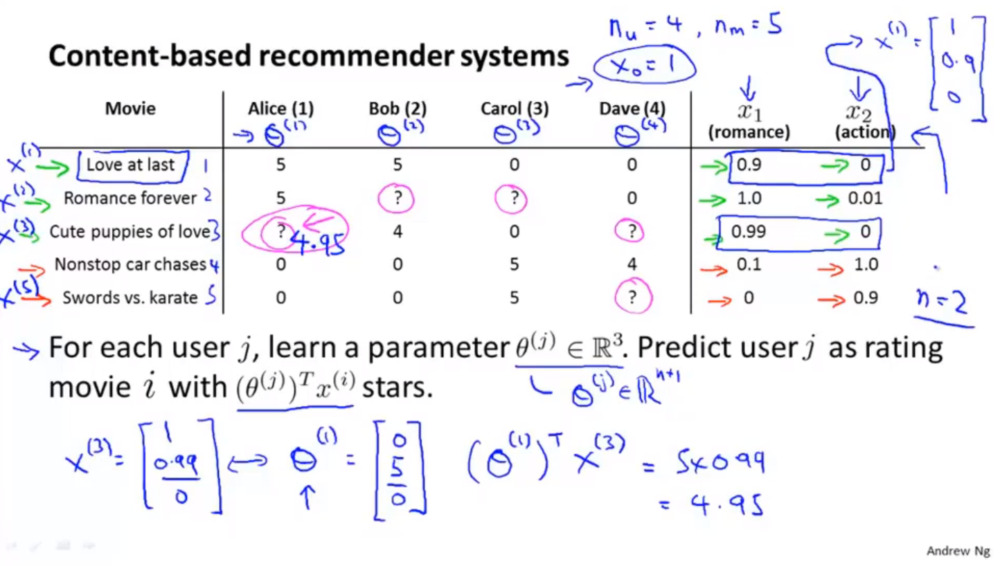
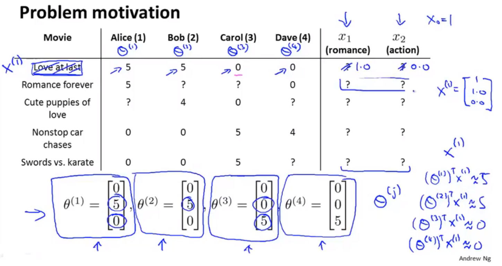
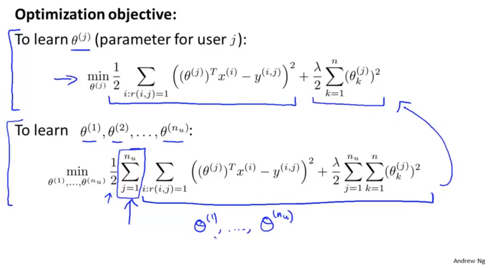
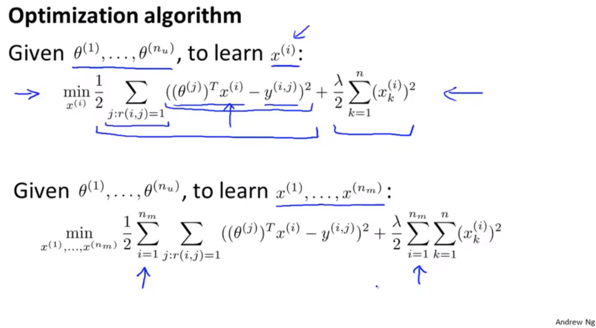
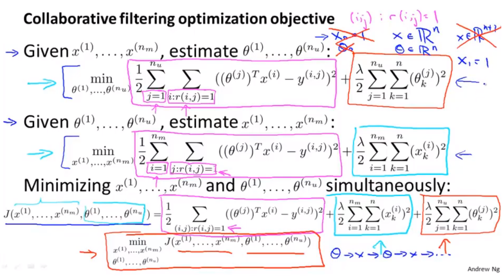
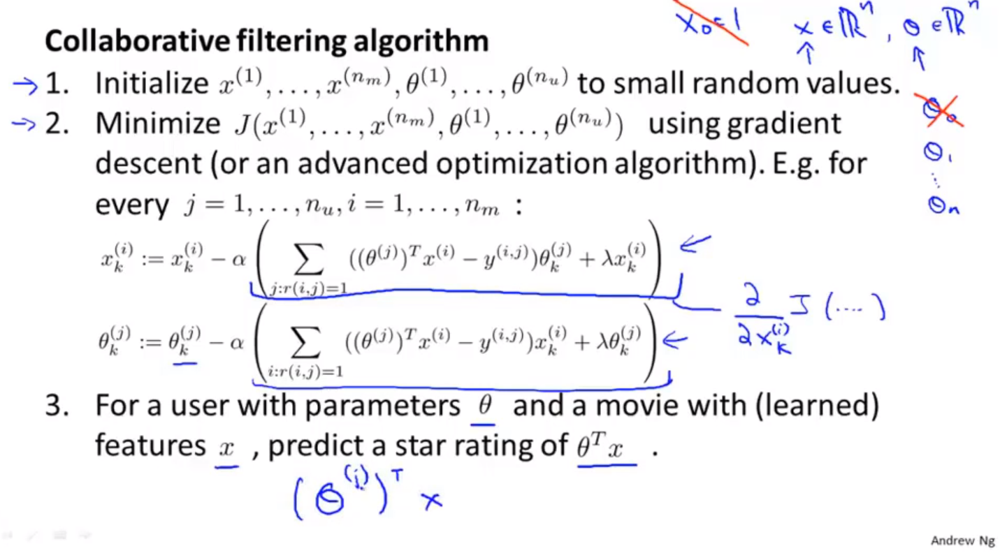
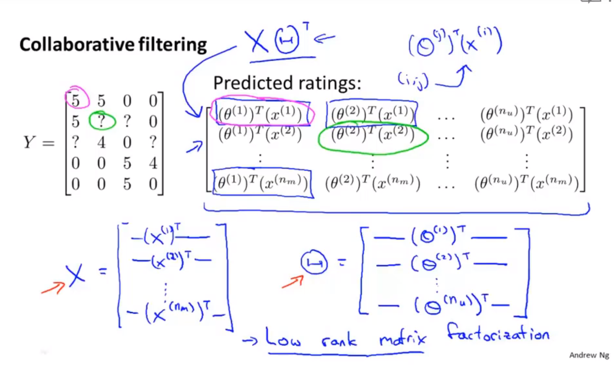
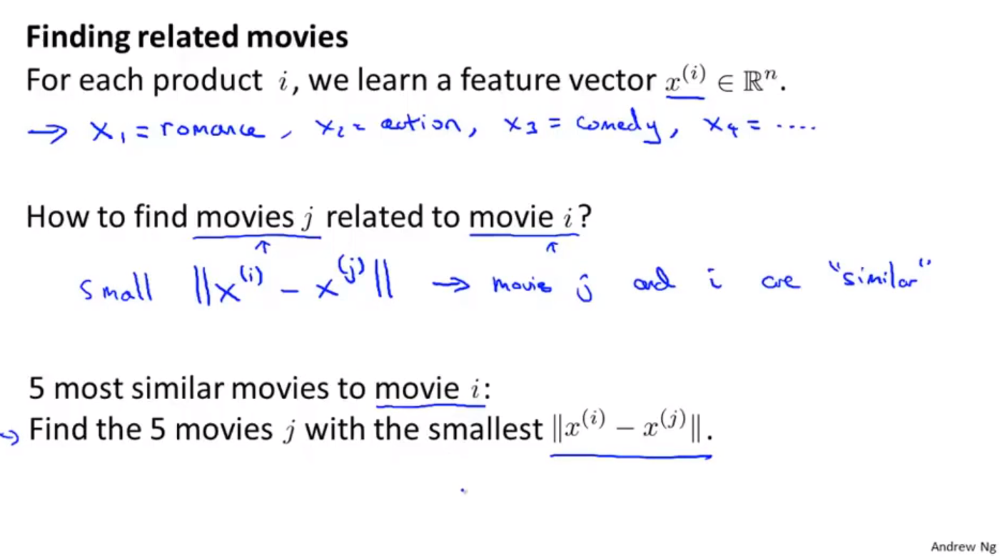

# 推荐系统

## 问题规划

* 电影和用户的评分相关性
* 使用用户对电影的评分，进行协同过滤的模型。

## 基于内容的推荐算法



主要思想：

* 基于用户浏览过的数据集，对用户尚未浏览的数据集进行评分。
* 假定我们已经知道，单个数据样本的特征标签。
* 通过多元线性回归+每个用户的历史数据集，训练得到每一个用户的线性回归参数$\theta$

## 协同过滤

* 特征学习，自行学习要使用的特征。
* 没有考虑用户之间的关联性。首先通过用户对电影特征的喜爱程度，反向
* 基于浏览过同一个电影的用户数据，对电影进行评分。同样也是基于内容的。前者是基于用户浏览记录+电影特征判断用户对特征的的爱好，后者是通过电影被浏览的记录判断电影包含的特征。


```
用户

电影

特征

基于内容的推荐算法：用户-电影 + 电影-特征 = 用户-特征
协同过滤： 用户-电影 + 用户-特征 = 电影-特征

两者可以结合，进行循环训练，能够收敛到更好的模型。

用户-特征 -> 电影-特征 -> 用户-特征
```


> * 基于内容的推荐算法：已知用户-电影，电影-特征，求解用户-特征，用户-电影。
> * 协同过滤：已知用户-电影，用户-特征，求解电影-特征，用户-电影。

### 两种算法进行对比

* 基于内容的电影推荐



* 基于内容的特征生成




## 协同过滤算法


* 协同过滤算法原理，同时优化“基于内容的特征生成”和“基于内容的电影推荐”两部分




* 协同过滤算法的实现。
  * 初始化用户-电影特征关系参数$\theta$和电影特征$x_i$
  * 最小化代价函数。对所有用户-电影特征关系参数$\theta$和电影特征$x_i$使用梯度下降算法，进行计算。
  * 最终生成用户-电影特征参数和电影特征的解。然后使用这两个解，生成用户推荐。



## 向量化

* 使用协同过滤，实现电影推荐的例子。
* 又称为低秩矩阵分解。可以对低秩矩阵进行矩阵化运算。



* 协同过滤算法获得的电影特征无法进行可读理解。
* 可以通过计算两个电影特征之间的距离，识别两个电影是否相似。




## 均值规范化

* 将各个数据进行均值规范化处理，能够让从来没有进行评分的用户，拥有平均的评分。
