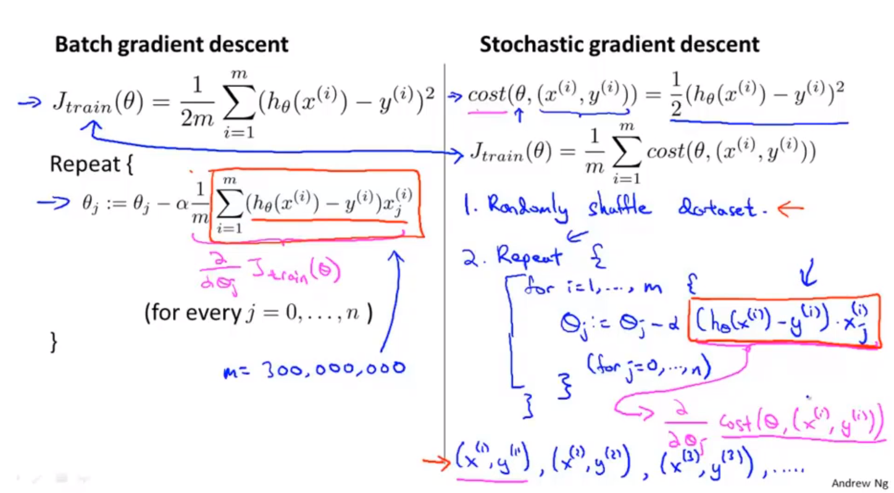
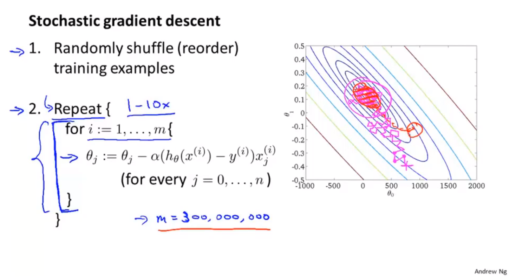
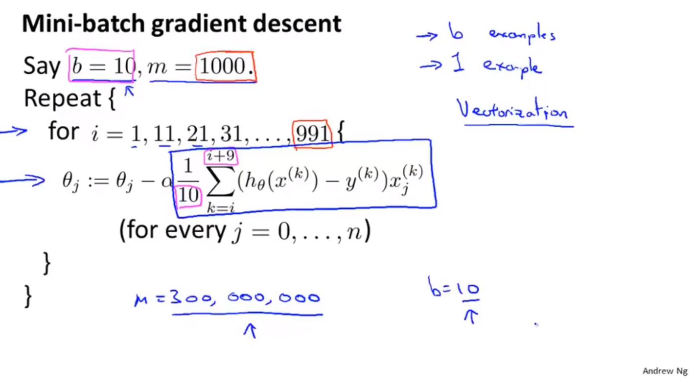
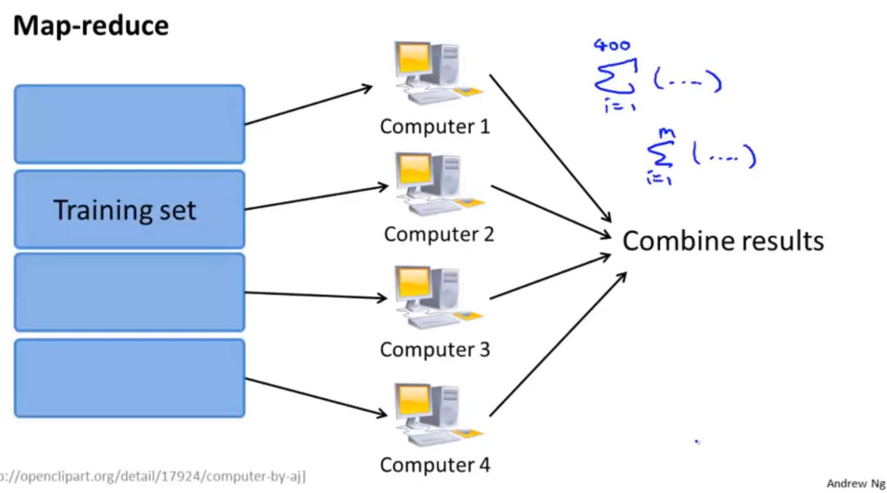

# 大数据集

## 大数据集机器学习

* 通过大量数据，能够减少数据方差带来的模型误差。但不能解决模型偏差带来的模型误差。（有待考虑）

## 随机梯度下降算法

* 数据集很大的时候，普通梯度下降会变得困难。使用随机梯度下降，能够解决数据集过大的现象。
* batch梯度下降。一次对所有的数据进行梯度下降。
* 随机梯度下降；stochastic gradient descent
  * random shuffle example
  * repeat gradient descent on one example

### 两种梯度下降算法对比

### 随机梯度下降算法过程

## mini-batch 梯度下降算法

* 选取少量样本进行梯度下降。
* 需要有非常高效的向量化方法，对小范围内的数据进行求和运算

## 随机梯度下降的收敛问题

* 学习率一般是固定的参数，如果想让代价函数收敛在更小的位置，可以随着训练过程降低学习率。
* 保持固定的学习率能够方便调试。

## 在线机器学习

* 针对不断增加的连续的数据流。不断增加数据的网站，连续的数据流==> 在线机器学习。一边学习一边使用。

* 邮寄包裹的例子：用户的统计学特征、发货地、目的地、给出的价格、用户选择还是离开。根据以上特征，训练处，什么时候用户留下，什么时候用户离开，并给出推荐的结果。

* 一般使用逻辑回归的方式，判定给定价格下用户留下的概率，或者在一定概率下，用户留下的价格。

* 在线机器学习的优点：能够使用不断变化的用户偏好。

* 点击率预测学习。用户特征（搜索关键词）----手机特征，用户是否点击，建立用户特征和手机特征之间的匹配关系。
* 与随机梯度下降非常相似，不同点在于，随机梯度下降，会使用固定的数据集，在线机器学习，使用不断变化的数据集。

## map-reduce算法

* map-reduce思想

* map-reduce 过程，可以处理$\Sigma$累加的部分，通过reduce过程，对计算结果累计。必要条件：算法能够表示成对训练集的一种求和
* 可以在单个机器的不同核心上执行map-reduce的过程
* 某些现行代数库在进行向量化运算的过程中，会通过多个核心进行优化，不必使用MapReduce
