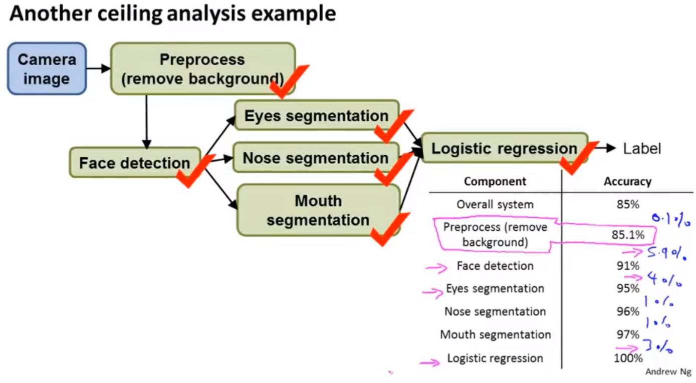

# 机器学习案例-Photo OCR

## 问题描述

* 主要目的：
  * 复杂的机器学习系统是如何组建出来的
  * 机器学习流水线的概念。
  * 如何分配机器学习资源

* 问题描述：照片的光学识别。
  1. 找出由文字的区域text detection
  2. 字符分割character segment 
  3. 字符识别character classification

* 机器学习流水线photo ocr pipeline
  * image -> text detection -> character segment -> character classification
  * 将图片传入一系列机器学习组件，完成一系列任务。

## 滑动窗口

* 使用一个固定大小滑动窗口，在待检测的图片上遍历所有可能存在目标的区域。
* 调整滑动窗口的大小，将滑动窗口映射为固定大小，然后继续进行滑动，并检测窗口中是否存在目标。（100-50的区域，通过数据处理映射为50-25的检测单元，然后进行目标分析）

## 获取大量数据和人工数据

###  人工合成数据
* 识别字体图片中：使用网络上个中免费的字体，添加各种不同的背景，对字体进行缩放旋转扭曲等操作，人工合成数据集。
* 语音识别：给正常的语音添加各种不同的背景噪音。

### 是否需要获得大量数据

* 保证假设函数的偏差很小
* 考虑是否能够快速获取十倍于现在的数据集
  * 人工合成
  * 众包服务
  * 网上搜集

## 时间规划

* 做机器学习，最重要的是时间，其次是数据，然后是算法选择，最后是系统实现和调参。

* 考虑机器学习系统、机器学习流水线上，准确率的瓶颈在哪里。

* 一个机器学习流水线的实例。

> 如果自己开发及其学习的过程，应该也要建立相应的流水线，每一个流水线上单独的算法，都应该可以发表一篇论文。关键是如何设计机器学习的流水线过程----------------应该通过广泛阅读相关论文，论证如何实现机器学习系统。

* 建议：把机器学习问题分成很多模块，对整个系统进行上下限分析，给出需要投入时间最多的模块，合理规划任务。

