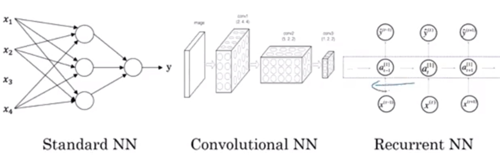

# 神经网络简介

> 必须得明白，吴恩达在通过什么角度，构建神经网络的基础知识。

## 什么是神经网络

### 神经网络分层
* 输入层----隐藏层----输出层

### 神经元

输入层只有一个参数：激活值。输出层、隐藏层神经元有三个参数：

* **权重**：指的是和输入层某个神经元的紧密关系。联系越紧密这个值越大（$W$）。

* **激活值**：输入的值乘以权重，然后相加。$z = W^T*X+bias$

* **偏置**：表示输入的截距，bias。

### 计算过程
  * 正向过程（forward pass）或者叫**正向传播步骤（forward propagation step）**
  * 反向过程（backward pass）或者叫**反向传播步骤（backward  propagation step）**。

### 向量化

* **向量化** 实现一个神经网络时，如果需要遍历整个训练集，并不需要直接使用 for 循环。采用向量化的方法代替for 循环
## 用神经网络进行监督学习

### 应用领域

* 房屋价格预测-ANN普通神经网络，多维度特征
* 图像-CNN卷积神经网络，二维像素
* 声音-RNN循环神经网络，一维实践序列
* 翻译-RNNs循环神经网络

### 不同的神经网络

### 监督学习

* 结构化数据：数据库中的结构化数据。
* 非结构化数据：声音、图像、文本。

## 深度学习的历史

### 原因
* 更多的数据data
* 更高的算力compute
* 更复杂的算法algorithm

### 流程

idea--code--experiment---back to idea
