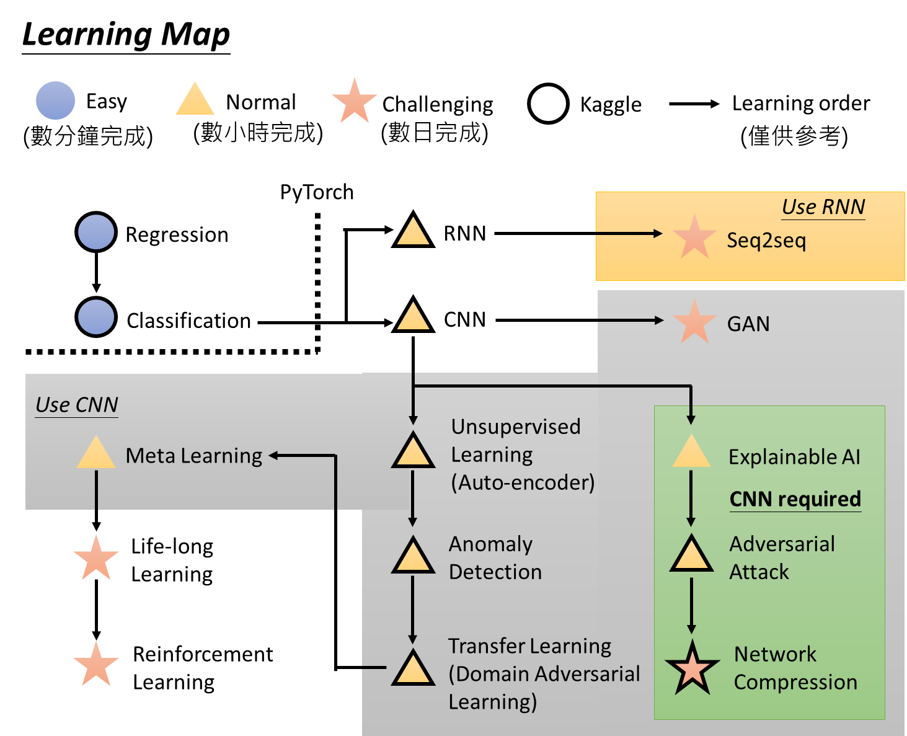

# Introduction

## 如何定义一个机器学习的问题
> 机器学习的本质，是机器自动寻找输入和输出之间的函数function，建立输入和输出的关系。
* 根据机器学习的输入input数据集data set，定义学习的场景
  * 有标签的数据集：监督学习supervisor learning
  * 没有标签的数据集：无监督学习unsupervisor learning、生成对抗网络GAN
  * 标签不全的数据集：半监督学习semi-supervisor learning 
  * 特征不一致的数据集：迁移学习transfer learning
  * 没有数据：强化学习reinforcement learning
* 根据机器学习的输出output，来定义一个问题或任务task
  * 连续的数值：回归问题regression
  * 离散的数值：分类问题classification
  * 结构化数值：生成问题generation（例如一张斑马的图片、一段翻译的结果、一篇文章的总结，生成结构化的数据，结构化学习）
* 选择合适的机器学习算法集合，评估机器学习算法的好坏
  * 定义损失函数loss function
  * 使用梯度下降优化算法，减小损失函数gradient descent

## 课程的概要

* scenario，即学习的情境。通常学习的情境是我们没有办法控制的，比如做reinforcement Learning是因为我们没有data、没有办法来做supervised Learning的情况下才去做的。如果有data，supervised Learning当然比reinforcement Learning要好；因此手上有什么样的data，就决定你使用什么样的scenario
* task，即要解决的问题。你要解的问题，随着你要找的function的output的不同，有输出scalar的regression、有输出options的classification、有输出structured object的structured Learning..
* model，即用来解决问题的模型(function set)。在这些task里面有不同的model，也就是说，同样的task，我们可以用不同的方法来解它，比如linear model、Non-linear model(deep Learning、SVM、decision tree、K-NN...)

> 在定义应用场景的时候，可能有来自不同领域的数据，例如语音处理的语音、文字处理的文本、图像识别的图像。对于不同领域的数据，其机器学习算法的场景是完全一致的，唯一不同的是，对数据的预处理。而解决一个机器学习问题，需要花费更多的时间在数据预处理的过程。

## 基础知识

### Supervised Learning(监督学习)

#### 场景的描述
supervised learning 需要大量的training data，这些training data告诉我们说，一个我们要找的function，它的input和output之间有什么样的关系而这种function的output，通常被叫做label(标签)。

#### 任务的分类
*  Regression(回归)regression是machine learning的一个task，通过regression找到的function，它的输出是一个scalar数值比如PM2.5的预测，给machine的training data是过去的PM2.5资料，而输出的是对未来PM2.5的预测**数值**，这就是一个典型的regression的问题

* Classification(分类)regression和classification的区别是，我们要机器输出的东西的类型是不一样的，在regression里机器输出的是scalar，而classification又分为两类：
  * Binary Classification(二元分类)在binary classification里，我们要机器输出的是yes or no，是或否。比如G-mail的spam filtering(垃圾邮件过滤器)，输入是邮件，输出是该邮件是否是垃圾邮件
  * Multi-class classification(多元分类)在multi-class classification里，机器要做的是选择题，等于给他数个选项，每一个选项就是一个类别，它要从数个类别里面选择正确的类别。比如document classification(新闻文章分类)，输入是一则新闻，输出是这个新闻属于哪一个类别(选项)

#### 模型的选择

在解任务的过程中，第一步是要选一个function的set，选不同的function set，会得到不同的结果；而选不同的function set就是选不同的model，model又分为很多种：

* Linear Model(线性模型)：最简单的模型
* Non-linear Model(非线性模型)：最常用的模型，包括：

    * **deep learning**
    * **SVM**
    * **decision tree**
    * **K-NN**

### Semi-supervised Learning(半监督学习)

#### 场景的描述
如果想要做一个区分猫和狗的任务。手头上有少量的labeled data，它们标注了图片上哪只是猫哪只是狗；同时又有大量的unlabeled data，它们仅仅只有猫和狗的图片，但没有标注去告诉机器哪只是猫哪只是狗。

在Semi-supervised Learning的技术里面，这些没有labeled的data，对机器学习也是有帮助的。

### Transfer Learning(迁移学习)

### 场景的描述
假设一样我们要做猫和狗的分类问题

我们也一样只有少量的有labeled的data；但是我们现在有大量的不相干的data(不是猫和狗的图片，而是一些其他不相干的图片)，在这些大量的data里面，它可能有label也可能没有label

Transfer Learning要解决的问题是，这一堆不相干的data可以对结果带来什么样的帮助

### Unsupervised Learning(无监督学习)

区别于supervised learning，unsupervised learning希望机器学到无师自通，在完全没有任何label的情况下，机器到底能学到什么样的知识

### Structured Learning(结构化学习)

在structured Learning里，我们要机器输出的是，一个有结构性的东西。

在分类的问题中，机器输出的只是一个选项；在structured类的problem里面，机器要输出的是一个复杂的物件。

举例来说，在语音识别的情境下，机器的输入是一个声音信号，输出是一个句子；句子是由许多词汇拼凑而成，它是一个有结构性的object。比如**GAN**也是structured Learning的一种方法

### Reinforcement Learning(强化学习)

* **Supervised Learning**：我们会告诉机器正确的答案是什么 ，其特点是**Learning from teacher**

* **Reinforcement Learning**：我们没有告诉机器正确的答案是什么，机器最终得到的只有一个分数，就是它做的好还是不好，但他不知道自己到底哪里做的不好，他也没有正确的答案；很像真实社会中的学习，你没有一个正确的答案，你只知道自己是做得好还是不好。其特点是**Learning from critics**

* 再拿下棋这件事举例，supervised Learning是说看到眼前这个棋盘，告诉机器下一步要走什么位置；而reinforcement Learning是说让机器和对手互弈，下了好几手之后赢了，机器就知道这一局棋下的不错，但是到底哪一步是赢的关键，机器是不知道的，他只知道自己是赢了还是输了。