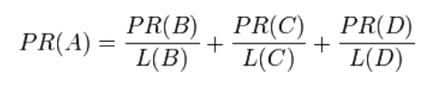
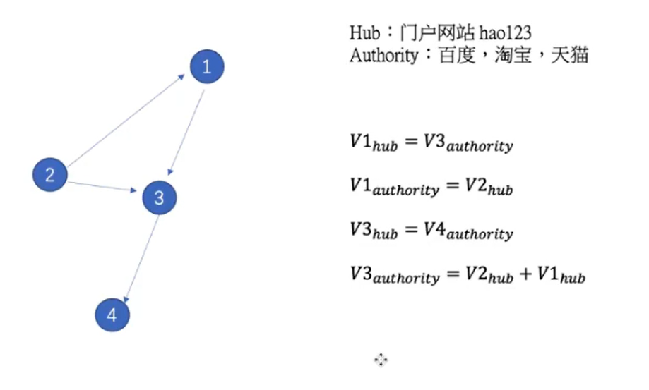

# 基础知识

## 1 图的表示
1. 邻接矩阵

## 2 图的特性
1. 子图
2. 度、出度、入度
3. 连通图、连通分量（无向图最大的连通分量）
4. 强连通图、弱连通图
5. 最短路径、图直径（最短路径的最大值）
6. 度中心性

$$
\frac{N_d}{n-1}
$$

## 3 图的中心性
1. 度中心性
2. 特征向量中心性。特征值越大，其相邻节点的度越大。
3. 连接的中心性。节点在图中的重要性。其他节点两两到达是否经过该节点

## 4 网页排序算法

### page rank算法

* 节点值等于指向节点的边的值的和。
* 边的值评分节点值
* 阻尼系数，有0.85的概率按照路径传播。

具体的步骤：
1. 在初始阶段：网页通过链接关系构建起Web图，每个页面设置相同的PageRank值，通过若干轮的计算，会得到每个页面所获得的最终PageRank值。随着每一轮的计算进行，网页当前的PageRank值会不断得到更新。

2. 在一轮中更新页面PageRank得分的计算方法：在一轮更新页面PageRank得分的计算中，每个页面将其当前的PageRank值平均分配到本页面包含的出链上，这样每个链接即获得了相应的权值。而每个页面将所有指向本页面的入链所传入的权值求和，即可得到新的PageRank得分。当每个页面都获得了更新后的PageRank值，就完成了一轮PageRank计算。、

3.  由于存在一些出链为0，也就是那些不链接任何其他网页的网， 也称为孤立网页，使得很多网页能被访问到。因此需要对 PageRank公式进行修正，即在简单公式的基础上增加了阻尼系数（damping factor）q， q一般取值q=0.85。其意义是，在任意时刻，用户到达某页面后并继续向后浏览的概率。 1- q= 0.15就是用户停止点击，随机跳到新URL的概率）的算法被用到了所有页面上，估算页面可能被上网者放入书签的概率。最后，即所有这些被换算为一个百分比再乘上一个系数q。由于下面的算法，没有页面的PageRank会是0。所以，Google通过数学系统给了每个页面一个最小值。

### HITS算法
