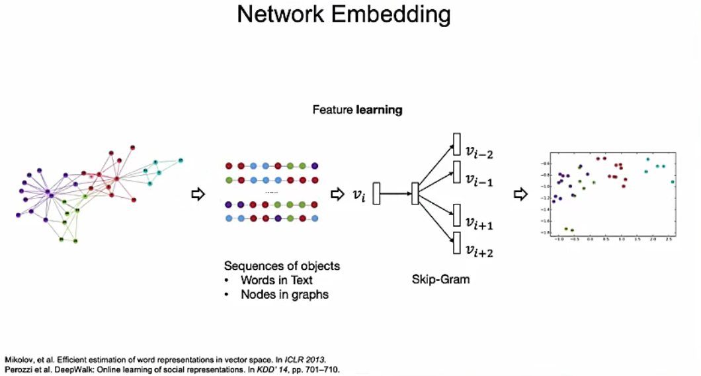

# 图表示学习

## 0 简介

### 概念
图表示学习，即图网络嵌入（Network Embedding）、图嵌入（Graph Embedding），用于得到网络中节点的低维、稠密、实值的向量表示，该向量表示形式在向量空间中具有表示以及推理的能力，可作为机器学习模型的输入，进而运用到网络问题领域下的常见任务中。

简单来说，就是将图转换成特征向量。

图表示学习，结合了图和表示学习领域相关的知识。希望通过神经网络能够自动抽取图中的特征。

### 应用

* 节点分类
* 链路预测
* 图分类
* 节点关系可视化
* 社交网络发现
* 图进化

### 目的
图表示学习是表示学习技术的分支领域，表示学习的目的是要得到对数据的广义特征表示。如邻接矩阵是对网络结构的表示，链表是对列表结构的表示，TFIDF 特征是对文本的特征表示。

**向量表示**可以通过多种手法得到，手法区分形式也不同，如最经典的以是否为监督学习进行区分，是否以只进行局部表示学习而区分，以及利用表示学习过程中所采用的方法是否为线性方法而区分。而图表示学习则专注于对图网络的表示，如图 2-8 所示，它能够以更加直观、高效的方式还原原始空间中节点的关系。

### 分类

表示学习方法包括四类主流方法：基于矩阵分解的方法、基于随机游走的方法、基于深度编码器的方法以及基于邻域聚合的方法。

* 基于矩阵分解的方法主要以矩阵分解的方式将原始的𝑛 × 𝑚大小的邻接矩阵降维表示成一个𝑛 × 𝑘大小的矩阵，其中𝑘 ≪ 𝑛，典型的有基于谱的图表示学习算法如拉普拉斯特征映射（Laplacian Eigenmaaps）算法[46]，以及基于最优化的图表示学习算法如多维量表算法 MDS[47]等。包括特征向量和SVD分解等，都可以提取图的特征值。
* 基于随机游走的方法主要是将 word2vec 方法引入到图表示学习过程，通过在网络随机游走形成大量“语列”信息，再将“语列”使用自然语言处理下的经典方法进行向量表示学习，得到能够体现节点间相互关系的、稠密的向量表示，典型的有 DeepWalk 算法[48]，node2vec 算法[49]等。
* 基于深度自编码器[50]的方法主要是使用神经网络来构建图自编码器，从而压缩节点邻居信息，典型如 SDNE 算法[34]。
* 而基于邻域聚合的方法主要是将卷积神经网络中的“卷积”运算拓展到了图网络，通过邻域聚合的方式在不规则的图网络中进行特征聚合，从而得到节点嵌入表示。

### 分类说明
* 基于矩阵分解的方法、基于随机游走的方法和基于深度编码器的方法都具有很大的局限性，它们的学习目标是从一个固定的图中得到节点的嵌入表示，因此旦图结构发生改变或者有新的节点出现，就必须重新训练模型得到节点的嵌入表示。基于邻域聚合的方法属于归纳式学习方法，它的学习目标是得到为每个节点产生能够进行嵌入表示的映射函数，所以即使节点之间的边关系发生改变或者有新的节点出现，它都能很快得到节点的嵌入表示而无须重新训练模型。

* 而恶意软件检测正是一个需要用已知预测未知的问题，给定已知的恶意样本和良性样本的相关行为数据，需要能够基于这些已知的数据去检测未知样本的性质，而未知样本中可能很可能含有未知节点以及在训练样本中未曾出现过的函数调用关系。因此，本文采用了基于邻域聚合的图表示学习方法对函数调用行为进行嵌入表示学习，并将得到的函数节点嵌入表示输入到分类模型进行端到端的训练，从而实现对恶意软件的检测。

## 1 基于矩阵分解的方法

### 特征向量

### SVD分解

### 拉普拉斯映射算法

### 多维量表算法MDS

## 2 基于随机游走的方法

 

* 原理：随机游走+skipgram模型
  * 随机游走生成节点列，输入到skipgram模型当中，进行训练和学习。
* 相关的模型和算法
  * deepwalk算法
  * LINE模型
  * PTE模型
  * node2vec模型
  * metapath2vec模型

### deepwalk算法

### node2vec算法

## 3 基于深度自编码器的方法

### SDNE 算法

## 4 基于邻域聚合的方法

### GNN算法