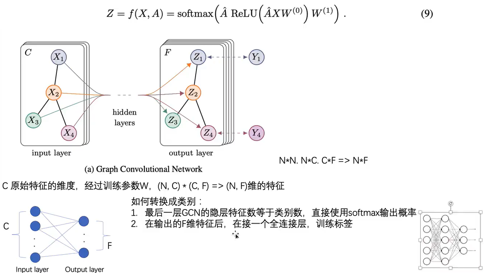
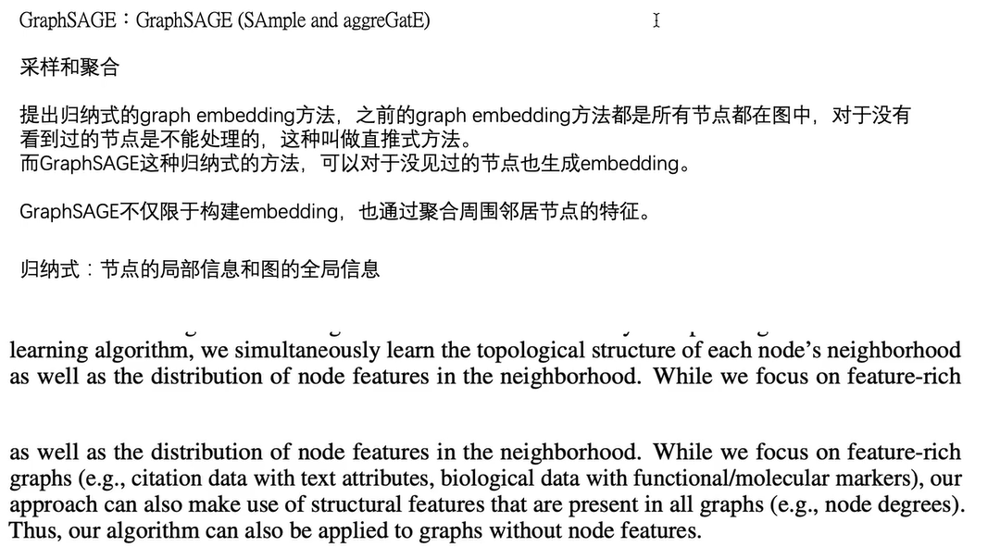
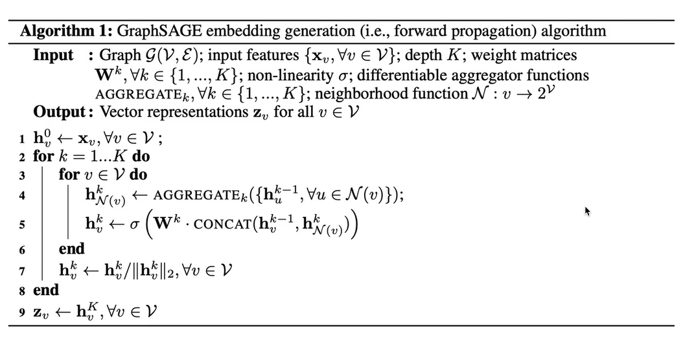
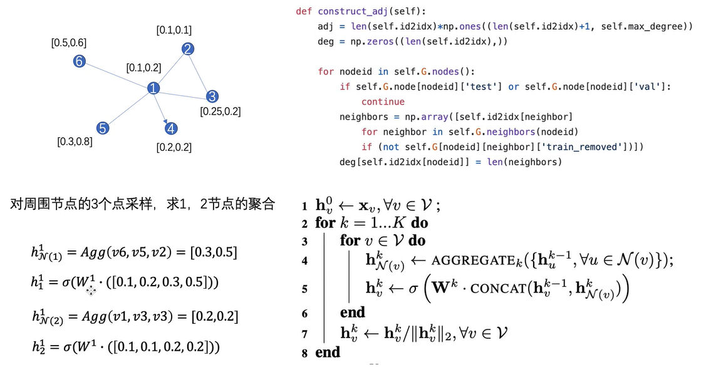
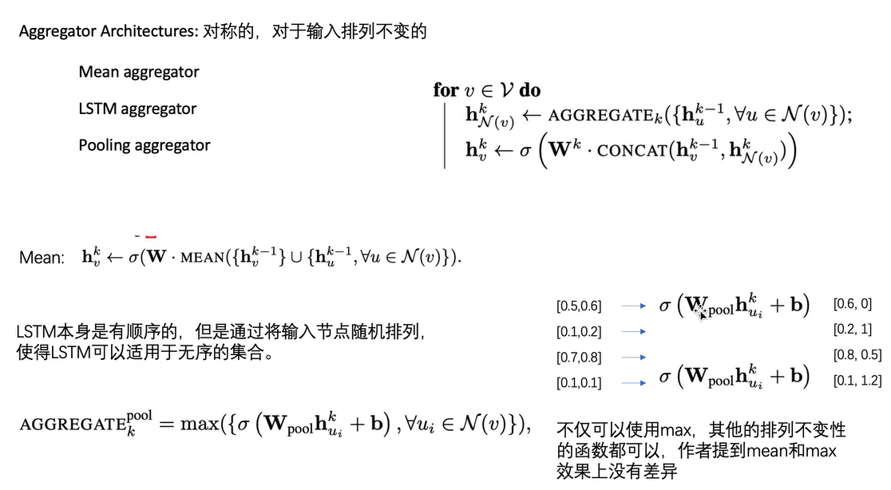
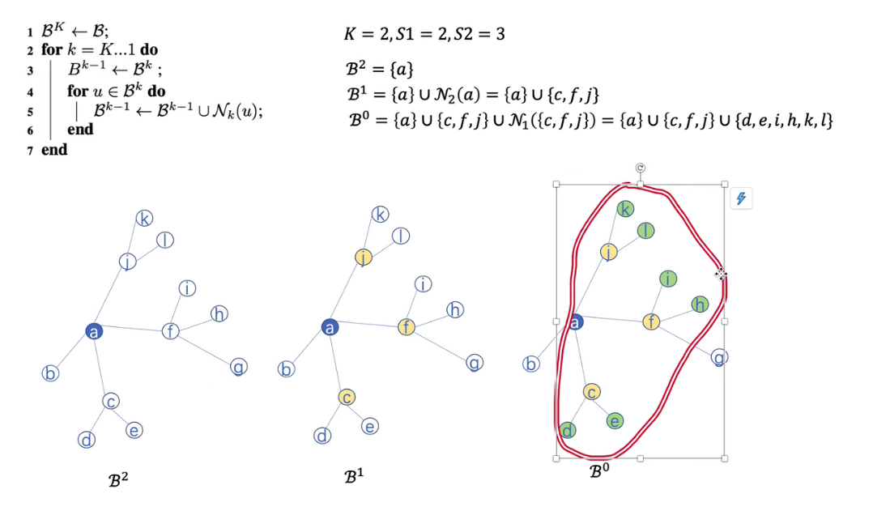

# 图神经网络GNN

## 简介

### 概述
包括主要的三个算法

* GCN
* GraphSAGE
* GAT

## 1 GCN
1. 原理都是利用节点周围节点的信息，聚合下一层的节点的信息。
2. 使用对角阵D进行归一化操作。
3. 使用邻接矩阵A和特征矩阵X相乘，聚合直接相连的节点的信息。

* 公式说明

* 物理含义

* 具体目标
  * 还是得到节点的嵌入向量。
  * 利用节点的类型作为标签，进行有监督的学习

## 2 GraphSAGE

### graphSAGE原理
* 原理：聚合节点周围的节点的信息。

* 算法流程。包括聚合和拼接两个关键步骤。可以定制这两个函数的具体形式。

* 一个算法的实例。aggregate采用了均值函数。concat采用了直接拼接的函数。W会将节点高维的节点特征映射到低维节点特征当中。

* 在以上运算的基础上进行采样。即选择固定数量的邻居节点，而不是所有的邻居节点。以下是一个采样的实例

* 可以选择不同的聚合函数

### graphSAGE minibatch
* graphSAGE有minibatch版本。graphsage只聚合周围图的信息，而不是聚合图上所有节点的信息，所以可以通过采样选点的方式，进行训练。而不是全图训练。
* 关于这里minibatch的含义进行说明：在GCN和上边的graphSAGE当中，全图相当于所有样本构成的样本集合，每一个图节点相当于一个样本，每个图节点都有一个类别，根据softmax层的输出和这个图节点的类别可以得到当前节点的损失，然后进行反向传播和梯度下降。输入如果是整个图，则相当于在全局的样本上进行batch梯度下降，而不是minibatch梯度下降。这样，如果图很大的话，就会导致输入过于庞大，迭代过于缓慢。所以通过采样（选择小批量的样本minibatch）的方式，进行训练，能够加快训练的速度。

### graphSAGE embedding

* graphSAGE无监督学习的方案。
* 基于的原理：如果两个节点的比较相近，那么他们具有相近的表征。如果两个节点比较远，则他们的表征就会比较远。

## 3 GAT
> 暂时不太需要。
* 原理：图注意力网络。在GCN的基础上，加上了attension系数。

