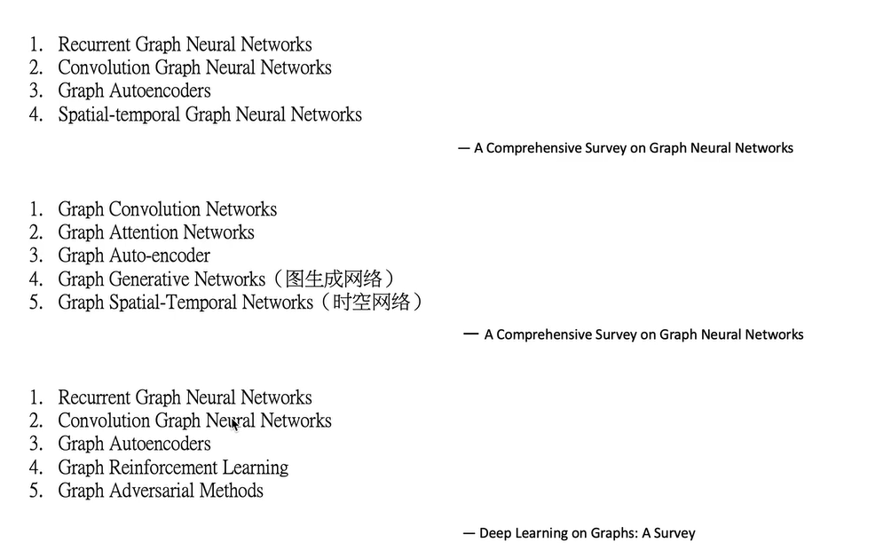
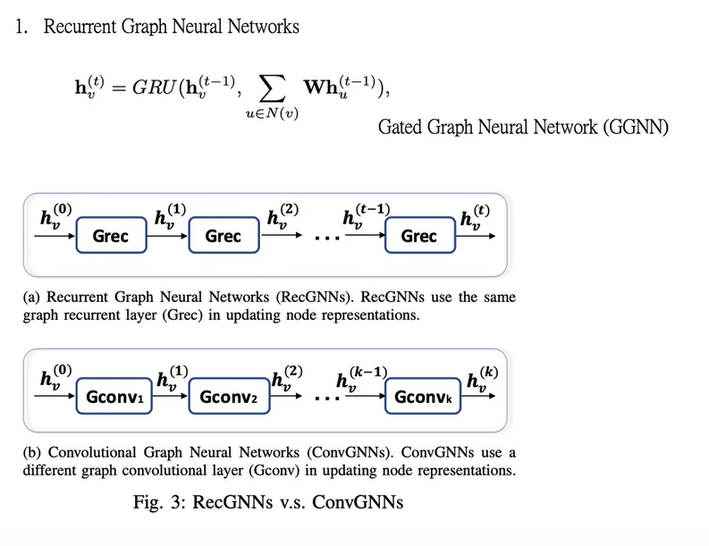
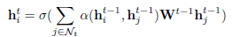
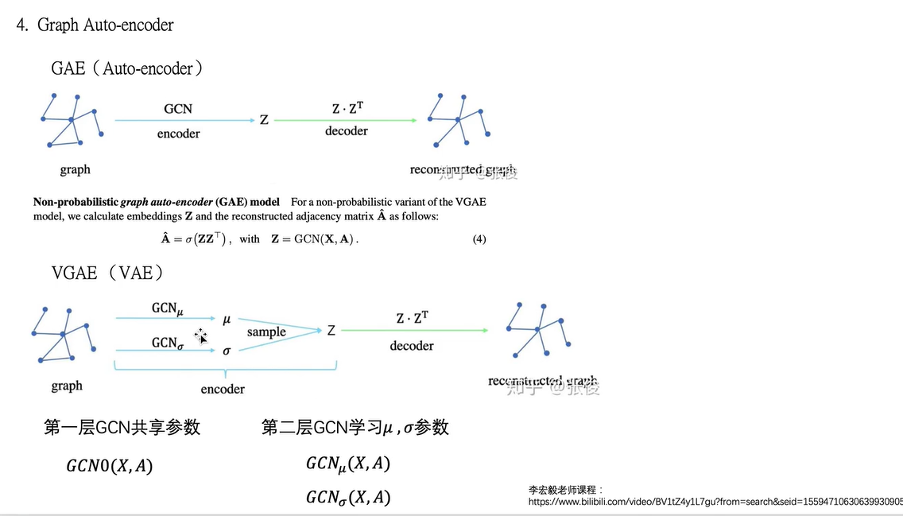
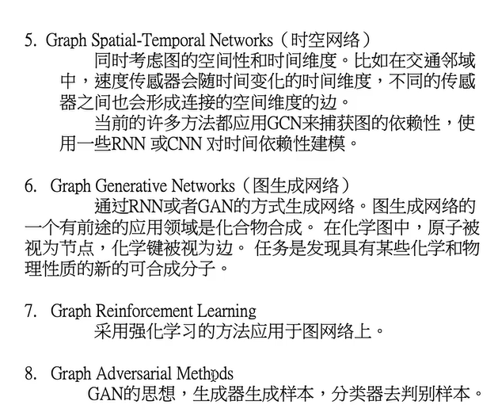
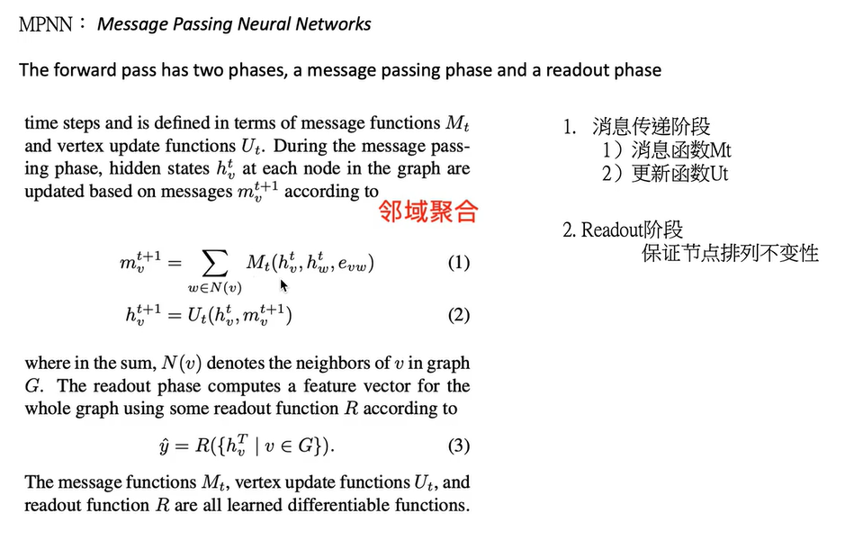
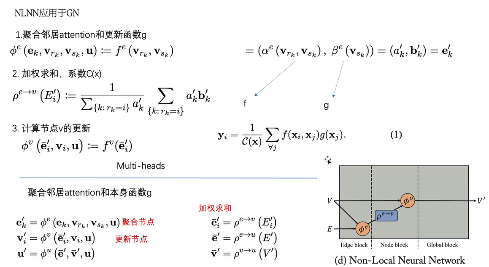
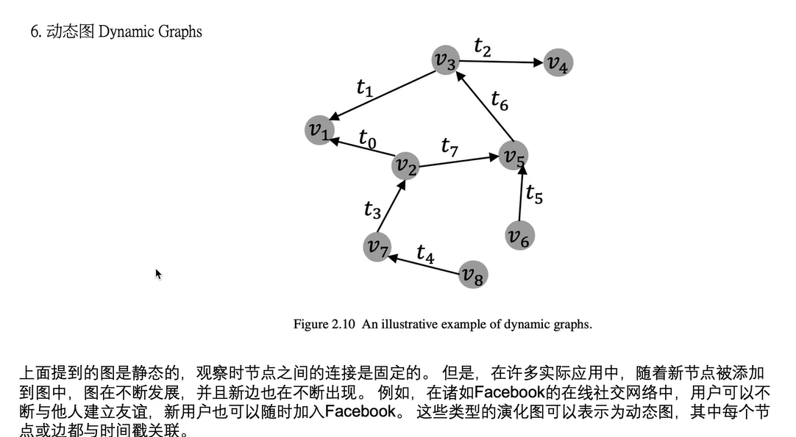
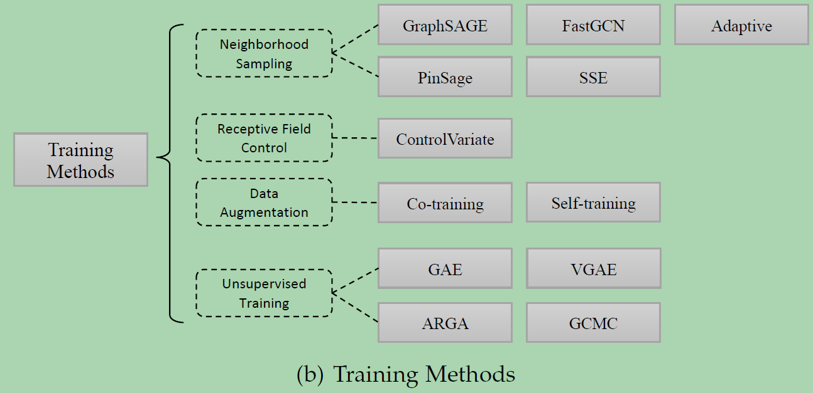
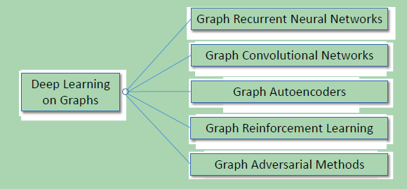

# 图神经网络的综述

主要是对图神经网络的综述，包括各种类型的图神经网络。
## 0 概述
### 发展原因
* 计算资源的快速发展（如GPU）
* 大量训练数据的可用性
* 深度学习从欧氏空间数据中提取潜在特征的有效性

### 图嵌入和图神经网络的关系

图神经网络的研究与图嵌入或网络嵌入密切相关，图嵌入或网络嵌入是数据挖掘和机器学习界日益关注的另一个课题。

图嵌入旨在通过保留图的网络拓扑结构和节点内容信息，将图中顶点表示为低维向量，以便使用简单的机器学习算法（例如，支持向量机分类）进行处理。许多图嵌入算法通常是无监督的算法，它们可以大致可以划分为三个类别，即矩阵分解、随机游走和深度学习方法。同时图嵌入的深度学习方法也属于图神经网络，包括基于图自动编码器的算法（如DNGR和SDNE）和无监督训练的图卷积神经网络（如GraphSage）。

## 1 根据神经网络的类型进行分类

主要有以下六种：
* 图卷积网络（Graph Convolution Networks，GCN）、
* 图递归网络GRNN、
* 图注意力网络（Graph Attention Networks）、
* 图自编码器（ Graph Autoencoders）、
* 图生成网络（ Graph Generative Networks） 
* 图时空网络（Graph Spatial-temporal Networks）。

### 图卷积神经网络

图卷积网络将卷积运算从传统数据（例如图像）推广到图数据。其核心思想是学习一个函数映射 ，通过该映射图中的节点可以聚合它自己的特征与它的邻居特征来生成节点的新表示。图卷积网络是许多复杂图神经网络模型的基础，包括基于自动编码器的模型、生成模型和时空网络等。

**图卷积神经网络GCN**

* 方法又可以分为两大类，基于谱（spectral-based）和基于空间（spatial-based）。基于谱的方法从图信号处理的角度引入滤波器来定义图卷积，其中图卷积操作被解释为从图信号中去除噪声。基于空间的方法将图卷积表示为从邻域聚合特征信息，当图卷积网络的算法在节点层次运行时，图池化模块可以与图卷积层交错，将图粗化为高级子结构。如下图所示，这种架构设计可用于提取图的各级表示和执行图分类任务。

**GraphSAGE**

### 图递归神经网络

### 图注意力神经网络
**图注意力网络GAT**

* 是一种基于空间的图卷积网络，它的注意机制是在聚合特征信息时，将注意机制用于确定节点邻域的权重。其中α（·）是一个注意力函数，它自适应地控制相邻节点j对节点i的贡献。

* 在聚集特征信息时将注意力权重分配给不同的邻居节点，还可以根据注意力权重将多个模型集合起来，以及使用注意力权重引导随机行走。
* 尽管GAT和GAAN在图注意网络的框架下进行了分类，但它们也可以同时被视为基于空间的图形卷积网络。GAT和GAAN的优势在于，它们能够自适应地学习邻居的重要性权重。然而，计算成本和内存消耗随着每对邻居之间的注意权重的计算而迅速增加。

### 图自编码器

图自动编码器是一类图嵌入方法，其目的是利用神经网络结构将图的顶点表示为低维向量。典型的解决方案是利用多层感知机作为编码器来获取节点嵌入，其中解码器重建节点的邻域统计信息，如positive pointwise mutual information （PPMI）或一阶和二阶近似值。

目前基于GCN的自编码器的方法主要有：
* Graph Autoencoder (GAE)
* Adversarially Regularized Graph Autoencoder (ARGA)

图自编码器的其它变体有：

* Network Representations with Adversarially Regularized Autoencoders (NetRA)
* Deep Neural Networks for Graph Representations (DNGR)
* Structural Deep Network Embedding (SDNE)
* Deep Recursive Network Embedding (DRNE)

DNGR和SDNE学习仅给出**拓扑结构的节点嵌入**，而GAE、ARGA、NetRA、DRNE用于学习当**拓扑信息和节点内容特征都存在时的节点嵌入**。图自动编码器的一个挑战是邻接矩阵A的稀疏性，这使得解码器的正条目数远远小于负条目数。为了解决这个问题，DNGR重构了一个更密集的矩阵，即PPMI矩阵，SDNE对邻接矩阵的零项进行惩罚，GAE对邻接矩阵中的项进行重加权，NetRA将图线性化为序列。

### 图生成网络

图生成网络的目标是在给定一组观察到的图的情况下生成新的图。图生成网络的许多方法都是特定于领域的。例如，在分子图生成中，一些工作模拟了称为SMILES的分子图的字符串表示。在自然语言处理中，生成语义图或知识图通常以给定的句子为条件。最近，人们提出了几种通用的方法。一些工作将生成过程作为节点和边的交替形成因素，而另一些则采用生成对抗训练。这类方法要么使用GCN作为构建基块，要么使用不同的架构。

基于GCN的图生成网络主要有

**Molecular Generative Adversarial Networks (MolGAN)**
将relational GCN、改进的GAN和强化学习（RL）目标集成在一起，以生成具有所需属性的图。GAN由一个生成器和一个鉴别器组成，它们相互竞争以提高生成器的真实性。在MolGAN中，生成器试图提出一个伪图及其特征矩阵，而鉴别器的目标是区分伪样本和经验数据。此外，还引入了一个与鉴别器并行的奖励网络，以鼓励生成的图根据外部评价器具有某些属性。

**Deep Generative Models of Graphs (DGMG)**
利用基于空间的图卷积网络来获得现有图的隐藏表示。生成节点和边的决策过程是以整个图的表示为基础的。简而言之，DGMG递归地在一个图中产生一个节点，直到达到某个停止条件。在添加新节点后的每一步，DGMG都会反复决定是否向添加的节点添加边，直到决策的判定结果变为假。如果决策为真，则评估将新添加节点连接到所有现有节点的概率分布，并从概率分布中抽取一个节点。将新节点及其边添加到现有图形后，DGMG将更新图的表示。

其它架构的图生成网络主要有

**GraphRNN**
通过两个层次的循环神经网络的深度图生成模型。图层次的RNN每次向节点序列添加一个新节点，而边层次RNN生成一个二进制序列，指示新添加的节点与序列中以前生成的节点之间的连接。为了将一个图线性化为一系列节点来训练图层次的RNN，GraphRNN采用了广度优先搜索（BFS）策略。为了建立训练边层次的RNN的二元序列模型，GraphRNN假定序列服从多元伯努利分布或条件伯努利分布。

**NetGAN**
Netgan将LSTM与Wasserstein-GAN结合在一起，使用基于随机行走的方法生成图形。GAN框架由两个模块组成，一个生成器和一个鉴别器。生成器尽最大努力在LSTM网络中生成合理的随机行走序列，而鉴别器则试图区分伪造的随机行走序列和真实的随机行走序列。训练完成后，对一组随机行走中节点的共现矩阵进行正则化，我们可以得到一个新的图。

### 图时空网络

图时空网络同时捕捉时空图的时空相关性。时空图具有全局图结构，每个节点的输入随时间变化。例如，在交通网络中，每个传感器作为一个节点连续记录某条道路的交通速度，其中交通网络的边由传感器对之间的距离决定。图形时空网络的目标可以是预测未来的节点值或标签，或者预测时空图标签。最近的研究仅仅探讨了GCNs的使用，GCNs与RNN或CNN的结合，以及根据图结构定制的循环体系结构。

目前图时空网络的模型主要有

* Diffusion Convolutional Recurrent Neural Network (DCRNN)

* CNN-GCN

* Spatial Temporal GCN (ST-GCN)

* Structural-RNN

## 2 根据框架和机制进行分类
### 基于消息传递机制的MPNN。
* MPNN分两个阶段，消息传递阶段和Readout阶段，readout阶段可以读出整个网络的特征向量，用于图分类，这个很关键。现在缺的两个部分之一。

### 局部图神经网络MLNN

### 图网络GN框架
统一了MPNN和MLNN
* 利用全局信息，更新每个点、每个边。
* 利用更新后的信息，形成全局的边和点。
* 利用全局的边和全局的点，构成新的全局信息

## 3 根据图计算的任务进行分类

### 节点问题：节点分类

### 边问题：将两个节点作为输入，输出边的预测

### 图问题：图分类、图匹配、图生成

### 图上的任务类别
* 半监督任务Node
* 有监督任务Graph Node
* 无监督任务Graph Embedding

## 4 根据图的类型进行分类
* 异构图
* 二部图
* 多维图
* 符号图
* 超图
* 动态图
### 异构图

点和点、边和边之间的关系不一样。节点不同。人和文章

### 二部图

将图中的节点分为两部分。不同部分的节点之间有边连接。但是各部分之间有连接。

### 多维图

边的类型有很多，多重关系组成的图。

### 符号图
边包含两种正负。

### 超图

### 动态图
节点之间的关系是会变化的。

### An overview of variants of graph neural networks

