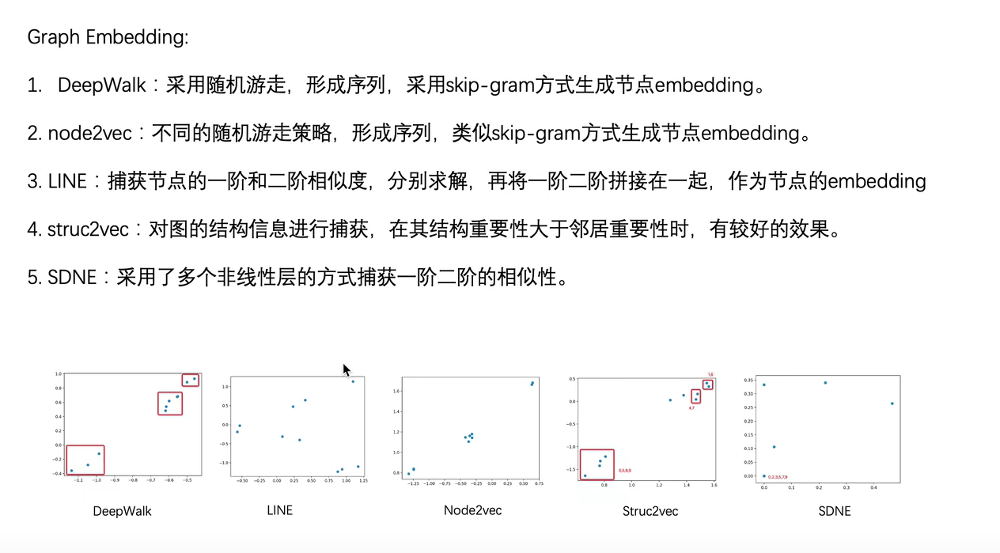
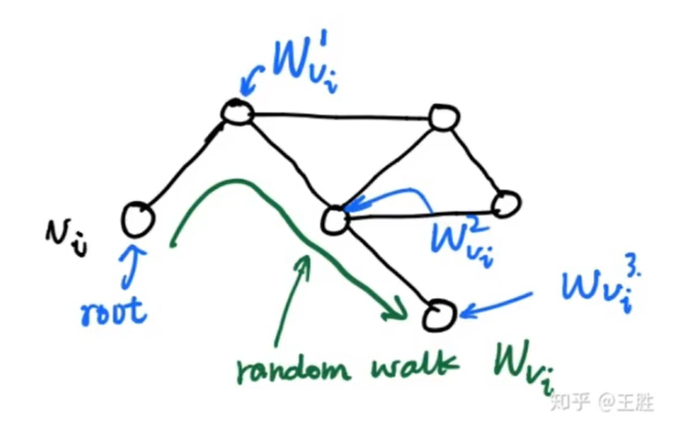
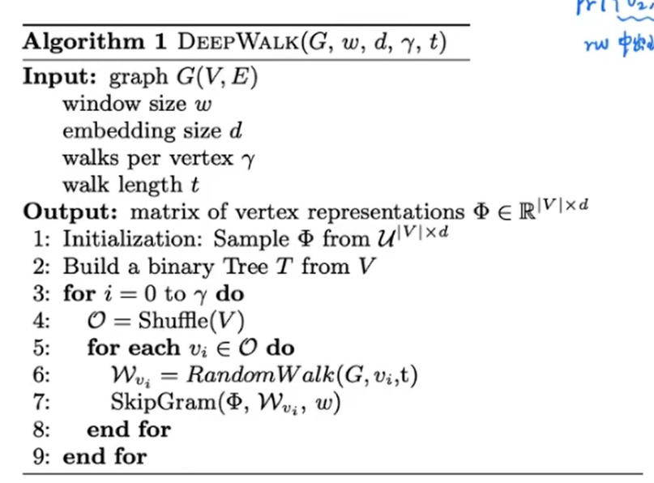
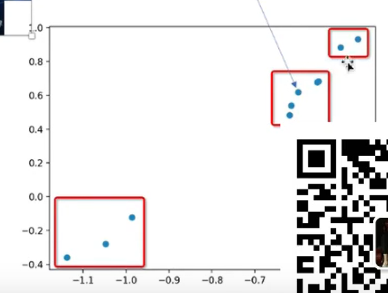
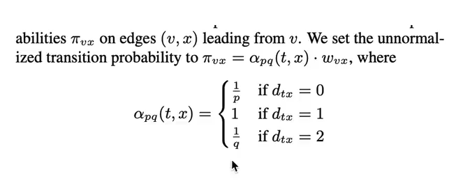
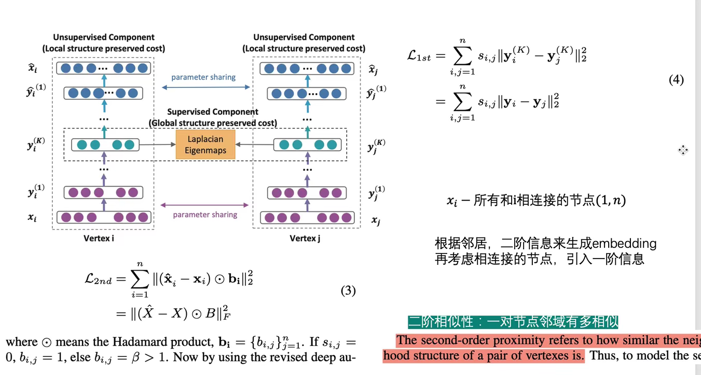

# 图嵌入

## 0 引言

### 概述
在图上进行每一个节点的embedding，最终得到的结果是图上每一个节点的嵌入表示。这里主要通过无监督的方法实现embedding的过程。主要包括五种传统算法

1. Deepwalk
2. LINE
3. SDNE
4. node2vec
5. struct2vec

### 作用

n维onehot向量表示图上的每一个节点。有多少个节点，就有多少onehot向量。如果节点的数量比较多，那么n的维度就会比较大。

### 代码

https://github.com/shenweichen/GraphEmbedding

## 1 deepwalk

* 对每一个节点进行多次随机游走得到一系列语义信息。

* w表示前后照顾的节点的数量、d表示嵌入后向量的维度、$\gamma$表示迭代的次数、t表示行走的步长

* 嵌入的维度为d=2的时候，就可以进行二维可视化了。如下所示，通过嵌入后的二维向量可是话，能够得到点的距离关系，相当于利用了图特征。

## 2 LINE

* 基于以下两个原理：
  * 节点相互连接，并且相互连接的节点之间的权重很大，具有很高的相似性。
  * 节点的邻居如果很相似的话，那么这两个节点即使不连接，那么他们也非常相似。
* 同时使用了一阶相似度和二阶相似度。

## 3 node2vec

* 同质性：节点和周围节点的是非常相似的。
* 结构等价性：结构等价性
* 有策略的随机游走。根据概率进行随机游走，选择游走序列。

## 4 struct2vec
> 这个可以以后再学，有点复杂。而且大概率用不到。

* 能够捕捉不相邻节点的同构信息。

## 5 SDNE

* 使用deeplearning的方式训练节点的embedding

