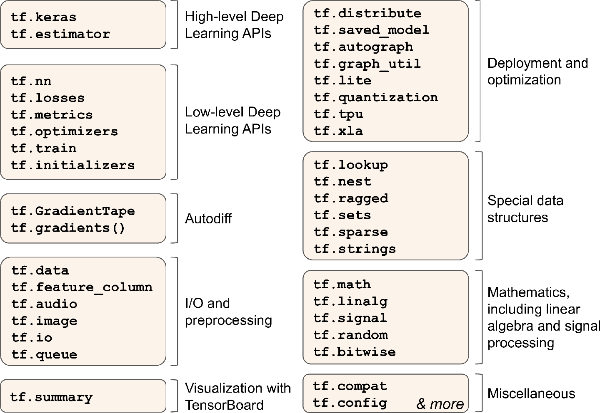
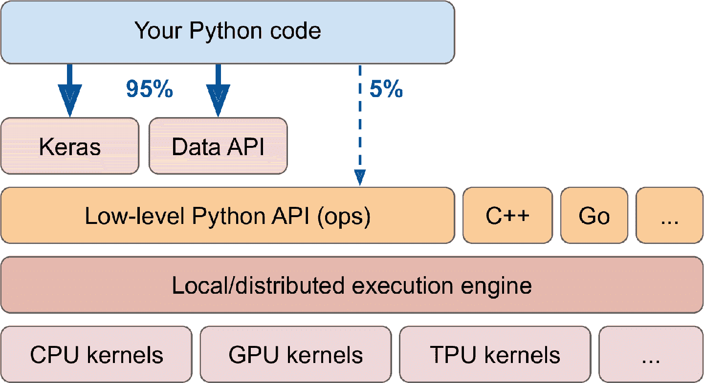
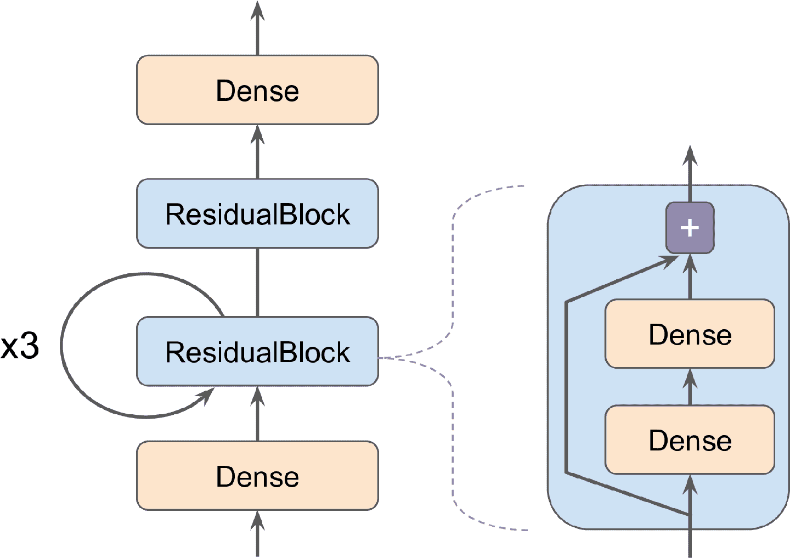
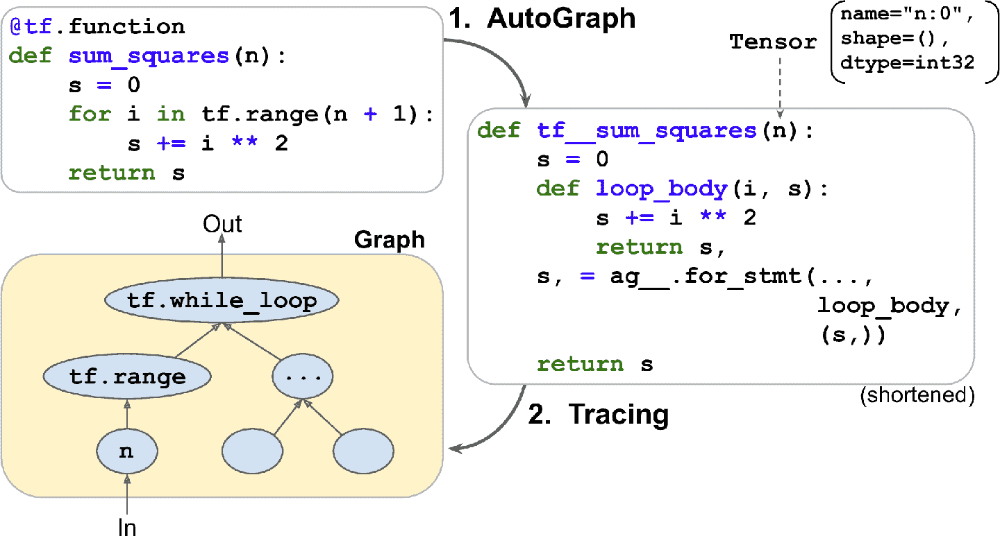

# 十二、使用 TensorFlow 自定义模型并训练

> 译者：[@SeanCheney](https://www.jianshu.com/u/130f76596b02)


目前为止，我们只是使用了 TensorFlow 的高级 API —— `tf.keras`，它的功能很强大：搭建了各种神经网络架构，包括回归、分类网络、Wide & Deep 网络、自归一化网络，使用了各种方法，包括批归一化、丢弃和学习率调度。事实上，你在实际案例中 95% 碰到的情况只需要`tf.keras`就足够了（和`tf.data`，见第 13 章）。现在来深入学习 TensorFlow 的低级 Python API。当你需要实现自定义损失函数、自定义标准、层、模型、初始化器、正则器、权重约束时，就需要低级 API 了。甚至有时需要全面控制训练过程，例如使用特殊变换或对约束梯度时。这一章就会讨论这些问题，还会学习如何使用 TensorFlow 的自动图生成特征提升自定义模型和训练算法。首先，先来快速学习下 TensorFlow。

> 笔记：TensorFlow 2.0（beta）是 2019 年六月发布的，相比前代更易使用。本书第一版使用的是 TF 1，这一版使用的是 TF 2。

## TensorFlow 速览

TensorFlow 是一个强大的数值计算库，特别适合做和微调大规模机器学习（但也可以用来做其它的重型计算）。TensorFlow 是谷歌大脑团队开发的，支持了谷歌的许多大规模服务，包括谷歌云对话、谷歌图片和谷歌搜索。TensorFlow 是 2015 年 11 月开源的，（按文章引用、公司采用、GitHub 星数）是目前最流行的深度学习库。无数的项目是用 TensorFlow 来做各种机器学习任务，包括图片分类、自然语言处理、推荐系统和时间序列预测。TensorFlow 提供的功能如下：

*   TensorFlow 的核心与 NumPy 很像，但 TensorFlow 支持 GPU；

*   TensorFlow 支持（多设备和服务器）分布式计算；

*   TensorFlow 使用了即时 JIT 编译器对计算速度和内存使用优化。编译器的工作是从 Python 函数提取出计算图，然后对计算图优化（比如剪切无用的节点），最后高效运行（比如自动并行运行独立任务）；

*   计算图可以导出为迁移形式，因此可以在一个环境中训练一个 TensorFlow 模型（比如使用 Python 或 Linux），然后在另一个环境中运行（比如在安卓设备上用 Java 运行）；

*   TensorFlow 实现了自动微分，并提供了一些高效的优化器，比如 RMSProp 和 NAdam，因此可以容易的最小化各种损失函数。

基于上面这些特点，TensorFlow 还提供了许多其他功能：最重要的是`tf.keras`，还有数据加载和预处理操作（`tf.data`，`tf.io`等等），图片处理操作（`tf.image`），信号处理操作（`tf.signal`），等等（图 12-1 总结了 TensorFlow 的 Python API）



图 12-1 TensorFlow 的 Python API

> 提示：这一章会介绍 TensorFlow API 的多个包和函数，但来不及介绍全部，所以读者最好自己花点时间好好看看 API。TensorFlow 的 API 十分丰富，且文档详实。

TensorFlow 的低级操作都是用高效的 C++ 实现的。许多操作有多个实现，称为`核`：每个核对应一个具体的设备型号，比如 CPU、GPU，甚至 TPU（张量处理单元）。GPU 通过将任务分成小块，在多个 GPU 线程中并行运行，可以极大提高提高计算的速度。TPU 更快：TPU 是自定义的 ASIC 芯片，专门用来做深度学习运算的（第 19 章会讨论适合使用 GPU 和 TPU）。

TensorFlow 的架构见图 12-2。大多数时候你的代码使用高级 API 就够了（特别是`tf.keras`和`tf.data`），但如果需要更大的灵活性，就需要使用低级 Python API，来直接处理张量。TensorFlow 也支持其它语言的 API。任何情况下，甚至是跨设备和机器的情况下，TensorFlow 的执行引擎都会负责高效运行。



图 12-2 TensorFlow 的架构

TensorFlow 不仅可以运行在 Windows、Linux 和 macOS 上，也可以运行在移动设备上（使用 TensorFlow Lite），包括 iOS 和安卓（见第 19 章）。如果不想使用 Python API，还可以使用 C++、Java、Go 和 Swift 的 API。甚至还有 JavaScript 的实现 TensorFlow.js，它可以直接在浏览器中运行。

TensorFlow 不只有这些库。TensorFlow 处于一套可扩展的生态系统库的核心位置。首先，TensorBoard 可以用来可视化。其次，TensorFlow Extended（TFX），是谷歌推出的用来生产化的库，包括：数据确认、预处理、模型分析和服务（使用 TF Serving，见第 19 章）。谷歌的 TensorFlow Hub 上可以方便下载和复用预训练好的神经网络。你还可以从 TensorFlow 的 [model garden](https://links.jianshu.com/go?to=https%3A%2F%2Fgithub.com%2Ftensorflow%2Fmodels%2F) 获取许多神经网络架构，其中一些是预训练好的。[TensorFlow Resources](https://links.jianshu.com/go?to=https%3A%2F%2Fwww.tensorflow.org%2Fresources) 和[这个页面](https://links.jianshu.com/go?to=https%3A%2F%2Fgithub.com%2Fjtoy%2Fawesome-tensorflow)上有更多的资源。你可以在 GitHub 上找到数百个 TensorFlow 项目，无论干什么都可以方便地找到现成的代码。

> 提示：越来越多的 ML 论文都附带了实现过程，一些甚至带有预训练模型。可以在[这里](https://links.jianshu.com/go?to=https%3A%2F%2Fpaperswithcode.com%2F)找到。

最后，TensorFlow 有一支热忱满满的开发者团队，也有庞大的社区。要是想问技术问题，可以去[这里](https://links.jianshu.com/go?to=http%3A%2F%2Fstackoverflow.com%2F)
，问题上打上 tensorflow 和 python 标签。还可以在 [GitHub](https://links.jianshu.com/go?to=https%3A%2F%2Fgithub.com%2Ftensorflow%2Ftensorflow) 上提 bug 和新功能。一般的讨论可以去[谷歌群组](https://links.jianshu.com/go?to=https%3A%2F%2Fgroups.google.com%2Fa%2Ftensorflow.org%2Fforum%2F)。

下面开始写代码！

## 像 NumPy 一样使用 TensorFlow

TensorFlow 的 API 是围绕张量（tensor）展开的，从一个操作流动（flow）到另一个操作，所以名字叫做 TensorFlow。张量通常是一个多维数组（就像 NumPy 的`ndarray`），但也可以是标量（即简单值，比如 42）。张量对于自定义的损失函数、标准、层等等非常重要，接下来学习如何创建和操作张量。

### 张量和运算

使用`tf.constant()`创建张量。例如，下面的张量表示的是两行三列的浮点数矩阵：

```py
>>> tf.constant([[1., 2., 3.], [4., 5., 6.]]) # matrix
<tf.Tensor: id=0, shape=(2, 3), dtype=float32, numpy=
array([[1., 2., 3.],
       [4., 5., 6.]], dtype=float32)>
>>> tf.constant(42) # 标量
<tf.Tensor: id=1, shape=(), dtype=int32, numpy=42> 
```

就像`ndarray`一样，`tf.Tensor`也有形状和数据类型（`dtype`）：

```py
>>> t = tf.constant([[1., 2., 3.], [4., 5., 6.]])
>>> t.shape
TensorShape([2, 3])
>>> t.dtype
tf.float32 
```

索引和 NumPy 中很像：

```py
>>> t[:, 1:]
<tf.Tensor: id=5, shape=(2, 2), dtype=float32, numpy=
array([[2., 3.],
       [5., 6.]], dtype=float32)>
>>> t[..., 1, tf.newaxis]
<tf.Tensor: id=15, shape=(2, 1), dtype=float32, numpy=
array([[2.],
       [5.]], dtype=float32)> 
```

最重要的，所有张量运算都可以执行：

```py
>>> t + 10
<tf.Tensor: id=18, shape=(2, 3), dtype=float32, numpy=
array([[11., 12., 13.],
       [14., 15., 16.]], dtype=float32)>
>>> tf.square(t)
<tf.Tensor: id=20, shape=(2, 3), dtype=float32, numpy=
array([[ 1.,  4.,  9.],
       [16., 25., 36.]], dtype=float32)>
>>> t @ tf.transpose(t)
<tf.Tensor: id=24, shape=(2, 2), dtype=float32, numpy=
array([[14., 32.],
       [32., 77.]], dtype=float32)> 
```

可以看到，`t + 10`等同于调用`tf.add(t, 10)`，`-`和`*`也支持。`@`运算符是在 Python3.5 中出现的，用于矩阵乘法，等同于调用函数`tf.matmul()`。

可以在 tf 中找到所有基本的数学运算（`tf.add()`、`tf.multiply()`、`tf.square()`、`tf.exp()`、`tf.sqrt()`），以及 NumPy 中的大部分运算（比如`tf.reshape()`、`tf.squeeze()`、`tf.tile()`）。一些 tf 中的函数与 NumPy 中不同，例如，`tf.reduce_mean()`、`tf.reduce_sum()`、`tf.reduce_max()`、`tf.math.log()`等同于`np.mean()`、`np.sum()`、`np.max()`和`np.log()`。当函数名不同时，通常都是有原因的。例如，TensorFlow 中必须使用`tf.transpose(t)`，不能像 NumPy 中那样使用`t.T`。原因是函数`tf.transpose(t)`所做的和 NumPy 的属性`T`并不完全相同：在 TensorFlow 中，是使用转置数据的复制来生成张量的，而在 NumPy 中，`t.T`是数据的转置视图。相似的，`tf.reduce_sum()`操作之所以这么命名，是因为它的 GPU 核（即 GPU 实现）所采用的归约算法不能保证元素相加的顺序，因为 32 位的浮点数精度有限，每次调用的结果可能会有细微的不同。`tf.reduce_mean()`也是这样（`tf.reduce_max()`结果是确定的）。

> 笔记：许多函数和类都有假名。比如，`tf.add()`和`tf.math.add()`是相同的。这可以让 TensorFlow 对于最常用的操作有简洁的名字，同时包可以有序安置。

> Keras 的低级 API
> Keras API 有自己的低级 API，位于`keras.backend`，包括：函数`square()`、`exp()`、`sqrt()`。在`tf.keras`中，这些函数通常通常只是调用对应的 TensorFlow 操作。如果你想写一些可以迁移到其它 Keras 实现上，就应该使用这些 Keras 函数。但是这些函数不多，所以这本书里就直接使用 TensorFlow 的运算了。下面是一个简单的使用了`keras.backend`的例子，简记为`k`：
> 
> ```py
> >>> from tensorflow import keras
> >>> K = keras.backend
> >>> K.square(K.transpose(t)) + 10
> <tf.Tensor: id=39, shape=(3, 2), dtype=float32, numpy=
> array([[11., 26.],
>        [14., 35.],
>        [19., 46.]], dtype=float32)> 
> ```

### 张量和 NumPy

张量和 NumPy 融合地非常好：使用 NumPy 数组可以创建张量，张量也可以创建 NumPy 数组。可以在 NumPy 数组上运行 TensorFlow 运算，也可以在张量上运行 NumPy 运算：

```py
>>> a = np.array([2., 4., 5.])
>>> tf.constant(a)
<tf.Tensor: id=111, shape=(3,), dtype=float64, numpy=array([2., 4., 5.])>
>>> t.numpy() # 或 np.array(t)
array([[1., 2., 3.],
       [4., 5., 6.]], dtype=float32)
>>> tf.square(a)
<tf.Tensor: id=116, shape=(3,), dtype=float64, numpy=array([4., 16., 25.])>
>>> np.square(t)
array([[ 1.,  4.,  9.],
       [16., 25., 36.]], dtype=float32) 
```

> 警告：NumPy 默认使用 64 位精度，TensorFlow 默认用 32 位精度。这是因为 32 位精度通常对于神经网络就足够了，另外运行地更快，使用的内存更少。因此当你用 NumPy 数组创建张量时，一定要设置`dtype=tf.float32`。

### 类型转换

类型转换对性能的影响非常大，并且如果类型转换是自动完成的，不容易被注意到。为了避免这样，TensorFlow 不会自动做任何类型转换：只是如果用不兼容的类型执行了张量运算，TensorFlow 就会报异常。例如，不能用浮点型张量与整数型张量相加，也不能将 32 位张量与 64 位张量相加：

```py
>>> tf.constant(2.) + tf.constant(40)
Traceback[...]InvalidArgumentError[...]expected to be a float[...]
>>> tf.constant(2.) + tf.constant(40., dtype=tf.float64)
Traceback[...]InvalidArgumentError[...]expected to be a double[...] 
```

这点可能一开始有点恼人，但是有其存在的理由。如果真的需要转换类型，可以使用`tf.cast()`：

```py
>>> t2 = tf.constant(40., dtype=tf.float64)
>>> tf.constant(2.0) + tf.cast(t2, tf.float32)
<tf.Tensor: id=136, shape=(), dtype=float32, numpy=42.0> 
```

### 变量

到目前为止看到的`tf.Tensor`值都是不能修改的。意味着不能使用常规张量实现神经网络的权重，因为权重必须要能被反向传播调整。另外，其它的参数也需要随着时间调整（比如，动量优化器要跟踪过去的梯度）。此时需要的是`tf.Variable`：

```py
>>> v = tf.Variable([[1., 2., 3.], [4., 5., 6.]])
>>> v
<tf.Variable 'Variable:0' shape=(2, 3) dtype=float32, numpy=
array([[1., 2., 3.],
       [4., 5., 6.]], dtype=float32)> 
```

`tf.Variable`和`tf.Tensor`很像：可以运行同样的运算，可以配合 NumPy 使用，也要注意类型。可以使用`assign()`方法对其就地修改（或`assign_add()`、`assign_sub()`）。使用切片的`assign()`方法可以修改独立的切片（直接赋值行不通），或使用`scatter_update()`、`scatter_nd_update()`方法：

```py
v.assign(2 * v)           # => [[2., 4., 6.], [8., 10., 12.]]
v[0, 1].assign(42)        # => [[2., 42., 6.], [8., 10., 12.]]
v[:, 2].assign([0., 1.])  # => [[2., 42., 0.], [8., 10., 1.]]
v.scatter_nd_update(indices=[[0, 0], [1, 2]], updates=[100., 200.])
                          # => [[100., 42., 0.], [8., 10., 200.]] 
```

> 笔记：在实践中，很少需要手动创建变量，因为 Keras 有`add_weight()`方法可以自动来做。另外，模型参数通常会直接通过优化器更新，因此很少需要手动更新。

### 其它数据结构

TensorFlow 还支持其它几种数据结构，如下（可以参考笔记本的`Tensors and Operations`部分，或附录的 F）：

稀疏张量（`tf.SparseTensor`）
高效表示含有许多 0 的张量。`tf.sparse`包含有对稀疏张量的运算。

张量数组（`tf.TensorArray`）
是张量的列表。有默认固定大小，但也可以做成动态的。列表中的张量必须形状相同，数据类型也相同。

嵌套张量（`tf.RaggedTensor`）
张量列表的静态列表，张量的形状和数据结构相同。`tf.ragged`包里有嵌套张量的运算。

字符串张量
类型是`tf.string`的常规张量，是字节串而不是 Unicode 字符串，因此如果你用 Unicode 字符串（比如，Python3 字符串`café`）创建了一个字符串张量，就会自动被转换为 UTF-8（`b"caf\xc3\xa9"`）。另外，也可以用`tf.int32`类型的张量表示 Unicode 字符串，其中每项表示一个 Unicode 码（比如，`[99, 97, 102, 233]`）。`tf.strings`包里有字节串和 Unicode 字符串的运算，以及二者转换的运算。要注意`tf.string`是原子性的，也就是说它的长度不出现在张量的形状中，一旦将其转换成了 Unicode 张量（即，含有 Unicode 码的`tf.int32`张量），长度才出现在形状中。

集合
表示为常规张量（或稀疏张量）。例如`tf.constant([[1, 2], [3, 4]])`表示两个集合{1, 2}和{3, 4}。通常，用张量的最后一个轴的向量表示集合。集合运算可以用`tf.sets`包。

队列
用来在多个步骤之间保存张量。TensorFlow 提供了多种队列。先进先出（FIFO）队列`FIFOQueue`，优先级队列`PriorityQueue`，随机队列`RandomShuffleQueue`，通过填充的不同形状的批次项队列`PaddingFIFOQueue`。这些队列都在`tf.queue`包中。

有了张量、运算、变量和各种数据结构，就可以开始自定义模型和训练算法啦！

## 自定义模型和训练算法

先从简单又常见的任务开始，创建一个自定义的损失函数。

### 自定义损失函数

假如你想训练一个回归模型，但训练集有噪音。你当然可以通过清除或修正异常值来清理数据集，但是这样还不够：数据集还是有噪音。此时，该用什么损失函数呢？均方差可能对大误差惩罚过重，导致模型不准确。均绝对值误差不会对异常值惩罚过重，但训练可能要比较长的时间才能收敛，训练模型也可能不准确。此时使用 Huber 损失（第 10 章介绍过）就比 MSE 好多了。目前官方 Keras API 中没有 Huber 损失，但`tf.keras`有（使用类`keras.losses.Huber`的实例）。就算`tf.keras`没有，实现也不难！只需创建一个函数，参数是标签和预测值，使用 TensorFlow 运算计算每个实例的损失：

```py
def huber_fn(y_true, y_pred):
    error = y_true - y_pred
    is_small_error = tf.abs(error) < 1
    squared_loss = tf.square(error) / 2
    linear_loss  = tf.abs(error) - 0.5
    return tf.where(is_small_error, squared_loss, linear_loss) 
```

> 警告：要提高性能，应该像这个例子使用向量。另外，如果想利用 TensorFlow 的图特性，则只能使用 TensorFlow 运算。

最好返回一个包含实例的张量，其中每个实例都有一个损失，而不是返回平均损失。这么做的话，Keras 可以在需要时，使用类权重或样本权重（见第 10 章）。

现在，编译 Keras 模型时，就可以使用 Huber 损失来训练了：

```py
model.compile(loss=huber_fn, optimizer="nadam")
model.fit(X_train, y_train, [...]) 
```

仅此而已！对于训练中的每个批次，Keras 会调用函数`huber_fn()`计算损失，用损失来做梯度下降。另外，Keras 会从一开始跟踪总损失，并展示平均损失。

在保存这个模型时，这个自定义损失会发生什么呢？

### 保存并加载包含自定义组件的模型

因为 Keras 可以保存函数名，保存含有自定义损失函数的模型也不成问题。当加载模型时，你需要提供一个字典，这个字典可以将函数名和真正的函数映射起来。一般说来，当加载一个含有自定义对象的模型时，你需要将名字映射到对象上：

```py
model = keras.models.load_model("my_model_with_a_custom_loss.h5",
                                custom_objects={"huber_fn": huber_fn}) 
```

对于刚刚的代码，在 -1 和 1 之间的误差被认为是“小”误差。如果要改变阈值呢？一个解决方法是创建一个函数，它可以产生一个可配置的损失函数：

```py
def create_huber(threshold=1.0):
    def huber_fn(y_true, y_pred):
        error = y_true - y_pred
        is_small_error = tf.abs(error) < threshold
        squared_loss = tf.square(error) / 2
        linear_loss  = threshold * tf.abs(error) - threshold**2 / 2
        return tf.where(is_small_error, squared_loss, linear_loss)
    return huber_fn
model.compile(loss=create_huber(2.0), optimizer="nadam") 
```

但在保存模型时，`threshold`不能被保存。这意味在加载模型时（注意，给 Keras 的函数名是`Huber_fn`，不是创造这个函数的函数名），必须要指定`threshold`的值：

```py
model = keras.models.load_model("my_model_with_a_custom_loss_threshold_2.h5",
                                custom_objects={"huber_fn": create_huber(2.0)}) 
```

要解决这个问题，可以创建一个`keras.losses.Loss`类的子类，然后实现`get_config()`方法：

```py
class HuberLoss(keras.losses.Loss):
    def __init__(self, threshold=1.0, **kwargs):
        self.threshold = threshold
        super().__init__(**kwargs)
    def call(self, y_true, y_pred):
        error = y_true - y_pred
        is_small_error = tf.abs(error) < self.threshold
        squared_loss = tf.square(error) / 2
        linear_loss  = self.threshold * tf.abs(error) - self.threshold**2 / 2
        return tf.where(is_small_error, squared_loss, linear_loss)
    def get_config(self):
        base_config = super().get_config()
        return {**base_config, "threshold": self.threshold} 
```

> 警告：Keras API 目前只使用子类来定义层、模型、调回和正则器。如果使用子类创建其它组件（比如损失、指标、初始化器或约束），它们不能迁移到其它 Keras 实现上。可能 Keras API 经过更新，就会支持所有组件了。

逐行看下这段代码：

*   构造器接收`**kwargs`，并将其传递给父构造器，父构造器负责处理超参数：损失的`name`，要使用的、用于将单个实例的损失汇总的`reduction`算法。默认情况下是`"sum_over_batch_size"`，意思是损失是各个实例的损失之和，如果有样本权重，则做权重加权，再除以批次大小（不是除以权重之和，所以不是加权平均）。其它可能的值是`"sum"`和`None`。

*   `call()`方法接受标签和预测值，计算所有实例的损失，并返回。

*   `get_config()`方法返回一个字典，将每个超参数映射到值上。它首先调用父类的`get_config()`方法，然后将新的超参数加入字典（`{**x}`语法是 Python 3.5 引入的）。

当编译模型时，可以使用这个类的实例：

```py
model.compile(loss=HuberLoss(2.), optimizer="nadam") 
```

保存模型时，阈值会一起保存；加载模型时，只需将类名映射到具体的类上：

```py
model = keras.models.load_model("my_model_with_a_custom_loss_class.h5",
                                custom_objects={"HuberLoss": HuberLoss}) 
```

保存模型时，Keras 调用损失实例的`get_config()`方法，将配置以 JSON 的形式保存在 HDF5 中。当加载模型时，会调用`HuberLoss`类的`from_config()`方法：这个方法是父类`Loss`实现的，创建一个类`Loss`的实例，将`**config`传递给构造器。

### 自定义激活函数、初始化器、正则器和约束

Keras 的大多数功能，比如损失、正则器、约束、初始化器、指标、激活函数、层，甚至是完整的模型，都可以用相似的方法做自定义。大多数时候，需要写一个简单的函数，带有合适的输入和输出。下面的例子是自定义激活函数（等价于`keras.activations.softplus()`或`tf.nn.softplus()`），自定义 Glorot 初始化器（等价于`keras.initializers.glorot_normal()`），自定义`ℓ1`正则化器（等价于`keras.regularizers.l1(0.01)`），可以保证权重都是正值的自定义约束（等价于`equivalent to keras.constraints.nonneg()`或`tf.nn.relu()`）：

```py
def my_softplus(z): # return value is just tf.nn.softplus(z)
    return tf.math.log(tf.exp(z) + 1.0)

def my_glorot_initializer(shape, dtype=tf.float32):
    stddev = tf.sqrt(2\. / (shape[0] + shape[1]))
    return tf.random.normal(shape, stddev=stddev, dtype=dtype)

def my_l1_regularizer(weights):
    return tf.reduce_sum(tf.abs(0.01 * weights))

def my_positive_weights(weights): # return value is just tf.nn.relu(weights)
    return tf.where(weights < 0., tf.zeros_like(weights), weights) 
```

可以看到，参数取决于自定义函数的类型。这些自定义函数可以如常使用，例如：

```py
layer = keras.layers.Dense(30, activation=my_softplus,
                           kernel_initializer=my_glorot_initializer,
                           kernel_regularizer=my_l1_regularizer,
                           kernel_constraint=my_positive_weights) 
```

激活函数会应用到这个`Dense`层的输出上，结果会传递到下一层。层的权重会使用初始化器的返回值。在每个训练步骤，权重会传递给正则化函数以计算正则损失，这个损失会与主损失相加，得到训练的最终损失。最后，会在每个训练步骤结束后调用约束函数，经过约束的权重会替换层的权重。

如果函数有需要连同模型一起保存的超参数，需要对相应的类做子类，比如`keras.regularizers.Regularizer`，`keras.constraints.Constraint`，`keras.initializers.Initializer`，或 `keras.layers.Layer`（任意层，包括激活函数）。就像前面的自定义损失一样，下面是一个简单的`ℓ1`正则类，可以保存它的超参数`factor`（这次不必调用其父构造器或`get_config()`方法，因为它们不是父类定义的）：

```py
class MyL1Regularizer(keras.regularizers.Regularizer):
    def __init__(self, factor):
        self.factor = factor
    def __call__(self, weights):
        return tf.reduce_sum(tf.abs(self.factor * weights))
    def get_config(self):
        return {"factor": self.factor} 
```

注意，你必须要实现损失、层（包括激活函数）和模型的`call()`方法，或正则化器、初始化器和约束的`__call__()`方法。对于指标，处理方法有所不同。

### 自定义指标

损失和指标的概念是不一样的：梯度下降使用损失（比如交叉熵损失）来训练模型，因此损失必须是可微分的（至少是在评估点可微分），梯度不能在所有地方都是 0。另外，就算损失比较难解释也没有关系。相反的，指标（比如准确率）是用来评估模型的：指标的解释性一定要好，可以是不可微分的，或者可以在任何地方的梯度都是 0。

但是，在多数情况下，定义一个自定义指标函数和定义一个自定义损失函数是完全一样的。事实上，刚才创建的 Huber 损失函数也可以用来当指标（持久化也是同样的，只需要保存函数名`Huber_fn`就成）：

```py
model.compile(loss="mse", optimizer="nadam", metrics=[create_huber(2.0)]) 
```

对于训练中的每个批次，Keras 能计算该指标，并跟踪自周期开始的指标平均值。大多数时候，这样没有问题。但会有例外！比如，考虑一个二元分类器的准确性。第 3 章介绍过，准确率是真正值除以正预测数（包括真正值和假正值）。假设模型在第一个批次做了 5 个正预测，其中 4 个是正确的，准确率就是 80%。再假设模型在第二个批次做了 3 次正预测，但没有一个预测对，则准确率是 0%。如果对这两个准确率做平均，则平均值是 40%。但它不是模型在两个批次上的准确率！事实上，真正值总共有 4 个，正预测有 8 个，整体的准确率是 50%。我们需要的是一个能跟踪真正值和正预测数的对象，用该对象计算准确率。这就是类`keras.metrics.Precision`所做的：

```py
>>> precision = keras.metrics.Precision()
>>> precision([0, 1, 1, 1, 0, 1, 0, 1], [1, 1, 0, 1, 0, 1, 0, 1])
<tf.Tensor: id=581729, shape=(), dtype=float32, numpy=0.8>
>>> precision([0, 1, 0, 0, 1, 0, 1, 1], [1, 0, 1, 1, 0, 0, 0, 0])
<tf.Tensor: id=581780, shape=(), dtype=float32, numpy=0.5> 
```

在这个例子中，我们创建了一个`Precision`对象，然后将其用作函数，将第一个批次的标签和预测传给它，然后传第二个批次的数据（这里也可以传样本权重）。数据和前面的真正值和正预测一样。第一个批次之后，正确率是 80%；第二个批次之后，正确率是 50%（这是完整过程的准确率，不是第二个批次的准确率）。这叫做流式指标（或者静态指标），因为他是一个批次接一个批次，逐次更新的。

任何时候，可以调用`result()`方法获取指标的当前值。还可以通过`variables`属性，查看指标的变量（跟踪正预测和负预测的数量），还可以用`reset_states()`方法重置变量：

```py
>>> p.result()
<tf.Tensor: id=581794, shape=(), dtype=float32, numpy=0.5>
>>> p.variables
[<tf.Variable 'true_positives:0' [...] numpy=array([4.], dtype=float32)>,
 <tf.Variable 'false_positives:0' [...] numpy=array([4.], dtype=float32)>]
>>> p.reset_states() # both variables get reset to 0.0 
```

如果想创建一个这样的流式指标，可以创建一个`keras.metrics.Metric`类的子类。下面的例子跟踪了完整的 Huber 损失，以及实例的数量。当查询结果时，就能返回比例值，该值就是平均 Huber 损失：

```py
class HuberMetric(keras.metrics.Metric):
    def __init__(self, threshold=1.0, **kwargs):
        super().__init__(**kwargs) # handles base args (e.g., dtype)
        self.threshold = threshold
        self.huber_fn = create_huber(threshold)
        self.total = self.add_weight("total", initializer="zeros")
        self.count = self.add_weight("count", initializer="zeros")
    def update_state(self, y_true, y_pred, sample_weight=None):
        metric = self.huber_fn(y_true, y_pred)
        self.total.assign_add(tf.reduce_sum(metric))
        self.count.assign_add(tf.cast(tf.size(y_true), tf.float32))
    def result(self):
        return self.total / self.count
    def get_config(self):
        base_config = super().get_config()
        return {**base_config, "threshold": self.threshold} 
```

逐行看下代码：

*   构造器使用`add_weight()`方法来创建用来跟踪多个批次的变量 —— 在这个例子中，就是 Huber 损失的和（`total`）和实例的数量（`count`）。如果愿意的话，可以手动创建变量。Keras 会跟中任何被设为属性的`tf.Variable`（更一般的讲，任何“可追踪对象”，比如层和模型）。

*   当将这个类的实例当做函数使用时会调用`update_state()`方法（正如`Precision`对象）。它能用每个批次的标签和预测值（还有样本权重，但这个例子忽略了样本权重）来更新变量。

*   `result()`方法计算并返回最终值，在这个例子中，是返回所有实例的平均 Huber 损失。当你将指标用作函数时，`update_state()`方法先被调用，然后调用`result()`方法，最后返回输出。

*   还实现了`get_config()`方法，用以确保`threshold`和模型一起存储。

*   `reset_states()`方法默认将所有值重置为 0.0（也可以改为其它值）。

> 笔记：Keras 能无缝处理变量持久化。

当用简单函数定义指标时，Keras 会在每个批次自动调用它，还能跟踪平均值，就和刚才的手工处理一模一样。因此，`HuberMetric`类的唯一好处是`threshold`可以进行保存。当然，一些指标，比如准确率，不能简单的平均化；对于这些例子，只能实现一个流式指标。

创建好了流式指标，再创建自定义层就很简单了。

### 自定义层

有时候你可能想搭建一个架构，但 TensorFlow 没有提供默认实现。这种情况下，就需要创建自定义层。否则只能搭建出的架构会是简单重复的，包含相同且重复的层块，每个层块实际上就是一个层而已。比如，如果模型的层顺序是 A、B、C、A、B、C、A、B、C，则完全可以创建一个包含 A、B、C 的自定义层 D，模型就可以简化为 D、D、D。

如何创建自定义层呢？首先，一些层没有权重，比如`keras.layers.Flatten`或`keras.layers.ReLU`。如果想创建一个没有任何权重的自定义层，最简单的方法是协议个函数，将其包装进`keras.layers.Lambda`层。比如，下面的层会对输入做指数运算：

```py
exponential_layer = keras.layers.Lambda(lambda x: tf.exp(x)) 
```

这个自定义层可以像任何其它层一样使用顺序 API、函数式 API 或子类化 API。你还可以将其用作激活函数（或者使用`activation=tf.exp`，`activation=keras.activations.exponential`，或者`activation="exponential"`）。当预测值的数量级不同时，指数层有时用在回归模型的输出层。

你可能猜到了，要创建自定义状态层（即，有权重的层），需要创建`keras.layers.Layer`类的子类。例如，下面的类实现了一个紧密层的简化版本：

```py
class MyDense(keras.layers.Layer):
    def __init__(self, units, activation=None, **kwargs):
        super().__init__(**kwargs)
        self.units = units
        self.activation = keras.activations.get(activation)

    def build(self, batch_input_shape):
        self.kernel = self.add_weight(
            name="kernel", shape=[batch_input_shape[-1], self.units],
            initializer="glorot_normal")
        self.bias = self.add_weight(
            name="bias", shape=[self.units], initializer="zeros")
        super().build(batch_input_shape) # must be at the end

    def call(self, X):
        return self.activation(X @ self.kernel + self.bias)

    def compute_output_shape(self, batch_input_shape):
        return tf.TensorShape(batch_input_shape.as_list()[:-1] + [self.units])

    def get_config(self):
        base_config = super().get_config()
        return {**base_config, "units": self.units,
                "activation": keras.activations.serialize(self.activation)} 
```

逐行看下代码：

*   构造器将所有超参数作为参数（这个例子中，是`units`和`activation`），更重要的，它还接收一个`**kwargs`参数。接着初始化了父类，传给父类`kwargs`：它负责标准参数，比如`input_shape`、`trainable`和`name`。然后将超参数存为属性，使用`keras.activations.get()`函数（这个函数接收函数、标准字符串，比如`"relu"`、`"selu"`、或`"None"`），将`activation`参数转换为合适的激活函数。

*   `build()`方法通过对每个权重调用`add_weight()`方法，创建层的变量。层第一次被使用时，调用`build()`方法。此时，Keras 能知道该层输入的形状，并传入`build()`方法，这对创建权重是必要的。例如，需要知道前一层的神经元数量，来创建连接权重矩阵（即，`"kernel"`）：对应的是输入的最后一维的大小。在`build()`方法最后（也只是在最后），必须调用父类的`build()`方法：这步告诉 Keras 这个层建好了（或者设定`self.built=True`）。

*   `call()`方法执行预想操作。在这个例子中，计算了输入`X`和层的核的矩阵乘法，加上了偏置向量，对结果使用了激活函数，得到了该层的输出。

*   `compute_output_shape()`方法只是返回了该层输出的形状。在这个例子中，输出和输入的形状相同，除了最后一维被替换成了层的神经元数。在`tf.keras`中，形状是`tf.TensorShape`类的实例，可以用`as_list()`转换为 Python 列表。

*   `get_config()`方法和前面的自定义类很像。注意是通过调用`keras.activations.serialize()`，保存了激活函数的完整配置。

现在，就可以像其它层一样，使用`MyDense`层了！

> 笔记：一般情况下，可以忽略`compute_output_shape()`方法，因为`tf.keras`能自动推断输出的形状，除非层是动态的（后面会看到动态层）。在其它 Keras 实现中，要么需要`compute_output_shape()`方法，要么默认输出形状和输入形状相同。

要创建一个有多个输入（比如`Concatenate`）的层，`call()`方法的参数应该是包含所有输入的元组。相似的，`compute_output_shape()`方法的参数应该是一个包含每个输入的批次形状的元组。要创建一个有多输出的层，`call()`方法要返回输出的列表，`compute_output_shape()`方法要返回批次输出形状的列表（每个输出一个形状）。例如，下面的层有两个输入和三个输出：

```py
class MyMultiLayer(keras.layers.Layer):
    def call(self, X):
        X1, X2 = X
        return [X1 + X2, X1 * X2, X1 / X2]

    def compute_output_shape(self, batch_input_shape):
        b1, b2 = batch_input_shape
        return [b1, b1, b1] # 可能需要处理广播规则 
```

这个层现在就可以像其它层一样使用了，但只能使用函数式和子类化 API，顺序 API 不成（只能使用单输入和单输出的层）。

如果你的层需要在训练和测试时有不同的行为（比如，如果使用`Dropout` 或 `BatchNormalization`层），那么必须给`call()`方法加上`training`参数，用这个参数确定该做什么。比如，创建一个在训练中（为了正则）添加高斯造影的层，但不改动训练（Keras 有一个层做了同样的事，`keras.layers.GaussianNoise`）：

```py
class MyGaussianNoise(keras.layers.Layer):
    def __init__(self, stddev, **kwargs):
        super().__init__(**kwargs)
        self.stddev = stddev

    def call(self, X, training=None):
        if training:
            noise = tf.random.normal(tf.shape(X), stddev=self.stddev)
            return X + noise
        else:
            return X

    def compute_output_shape(self, batch_input_shape):
        return batch_input_shape 
```

上面这些就能让你创建自定义层了！接下来看看如何创建自定义模型。

### 自定义模型

第 10 章在讨论子类化 API 时，接触过创建自定义模型的类。说白了：创建`keras.Model`类的子类，创建层和变量，用`call()`方法完成模型想做的任何事。假设你想搭建一个图 12-3 中的模型。



图 12-3 自定义模型案例：包含残差块层，残块层含有跳连接

输入先进入一个紧密层，然后进入包含两个紧密层和一个添加操作的残差块（第 14 章会看见，残差块将输入和输出相加），经过 3 次同样的残差块，再通过第二个残差块，最终结果通过一个紧密输出层。这个模型没什么意义，只是一个搭建任意结构（包含循环和跳连接）模型的例子。要实现这个模型，最好先创建`ResidualBlock`层，因为这个层要用好几次：

```py
class ResidualBlock(keras.layers.Layer):
    def __init__(self, n_layers, n_neurons, **kwargs):
        super().__init__(**kwargs)
        self.hidden = [keras.layers.Dense(n_neurons, activation="elu",
                                          kernel_initializer="he_normal")
                       for _ in range(n_layers)]

    def call(self, inputs):
        Z = inputs
        for layer in self.hidden:
            Z = layer(Z)
        return inputs + Z 
```

这个层稍微有点特殊，因为它包含了其它层。用 Keras 来实现：自动检测`hidden`属性包含可追踪对象（即，层），内含层的变量可以自动添加到整层的变量列表中。类的其它部分很好懂。接下来，使用子类化 API 定义模型：

```py
class ResidualRegressor(keras.Model):
    def __init__(self, output_dim, **kwargs):
        super().__init__(**kwargs)
        self.hidden1 = keras.layers.Dense(30, activation="elu",
                                          kernel_initializer="he_normal")
        self.block1 = ResidualBlock(2, 30)
        self.block2 = ResidualBlock(2, 30)
        self.out = keras.layers.Dense(output_dim)

    def call(self, inputs):
        Z = self.hidden1(inputs)
        for _ in range(1 + 3):
            Z = self.block1(Z)
        Z = self.block2(Z)
        return self.out(Z) 
```

在构造器中创建层，在`call()`方法中使用。这个模型可以像其它模型那样来使用（编译、拟合、评估、预测）。如果你还想使用`save()`方法保存模型，使用`keras.models.load_model()`方法加载模型，则必须在`ResidualBlock`类和`ResidualRegressor`类中实现`get_config()`方法。另外，可以使用`save_weights()`方法和`load_weights()`方法保存和加载权重。

`Model`类是`Layer`类的子类，因此模型可以像层一样定义和使用。但是模型还有一些其它的功能，包括`compile()`、`fit()`、`evaluate()` 和`predict()`（还有一些变量），还有`get_layers()`方法（它能通过名字或序号返回模型的任意层）、`save()`方法（支持`keras.models.load_model()`和`keras.models.clone_model()`）。

> 提示：如果模型提供的功能比层多，为什么不讲每一个层定义为模型呢？技术上当然可以这么做，但对内部组件和模型（即，层或可重复使用的层块）加以区别，可以更加清晰。前者应该是`Layer`类的子类，后者应该是`Model`类的子类。

掌握了上面的方法，你就可以使用顺序 API、函数式 API、子类化 API 搭建几乎任何文章上的模型了。为什么是“几乎”？因为还有些内容需要掌握：首先，如何基于模型内部定义损失或指标，第二，如何搭建自定义训练循环。

### 基于模型内部的损失和指标

前面的自定义损失和指标都是基于标签和预测（或者还有样本权重）。有时，你可能想基于模型的其它部分定义损失，比如隐藏层的权重或激活函数。这么做，可以是处于正则的目的，或监督模型的内部。

要基于模型内部自定义损失，需要先做基于这些组件的计算，然后将结果传递给`add_loss()`方法。例如，自定义一个包含五个隐藏层加一个输出层的回归 MLP 模型。这个自定义模型基于上层的隐藏层，还有一个辅助的输出。和辅助输出关联的损失，被称为重建损失（见第 17 章）：它是重建和输入的均方差。通过将重建误差添加到主损失上，可以鼓励模型通过隐藏层保留尽量多的信息，即便是那些对回归任务没有直接帮助的信息。在实际中，重建损失有助于提高泛化能力（它是一个正则损失）。下面是含有自定义重建损失的自定义模型：

```py
class ReconstructingRegressor(keras.Model):
    def __init__(self, output_dim, **kwargs):
        super().__init__(**kwargs)
        self.hidden = [keras.layers.Dense(30, activation="selu",
                                          kernel_initializer="lecun_normal")
                       for _ in range(5)]
        self.out = keras.layers.Dense(output_dim)

    def build(self, batch_input_shape):
        n_inputs = batch_input_shape[-1]
        self.reconstruct = keras.layers.Dense(n_inputs)
        super().build(batch_input_shape)

    def call(self, inputs):
        Z = inputs
        for layer in self.hidden:
            Z = layer(Z)
        reconstruction = self.reconstruct(Z)
        recon_loss = tf.reduce_mean(tf.square(reconstruction - inputs))
        self.add_loss(0.05 * recon_loss)
        return self.out(Z) 
```

逐行看下代码：

*   构造器搭建了一个有五个紧密层和一个紧密输出层的 DNN。

*   `build()`方法创建了另一个紧密层，可以重建模型的输入。必须要在这里创建`build()`方法的原因，是单元的数量必须等于输入数，而输入数在调用`build()`方法之前是不知道的。

*   `call()`方法处理所有五个隐藏层的输入，然后将结果传给重建层，重建层产生重建。

*   `call()`方法然后计算重建损失（重建和输入的均方差），然后使用`add_loss()`方法，将其加到模型的损失列表上。注意，这里对重建损失乘以了 0.05（这是个可调节的超参数），做了缩小，以确保重建损失不主导主损失。

*   最后，`call()`方法将隐藏层的输出传递给输出层，然后返回输出。

相似的，可以加上一个基于模型内部的自定义指标。例如，可以在构造器中创建一个`keras.metrics.Mean`对象，然后在`call()`方法中调用它，传递给它`recon_loss`，最后通过`add_metric()`方法，将其添加到模型上。使用这种方式，在训练模型时，Keras 能展示每个周期的平均损失（损失是主损失加上 0.05 乘以重建损失），和平均重建误差。两者都会在训练过程中下降：

```py
Epoch 1/5
11610/11610 [=============] [...] loss: 4.3092 - reconstruction_error: 1.7360
Epoch 2/5
11610/11610 [=============] [...] loss: 1.1232 - reconstruction_error: 0.8964
[...] 
```

在超过 99% 的情况中，前面所讨论的内容已经足够搭建你想要的模型了，就算是包含复杂架构、损失和指标也行。但是，在某些极端情况，你还需要自定义训练循环。介绍之前，先来看看 TensorFlow 如何自动计算梯度。

### 使用自动微分计算梯度

要搞懂如何使用自动微分自动计算梯度，来看一个例子：

```py
def f(w1, w2):
    return 3 * w1 ** 2 + 2 * w1 * w2 
```

如果你会微积分，就能算出这个函数对`w1`的偏导是`6 * w1 + 2 * w2`，还能算出它对`w2`的偏导是`2 * w1`。例如，在点`(w1, w2) = (5, 3)`，这两个偏导数分别是 36 和 10，在这个点的梯度向量就是`(36, 10)`。但对于神经网络来说，函数会复杂得多，可能会有上完个参数，用手算偏导几乎是不可能的任务。一个解决方法是计算每个偏导的大概值，通过调节参数，查看输出的变化：

```py
>>> w1, w2 = 5, 3
>>> eps = 1e-6
>>> (f(w1 + eps, w2) - f(w1, w2)) / eps
36.000003007075065
>>> (f(w1, w2 + eps) - f(w1, w2)) / eps
10.000000003174137 
```

这种方法很容易实现，但只是大概。重要的是，需要对每个参数至少要调用一次`f()`（不是至少两次，因为可以只计算一次`f(w1, w2)`）。这样，对于大神经网络，就不怎么可控。所以，应该使用自动微分。TensorFlow 的实现很简单：

```py
w1, w2 = tf.Variable(5.), tf.Variable(3.)
with tf.GradientTape() as tape:
    z = f(w1, w2)

gradients = tape.gradient(z, [w1, w2]) 
```

先定义了两个变量`w1` 和 `w2`，然后创建了一个`tf.GradientTape`上下文，它能自动记录变脸的每个操作，最后使用它算出结果`z`关于两个变量`[w1, w2]`的梯度。TensorFlow 计算的梯度如下：

```py
>>> gradients
[<tf.Tensor: id=828234, shape=(), dtype=float32, numpy=36.0>,
 <tf.Tensor: id=828229, shape=(), dtype=float32, numpy=10.0>] 
```

很好！不仅结果是正确的（准确度只受浮点误差限制），`gradient()`方法只逆向算了一次，无论有多少个变量，效率很高。

> 提示：为了节省内存，只将严格的最小值放在`tf.GradientTape()`中。另外，通过`在 tf.GradientTape()`中创建一个`tape.stop_recording()`来暂停记录。

当调用记录器的`gradient()`方法时，记录器会自动清零，所以调用两次`gradient()`就会报错：

```py
with tf.GradientTape() as tape:
    z = f(w1, w2)

dz_dw1 = tape.gradient(z, w1) # => tensor 36.0
dz_dw2 = tape.gradient(z, w2) # 运行时错误 
```

如果需要调用`gradient()`一次以上，比续将记录器持久化，并在每次用完之后删除，释放资源：

```py
with tf.GradientTape(persistent=True) as tape:
    z = f(w1, w2)

dz_dw1 = tape.gradient(z, w1) # => tensor 36.0
dz_dw2 = tape.gradient(z, w2) # => tensor 10.0, works fine now!
del tape 
```

默认情况下，记录器只会跟踪包含变量的操作，所以如果是计算`z`的梯度，`z`和变量没关系，结果就会是`None`：

```py
c1, c2 = tf.constant(5.), tf.constant(3.)
with tf.GradientTape() as tape:
    z = f(c1, c2)

gradients = tape.gradient(z, [c1, c2]) # returns [None, None] 
```

但是，你也可以强制记录器监视任何你想监视的张量，将它们当做变量来计算梯度：

```py
with tf.GradientTape() as tape:
    tape.watch(c1)
    tape.watch(c2)
    z = f(c1, c2)

gradients = tape.gradient(z, [c1, c2]) # returns [tensor 36., tensor 10.] 
```

在某些情况下，这么做会有帮助，比如当输入的波动很小，而激活函数结果波动很大时，要实现一个正则损失，就可以这么做：损失会基于激活函数结果，激活函数结果会基于输入。因为输入不是变量，就需要记录器监视输入。

大多数时候，梯度记录器被用来计算单一值（通常是损失）的梯度。这就是自动微分发挥长度的地方了。因为自动微分只需要一次向前传播一次向后传播，就能计算所有梯度。如果你想计算一个向量的梯度，比如一个包含多个损失的向量，TensorFlow 就会计算向量和的梯度。因此，如果你需要计算单个梯度的话（比如每个损失相对于模型参数的梯度），你必须调用记录器的`jabobian()`方法：它能做反向模式的自动微分，一次计算完向量中的所有损失（默认是并行的）。甚至还可以计算二级偏导，但在实际中用的不多（见笔记本中的“自动微分计算梯度部分”）。

某些情况下，你可能想让梯度在部分神经网络停止传播。要这么做的话，必须使用`tf.stop_gradient()`函数。它能在前向传播中（比如`tf.identity()`）返回输入，并能阻止梯度反向传播（就像常量一样）：

```py
def f(w1, w2):
    return 3 * w1 ** 2 + tf.stop_gradient(2 * w1 * w2)

with tf.GradientTape() as tape:
    z = f(w1, w2) # same result as without stop_gradient()

gradients = tape.gradient(z, [w1, w2]) # => returns [tensor 30., None] 
```

最后，在计算梯度时可能还会碰到数值问题。例如，如果对于很大的输入，计算`my_softplus()`函数的梯度，结果会是`NaN`：

```py
>>> x = tf.Variable([100.])
>>> with tf.GradientTape() as tape:
...     z = my_softplus(x)
...
>>> tape.gradient(z, [x])
<tf.Tensor: [...] numpy=array([nan], dtype=float32)> 
```

这是因为使用自动微分计算这个函数的梯度，会有些数值方面的难点：因为浮点数的精度误差，自动微分最后会变成无穷除以无穷（结果是`NaN`）。幸好，softplus 函数的导数是`1 / (1 + 1 / exp(x))`，它是数值稳定的。接着，让 TensorFlow 使用这个稳定的函数，通过装饰器`@tf.custom_gradient`计算`my_softplus()`的梯度，既返回正常输出，也返回计算导数的函数（注意：它会接收的输入是反向传播的梯度；根据链式规则，应该乘以函数的梯度）：

```py
@tf.custom_gradient
def my_better_softplus(z):
    exp = tf.exp(z)
    def my_softplus_gradients(grad):
        return grad / (1 + 1 / exp)
    return tf.math.log(exp + 1), my_softplus_gradients 
```

计算好了`my_better_softplus()`的梯度，就算对于特别大的输入值，也能得到正确的结果（但是，因为指数运算，主输出还是会发生爆炸；绕过的方法是，当输出很大时，使用`tf.where()`返回输入）。

祝贺你！现在你就可以计算任何函数的梯度（只要函数在计算点可微就行），甚至可以阻止反向传播，还能写自己的梯度函数！TensorFlow 的灵活性还能让你编写自定义的训练循环。

### 自定义训练循环

在某些特殊情况下，`fit()`方法可能不够灵活。例如，第 10 章讨论过的 Wide & Deep 论文使用了两个优化器：一个用于宽路线，一个用于深路线。因为`fit()`方法智能使用一个优化器（编译时设置的优化器），要实现这篇论文就需要写自定义循环。

你可能还想写自定义的训练循环，只是想让训练过程更加可控（也许你对`fit()`方法的细节并不确定）。但是，自定义训练循环会让代码变长、更容易出错、也难以维护。

> 提示：除非真的需要自定义，最好还是使用`fit()`方法，而不是自定义训练循环，特别是当你是在一个团队之中时。

首先，搭建一个简单的模型。不用编译，因为是要手动处理训练循环：

```py
l2_reg = keras.regularizers.l2(0.05)
model = keras.models.Sequential([
    keras.layers.Dense(30, activation="elu", kernel_initializer="he_normal",
                       kernel_regularizer=l2_reg),
    keras.layers.Dense(1, kernel_regularizer=l2_reg)
]) 
```

接着，创建一个小函数，它能从训练集随机采样一个批次的实例（第 13 章会讨论更便捷的 Data API）：

```py
def random_batch(X, y, batch_size=32):
    idx = np.random.randint(len(X), size=batch_size)
    return X[idx], y[idx] 
```

再定义一个可以展示训练状态的函数，包括步骤数、总步骤数、平均损失（用`Mean`指标计算），和其它指标：

```py
def print_status_bar(iteration, total, loss, metrics=None):
    metrics = " - ".join(["{}: {:.4f}".format(m.name, m.result())
                         for m in [loss] + (metrics or [])])
    end = "" if iteration < total else "\n"
    print("\r{}/{} - ".format(iteration, total) + metrics,
          end=end) 
```

这段代码不难，除非你对 Python 字符串的`{:.4f}`不熟：它的作用是保留四位小数。使用`\r`（回车）和`end=""`连用，保证状态条总是打印在一条线上。笔记本中，`print_status_bar()`函数包括进度条，也可以使用`tqdm`库。

有了这些准备，就可以开干了！首先，我们定义超参数、选择优化器、损失函数和指标（这个例子中是 MAE）：

```py
n_epochs = 5
batch_size = 32
n_steps = len(X_train) // batch_size
optimizer = keras.optimizers.Nadam(lr=0.01)
loss_fn = keras.losses.mean_squared_error
mean_loss = keras.metrics.Mean()
metrics = [keras.metrics.MeanAbsoluteError()] 
```

可以搭建自定义循环了：

```py
for epoch in range(1, n_epochs + 1):
    print("Epoch {}/{}".format(epoch, n_epochs))
    for step in range(1, n_steps + 1):
        X_batch, y_batch = random_batch(X_train_scaled, y_train)
        with tf.GradientTape() as tape:
            y_pred = model(X_batch, training=True)
            main_loss = tf.reduce_mean(loss_fn(y_batch, y_pred))
            loss = tf.add_n([main_loss] + model.losses)
        gradients = tape.gradient(loss, model.trainable_variables)
        optimizer.apply_gradients(zip(gradients, model.trainable_variables))
        mean_loss(loss)
        for metric in metrics:
            metric(y_batch, y_pred)
        print_status_bar(step * batch_size, len(y_train), mean_loss, metrics)
    print_status_bar(len(y_train), len(y_train), mean_loss, metrics)
    for metric in [mean_loss] + metrics:
        metric.reset_states() 
```

逐行看下代码：

*   创建了两个嵌套循环：一个是给周期的，一个是给周期里面的批次的。

*   然后从训练集随机批次采样。

*   在`tf.GradientTape()`内部，对一个批次做了预测（将模型用作函数），计算其损失：损失等于主损失加上其它损失（在这个模型中，每层有一个正则损失）。因为`mean_squared_error()`函数给每个实例返回一个损失，使用`tf.reduce_mean()`计算平均值（如果愿意的话，每个实例可以用不同的权重）。正则损失已经转变为单个的标量，所以只需求和就成（使用`tf.add_n()`，它能将相同形状和数据类型的张量求和）。

*   接着，让记录器计算损失相对于每个可训练变量的梯度（不是所有的变量！），然后用优化器对梯度做梯度下降。

*   然后，更新（当前周期）平均损失和平均指标，显示状态条。

*   在每个周期结束后，再次展示状态条，使其完整，然后换行，重置平均损失和平均指标。

如果设定优化器的`clipnorm`或`clipvalue`超参数，就可以自动重置。如果你想对梯度做任何其它变换，在调用`apply_gradients()`方法之前，做变换就行。

如果你对模型添加了权重约束（例如，添加层时设置`kernel_constraint`或`bias_constraint`），你需要在`apply_gradients()`之后，更新训练循环，以应用这些约束：

```py
for variable in model.variables:
    if variable.constraint is not None:
        variable.assign(variable.constraint(variable)) 
```

最重要的，这个训练循环没有处理训练和测试过程中，行为不一样的层（例如，`BatchNormalization`或`Dropout`）。要处理的话，需要调用模型，令`training=True`，并传播到需要这么设置的每一层。

可以看到，有这么多步骤都要做对才成，很容易出错。但另一方面，训练的控制权完全在你手里。

现在你知道如何自定义模型中的任何部分了，也知道如何训练算法了，接下来看看如何使用 TensorFlow 的自动图生成特征：它能显著提高自定义代码的速度，并且还是可迁移的（见第 19 章）。

## TensorFlow 的函数和图

在 TensorFlow 1 中，图是绕不过去的（同时图也很复杂），因为图是 TensorFlow 的 API 的核心。在 TensorFlow 2 中，图还在，但不是核心了，使用也简单多了。为了演示其易用性，从一个三次方函数开始：

```py
def cube(x):
    return x ** 3 
```

可以用一个值调用这个函数，整数、浮点数都成，或者用张量来调用：

```py
>>> cube(2)
8
>>> cube(tf.constant(2.0))
<tf.Tensor: id=18634148, shape=(), dtype=float32, numpy=8.0> 
```

现在，使用`tf.function()`将这个 Python 函数变为 TensorFlow 函数：

```py
>>> tf_cube = tf.function(cube)
>>> tf_cube
<tensorflow.python.eager.def_function.Function at 0x1546fc080> 
```

可以像原生 Python 函数一样使用这个 TF 函数，可以返回同样的结果（张量）：

```py
>>> tf_cube(2)
<tf.Tensor: id=18634201, shape=(), dtype=int32, numpy=8>
>>> tf_cube(tf.constant(2.0))
<tf.Tensor: id=18634211, shape=(), dtype=float32, numpy=8.0> 
```

`tf.function()`在底层分析了`cube()`函数的计算，然后生成了一个等价的计算图！可以看到，过程十分简单（下面会讲解过程）。另外，也可以使用`tf.function`作为装饰器，更常见一些：

```py
@tf.function
def tf_cube(x):
    return x ** 3 
```

原生的 Python 函数通过 TF 函数的`python_function`属性仍然可用：

```py
>>> tf_cube.python_function(2)
8 
```

TensorFlow 优化了计算图，删掉了没用的节点，简化了表达式（比如，`1 + 2`会替换为 3），等等。当优化好的计算图准备好之后，TF 函数可以在图中，按合适的顺序高效执行运算（该并行的时候就并行）。作为结果，TF 函数比普通的 Python 函数快的做，特别是在做复杂计算时。大多数时候，根本没必要知道底层到底发生了什么，如果需要对 Python 函数加速，将其转换为 TF 函数就行。

另外，当你写的自定义损失函数、自定义指标、自定义层或任何其它自定义函数，并在 Keras 模型中使用的，Keras 都自动将其转换成了 TF 函数，不用使用`tf.function()`。

> 提示：创建自定义层或模型时，设置`dynamic=True`，可以让 Keras 不转化你的 Python 函数。另外，当调用模型的`compile()`方法时，可以设置`run_eagerly=True`。

默认时，TF 函数对每个独立输入的形状和数据类型的集合，生成了一个新的计算图，并缓存以备后续使用。例如，如果你调用`tf_cube(tf.constant(10))`，就会生成一个`int32`张量、形状是[]的计算图。如果你调用`tf_cube(tf.constant(20))`，会使用相同的计算图。但如果调用`tf_cube(tf.constant([10, 20]))`，就会生成一个`int32`、形状是`[2]`的新计算图。这就是 TF 如何处理多态的（即变化的参数类型和形状）。但是，这只适用于张量参数：如果你将 Python 数值传给 TF，就会为每个独立值创建一个计算图：比如，调用`tf_cube(10)`和`tf_cube(20)`会产生两个计算图。

> 警告：如果用多个不同的 Python 数值调用 TF 函数，就会产生多个计算图，这样会减慢程勋，使用很多的内存（必须删掉 TF 函数才能释放）。Python 的值应该复赋值给尽量重复的参数，比如超参数，每层有多少个神经元。这可以让 TensorFlow 更好的优化模型中的变量。

### 自动图和跟踪

TensorFlow 是如何生成计算图的呢？它先分析了 Python 函数源码，得出所有的数据流控制语句，比如`for`循环，`while`循环，`if`条件，还有`break`、`continue`、`return`。这个第一步被称为自动图（AutoGraph）。TensorFlow 之所以要分析源码，试分析 Python 没有提供任何其它的方式来获取控制流语句：Python 提供了`__add__()`和`__mul__()`这样的魔术方法，但没有`__while__()`或`__if__()`这样的魔术方法。分析完源码之后，自动图中的所有控制流语句都被替换成相应的 TensorFlow 方法，比如`tf.while_loop()`（`while`循环）和`tf.cond()`（`if`判断）。例如，见图 12-4，自动图分析了 Python 函数`sum_squares()`的源码，然后变为函数`tf__sum_squares()`。在这个函数中，`for`循环被替换成了`loop_body()`（包括原生的`for`循环）。然后是函数`for_stmt()`，调用这个函数会形成运算`tf.while_loop()`。



图 12-4 TensorFlow 是如何使用自动图和跟踪生成计算图的？

然后，TensorFlow 调用这个“升级”方法，但没有向其传递参数，而是传递一个符号张量（symbolic tensor）——一个没有任何真实值的张量，只有名字、数据类型和形状。例如，如果调用`sum_squares(tf.constant(10))`，然后会调用`tf__sum_squares()`，其符号张量的类型是`int32`，形状是`[]`。函数会以图模式运行，意味着每个 TensorFlow 运算会在图中添加一个表示自身的节点，然后输出`tensor(s)`（与常规模式相对，这被称为动态图执行，或动态模式）。在图模式中，TF 运算不做任何计算。如果你懂 TensorFlow 1，这应该很熟悉，因为图模式是默认模式。在图 12-4 中，可以看到`tf__sum_squares()`函数被调用，参数是符号张量，最后的图是跟踪中生成的。节点表示运算，箭头表示张量（生成的函数和图都简化了）。

> 提示：想看生成出来的函数源码的话，可以调用`tf.autograph.to_code(sum_squares.python_function)`。源码不美观，但可以用来调试。

### TF 函数规则

大多数时候，将 Python 函数转换为 TF 函数是琐碎的：要用`@tf.function`装饰，或让 Keras 来负责。但是，也有一些规则：

*   如果调用任何外部库，包括 NumPy，甚至是标准库，调用只会在跟踪中运行，不会是图的一部分。事实上，TensorFlow 图只能包括 TensorFlow 的构件（张量、运算、变量、数据集，等等）。因此，要确保使用的是`tf.reduce_sum()`而不是`np.sum()`，使用的是`tf.sort()`而不是内置的`sorted()`，等等。还要注意：

1.  如果定义了一个 TF 函数`f(x)`，它只返回`np.random.rand()`，当函数被追踪时，生成的是个随机数，因此`f(tf.constant(2.))`和`f(tf.constant(3.))`会返回同样的随机数，但`f(tf.constant([2., 3.]))`会返回不同的数。如果将`np.random.rand()`替换为`tf.random.uniform([])`，每次调用都会返回新的随机数，因为运算是图的一部分。

2.  如果你的非 TensorFlow 代码有副作用（比如日志，或更新 Python 计数器），则 TF 函数被调用时，副作用不一定发生，因为只有函数被追踪时才有效。

3.  你可以在`tf.py_function()`运算中包装任意的 Python 代码，但这么做的话会使性能下降，因为 TensorFlow 不能做任何图优化。还会破坏移植性，因为图只能在有 Python 的平台上跑起来（且安装上正确的库）。

*   你可以调用其它 Python 函数或 TF 函数，但是它们要遵守相同的规则，因为 TensorFlow 会在计算图中记录它们的运算。注意，其它函数不需要用`@tf.function`装饰。

*   如果函数创建了一个 TensorFlow 变量（或任意其它静态 TensorFlow 对象，比如数据集或队列），它必须在第一次被调用时创建 TF 函数，否则会导致异常。通常，最好在 TF 函数的外部创建变量（比如在自定义层的`build()`方法中）。如果你想将一个新值赋值给变量，要确保调用它的`assign()`方法，而不是使用`=`。

*   Python 的源码可以被 TensorFlow 使用。如果源码用不了（比如，如果是在 Python shell 中定义函数，源码就访问不了，或者部署的是编译文件`*.pyc`），图的生成就会失败或者缺失功能。

*   TensorFlow 只能捕获迭代张量或数据集的`for`循环。因此要确保使用`for i in tf.range(x)`，而不是`for i in range(x)`，否则循环不能在图中捕获，而是在会在追踪中运行。（如果`for`循环使用创建计算图的，这可能是你想要的，比如创建神经网络中的每一层）。

*   出于性能原因，最好使用向量化的实现方式，而不是使用循环。

总结一下，这一章一开始介绍了 TensorFlow，然后是 TensorFlow 的低级 API，包括张量、运算、变量和特殊的数据结构。然后使用这些工具自定义了`tf.keras`中的几乎每个组件。最后，学习了 TF 函数如何提升性能，计算图是如何通过自动图和追踪生成的，在写 TF 函数时要遵守什么规则。（附录 G 介绍了生成图的内部黑箱）

下一章会学习如何使用 TensorFlow 高效加载和预处理数据。

# 练习

1.  如何用一句话描述 TensorFlow？它的主要特点是什么？能列举出其它流行的深度学习库吗？

2.  TensorFlow 是 NumPy 的简单替换吗？二者有什么区别？

3.  `tf.range(10)`和`tf.constant(np.arange(10))`能拿到相同的结果吗？

4.  列举出除了常规张量之外，TensorFlow 的其它六种数据结构？

5.  可以通过函数或创建`keras.losses.Loss`的子类来自定义损失函数。两种方法各在什么时候使用？

6.  相似的，自定义指标可以通过定义函数或创建`keras.metrics.Metric`的子类。两种方法各在什么时候使用？

7.  什么时候应该创建自定义层，而不是自定义模型？

8.  什么时候需要创建自定义的训练循环？

9.  自定义 Keras 组件可以包含任意 Python 代码吗，或者 Python 代码需要转换为 TF 函数吗？

10.  如果想让一个函数可以转换为 TF 函数，要遵守设么规则？

11.  什么时候需要创建一个动态 Keras 模型？怎么做？为什么不让所有模型都是动态的？

12.  实现一个具有层归一化的自定义层（第 15 章会用到）：

a. `build()`方法要定义两个可训练权重`α`和`β`，形状都是`input_shape[-1:]`，数据类型是`tf.float32`。`α`用 1 初始化，`β`用 0 初始化。

b. `call()`方法要计算每个实例的特征的平均值`μ`和标准差`σ`。你可以使用`tf.nn.moments(inputs, axes=-1, keepdims=True)`，它可以返回平均值`μ`和方差`σ^2`（计算其平方根得到标准差）。函数返回`α⊗(X - μ)/(σ + ε) + β`，其中`⊗`表示元素级别惩罚，`ε`是平滑项（避免发生除以 0，而是除以 0.001）。

c. 确保自定义层的输出和`keras.layers.LayerNormalization`层的输出一致（或非常接近）。

13.  训练一个自定义训练循环，来处理 Fashion MNIST 数据集。

a. 展示周期、迭代，每个周期的平均训练损失、平均准确度（每次迭代会更新），还有每个周期结束后的验证集损失和准确度。

b. 深层和浅层使用不同的优化器，不同的学习率。

参考答案见附录 A。

