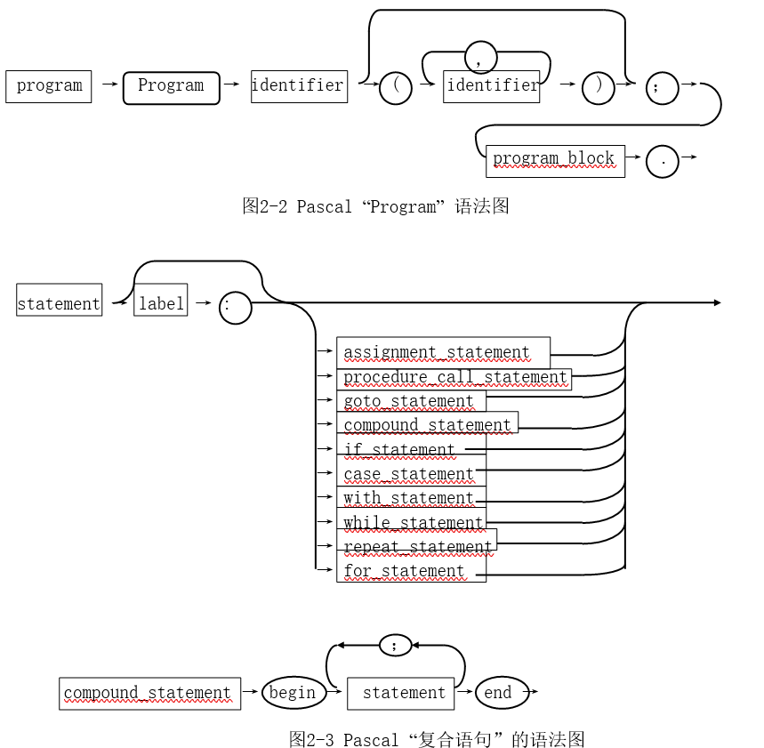

# 设计概述

## 1 表示与抽象
### 表达与抽象的概念
* 表示是对事物抽象的表达。
* 抽象是对论题本质的提取。
* 同一个事物在不同抽象层次上的表示。自然语言描述、高级语言表示、汇编语言表示、机器语言表示。
* 上层抽象可以用多种下层抽象的实现。
### 不同抽象层次
* 客观世界自然语言描述
* 数学模型数学语言描述
* 程序设计程序语言描述
* 机器指令机器语言描述


### 显示表示和隐式表示
* 显示表示float n=3.14指明n的类型。
* 隐式表示 n=3.14缺省为浮点类型。

### 聚合表示和分散表示。
* 分散表示。整型，浮点型等数据之间的+运算使用不同的运算符。
* 聚合表示。所有类型的+运算都可以使用+运算符实现。或者同一个函数实现。

## 2 设计目标

### 具体目标
定义一组能表示某种范型的特征集，每个特征有严格定义并可在机器上高效实现，程序员可灵活运用这些特征表达它所希望的任何计算。

### 评价标准
* 模型有力 Model Power 
* 语义清晰 Semantic Clarity 
* 移植性好 Portability 
* 可读性好 Readability 
* 程序质量 Quality 
* 安全性 
* 并发
* 方便 Convenience 
* 简单 Simplicity 
* 高效 Efficiency 
* 灵活性 Flexibility 
* 可扩充性 Extensible 
* 可重用性 Reusable


## 3 设计准则

### 具体准则
* 频度准则：越常用越简单 
* 结构一致：程序结构和计算的逻辑结构一致,可读、方便 
* 局部性 Locality： 
    - 只有全局变量 Basic 
    - 不鼓励全局变量 Pascal, C 
    - 无全局变量函数式 Java 
* 词法内聚 Lexical Coherence : 变量在使用处就近声明（Pascal 声明和语句严格分开）
* 语法一致性 
* 安全性Security 
* 正交性和正规性
* 数据隐藏。封装,以名字封装内部数据设计者可见使用者不可见 
* 抽象表达


## 4 规格说明

### 概述

规格说明用来定义一个语言文本的语法和语义。用于表达程序设计语言的的语言成为元语言。
* 形式语法：以形式结构规则的语言元素组合规则。
* 微语法：词法Lexicon
* 宏语法：定义特征规则

### 字符集
* 允许出现在语言的程序里出现的字符的全体 


### 词法分析

由程序的字符序列得到词法元素序列的过程就是词法分析。编译器处理表示源程序的字符序列，根据词法规则做词法分析，将 源程序切分为符合词法的段，识别出源程序的有意义单词（token) 。词法分析得到一个（表达被分析的源程序的）单词流，流中各单词 标明了词法类别。词法分析中抛弃所有无保留价值的分隔符（如空白符）和噪声词。

词法分析通常采用最长可能原则，确定可能成为单词的最长字符串。

词法分类主要包括以下内容
* 标识符：文字形式的词法对象，用于表示程序对象的名字。
* 关键字：语言规定了特殊意义的标识符
* 运算符：有预定义意义的特殊字符或特殊字符序列
* 分隔符：用于分隔程序里的不同词法元素的特殊符号或标识符。空格，换行和制表符等，通常作为语法元素的分隔符。

### 语法分析

* 语法分析定义

语法规定位于词法层次之上的程序结构。

语法用于确定一个输入序列是否合法的程序。程序存在多个不同层次的合法性问题： 
– 局部结构 例：C程序里的if 之后是不是左括号，括号是否配对 
– 上下文关系 例：变量使用前是否有定义，使用是否符合类型的要求 
– 深层问题 例：使用变量的值之前，变量是否已经初始化

* 语法分析图



其中方框为非终结符，圆和椭圆形为终结符。箭头指向构造流向。每个非终结符又可开始一个语法图(一条产生式规则) 。与EBNF完全对应，[ ]以'短路'绕道表示，{　}以迥环表示，小圆弧是有意义的，表示流向。有的语法图在环线上注上数字表示最多转几次。 

* 语法分析分类
    * “自顶向下” 释义则从文法的起始符开始，按可能产生的表达式寻 找语句相同的结构匹配。每一步都产生下一个可能的源符号串，找到再 往下走。
    * “由底向上”释义则相反，它先查找源代码的各个符号串，看它能 否匹配归结为产生式左边的非终结符，如果有含混则向前多读入k个符 号串，为此归约下去，一个短语一个短语，最后到达起始符号串，归约 的过程就形成了释义树。


### 语义分析
> 在最后再详细补充

程序通常要在计算机上执行，因此按照程序的运行步骤或操作来说明程序设计语言是很自然的，这就是所谓的操作语义学。大多数程序设计语言的非形式化语义都是用这种方式说明的。例如 Pascal中while命令的操作语义可说明如下： 
```
执行命令while E do C，其步骤为： 
    (1) 对表达式E求值，产生一个真假值。 
    (2) 如果值为true，则执行命令C，然后从(1)开始重复。
    (3) 如果值为false，终止。
```


* 指称语义。为每个程序短语指派一数学实体(指称)为其意义。典型情况是将其输入映射为输出的函数。例如，一个表达式的指称是将环境和存储映射为值的函数。一个命令的指称是将环境、初始存储映射为最终存储的函数。
```
    execute 〖while E do C〗 = 
        let execute-while env sto = 
        let truth-value tr=evaluate〖E〗 env sto in
            if tr
            then execute-while env (execute 〖C〗 env sto) 
            else sto
        in
        execute-while
```
* 公理语义。它只定义证明规则(公理及推理规则)，以此证明程序的某些性质。这些证明规则在某种意义上就是抽象的语义。公理语义主要用于程序验证，语言理解，语言规范/标准化等方面，对编译 、解释器的  没有直接的作用。把语言的公理描述看作是该语言的一个理论，该理论由三部分组成：      
    * 公理集  元语言描述的不加证明的公理集如：|- 0 succ 0 即自然数0的后继大于0是一个定理(由|-表示)也是一条公理。
    * 语法规划集  以它来确定什么是合式公式。
    * 推理规则集  从已确立的定理演绎新定理。

* 代数语义。代数语义把语义模型的集合看成是一个代数结构，模型簇 对应为代数系统。


## 5 上下文无关文法

### 文法（Grammar）
文法可导出该语言所有可能的句子，形式地，一个文法G是一个四元组： 
$$
G=(S,N,T,P)
$$
* 其中，T是终结符号串的有限集。
* N是非终结符号串的有限集，是文法中提供的成分概念，相当于英语动词短语、名词短语或定语从句等句子成分的符号表示。
* T∩N = Φ，即它们是不相交的。
* S是起始符号串，S∈N。
* P是产生式，一般形式是:α→β    α，β∈(T∪N)*。“→”表示左端可推导出右端，如α→β，α→Υ，α→δ则可写为： α→β|Υ|δ


如果产生式将语言的非终结符中的每一个标记都推得为终结符号，则这一组产生式集即为该语言的全部文法。

### 文法的递归表示

文法的递归表示在形式文法中是必须的。例2-1 整数的产生式表示法：
```
<digit>→0|1|2|3|4|5|6|7|8|9
<Integer>→<digit>             一位数字是整数
<Integer>→<digit><digit>      两位数字也是整数
<Integer>→<digit>…<digit>    n位数字也是整数
可以写成：
<Integer>→<digit>|<Integer><digit>|<digit> <Integer>
```
> α→αβ是左递归产生式，而α→βα是右递归产生式，也叫尾递归的。不同型式的产生式决定了不同型式的文法。

### Chomsky文法
> 希腊字母是终结符。大写字母是非终结符。

* **0型文法**如果对产生式α→β左端和右端不加任何限制:
```
α∈(N∪T) ，β∈(N∪T)* 
```
这种文法对应的语言是递归可枚举语言。在编译理论中，图灵机(或双向下推机)可以识别这种语言。

* **1型文法**如果产生式形如：
```
αAβ→αBβ  α,β∈(N∪T)*， A∈N， B∈(N∪T) 
```
则叫做上下文相关文法，对应的语言是上下文敏感语言。线性有界自动机可识别这种语言。（因为左端含有非终结符，每一个推导式与左右两边的非终结符有关，所以是上下文有关文法）

* **2型文法**如果产生式形如：
```
A→α  α∈ (N∪T)*， A∈N
```
左端不含终结符且只有一个非终结符。这种文法叫上下文无关文法。对应的语言即上下文无关语言。非确定下推机能识别这种语言。

* 3型文法  如果产生式形如： 
```
A→ αB|Bα  α∈T*， A，B ∈N
```
左端不含终结符且只有一个非终结符。右端最多也只有一个非终结符且不在最左就在最右端。这种文法叫做正则文法，对应为正则语言。有限自动机可识别这种语言。显然，这种文法经置换可消除右端非终结符，使每一产生式均可用一终结符的正则表达式表达。 
例2-2 所有产生式的非终结符均可置换为终结符表达式。
```
设产生式是:
N={S，R, Q}, T={a，b，c}
P={S→Ra， S→Q， R→Qb， Q→c}
则有:
S→Ra→Qba→cba|S→Q→c
R→Qb→cb
Q→c
```


### BNF和EBNF

BNF就是上下文无关文法的表示法。 

* ::= '定义为'，即产生式中的“→”符号。
* < > 表示所括符号串是非终结符号串。
* | '或者'表示左右两边符号串序列是可替换的。终结符、关键字、标点符号直接写在产生式中。

BNF示例
```
<unsigned integer> ::= <digit> 
                    | <unsigned integer> <digit> 
<integer> ::= +<unsigned integer> 
            |-<unsigned integer>
            |<unsigned integer> 
<identifier> ::= <letter> 
            | <idenfitier> < digit> 
            | <identifier> <letter>
```

增加更多内容

* "[ ]"表示括号内的内容是可选的。
* "{ }"表示括号内的内容可重复0至多次。
* "*"是指可以重复多次。
* "+"是指可以出现多次
* "?"意思是操作符左边的符号（或括号中的一组符号）是可选项（可以出现0到多次）。
```
<integer>    ::= [ +|-]<unsigned integer>
<identifier> ::= <letter> {<digit> | <letter>}
<unsigned integer> ::= <digit> 
<identifier> ::= <letter> {<digit> | < letter>}*
```

EBNF将BNF与正则表达式结合起来

* 其元语符号变动是： 增加[ ]、{ } 、( )(表示成组)、.(表示产生式终结)。[ ] 、{ } 意义同前，旨在消除或减少递归表达。 
* 取消非终结符的尖括号，至少是产生式左端，为此符号串中空白用'_'连接。 
* 为区别元符号和程序符号(程序中也有[ ]、 、()、.)，程序中的终结符加引号，如'('， ')'， '.'。

```
program ::= <program_heading> '；' <program_block> '.'.
program_heading ::= 'program' <identifier>[ '('<program_parameters> ')'].
program_parameters ::= <identifier_list>.
identifier_list ::= <identifier> {'，' <identifier>} .
program_block ::= <block>.
block ::= <label_declaration_part> <constant_declaration_part>
    <type_declaration_part><variable_declaration_part>
    <procedure_and_function_declaration_part><statement_part>.
variable_declaration_part ::= ['var' <variable_declaration> '；'    
                            {<variabe_declaration> '；' }].
variable_declaration ::= <identifier_list> '；' <type_denoter>.
statement_part ::= compound_statement.
compound_statement ::= 'begin' <statement_sequence> 'end'.
statement_sequence ::= <statement> {'；' <statement>}.
statement::=[<label> '：'](<simple_statement>|<structured_statement>).
simple_statement ::= <empty_statement> | <assignment_statement> |
                    <procedure_statement> | < goto_statement>.
structured_statement ::= <compound_statement>|<conditional_statement>
                        |<repetitive_statement> | <with_statement>. 

```


