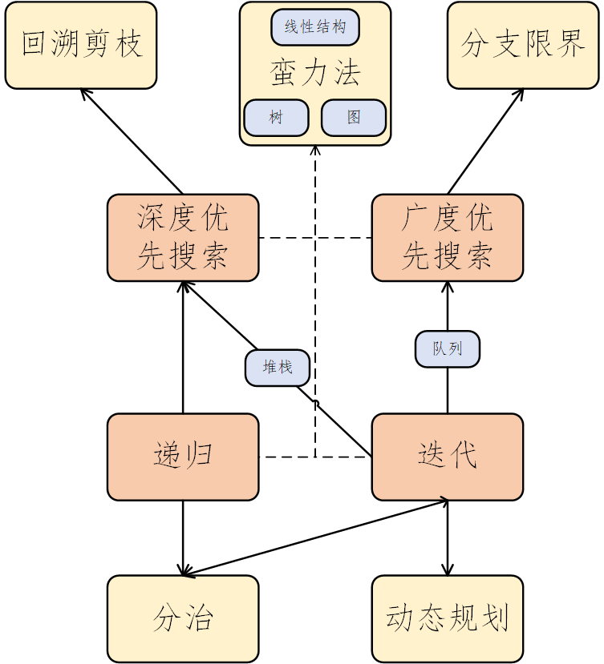

# 算法概述

> 参考文献
> * [八种算法思想](https://blog.csdn.net/weixin_42137700/article/details/86777003)
## 1 基本概念

### 定义
* 算法是一系列解决问题的清晰指令，对于符合一定规范的输入，算法能够在有限时间内获得所要求的输出。算法是解决问题的一种方法或过程，它是由若干条指令组成的有穷序列。
* 算法本质上不是数学，而是逻辑。

### 特征
* 输入：有零或多个外部量作为算法的输入。
* 输出：算法产生至少一个量作为输出。
* 确定性：组成算法的每条指令清晰、无歧义。
* 有效性：算法中执行的任何计算步骤都是可以被分解为基本的可执行的操作步。
* 有限性：算法中每条指令的执行次数有限，执行每条指令的时间也有限。

### 算法的描述
* 算法的描述方式：自然语言、流程图、伪代码
* 算法的正确性证明方式：归纳法
* 算法分析：正确性分析、效率分析、复杂度分析

### 算法的终极目标
* **次序order**：先做什么、后做什么。前边对后边有影响。
* **选择if-else**：要做什么、不做什么。合并相同的类别，减少分类讨论的情况。
* **重复while-for**:一直做什么。提取相同子结构、相同子操作，进行重复利用。可以通过**递归**实现重复。

### 整理说明

* 以**算法**结尾，代表的是某一系列或者某一类通用的算法。不依赖于具体的问题。通常可以解决很多具体的问题。
* 以**问题**结尾，代表的是某一个或者某一类典型的问题。不依赖于具体的算法。通常有很多算法可以解决该类问题。

## 2 求解流程

### 求解步骤
> 在没有熟练之前，应该前置按照这样的算法解决流程，解题。

1. **问题分析**
   1. **问题抽象**将应用问题抽象为数学问题
   2. **问题分类**搜索、排序、查找
2. **策略选择**
   1. 选择合适的**数据结构**
   2. 选择合适的**算法思想**
3. **算法设计**
   1. 确定**算法原理**，递归技术、循环技术、位运算技术
   2. 设计**算法流程**，数学递推关系和伪代码
4. **正确性证明**
   1. 查看伪代码的流程的正确性，手推算法过程。
   2. 验证**算法特例**
5. **算法分析**
   1. 分析算法**执行效率**
6. **算法实现**
   1. **编程实现**
   2. **代码调试**

### 更详细的说明

> 自己在处理一个题之前到底应该做哪些事情，或者说，按照怎样的流程？是否应该把这些流程写下来？或者按照某种套路来，将会事半功倍。

* 理解问题、问题分析，问题抽象和问题分类。应该将一个问题，归为某一个类别。问题类别，应该属于某个算法思想下的。也就是说，一个问题类别，应该用某种算法思想来解决。但是两者并不是完全重合。
* 选择策略，主要是选择使用哪种算法思想（包括蛮力法、递归与分治、动态规划、贪心、回溯、分支限界思想）。当确定了问题的类别之后。就可以确定其算法思想了。或者说，算法思想和问题类别应该是同时确定的。接下来需要做的是，设计一些静态的东西。例如数据结构等。
* 算法设计，每一类算法思想都有固定的算法技术，比如分治算法思想，对应的递归求解技术。例如回溯法和蛮力法的深度优先搜索思想，使用的是递归的算法技术和栈+循环的算法技术。广度优先搜索或者分治限界的算法思想，对应的是队列+循环的技术。
* 正确性证明，主要分析特例和为考虑到的特殊情况。尽可能举反例，同时完善设计好的算法。
* 算法分析，主要分析算法的执行效率上的可行性。
* 程序设计

## 3 算法分类

### 面向算法思想
> 共9中思想。任何一个问题的解决，不应该只归类于某一种算法思想。应该用到一种或几种。添加了递归和迭代作为第8种算法思想，他们主要用来处理同类型计算问题。添加了深搜和光搜作为第9中算法思想，他们主要用来处理多分支问题。

> 各种算法思想之间可以交叉结合，并非完全独立的。例如在树中寻找某个节点的值，对所有节点进行遍历是蛮力思想，可以采用深搜与广搜的思想决定搜索的顺序。同时可以用递归与迭代的思想解决搜索过程。各种思想间可以相互嵌套、相互叠加，但又不完全重合，共同解决问题。

1. 蛮力法（穷举和遍历思想。寻找满足条件的节点值）
2. 分治法
3. 动态规划
4. 贪心算法
5. 回溯剪枝（=>深搜思想，路径作为解，而非节点值。）
6. 分支限界（=>广搜思想，路径作为解，而非节点值。）
7. 随机化算法和近似算法
8. 递归与迭代
9. 深搜与广搜（解决多分支问题的两种思想。在枚举法中用来寻找合适的节点值，搜索最优结果与路径、前置后置节点无关。在回溯剪枝和分支限界中用来寻找合适的路径，与当前的搜索路径有关）

### 面向数据结构
> 共4类结构。在数据结构部分处理，数据结构本身就是算法的一部分，用于处理特殊数据结构的算法。这里的数据结构是指，用来描述问题的数据结构是什么。比如问题描述了一张图，则应该找图相关的算法。而不是解决问题中用到的数据结构。

* 数组和链表结构
* 堆栈和队列结构
* 树结构
* 图结构

### 面向问题类型
> 当前有7类问题。这些都是常见的问题类型。搜索针对多分支结构。查找针对线性数据结构。模板算法中的搜索和查找略有不同。在模板算法中，搜索的是匹配的元素的序列，查找的是单个元素。
* 查找问题（匹配，针对线性结构）
  * 顺序查找
  * 二分查找
  * 插值查找
  * 菲波那切查找
  * 树表查找
  * 分块查找
  * 哈希查找
* 排序问题
  * 选择排序
  * 冒泡排序
  * 快速排序
  * 桶排序
* 搜索问题(针对多分支结构)
  * 广度优先搜索
  * 深度优先搜索
* 字符串问题
* 排列组合
  * 任务分配
  * 背包问题
* 集合问题
* 数值问题

### 智能算法
> 更高级的算法。
  * 蚁群算法
  * 模拟退火算法
  * 遗传算法

## 4 算法思想总结

### 关系总结

* 五大基本算法思想
* 四个间接算法思想
* 对多种数据结构的操作

### 思想总结

算法思想|问题特征|
|-----|-----|
|分治法 | 规模缩小容易解决；最优子结构性质；子问题的解合并为该问题的解；子问题是相互独立的。|
|动态规划|最优子结构性质；无后效性；有重叠子问题，子问题之间是不独立的。|
|贪心算法|最优子结构性质；贪心选择性质。|
|回溯法|多米诺性质（叶子节点的解一定满足其父节点）。|
|分支限界|多米诺性质；求解最优解或一个可行解。|

## 5 简单对比
## 5.1 暴力破解法（Brute Force Paradigm）
* 暴力破解法简单直接，根据问题声明的定义，找到所有可变化的因子（Divisor），穷举所有可能解决问题的方法，逐个尝试。所以，根据暴力破解法的定义，理论上讲任何问题都可以使用暴力破解法来解决，只是在实际应用中算法对时间和空间的需求则无法满足。将暴力破解法应用于数据查找，由于查找比较次数与给定目标的规模直接相关，所以也称为线性查找（Linear Search）。

### 线性查找有很多典型应用：
* 选择排序（Selection Sort）
* 冒泡排序（Bubble Sort）
* 顺序查找（Sequential Search）
* 暴力字符串匹配（Naive String Match）

## 5.3 分治法（Divide and Conquer Paradigm）
* 分治法（Divide-and-Conquer），即 "分而治之"，是将原问题划分成 n 个规模较小而结构与原问题相似的子问题，递归地解决这些问题，然后再合并其结果，以得到原问题的解。
* 当我们遇到一个大问题时，总是习惯把问题的规模变小，这样便于分析讨论。这些规模变小后的问题和原来的问题是同质的，除了规模变小，其它的都是一样的，本质上它还是同一个问题，规模变小后的问题其实是原问题的子问题。

### 分治模式在每一层上都有三个步骤：
* 分解（Divide）：将原问题分解成一系列与原问题同质的子问题；
* 解决（Conquer）：递归地解决各个子问题。若子问题足够小，则直接求解；
* 合并（Combine）：将子问题的结果合并成原问题的解。

### 分治法所能解决的问题一般具有以下几个特征：
* 可以将问题分解为若干个规模较小的相同问题；
* 问题的规模缩小到一定程度后就可以很容易地解决；
* 问题分解出的子问题的解可以合并为该问题的解；
* 问题所分解出的各个子问题是相互独立的，即子问题之间不再包含公共的孙问题。
> 符合 1,2,3 条特征是使用分治法的关键，而特征 4 将涉及到分治法的效率问题。而如果不符合 3,4 特征的问题可以尝试考虑使用动态规划或贪心算法来解决。
### 分治法的典型应用：
* 合并排序（Merge Sort）
* 快速排序（Quick Sort）
* 二分查找（Binary Search）
## 5.3 动态规划法（Dynamic Programming Paradigm）
* 动态规划的过程可以描述为多阶段最优化解决问题的过程，每一次的决策依赖于当前的状态，随即又引起状态的转移，以此类推在变化的状态中产生出决策序列。
* 动态规划算法通常基于一个递推公式及一个或多个初始状态，当前子问题的解将由上一次子问题的解推出。使用动态规划来解题通常只需要多项式时间复杂度，所以会比回溯法、暴力法等要快许多。

### 动态规划方法中的关键词包括：
* 阶段（Stage）、
* 状态（State）、
* 决策（Decision）、
* 递推关系（Recurrent Relation）。

### 动态规划对比
* 动态规划首先将待求解的问题分解为若干个子问题（阶段），按顺序求解子问题。前一子问题的解为后一子问题的求解提供了有用的信息。在求解任一子问题时，列出各种可能的局部解，通过决策保留那些有可能达到最优的局部解，丢弃其他局部解。以此类推解决各子问题，最后一个子问题的解就是初始问题的解。
* 动态规划与分治法最大的差别是：适合于用动态规划法求解的问题，经分解后得到的子问题往往不是互相独立的（即下一个子问题的求解是建立在上一个子问题的解的基础上，进行进一步的求解）。

### 动态规划所能解决的问题一般具有以下几个特征：
* 最优化原理（Mathematical Optimization）：如果问题的最优解所包含的子问题的解也是最优的，就称该问题具有最优子结构（Optimal Substructure），即满足最优化原理。
* 无后效性：即某阶段状态一旦确定，就不受这个状态以后决策的影响。也就是说，某状态以后的过程不会影响以前的状态，只与当前状态有关。
* 有重叠子问题（Overlapping Subproblems）：即子问题之间是不独立的，一个子问题在下一阶段决策中可能被多次使用到。

> 特征 3 并不是动态规划适用的必要条件，但是如果没有这条性质，动态规划算法同其他算法相比就不具备优势。

### 动态规划的基本步骤：
* 划分阶段：按照问题的时间或空间特征，把问题分为若干个阶段。注意划分后的阶段一定要是有序的或者是可排序的，否则问题就无法求解。
* 确定状态和状态变量：将问题发展到各个阶段时所处于的各种客观情况用不同的状态表示出来。状态的选择要满足无后效性。
* 确定决策并写出状态转移方程：因为决策和状态转移有着天然的联系，状态转移就是根据上一阶段的状态和决策来导出本阶段的状态。所以如果确定了决策，状态转移方程也就可写出。但事实上常常是反过来做，根据相邻两个阶段的状态之间的关系来确定决策方法和状态转移方程。
* 寻找边界条件：给出的状态转移方程是一个递推式，需要一个递推的终止条件或边界条件。

## 5.4 贪心算法（Greedy Paradigm）
* 所谓贪心算法是指，在对问题求解时，总是做出在当前看来最好的选择。也就是说，不从整体最优上加以考虑，它所做出的仅是在某种意义上的局部最优解。
* 贪心算法没有固定的算法框架，算法设计的关键是贪心策略的选择。贪心策略适用的前提是：局部最优策略能导致产生全局最优解。所以实际上，贪心算法适用的情况很少。
* 贪心算法不是对所有问题都能得到整体最优解，选择的贪心策略必须具备无后效性，即某个状态以后的过程不会影响以前的状态，只与当前状态有关。所以对所采用的贪心策略一定要仔细分析其是否满足无后效性。

### 贪心算法的基本思路：
* 建立数学模型来描述问题。
* 把求解的问题分成若干个子问题。
* 对每一子问题求解，得到子问题的局部最优解。
* 把子问题的解局部最优解合成原来问题的一个解。

## 5.5 回溯法（Backtracking Paradigm）
* 回溯法描述了一种选优搜索过程，按选优条件向前搜索，以达到目标。但当探索到某一步时，发现原先的选择并不优或达不到目标，就退回一步重新选择，这种走不通就退回再走的方法称为回溯法，而满足回溯条件的某个状态的点称为 "回溯点"。
* 回溯法可以理解为隐式的深度优先搜索算法。其在包含问题的所有解的解空间树中，按照深度优先搜索的策略，从根节点出发深度探索解空间树。当探索到某一节点时，要先判断该节点是否包含问题的解，如果包含，就从该节点出发继续探索下去，如果该节点不包含问题的解，则逐层向其祖先节点回溯。
* 许多复杂的，规模较大的问题都可以使用回溯法，有 "通用解题方法" 的美称。

### 回溯法的一般步骤：
* 针对给定问题，确定问题的解空间，问题的解空间应至少包含问题的一个（最优）解；
* 确定节点的扩展搜索规则；
* 以深度优先方式搜索解空间，并在搜索过程中用剪枝函数避免无效搜索；

## 5.6 分支限界法（Branch and Bound Paradigm）
* 类似于回溯法，分支限界法也是一种在问题的解空间树上搜索问题解的算法。但在一般情况下，分支限界法与回溯法的求解目标不同。回溯法的求解目标是找出树中满足约束条件的所有解，而分支限界法的求解目标则是找出满足约束条件的一个解，或是在满足约束条件的解中找出使某一目标函数值达到极大或极小的解，即在某种意义下的最优解。
* 所谓 "分支" 就是采用广度优先搜索算法，依次搜索节点的所有分支，抛弃不满足约束条件的节点，然后从余下的节点中选择一个节点作为下一个搜索节点继续搜索。
* 由于求解目标不同，导致分支限界法与回溯法在解空间树上的搜索方式也不相同。回溯法以深度优先的方式搜索解空间树，而分支限界法则以广度优先或以最小耗费优先的方式搜索解空间树。
* 分支限界法的搜索策略是：在扩展节点处，先生成其所有的儿子节点（分支），然后再从当前的活节点表中选择下一个扩展节点。为了有效地选择下一扩展节点，以加速搜索的进程，在每一活节点处，计算一个函数值（限界），并根据这些已计算出的函数值，从当前活节点表中选择一个最有利的节点作为扩展节点，使搜索朝着解空间树上有最优解的分支推进，以便尽快地找出一个最优解。