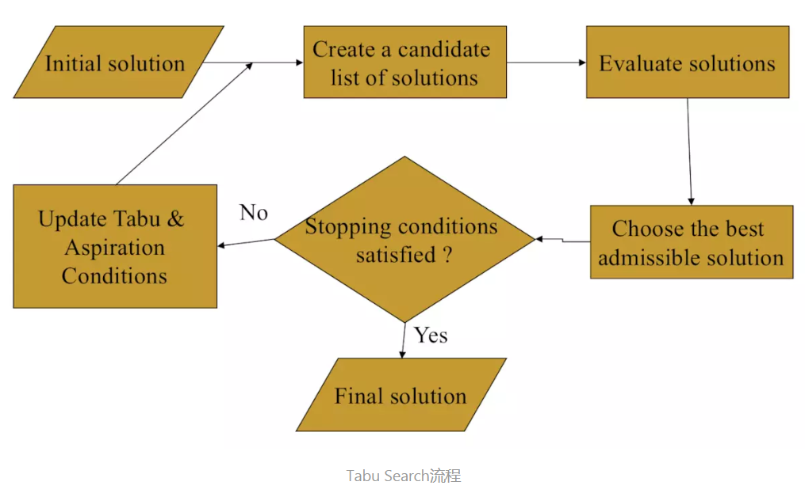

# 禁忌搜索算法

## 1 算法说明

### 算法概述

* 禁忌搜索（TS）是对局部邻域搜索的一种扩展，是一种全局优化算法。TS算法通过引入一个禁忌表和相应的禁忌准则来避免局部迂回，并通过“渴望准则”来挽救某些被禁忌的相对优化解，进而保证全局的有效搜索以实现全局优化。

* 标记对应已搜索到的局部最优解的一些对象，并在进一步的迭代搜索中尽量避开这些对象，但不是绝对禁止循环，从而保证对不同的有效搜索途径的探索。 

### 基本思想

* 给定一个当前解（初始解）和一种邻域结构，在当前解的邻域中确定若干候选解；
* 若最佳候选解对应的目标植优于 “best so far” ，则忽视其禁忌特性，用其替代当前解和“best so far”值，并将相应的对象加入禁忌表，同时修改禁忌表中各对象的禁忌任期；
* 若不存在上述候选解，则选择在候选解中非禁忌的最佳状态为新的当前解，而无视它与当前解的优劣，同时将相应的对象加入禁忌表，并修改禁忌表中各对象的任期；
* 重复上述迭代搜索过程，直至满足停止条件。 

### 算法原理

邻域

对于组合优化问题，给定任意可行解x，x∈D，D是决策变量的定义域，对于D上的一个映射：N：x∈D→N(x)∈2(D) 其中2(D)表示D的所有子集组成的集合，N(x)成为x的一个邻域，y∈N(x)称为x的一个邻居。

候选集合

候选集合一般由邻域中的邻居组成，可以将某解的所有邻居作为候选集合，也可以通过最优提取，也可以随机提取，例如某一问题的初始解是[1,2,3]，若通过两两交换法则生成候选集合，则可以是[1,3,2],[2,1,3],[3,2,1]中的一个或几个。

禁忌表

禁忌表包括禁忌对象和禁忌长度。由于在每次对当前解的搜索中，需要避免一些重复的步骤，因此将某些元素放入禁忌表中，这些元素在下次搜索时将不会被考虑，这些被禁止搜索的元素就是禁忌对象；
禁忌长度则是禁忌表所能接受的最多禁忌对象的数量，若设置的太多则可能会造成耗时较长或者算法停止，若太少则会造成重复搜索。

评价函数

用来评价当前解的好坏，TSP问题中是总旅程距离。

特赦规则

禁忌搜索算法中，迭代的某一步会出现候选集的某一个元素被禁止搜索，但是若解禁该元素，则会使评价函数有所改善，因此我们需要设置一个特赦规则，当满足该条件时该元素从禁忌表中跳出。

终止规则

一般当两次迭代得到的局部最优解不再变化，或者两次最优解的评价函数差别不大，或者迭代n次之后停止迭代，通常选择第三种方法。

### 算法流程

1. 定义相邻结构和如下算法参数: tt（Tabu tenure）、m (number of candidates）；m > tt ;
2. 以某种方法产生初始解s，置禁忌表为空；
3. 从s的邻域中选取m 个 候选解；
4. 选取候选解中的最优解X；
5. 若X不在禁忌表中，则s=x, 将X存入禁忌表且置其当前禁忌值为tt, 将禁忌表中其它元素值（禁忌值）减 1，然后将禁忌值为0的禁忌元素释放出禁忌表，转到（8）；
6. 若X在禁忌表中，且X的目标函数值优于当前最优解（best so far），则s=x, 将X禁忌值置为tt, 将禁忌表中其它元素值（禁忌值）减 1，然后将禁忌值为0的禁忌元素释放出禁忌表，转到（8）；
7. 若X在禁忌表中，且X的目标函数值不优于当前最优解（best so far），则从候选解中取得下一X，转到（4）；
8. 判断算法终止条件是否满足？若是，则结束算法并输出优化结果；否则转到（3）。
