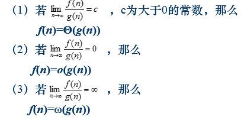
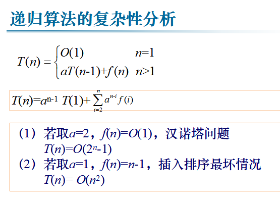
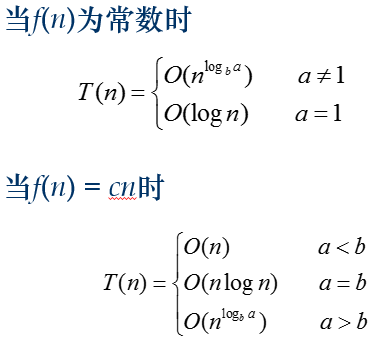
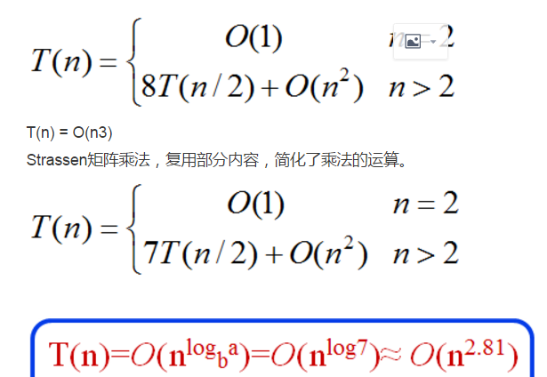

# 算法效率

> 目录
1. 算法效率的度量 
2. 函数的渐进的界
3. 算法的基本复杂性类型 
4. 算法复杂性分析的基本方法
5. 非递归算法的复杂性分析
6. 递归算法的复杂性分析
7. 递归算法与非递归算法比较
8. 经验分析方法
9. 算法可视化

## 1 算法效率的度量 

### 分类
* 时间复杂度
* 空间复杂度

### 算法效率的表示

N-要解决问题的规模
I-算法的输入
A-算法本身
C-算法复杂性
S-空间复杂性
T-时间复杂性
$$
C = F(N, I, A)\\
T = T(N, I)\\
S = S(N, I)\\
$$

### 算法效率的界
包含最大时间效率、最小时间效率、平均时间效率。

## 2 函数的渐进的界

### 函数的界定义
设f 和g 是定义域为自然数集N上的函数

1. $f(n)=O(g(n))$渐进上界  
若存在正数$c$和$n0$使得对一切$n≥n0有0≤f(n)≤cg(n)$
2. $f(n)= Ω(g(n))$渐进下届  
若存在正数$c$和$n0$使得对一切$n≥n0有0≤cg(n)≤ f(n)$
3. $f(n)=o(g(n))$不可达上届  
对任意正数$c$存在$n0$使得对一切$n≥n0$有$0≤f(n)<cg(n)$
4. $f(n)=ω(g(n))$不可达下界  
对任意正数$c$存在$n0$使得对一切$n≥n0有0≤cg(n)<f(n)$
5. $f(n)=Θ(g(n)) ⇔ f(n)=O(g(n))$ 且$f(n)=Ω(g(n))$紧渐进界
6. $O(1)$表示常数函数

### 函数界的基本性质1

### 函数界的基本性质2
设f , g, h 是定义域为自然数集N上的函数：
1. 如果f =O(g)且g=O(h)，那么f =O(h).
2. 如果 f =Ω(g)且g=Ω(h)，那么f =Ω(h).
3. 如果f =Θ(g)和g=Θ(h)，那么f =Θ(h).
4. O(f(n))+O(g(n)) = O(max{f(n),g(n)})
5. O(f(n))+O(g(n)) = O(f(n)+g(n))
6. O(f(n))*O(g(n)) = O(f(n)*g(n))

### 函数界的基本性质3

1. 设f,g,h 是定义域为自然数集N上的函数，若对某个其它的函数h, 我们有f =O(h)和g=O(h)，那么f+g = O(h).
2. 假设f 和g是定义域为自然数集合的函数，且满足g=O(f)，那么f+g=Θ(f).

### 常见函数的界
$$
\log_2n=o(\sqrt{n})\\
\log_an=Θ(log_bn)\\
\log_bn=o(n^α)\\
n^α=o(b^n)\\
n!=o(n^n)\\
n!= ω(2^n)\\
log(n!)= Θ(n\log n)
$$
## 3 算法的基本复杂性类型
$$
n^n>n!>a^n>n^a>n\log n>n>\sqrt{n}>\log n
$$
## 4 复杂性分析的基本步骤
1. 决定表示输入规模的参数。
2. 找出算法的基本操作。
3. 检查基本操作的执行次数是否只依赖于输入规模。如果还依赖于输入的其它特性，考虑最差、平均以及最优情况下的复杂性。
4. 对于非递归算法，建立算法基本操作执行次数的求和表达式；对于递归算法，建立算法基本操作执行次数的递推关系及其初始条件。
5. 利用求和公式和法则建立一个操作次数的闭合公式，或者求解递推关系式，确定增长的阶。

## 5 非递归算法的复杂性分析
1. 算法输入规模：可以用数组元素个数n度量
2. 基本操作：比较与赋值两种，选择比较
3. 比较操作只与输入规模相关，不用考虑最坏、平均、最好情况
4. 建立基本操作执行次数求和表达式
5. 确定增长的阶

## 6 递归算法的复杂性分析

* 线性收缩递归

* 等比收缩递归

## 7 递归算法与非递归算法比较

## 8 经验分析方法

## 9 算法可视化

## 10 常见算法算法效率总结

### 比较排序算法

### 排列问题-分治法

### 矩阵乘法-分治法

二分查找
O(logn)
01背包问题
动态规划O(nc)
回溯法O(2^n)
分支限界O(2^n)

投资问题动态规划O(mn2)

流水作业调度动态规划Johnson 算法O(nlogn)

最大字段和-动态规划O(n)
电路布线问题-动态规划O(n)
图像压缩问题-动态规划O(n)
最长公共子序列-动态规划O(m+n)

N后问题-回溯法O(n^n+1)
活动安排-贪心算法O(nlogn)

