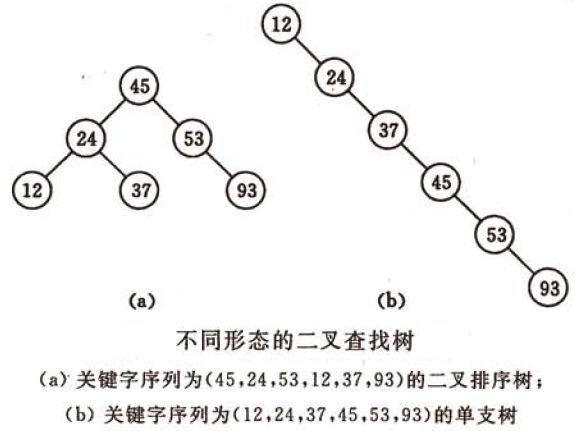
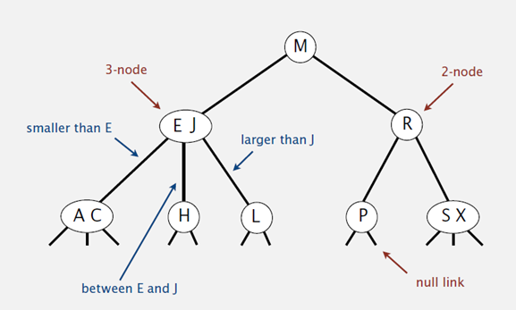
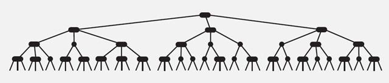
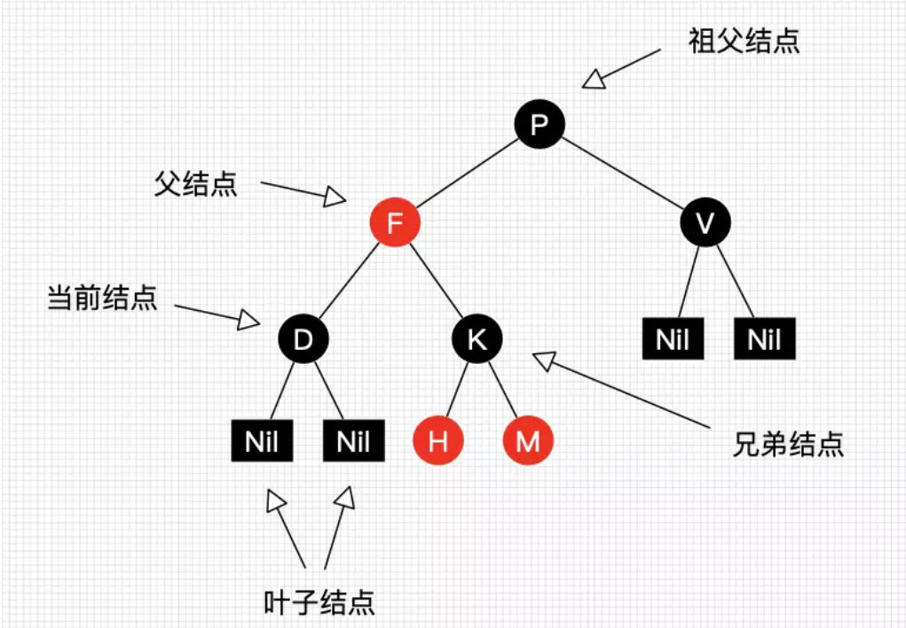
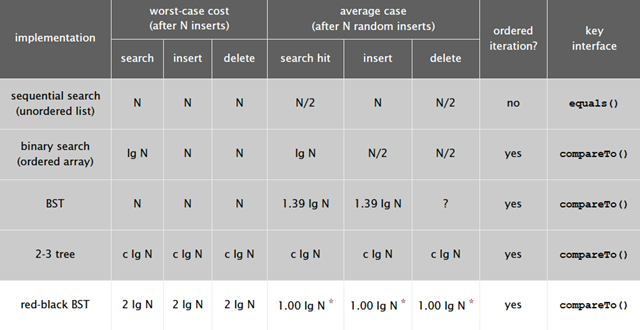
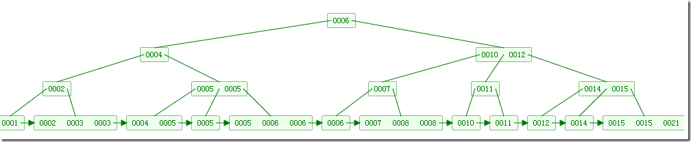
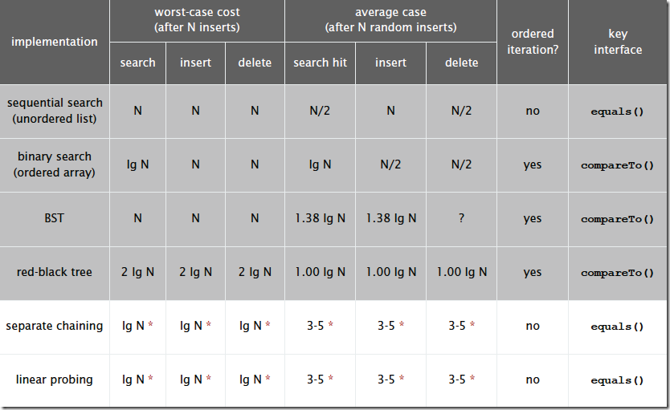

# 查找算法
> 阅读目录
1. 顺序查找
2. 二分查找
3. 插值查找
4. 斐波那契查找
5. 树表查找
6. 分块查找
7. 哈希查找

## 0 概述
* 查找是在大量的信息中寻找一个特定的信息元素，在计算机应用中，查找是常用的基本运算，例如编译程序中符号表的查找。
* 本文简单概括性的介绍了常见的七种查找算法，说是七种，其实二分查找、插值查找以及斐波那契查找都可以归为一类——插值查找。
* 插值查找和斐波那契查找是在二分查找的基础上的优化查找算法。树表查找和哈希查找会在后续的博文中进行详细介绍。

> * 查找算法，一般适用于线性结构。
> * 搜索算法，一般适用于树和图。

### 查找定义

* 根据给定的某个值，在查找表中确定一个其关键字等于给定值的数据元素（或记录）。

### 查找算法分类：
1. 静态查找和动态查找；

    静态或者动态都是针对查找表而言的。动态表指查找表中有删除和插入操作的表。
2. 无序查找和有序查找。
    * 无序查找：被查找数列有序无序均可；
    * 有序查找：被查找数列必须为有序数列。

### 平均查找长度（Average Search Length，ASL）

* 需和指定key进行比较的关键字的个数的期望值，称为查找算法在查找成功时的平均查找长度。

*对于含有n个数据元素的查找表，查找成功的平均查找长度为：ASL = Pi*Ci的和。
  * Pi：查找表中第i个数据元素的概率。
  * Ci：找到第i个数据元素时已经比较过的次数。

## 1 顺序查找
### 说明

* 顺序查找适合于存储结构为顺序存储或链接存储的线性表。

### 基本思想

* 顺序查找也称为线形查找，属于无序查找算法。从数据结构线形表的一端开始，顺序扫描，依次将扫描到的结点关键字与给定值k相比较，若相等则表示查找成功；若扫描结束仍没有找到关键字等于k的结点，表示查找失败。

### 复杂度分析：　
* 查找成功时的平均查找长度为：（假设每个数据元素的概率相等） 
$$
ASL = 1/n(1+2+3+…+n) = (n+1)/2;
$$
* 当查找不成功时，需要n+1次比较，时间复杂度为
$$
O(n);
$$
* 所以，顺序查找的时间复杂度为O(n)。

### 代码实现
```
//顺序查找
int SequenceSearch(int a[], int value, int n)
{
    int i;
    for(i=0; i<n; i++)
        if(a[i]==value)
            return i;
    return -1;
}
```
## 2 二分查找
### 说明
* 元素必须是有序的，如果是无序的则要先进行排序操作。

### 基本思想

* 也称为是折半查找，属于有序查找算法。用给定值k先与中间结点的关键字比较，中间结点把线形表分成两个子表，若相等则查找成功；若不相等，再根据k与该中间结点关键字的比较结果确定下一步查找哪个子表，这样递归进行，直到查找到或查找结束发现表中没有这样的结点。

### 复杂度分析

* 最坏情况下，关键词比较次数为log2(n+1)，且期望时间复杂度为O(log2n)；

> 注：折半查找的前提条件是需要有序表顺序存储，对于静态查找表，一次排序后不再变化，折半查找能得到不错的效率。但对于需要频繁执行插入或删除操作的数据集来说，维护有序的排序会带来不小的工作量，那就不建议使用。——《大话数据结构》

### 代码实现
```
//二分查找（折半查找），版本1
int BinarySearch1(int a[], int value, int n)
{
    int low, high, mid;
    low = 0;
    high = n-1;
    while(low<=high)
    {
        mid = (low+high)/2;
        if(a[mid]==value)
            return mid;
        if(a[mid]>value)
            high = mid-1;
        if(a[mid]<value)
            low = mid+1;
    }
    return -1;
}

//二分查找，递归版本
int BinarySearch2(int a[], int value, int low, int high)
{
    int mid = low+(high-low)/2;
    if(a[mid]==value)
        return mid;
    if(a[mid]>value)
        return BinarySearch2(a, value, low, mid-1);
    if(a[mid]<value)
        return BinarySearch2(a, value, mid+1, high);
}
```

## 3 插值查找
### 说明
* 折半查找这种查找方式，不是自适应的（也就是说是傻瓜式的）。二分查找中查找点计算如下：
$$
mid=(low+high)/2, 即mid=low+1/2*(high-low);
$$
* 通过类比，我们可以将查找的点改进为如下：
$$
mid=low+(key-a[low])/(a[high]-a[low])*(high-low)
$$
* 也就是将上述的比例参数1/2改进为自适应的，根据关键字在整个有序表中所处的位置，让mid值的变化更靠近关键字key，这样也就间接地减少了比较次数。假定数据是离散均匀分布的，搜索效率会很高。

### 基本思想
* 基于二分查找算法，将查找点的选择改进为自适应选择，可以提高查找效率。当然，差值查找也属于有序查找。
> 注：对于表长较大，而关键字分布又比较均匀的查找表来说，插值查找算法的平均性能比折半查找要好的多。反之，数组中如果分布非常不均匀，那么插值查找未必是很合适的选择。

### 复杂度分析
* 查找成功或者失败的时间复杂度均为$O(log_2(log_2n))$。最差时间复杂度O(n)

### 代码实现
```
//插值查找
int InsertionSearch(int a[], int value, int low, int high)
{
    int mid = low+(value-a[low])/(a[high]-a[low])*(high-low);
    if(a[mid]==value)
        return mid;
    if(a[mid]>value)
        return InsertionSearch(a, value, low, mid-1);
    if(a[mid]<value)
        return InsertionSearch(a, value, mid+1, high);
}
```

## 4 斐波那契查找
　　
> 在介绍斐波那契查找算法之前，我们先介绍一下很它紧密相连并且大家都熟知的一个概念——黄金分割。  
>　　黄金比例又称黄金分割，是指事物各部分间一定的数学比例关系，即将整体一分为二，较大部分与较小部分之比等于整体与较大部分之比，其比值约为1:0.618或1.618:1。    
>　　0.618被公认为最具有审美意义的比例数字，这个数值的作用不仅仅体现在诸如绘画、雕塑、音乐、建筑等艺术领域，而且在管理、工程设计等方面也有着不可忽视的作用。因此被称为黄金分割。  
>　　大家记不记得斐波那契数列：1, 1, 2, 3, 5, 8, 13, 21, 34, 55, 89…….（从第三个数开始，后边每一个数都是前两个数的和）。然后我们会发现，随着斐波那契数列的递增，前后两个数的比值会越来越接近0.618，利用这个特性，我们就可以将黄金比例运用到查找技术中。

### 基本思想
* 也是二分查找的一种提升算法，通过运用黄金比例的概念在数列中选择查找点进行查找，提高查找效率。同样地，斐波那契查找也属于一种有序查找算法。

* 相对于折半查找，一般将待比较的key值与第mid=（low+high）/2位置的元素比较，比较结果分三种情况：
  * 相等，mid位置的元素即为所求
  * `>，low=mid+1;`
  * `<，high=mid-1`

* 斐波那契查找与折半查找很相似，他是根据斐波那契序列的特点对有序表进行分割的。他要求开始表中记录的个数为某个斐波那契数减1，即n=F(k)-1;
* 开始将k值与第F(k-1)位置的记录进行比较(mid=low+F(k-1)-1),比较结果也分为三种

    * 相等，mid位置的元素即为所求
    * `>，low=mid+1,k-=2;`
　　  
    说明：low=mid+1说明待查找的元素在[mid+1,high]范围内，k-=2 说明范围[mid+1,high]内的元素个数为n-(F(k-1))= Fk-1-F(k-1)=Fk-F(k-1)-1=F(k-2)-1个，所以可以递归的应用斐波那契查找。

  * `<，high=mid-1,k-=1`
  　　  
      说明：low=mid+1说明待查找的元素在[low,mid-1]范围内，k-=1 说明范围[low,mid-1]内的元素个数为F(k-1)-1个，所以可以递归 的应用斐波那契查找。


### 复杂度分析

最坏情况下，时间复杂度为O(log2n)，且其期望复杂度也为O(log2n)。


### 代码实现
```
// 斐波那契查找.cpp 

#include "stdafx.h"
#include <memory>
#include  <iostream>
using namespace std;

const int max_size=20;//斐波那契数组的长度

/*构造一个斐波那契数组*/ 
void Fibonacci(int * F)
{
    F[0]=0;
    F[1]=1;
    for(int i=2;i<max_size;++i)
        F[i]=F[i-1]+F[i-2];
}

/*定义斐波那契查找法*/  
int FibonacciSearch(int *a, int n, int key)  //a为要查找的数组,n为要查找的数组长度,key为要查找的关键字
{
  int low=0;
  int high=n-1;
  
  int F[max_size];
  Fibonacci(F);//构造一个斐波那契数组F 

  int k=0;
  while(n>F[k]-1)//计算n位于斐波那契数列的位置
      ++k;

  int  * temp;//将数组a扩展到F[k]-1的长度
  temp=new int [F[k]-1];
  memcpy(temp,a,n*sizeof(int));

  for(int i=n;i<F[k]-1;++i)
     temp[i]=a[n-1];
  
  while(low<=high)
  {
    int mid=low+F[k-1]-1;
    if(key<temp[mid])
    {
      high=mid-1;
      k-=1;
    }
    else if(key>temp[mid])
    {
     low=mid+1;
     k-=2;
    }
    else
    {
       if(mid<n)
           return mid; //若相等则说明mid即为查找到的位置
       else
           return n-1; //若mid>=n则说明是扩展的数值,返回n-1
    }
  }  
  delete [] temp;
  return -1;
}

int main()
{
    int a[] = {0,16,24,35,47,59,62,73,88,99};
    int key=100;
    int index=FibonacciSearch(a,sizeof(a)/sizeof(int),key);
    cout<<key<<" is located at:"<<index;
    return 0;
}
```
## 5 树表查找
* 二叉查找树
* 平衡二叉树（AVL树）
* 红黑树(平衡二叉树的一种实现)
* B树（平衡多叉树）
* B+树（非叶节点建立索引，叶节点保存数据）
* 2-3树（B树或平衡多叉树的例子）

二叉查找树平均查找性能不错，为O(logn)，但是最坏情况会退化为O(n)。在二叉查找树的基础上进行优化，我们可以使用平衡查找树。平衡查找树中的2-3查找树，这种数据结构在插入之后能够进行自平衡操作，从而保证了树的高度在一定的范围内进而能够保证最坏情况下的时间复杂度。但是2-3查找树实现起来比较困难，红黑树是2-3树的一种简单高效的实现，他巧妙地使用颜色标记来替代2-3树中比较难处理的3-node节点问题。红黑树是一种比较高效的平衡查找树，应用非常广泛，很多编程语言的内部实现都或多或少的采用了红黑树。
　　除此之外，2-3查找树的另一个扩展——B/B+平衡树，在文件系统和数据库系统中有着广泛的应用。


## 5.1 树表查找—二叉树查找算法。

### 基本思想

* 二叉查找树是先对待查找的数据进行生成树，确保树的左分支的值小于右分支的值，然后在和每个节点的父节点比较大小，查找最适合的范围。这个算法的查找效率很高，但是如果使用这种查找方法要首先创建树。 

* 二叉查找树（BinarySearch Tree，也叫二叉搜索树，或称二叉排序树Binary Sort Tree）或者是一棵空树，或者是具有下列性质的二叉树：
  1. 若任意节点的左子树不空，则左子树上所有结点的值均小于它的根结点的值；
  2. 若任意节点的右子树不空，则右子树上所有结点的值均大于它的根结点的值；
  3. 任意节点的左、右子树也分别为二叉查找树。

* 二叉查找树性质：对二叉查找树进行中序遍历，即可得到有序的数列。

* 不同形态的二叉查找树如下图所示：


### 复杂度分析

* 它和二分查找一样，插入和查找的时间复杂度均为O(logn)，但是在最坏的情况下仍然会有O(n)的时间复杂度。

* 原因在于插入和删除元素的时候，树没有保持平衡（比如，我们查找上图（b）中的“93”，我们需要进行n次查找操作）。我们追求的是在最坏的情况下仍然有较好的时间复杂度，这就是平衡查找树设计的初衷。

* 下图为二叉树查找和顺序查找以及二分查找性能的对比图：


## 5.2 平衡查找树之2-3查找树（2-3 Tree）

### 基本思想
* 2-3查找树定义：和二叉树不一样，2-3树运行每个节点保存1个或者两个的值。对于普通的2节点(2-node)，他保存1个key和左右两个子节点。对应3节点(3-node)，保存两个Key，2-3查找树的定义如下：

  1. 要么为空，要么：
  2. 对于2节点，该节点保存一个key及对应value，以及两个指向左右节点的节点，左节点也是一个2-3节点，所有的值都比key要小，右节点也是一个2-3节点，所有的值比key要大。
  3. 对于3节点，该节点保存两个key及对应value，以及三个指向左中右的节点。左节点也是一个2-3节点，所有的值均比两个key中的最小的key还要小；中间节点也是一个2-3节点，中间节点的key值在两个跟节点key值之间；右节点也是一个2-3节点，节点的所有key值比两个key中的最大的key还要大。



2-3查找树的性质：
1. 如果中序遍历2-3查找树，就可以得到排好序的序列；
2. 在一个完全平衡的2-3查找树中，根节点到每一个为空节点的距离都相同。（这也是平衡树中“平衡”一词的概念，根节点到叶节点的最长距离对应于查找算法的最坏情况，而平衡树中根节点到叶节点的距离都一样，最坏情况也具有对数复杂度。）


### 复杂度分析：
2-3树的查找效率与树的高度是息息相关的。
* 在最坏的情况下，也就是所有的节点都是2-node节点，查找效率为lgN
* 在最好的情况下，所有的节点都是3-node节点，查找效率为log3N约等于0.631lgN

距离来说，对于1百万个节点的2-3树，树的高度为12-20之间，对于10亿个节点的2-3树，树的高度为18-30之间。

对于插入来说，只需要常数次操作即可完成，因为他只需要修改与该节点关联的节点即可，不需要检查其他节点，所以效率和查找类似。下面是2-3查找树的效率：

 
## 5.3 平衡查找树之红黑树（Red-Black Tree）
* 2-3查找树能保证在插入元素之后能保持树的平衡状态，最坏情况下即所有的子节点都是2-node，树的高度为lgn，从而保证了最坏情况下的时间复杂度。但是2-3树实现起来比较复杂，于是就有了一种简单实现2-3树的数据结构，即红黑树（Red-Black Tree）。

### 基本思想
* 红黑树首先是一种树形结构，同时又是一个二叉树（每个节点最多只能有两个孩子节点，左节点小于等于父节点，右节点大于父节点），为了保证树的左右孩子树相对平衡（深度相同），红黑树使用了节点标色的方式，将节点标记为红色或者黑色，在计算树的深度时只统计黑色节点的数量，不统计红色节点数量。

* 为了保证左右子树的平衡，红黑树定义了一些规则或者特点来维持平衡。

* 主要特点（规则）
  * 每个节点要么是黑色，要么是红色。（节点非黑即红）
  * 根节点是黑色。
  * 每个叶子节点（NULL）是黑色（为了简单期间，一般会省略该节点）。
  * 如果一个节点是红色的，则它的子节点必须是黑色的。（也就是说父子节点不能同时为红色）
  * 从一个节点到该节点的每一个叶子子孙节点的所有路径上包含相同数目的黑节点。（这一点是平衡的关键）
  * 新插入节点默认为红色，插入后需要校验红黑树是否符合规则，不符合则需要进行操作。




* 红黑树平衡方法.前面讲到红黑树能自平衡，它靠的是什么？三种操作：左旋、右旋和变色。
    * 左旋：以某个结点作为支点(旋转结点)，其右子结点变为旋转结点的父结点，右子结点的左子结点变为旋转结点的右子结点，左子结点保持不变。
    * 右旋：以某个结点作为支点(旋转结点)，其左子结点变为旋转结点的父结点，左子结点的右子结点变为旋转结点的左子结点，右子结点保持不变。
    * 变色：结点的颜色由红变黑或由黑变红。

### 复杂度分析
* 最坏的情况就是，红黑相间的路径长度是全黑路径长度的2倍。
红黑树的平均高度大约为2logn。
* 下图是红黑树在各种情况下的时间复杂度，可以看出红黑树是2-3查找树的一种实现，它能保证最坏情况下仍然具有对数的时间复杂度。



## 5.4 B树和B+树（B Tree/B+ Tree）

### 基本思想
* B树定义：B树可以看作是对2-3查找树的一种扩展，即他允许每个节点有M-1个子节点。B树的插入及平衡化操作和2-3树很相似。
  * 根节点至少有两个子节点
  * 每个节点有M-1个key，并且以升序排列
  * 位于M-1和M key的子节点的值位于M-1 和M key对应的Value之间
  * 其它节点至少有M/2个子节点

* 下图是一个M=4 阶的B树:


　　
B+树定义：

* B+树是对B树的一种变形树，它与B树的差异在于：
  * 有k个子结点的结点必然有k个关键码；
  * 非叶结点仅具有索引作用，跟记录有关的信息均存放在叶结点中。
  * 树的所有叶结点构成一个有序链表，可以按照关键码排序的次序遍历全部记录。

* 如下图，是一个B+树:

 
* B和B+树的区别在于，B+树的非叶子结点只包含导航信息，不包含实际的值，所有的叶子结点和相连的节点使用链表相连，便于区间查找和遍历。

* B+ 树的优点在于：
  * 由于B+树在内部节点上不好含数据信息，因此在内存页中能够存放更多的key。 数据存放的更加紧密，具有更好的空间局部性。因此访问叶子几点上关联的数据也具有更好的缓存命中率。
  * B+树的叶子结点都是相链的，因此对整棵树的便利只需要一次线性遍历叶子结点即可。而且由于数据顺序排列并且相连，所以便于区间查找和搜索。而B树则需要进行每一层的递归遍历。相邻的元素可能在内存中不相邻，所以缓存命中性没有B+树好。
* 但是B树也有优点
  * 由于B树的每一个节点都包含key和value，因此经常访问的元素可能离根节点更近，因此访问也更迅速。

## 6 分块查找
> 分块查找又称索引顺序查找，它是顺序查找的一种改进方法。

### 算法思想

* 将n个数据元素"按块有序"划分为m块（m ≤ n）。每一块中的结点不必有序，但块与块之间必须"按块有序"；即第1块中任一元素的关键字都必须小于第2块中任一元素的关键字；而第2块中任一元素又都必须小于第3块中的任一元素，……
### 算法流程：
1. step1 先选取各块中的最大关键字构成一个索引表；
2. step2 查找分两个部分：先对索引表进行二分查找或顺序查找，以确定待查记录在哪一块中；然后，在已确定的块中用顺序法进行查找。

## 7 哈希查找
### 哈希表-哈希函数原理
什么是哈希表？

* 我们使用一个下标范围比较大的数组来存储元素。可以设计一个函数（哈希函数， 也叫做散列函数），使得每个元素的关键字都与一个函数值（即数组下标）相对应，于是用这个数组单元来存储这个元素；也可以简单的理解为，按照关键字为每一个元素"分类"，然后将这个元素存储在相应"类"所对应的地方。但是，不能够保证每个元素的关键字与函数值是一一对应的，因此极有可能出现对于不同的元素，却计算出了相同的函数值，这样就产生了"冲突"，换句话说，就是把不同的元素分在了相同的"类"之中。后面我们将看到一种解决"冲突"的简便做法。

* 总的来说，"直接定址"与"解决冲突"是哈希表的两大特点。

* 什么是哈希函数？

* 哈希函数的规则是：通过某种转换关系，使关键字适度的分散到指定大小的的顺序结构中，越分散，则以后查找的时间复杂度越小，空间复杂度越高。

### 算法思想

* 哈希的思路很简单，如果所有的键都是整数，那么就可以使用一个简单的无序数组来实现：将键作为索引，值即为其对应的值，这样就可以快速访问任意键的值。这是对于简单的键的情况，我们将其扩展到可以处理更加复杂的类型的键。

### 算法流程：
1. 用给定的哈希函数构造哈希表；
2. 根据选择的冲突处理方法解决地址冲突；常见的解决冲突的方法：拉链法和线性探测法。详细的介绍可以参见：浅谈算法和数据结构: 十一 哈希表。
3. 在哈希表的基础上执行哈希查找。


* 哈希表是一个在时间和空间上做出权衡的经典例子。如果没有内存限制，那么可以直接将键作为数组的索引。那么所有的查找时间复杂度为O(1)；如果没有时间限制，那么我们可以使用无序数组并进行顺序查找，这样只需要很少的内存。哈希表使用了适度的时间和空间来在这两个极端之间找到了平衡。只需要调整哈希函数算法即可在时间和空间上做出取舍。

### 复杂度分析：
* 单纯论查找复杂度：对于无冲突的Hash表而言，查找复杂度为O(1)（注意，在查找之前我们需要构建相应的Hash表）。
　　
* 使用Hash，我们付出了什么？

* 我们在实际编程中存储一个大规模的数据，最先想到的存储结构可能就是map，也就是我们常说的KV pair，经常使用Python的博友可能更有这种体会。使用map的好处就是，我们在后续处理数据处理时，可以根据数据的key快速的查找到对应的value值。map的本质就是Hash表，那我们在获取了超高查找效率的基础上，我们付出了什么？
* Hash是一种典型以空间换时间的算法，比如原来一个长度为100的数组，对其查找，只需要遍历且匹配相应记录即可，从空间复杂度上来看，假如数组存储的是byte类型数据，那么该数组占用100byte空间。现在我们采用Hash算法，我们前面说的Hash必须有一个规则，约束键与存储位置的关系，那么就需要一个固定长度的hash表，此时，仍然是100byte的数组，假设我们需要的100byte用来记录键与位置的关系，那么总的空间为200byte,而且用于记录规则的表大小会根据规则，大小可能是不定的。
* Hash算法和其他查找算法的性能对比：

