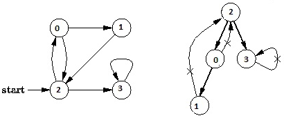

# 深度优先搜索
## 1 概述

### 定义
* 深度优先搜索（DFS：Depth-First Search）是一种图搜索策略，其将搜索限制到 2 种操作：
  1. 访问图中的一个节点；
  2. 访问该节点的子节点；

### 过程
* 在深度优先搜索中，对于最新发现的顶点，如果它还有以此为起点而未探测到的边，就沿此边继续探测下去。当顶点 v 的所有边都已被探寻过后，搜索将回溯到发现顶点 v 有起始点的那些边。这一过程一直进行到已发现从源顶点可达的所有顶点为止。实际上深度优先搜索最初的探究也是为了解决迷宫问题。

* 对图的深度优先搜索与对树（Tree）的深度优先遍历（Depth First Traversal）是类似的，区别在于图中可能存在环，所以可能会遍历到已经遍历的节点。

### 例子

* 例如，下面的图中，从顶点 2 开始遍历，当遍历到顶点 0 时，子顶点为 1 和 2，而顶点 2 已经遍历过，如果不做标记，遍历过程将陷入死循环。所以，在 DFS 的算法实现中需要对顶点是否访问过做标记。

* 上图的 DFS 遍历结果为 2, 0, 1, 3。

### 实现
* DFS 算法可以通过不同方式来实现：
  * 递归方式
  * 非递归方式：栈（Stack）数据结构来存储遍历图中节点的中间状态；

### 时间复杂度

* 深度优先搜索（DFS）的时间复杂度为 O(V+E)，V 即 Vertex 顶点数量，E 即 Edge 边数量。

### DFS算法的递归方式伪码
```
1 procedure DFS(G,v):
2     label v as discovered
3     for all edges from v to w in G.adjacentEdges(v) do
4         if vertex w is not labeled as discovered then
5             recursively call DFS(G,w)
```
### DFS算法的非递归方式伪码
```
1 procedure DFS-iterative(G,v):
2     let S be a stack
3     S.push(v)
4     while S is not empty
5           v ← S.pop() 
6           if v is not labeled as discovered:
7               label v as discovered
8               for all edges from v to w in G.adjacentEdges(v) do
9                   S.push(w)
```

### DFS算法实现代码如下：
```java
  1 using System;
  2 using System.Linq;
  3 using System.Collections.Generic;
  4 
  5 namespace GraphAlgorithmTesting
  6 {
  7   class Program
  8   {
  9     static void Main(string[] args)
 10     {
 11       Graph g = new Graph(4);
 12       g.AddEdge(0, 1);
 13       g.AddEdge(0, 2);
 14       g.AddEdge(1, 2);
 15       g.AddEdge(2, 0);
 16       g.AddEdge(2, 3);
 17       g.AddEdge(3, 3);
 18 
 19       foreach (var vertex in g.DFS(2))
 20       {
 21         Console.WriteLine(vertex);
 22       }
 23       foreach (var vertex in g.RecursiveDFS(2))
 24       {
 25         Console.WriteLine(vertex);
 26       }
 27 
 28       Console.ReadKey();
 29     }
 30 
 31     class Edge
 32     {
 33       public Edge(int begin, int end)
 34       {
 35         this.Begin = begin;
 36         this.End = end;
 37       }
 38 
 39       public int Begin { get; private set; }
 40       public int End { get; private set; }
 41     }
 42 
 43     class Graph
 44     {
 45       private Dictionary<int, List<Edge>> _adjacentEdges
 46         = new Dictionary<int, List<Edge>>();
 47 
 48       public Graph(int vertexCount)
 49       {
 50         this.VertexCount = vertexCount;
 51       }
 52 
 53       public int VertexCount { get; private set; }
 54 
 55       public void AddEdge(int begin, int end)
 56       {
 57         if (!_adjacentEdges.ContainsKey(begin))
 58         {
 59           var edges = new List<Edge>();
 60           _adjacentEdges.Add(begin, edges);
 61         }
 62 
 63         _adjacentEdges[begin].Add(new Edge(begin, end));
 64       }
 65 
 66       public List<int> DFS(int start)
 67       {
 68         List<int> traversal = new List<int>();
 69         int current = start;
 70 
 71         // mark all the vertices as not visited
 72         bool[] visited = new bool[VertexCount];
 73         for (int i = 0; i < VertexCount; i++)
 74         {
 75           visited[i] = false;
 76         }
 77 
 78         // create a stack for DFS
 79         Stack<int> stack = new Stack<int>();
 80 
 81         // mark the current node as visited and push it
 82         visited[current] = true;
 83         stack.Push(current);
 84 
 85         while (stack.Count > 0)
 86         {
 87           current = stack.Pop();
 88 
 89           // if this is what we are looking for
 90           traversal.Add(current);
 91 
 92           // get all child vertices of the popped vertex,
 93           // if a child has not been visited, 
 94           // then mark it visited and push it
 95           if (_adjacentEdges.ContainsKey(current))
 96           {
 97             foreach (var edge in _adjacentEdges[current].OrderByDescending(e => e.End))
 98             {
 99               if (!visited[edge.End])
100               {
101                 visited[edge.End] = true;
102                 stack.Push(edge.End);
103               }
104             }
105           }
106         }
107 
108         return traversal;
109       }
110 
111       public List<int> RecursiveDFS(int start)
112       {
113         List<int> traversal = new List<int>();
114         int current = start;
115 
116         // mark all the vertices as not visited
117         bool[] visited = new bool[VertexCount];
118         for (int i = 0; i < VertexCount; i++)
119         {
120           visited[i] = false;
121         }
122 
123         // traversal
124         RecursiveDFSTraversal(current, visited, traversal);
125 
126         return traversal;
127       }
128 
129       private void RecursiveDFSTraversal(int current, bool[] visited, List<int> traversal)
130       {
131         visited[current] = true;
132         traversal.Add(current);
133 
134         if (_adjacentEdges.ContainsKey(current))
135         {
136           foreach (var edge in _adjacentEdges[current].OrderBy(e => e.End))
137           {
138             if (!visited[edge.End])
139             {
140               RecursiveDFSTraversal(edge.End, visited, traversal);
141             }
142           }
143         }
144       }
145     }
146   }
147 }
```