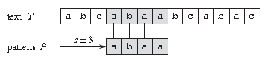
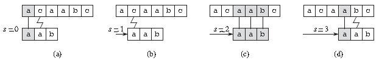

# 字符串匹配算法

## 问题分析

### 字符串匹配问题的形式定义
* 文本（Text）是一个长度为 n 的数组 T[1..n]；
* 模式（Pattern）是一个长度为 m 且 m≤n 的数组 P[1..m]；
* T 和 P 中的元素都属于有限的字母表 Σ 表；
* 如果 0≤s≤n-m，并且 T[s+1..s+m] = P[1..m]，即对 1≤j≤m，有 T[s+j] = P[j]，则说模式 P 在文本 T 中出现且位移为 s，且称 s 是一个有效位移（Valid Shift）。



* 比如上图中，目标是找出所有在文本 T = abcabaabcabac 中模式 P = abaa 的所有出现。该模式在此文本中仅出现一次，即在位移 s = 3 处，位移 s = 3 是有效位移。


### 解决字符串匹配的算法包括
* 朴素算法（Naive Algorithm）
* Rabin-Karp 算法
* 有限自动机算法（Finite Automation）
* Knuth-Morris-Pratt 算法（即 KMP Algorithm）
* Boyer-Moore 算法、Simon 算法、Colussi 算法
* Galil-Giancarlo 算法、Apostolico-Crochemore 算法
* Horspool 算法和 Sunday 算法等


### 基本步骤和算法效率

* 字符串匹配算法通常分为两个步骤：预处理（Preprocessing）和匹配（Matching）。所以算法的总运行时间为预处理和匹配的时间的总和。

* 上图描述了常见字符串匹配算法的预处理和匹配时间。

## 1 朴素的字符串匹配算法（Naive String Matching Algorithm）

### 基本思想
* 朴素的字符串匹配算法又称为暴力匹配算法（Brute Force Algorithm），它的主要特点是：
  1. 没有预处理阶段；
  2. 滑动窗口总是后移 1 位；
  3. 对模式中的字符的比较顺序不限定，可以从前到后，也可以从后到前；
  4. 匹配阶段需要 O((n - m + 1)m) 的时间复杂度；
  5. 需要 2n 次的字符比较；

* 很显然，朴素的字符串匹配算法 NAIVE-STRING-MATCHER 是最原始的算法，它通过使用循环来检查是否在范围 n-m+1 中存在满足条件 P[1..m] = T [s + 1..s + m] 的有效位移 s。

### 算法原理
```
1 NAIVE-STRING-MATCHER(T, P)
2  n ← length[T]
3  m ← length[P]
4  for s ← 0 to n - m
5    do if P[1 .. m] = T[s + 1 .. s + m]
6      then print "Pattern occurs with shift" s
```


* 如上图中，对于模式 P = aab 和文本 T = acaabc，将模式 P 沿着 T 从左到右滑动，逐个比较字符以判断模式 P 在文本 T 中是否存在。

### NAIVE-STRING-MATCHER时间效率

* 可以看出，NAIVE-STRING-MATCHER 没有对模式 P 进行预处理，所以预处理的时间为 0。而匹配的时间在最坏情况下为 Θ((n-m+1)m)，如果 m = [n/2]，则为 Θ(n2)。

### NAIVE-STRING-MATCHER 的代码示例。
```java
  1 namespace StringMatching
  2 {
  3   class Program
  4   {
  5     static void Main(string[] args)
  6     {
  7       char[] text1 = "BBC ABCDAB ABCDABCDABDE".ToCharArray();
  8       char[] pattern1 = "ABCDABD".ToCharArray();
  9 
 10       int firstShift1;
 11       bool isMatched1 = NaiveStringMatcher.TryMatch1(text1, pattern1, out firstShift1);
 12       Contract.Assert(isMatched1);
 13       Contract.Assert(firstShift1 == 15);
 14 
 15       char[] text2 = "ABABDAAAACAAAABCABAB".ToCharArray();
 16       char[] pattern2 = "AAACAAAA".ToCharArray();
 17 
 18       int firstShift2;
 19       bool isMatched2 = NaiveStringMatcher.TryMatch2(text2, pattern2, out firstShift2);
 20       Contract.Assert(isMatched2);
 21       Contract.Assert(firstShift2 == 6);
 22 
 23       char[] text3 = "ABAAACAAAAAACAAAABCABAAAACAAAAFDLAAACAAAAAACAAAA".ToCharArray();
 24       char[] pattern3 = "AAACAAAA".ToCharArray();
 25 
 26       int[] shiftIndexes = NaiveStringMatcher.MatchAll(text3, pattern3);
 27       Contract.Assert(shiftIndexes.Length == 5);
 28       Contract.Assert(string.Join(",", shiftIndexes) == "2,9,22,33,40");
 29 
 30       Console.WriteLine("Well done!");
 31       Console.ReadKey();
 32     }
 33   }
 34 
 35   public class NaiveStringMatcher
 36   {
 37     public static bool TryMatch1(char[] text, char[] pattern, out int firstShift)
 38     {
 39       firstShift = -1;
 40       int n = text.Length;
 41       int m = pattern.Length;
 42       int s = 0, j = 0;
 43 
 44       // for..for..
 45       for (s = 0; s < n - m; s++)
 46       {
 47         for (j = 0; j < m; j++)
 48         {
 49           if (text[s + j] != pattern[j])
 50           {
 51             break;
 52           }
 53         }
 54         if (j == m)
 55         {
 56           firstShift = s;
 57           return true;
 58         }
 59       }
 60 
 61       return false;
 62     }
 63 
 64     public static bool TryMatch2(char[] text, char[] pattern, out int firstShift)
 65     {
 66       firstShift = -1;
 67       int n = text.Length;
 68       int m = pattern.Length;
 69       int s = 0, j = 0;
 70 
 71       // while..
 72       while (s < n && j < m)
 73       {
 74         if (text[s] == pattern[j])
 75         {
 76           s++;
 77           j++;
 78         }
 79         else
 80         {
 81           s = s - j + 1;
 82           j = 0;
 83         }
 84 
 85         if (j == m)
 86         {
 87           firstShift = s - j;
 88           return true;
 89         }
 90       }
 91 
 92       return false;
 93     }
 94 
 95     public static int[] MatchAll(char[] text, char[] pattern)
 96     {
 97       int n = text.Length;
 98       int m = pattern.Length;
 99       int s = 0, j = 0;
100       int[] shiftIndexes = new int[n - m + 1];
101       int c = 0;
102 
103       // while..
104       while (s < n && j < m)
105       {
106         if (text[s] == pattern[j])
107         {
108           s++;
109           j++;
110         }
111         else
112         {
113           s = s - j + 1;
114           j = 0;
115         }
116 
117         if (j == m)
118         {
119           shiftIndexes[c] = s - j;
120           c++;
121 
122           s = s - j + 1;
123           j = 0;
124         }
125       }
126 
127       int[] shifts = new int[c];
128       for (int y = 0; y < c; y++)
129       {
130         shifts[y] = shiftIndexes[y];
131       }
132 
133       return shifts;
134     }
135   }
136 }
```
* 上面代码中 TryMatch1 和 TryMatch2 分别使用 for 和 while 循环达到相同效果。


## 2 Knuth-Morris-Pratt 字符串匹配算法（即 KMP 算法）

### 基本思想
* 我们来观察一下朴素的字符串匹配算法的操作过程。如下图（a）中所描述，在模式 P = ababaca 和文本 T 的匹配过程中，模板的一个特定位移 s，q = 5 个字符已经匹配成功，但模式 P 的第 6 个字符不能与相应的文本字符匹配。


* 此时，q 个字符已经匹配成功的信息确定了相应的文本字符，而知道这 q 个文本字符，就使我们能够立即确定某些位移是非法的。例如上图（a）中，我们可以判断位移 s+1 是非法的，因为模式 P 的第一个字符 a 将与模式的第二个字符 b 匹配的文本字符进行匹配，显然是不匹配的。而图（b）中则显示了位移 s’ = s+2 处，使模式 P 的前三个字符和相应的三个文本字符对齐后必定会匹配。KMP 算法的基本思路就是设法利用这些已知信息，不要把 "搜索位置" 移回已经比较过的位置，而是继续把它向后面移，这样就提高了匹配效率。

### 算法原理
> The basic idea behind KMP’s algorithm is: whenever we detect a mismatch (after some matches), we already know some of the characters in the text (since they matched the pattern characters prior to the mismatch). We take advantage of this information to avoid matching the characters that we know will anyway match.


* 已知模式 P[1..q] 与文本 T[s+1..s+q] 匹配，那么满足 P[1..k] = T[s’+1..s’+k] 其中 s’+k = s+q 的最小位移 s’ > s 是多少？这样的位移 s’ 是大于 s 的但未必非法的第一个位移，因为已知 T[s+1..s+q] 。在最好的情况下有 s’ = s+q，因此立刻能排除掉位移 s+1, s+2 .. s+q-1。在任何情况下，对于新的位移 s’，无需把 P 的前 k 个字符与 T 中相应的字符进行比较，因为它们肯定匹配。

* 可以用模式 P 与其自身进行比较，以预先计算出这些必要的信息。例如上图（c）中所示，由于 T[s’+1..s’+k] 是文本中已经知道的部分，所以它是字符串 Pq 的一个后缀。

* 此处我们引入模式的前缀函数 π（Pai），π 包含有模式与其自身的位移进行匹配的信息。这些信息可用于避免在朴素的字符串匹配算法中，对无用位移进行测试。
$$
π[q] = max {k : k < q and Pk ⊐ Pq}
$$

* π[q] 代表当前字符之前的字符串中，最长的共同前缀后缀的长度。（π[q] is the length of the longest prefix of P that is a proper suffix of Pq.）
下图给出了关于模式 P = ababababca 的完整前缀函数 π，可称为部分匹配表（Partial Match Table）。

### 计算过程：
* π[1] = 0，a 仅一个字符，前缀和后缀为空集，共有元素最大长度为 0；
* π[2] = 0，ab 的前缀 a，后缀 b，不匹配，共有元素最大长度为 0；
* π[3] = 1，aba，前缀 a ab，后缀 ba a，共有元素最大长度为 1；
* π[4] = 2，abab，前缀 a ab aba，后缀 bab ab b，共有元素最大长度为 2；
* π[5] = 3，ababa，前缀 a ab aba abab，后缀 baba aba ba a，共有元素最大长度为 3；
* π[6] = 4，ababab，前缀 a ab aba abab ababa，后缀 babab abab bab ab b，共有元素最大长度为 4；
* π[7] = 5，abababa，前缀 a ab aba abab ababa ababab，后缀 bababa ababa baba aba ba a，共有元素最大长度为 5；
* π[8] = 6，abababab，前缀 .. ababab ..，后缀 .. ababab ..，共有元素最大长度为 6；
* π[9] = 0，ababababc，前缀和后缀不匹配，共有元素最大长度为 0；
* π[10] = 1，ababababca，前缀 .. a ..，后缀 .. a ..，共有元素最大长度为 1；

### 算法原理
* KMP 算法 KMP-MATCHER 中通过调用 COMPUTE-PREFIX-FUNCTION 函数来计算部分匹配表。
```
 1 KMP-MATCHER(T, P)
 2 n ← length[T]
 3 m ← length[P]
 4 π ← COMPUTE-PREFIX-FUNCTION(P)
 5 q ← 0                          //Number of characters matched.
 6 for i ← 1 to n                 //Scan the text from left to right.
 7     do while q > 0 and P[q + 1] ≠ T[i]
 8             do q ← π[q]        //Next character does not match.
 9         if P[q + 1] = T[i]
10             then q ← q + 1     //Next character matches.
11         if q = m               //Is all of P matched?
12             then print "Pattern occurs with shift" i - m
13             q ← π[q]           //Look for the next match.
```
```
 1 COMPUTE-PREFIX-FUNCTION(P)
 2 m ← length[P]
 3 π[1] ← 0
 4 k ← 0
 5 for q ← 2 to m
 6      do while k > 0 and P[k + 1] ≠ P[q]
 7             do k ← π[k]
 8         if P[k + 1] = P[q]
 9            then k ← k + 1
10         π[q] ← k
11 return π
```

* 预处理过程 COMPUTE-PREFIX-FUNCTION 的运行时间为 Θ(m)，KMP-MATCHER 的匹配时间为 Θ(n)。

* 相比较于 NAIVE-STRING-MATCHER，KMP-MATCHER 的主要优化点就是在当确定字符不匹配时对于 pattern 的位移。

* NAIVE-STRING-MATCHER 的位移效果是：文本向后移一位，模式从头开始。
```
    s = s - j + 1;
    j = 0;
```

* KMP-MATCHER 首先对模式做了获取共同前缀后缀最大长度的预处理操作，位移过程是先将模式向后移 partial_match_length - table[partial_match_length - 1]，然后再判断是否匹配。这样通过对已匹配字符串的已知信息的利用，可以有效节省比较数量。
```
    if (j != 0)
        j = lps[j - 1];
    else
        s++;
```

* 下面描述了当发现字符 j 与 c 不匹配时的位移效果。
```
    // partial_match_length - table[partial_match_length - 1]
    rrababababjjjjjiiooorababababcauuu
      ||||||||-
      ababababca
    // 8-6=2
    rrababababjjjjjiiooorababababcauuu
      xx||||||-
        ababababca
    // 6-4=2
    rrababababjjjjjiiooorababababcauuu
        xx||||-
          ababababca
    // 4-2=2
    rrababababjjjjjiiooorababababcauuu
          xx||-
            ababababca
    // 2-0=2
    rrababababjjjjjiiooorababababcauuu
            xx-
              ababababca
```
* 综上可知，KMP 算法的主要特点是：
  1. 需要对模式字符串做预处理；
  2. 预处理阶段需要额外的 O(m) 空间和复杂度；
  3. 匹配阶段与字符集的大小无关；
  4. 匹配阶段至多执行 2n - 1 次字符比较；
  5. 对模式中字符的比较顺序时从左到右；

### 算法实现
* 下面是 KMP-MATCHER 的代码示例。
```java
  1 namespace StringMatching
  2 {
  3   class Program
  4   {
  5     static void Main(string[] args)
  6     {
  7       char[] text1 = "BBC ABCDAB ABCDABCDABDE".ToCharArray();
  8       char[] pattern1 = "ABCDABD".ToCharArray();
  9 
 10       int firstShift1;
 11       bool isMatched1 = KmpStringMatcher.TryMatch1(text1, pattern1, out firstShift1);
 12       Contract.Assert(isMatched1);
 13       Contract.Assert(firstShift1 == 15);
 14 
 15       char[] text2 = "ABABDAAAACAAAABCABAB".ToCharArray();
 16       char[] pattern2 = "AAACAAAA".ToCharArray();
 17 
 18       int firstShift2;
 19       bool isMatched2 = KmpStringMatcher.TryMatch2(text2, pattern2, out firstShift2);
 20       Contract.Assert(isMatched2);
 21       Contract.Assert(firstShift2 == 6);
 22 
 23       char[] text3 = "ABAAACAAAAAACAAAABCABAAAACAAAAFDLAAACAAAAAACAAAA".ToCharArray();
 24       char[] pattern3 = "AAACAAAA".ToCharArray();
 25 
 26       int[] shiftIndexes3 = KmpStringMatcher.MatchAll1(text3, pattern3);
 27       Contract.Assert(shiftIndexes3.Length == 5);
 28       Contract.Assert(string.Join(",", shiftIndexes3) == "2,9,22,33,40");
 29       int[] shiftIndexes4 = KmpStringMatcher.MatchAll2(text3, pattern3);
 30       Contract.Assert(shiftIndexes4.Length == 5);
 31       Contract.Assert(string.Join(",", shiftIndexes4) == "2,9,22,33,40");
 32 
 33       Console.WriteLine("Well done!");
 34       Console.ReadKey();
 35     }
 36   }
 37 
 38   public class KmpStringMatcher
 39   {
 40     public static bool TryMatch1(char[] text, char[] pattern, out int firstShift)
 41     {
 42       // KMP needs a pattern preprocess to get the Partial Match Table
 43       int[] lps = PreprocessToComputeLongestProperPrefixSuffixArray(pattern);
 44       // pattern: ABCDABD
 45       // char:  | A | B | C | D | A | B | D |
 46       // index: | 0 | 1 | 2 | 3 | 4 | 5 | 6 |
 47       // lps:   | 0 | 0 | 0 | 0 | 1 | 2 | 0 |
 48 
 49       firstShift = -1;
 50       int n = text.Length;
 51       int m = pattern.Length;
 52       int s = 0, j = 0;
 53 
 54       while (s < n && j < m)
 55       {
 56         if (j == -1 || text[s] == pattern[j])
 57         {
 58           s++;
 59           j++;
 60         }
 61         else
 62         {
 63           // here is different with naive string matcher
 64           if (j != 0)
 65             j = lps[j - 1];
 66           else
 67             s++;
 68         }
 69 
 70         if (j == m)
 71         {
 72           firstShift = s - j;
 73           return true;
 74         }
 75       }
 76 
 77       return false;
 78     }
 79 
 80     static int[] PreprocessToComputeLongestProperPrefixSuffixArray(char[] pattern)
 81     {
 82       int m = pattern.Length;
 83 
 84       // hold the longest prefix suffix values for pattern
 85       int[] lps = new int[m];
 86       lps[0] = 0;
 87 
 88       // length of the previous longest prefix suffix
 89       int k = 0;
 90       int q = 1;
 91       while (q < m)
 92       {
 93         if (pattern[k] == pattern[q])
 94         {
 95           k++;
 96           lps[q] = k;
 97           q++;
 98         }
 99         else
100         {
101           if (k != 0)
102           {
103             k = lps[k - 1];
104           }
105           else
106           {
107             lps[q] = 0;
108             q++;
109           }
110         }
111       }
112 
113       return lps;
114     }
115 
116     public static bool TryMatch2(char[] text, char[] pattern, out int firstShift)
117     {
118       // KMP needs a pattern preprocess
119       int[] next = PreprocessToGetNextArray(pattern);
120       // pattern: ABCDABD
121       // char:  | A | B | C | D | A | B | D |
122       // index: | 0 | 1 | 2 | 3 | 4 | 5 | 6 |
123       // lps:   | 0 | 0 | 0 | 0 | 1 | 2 | 0 |
124       // next:  |-1 | 0 | 0 | 0 | 0 | 1 | 2 | -> shift LPS 1 position to right 
125 
126       firstShift = -1;
127       int n = text.Length;
128       int m = pattern.Length;
129       int s = 0, j = 0;
130 
131       while (s < n && j < m)
132       {
133         if (j == -1 || text[s] == pattern[j])
134         {
135           s++;
136           j++;
137         }
138         else
139         {
140           // here is different with naive string matcher
141           j = next[j];
142         }
143 
144         if (j == m)
145         {
146           firstShift = s - j;
147           return true;
148         }
149       }
150 
151       return false;
152     }
153 
154     static int[] PreprocessToGetNextArray(char[] pattern)
155     {
156       int m = pattern.Length;
157       int[] next = new int[m];
158       next[0] = -1;
159 
160       int k = -1;
161       int q = 0;
162       while (q < m - 1)
163       {
164         if (k == -1 || pattern[k] == pattern[q])
165         {
166           k++;
167           q++;
168 
169           //next[q] = k;       // does not optimize
170 
171           if (pattern[k] != pattern[q])
172             next[q] = k;
173           else
174             next[q] = next[k]; // with optimization
175         }
176         else
177         {
178           k = next[k];
179         }
180       }
181 
182       return next;
183     }
184 
185     public static int[] MatchAll1(char[] text, char[] pattern)
186     {
187       // KMP needs a pattern preprocess
188       int[] lps = PreprocessToComputeLongestProperPrefixSuffixArray(pattern);
189       // pattern: ABCDABD
190       // char:  | A | B | C | D | A | B | D |
191       // index: | 0 | 1 | 2 | 3 | 4 | 5 | 6 |
192       // lps:   | 0 | 0 | 0 | 0 | 1 | 2 | 0 |
193 
194       int n = text.Length;
195       int m = pattern.Length;
196       int s = 0, j = 0;
197       int[] shiftIndexes = new int[n - m + 1];
198       int c = 0;
199 
200       while (s < n && j < m)
201       {
202         if (j == -1 || text[s] == pattern[j])
203         {
204           s++;
205           j++;
206         }
207         else
208         {
209           // here is different with naive string matcher
210           if (j != 0)
211             j = lps[j - 1];
212           else
213             s++;
214         }
215 
216         if (j == m)
217         {
218           shiftIndexes[c] = s - j;
219           c++;
220 
221           j = lps[j - 1];
222         }
223       }
224 
225       int[] shifts = new int[c];
226       for (int y = 0; y < c; y++)
227       {
228         shifts[y] = shiftIndexes[y];
229       }
230 
231       return shifts;
232     }
233 
234     public static int[] MatchAll2(char[] text, char[] pattern)
235     {
236       // KMP needs a pattern preprocess
237       int[] next = PreprocessToGetNextArray(pattern);
238       // pattern: ABCDABD
239       // char:  | A | B | C | D | A | B | D |
240       // index: | 0 | 1 | 2 | 3 | 4 | 5 | 6 |
241       // lps:   | 0 | 0 | 0 | 0 | 1 | 2 | 0 |
242       // next:  |-1 | 0 | 0 | 0 | 0 | 1 | 2 | -> shift LPS 1 position to right
243 
244       int n = text.Length;
245       int m = pattern.Length;
246       int s = 0, j = 0;
247       int[] shiftIndexes = new int[n - m + 1];
248       int c = 0;
249 
250       while (s < n && j < m)
251       {
252         if (j == -1 || text[s] == pattern[j])
253         {
254           s++;
255           j++;
256         }
257         else
258         {
259           // here is different with naive string matcher
260           j = next[j];
261         }
262 
263         if (j == m)
264         {
265           shiftIndexes[c] = s - j;
266           c++;
267 
268           j = next[j - 1];
269         }
270       }
271 
272       int[] shifts = new int[c];
273       for (int y = 0; y < c; y++)
274       {
275         shifts[y] = shiftIndexes[y];
276       }
277 
278       return shifts;
279     }
280   }
281 }
```