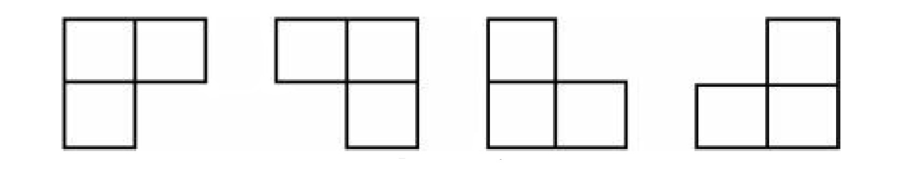
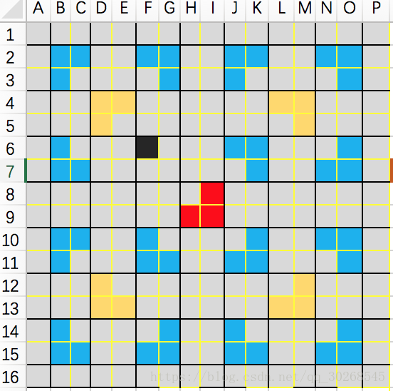

## 棋盘覆盖问题


### 问题描述

棋盘覆盖问题。有一个$2^k∗2^k$的方格棋盘，恰有一个方格是黑色的，其他为白色。你的任务是用包含3个方格的L型牌覆盖所有白色方格。黑色方格不能被覆盖，且任意一个白色方格不能同时被两个或更多牌覆盖。如图所示为L型牌的4种旋转方式。

求解棋盘覆盖的方法。




### 问题分析

* 问题分类：

### 策略选择

* 数据结构：线性数据结构
* 算法思想：分治法

### 算法设计

分治三步骤
1. 划分问题：将$2^k∗2^k$的棋盘划分为 $2^{k−1}∗2^{k−1}$这样的子棋盘4块。
2. 递归求解：递归填充各个格子，填充分为四个情况，在下面会有解释，递归出口为 k=0k=0也就是子棋盘方格数为1。
3. 合并问题：不需要合并子问题。

分治方法：将棋盘等分为四块。然后分为以下两种情况。
1. 额外的方格在某一块中，不需要处理该区块。
2. 额外的方格不在某一块中。则添加一个L型牌覆盖三个没有额外方格的块。

重复以上步骤直到能完全覆盖。


### 算法分析

### 算法实现

```C++
void chessBoard(int row, int column, int x, int y, int siz) {
    // 递归出口
    if(siz == 1) {
        return;
    }

    // 对半划分成2^(siz - 1) * 2^(siz - 1)的棋盘
    int s = siz / 2;
    // L型牌编号自增
    int t = ++number;
    // 中间点，以此判别(x,y)在哪个子棋盘中
    int centerRow = row + s;
    int centerColumn = column + s;
    // 黑色方格在左上子棋盘
    if(x < centerRow && y < centerColumn) {
        chessBoard(row, column, x, y, s);
    } else {
        // 不在则填充左上子棋盘的右下角
        chess[centerRow - 1][centerColumn - 1] = t;
        // 然后覆盖其他格子，注意这时(x,y)要看做已填充位置
        chessBoard(row, column, centerRow - 1, centerColumn - 1, s);
    }

    // 黑色方格在右上子棋盘
    if(x < centerRow && y >= centerColumn) {
        chessBoard(row, centerColumn, x, y, s);
    } else {
        // 不在则填充右上子棋盘的左下角
        chess[centerRow - 1][centerColumn] = t;
        // 然后覆盖其他格子，注意这时(x,y)要看做已填充位置
        chessBoard(row, centerColumn, centerRow - 1, centerColumn, s);
    }

    // 黑色方格在左下子棋盘
    if(x >= centerRow && y < centerColumn) {
        chessBoard(centerRow, column, x, y, s);
    } else {
        // 不在则填充左下子棋盘的右上角
        chess[centerRow][centerColumn - 1] = t;
        // 然后覆盖其他格子，注意这时(x,y)要看做已填充位置
        chessBoard(centerRow, column, centerRow, centerColumn - 1, s);
    }

    // 黑色方格在右下子棋盘
    if(x >= centerRow && y >= centerColumn) {
        chessBoard(centerRow, centerColumn, x, y, s);
    } else {
        // 不在则填充右下子棋盘的左上角
        chess[centerRow][centerColumn] = t;
        // 然后覆盖其他格子，注意这时(x,y)要看做已填充位置
        chessBoard(centerRow, centerColumn, centerRow, centerColumn, s);
    }

}
```