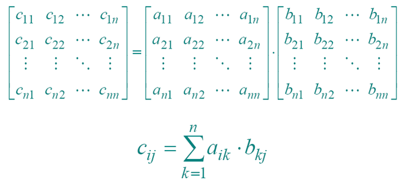

# 矩阵乘法

## 1 矩阵乘法-蛮力法
### 问题描述



### 问题分析

### 算法设计

问题归结为计算元素C[i,j]。依据定义来计算A和B的乘积矩阵C，则每计算C的一个元素C[i][j]，需要做n次乘法和n-1次加法。C的规模为n*n。

### 算法分析
* 时间复杂度O(n^3)

### 算法实现


## 2 矩阵乘法-STRASSEN算法


### 算法设计

算法的基本思想在于以增加加减法的次数来减少乘法次数：
用了7次n/2 x n/2 矩阵乘法和18次n/2 x n/2 矩阵的加法


### 算法过程
* 将矩阵分块
```
A = a11	a12 
    a21	a22           
B = b11	b12
    b21	b22
```
* 计算分块矩阵的乘法
```
d1 = (a11 + a22) (b11 + b22)
d2 = (a21 + a22) b11
d3 = a11 (b12 – b22)
d4 = a22 (b21 –b11)
d5 = (a11 + a12) b22
d6 = (a21 – a11) (b11 + b12)
d7 = (a12 – a22) ( b21 + b22)
```

* 将分块矩阵乘法进行合并
```
C11 = 
C12 = 
C21 = 
C22 = 
```

### 算法效率
* 时间复杂度：T (n) =$O(n^{log7})= O(n^{2.81})$

### 算法实现

```

```
