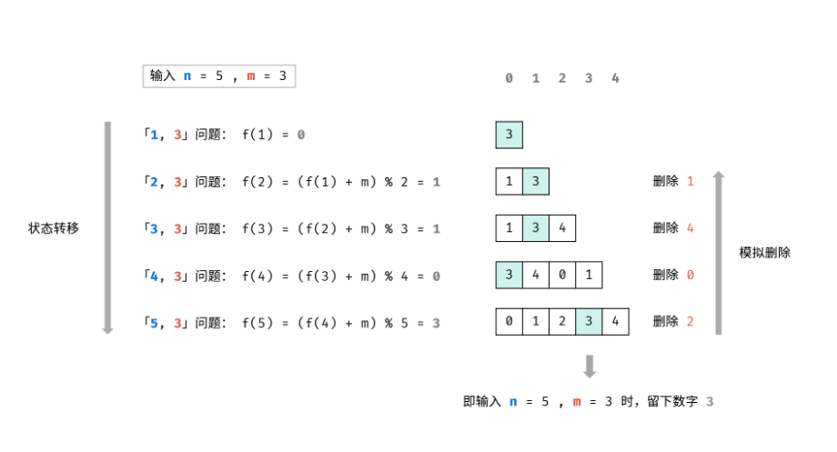

# 约瑟夫问题


### 问题描述
一堆人围城环。每次淘汰第m个人。最终剩下谁。

### 问题分析


### 算法设计

我们将上述问题建模为函数 f(n, m)，该函数的返回值为最终留下的元素的序号。

首先，长度为 n 的序列会先删除第 m % n 个元素，然后剩下一个长度为 n - 1 的序列。那么，我们可以递归地求解 f(n - 1, m)，就可以知道对于剩下的 n - 1 个元素，最终会留下第几个元素，我们设答案为 x = f(n - 1, m)。

由于我们删除了第 m % n 个元素，将序列的长度变为 n - 1。当我们知道了 f(n - 1, m) 对应的答案 x 之后，我们也就可以知道，长度为 n 的序列最后一个删除的元素，应当是从 m % n 开始数的第 x 个元素。因此有 f(n, m) = (m % n + x) % n = (m + x) % n。



### 算法分析


### 算法实现

* 递归

```
class Solution {
    int f(int n, int m) {
        if (n == 1) {
            return 0;
        }
        int x = f(n - 1, m);
        return (m + x) % n;
    }
public:
    int lastRemaining(int n, int m) {
        return f(n, m);
    }
};
```
* 迭代

```
class Solution {
public:
    int lastRemaining(int n, int m) {
        int f = 0;
        for (int i = 2; i != n + 1; ++i) {
            f = (m + f) % i;
        }
        return f;
    }
};
```

