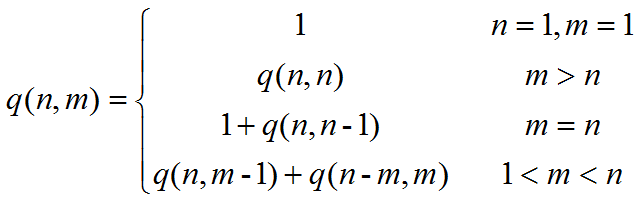

## 整数划分

### 问题描述

将给定正整数n表示成一系列正整数之和n=n1+n2+…+nk，其中n1≥n2≥…≥nk≥1，k≥1。求最大加数不大于m的划分个数p(n,m)。


### 算法设计



### 算法实现
```C++
#include<iostream>
using namespace std;
int q(int n,int m)
{
	if((n<1)||(m<1))
		return 0;
	if((n == 1)||(m == 1))
		return 1;
	if(n < m)
		return q(n,n);
	if(n == m)
		return q(n,m-1)+1;
	return q(n,m-1)+q(n-m,m);
```

