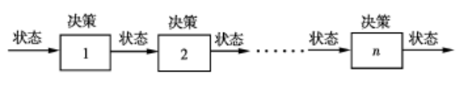
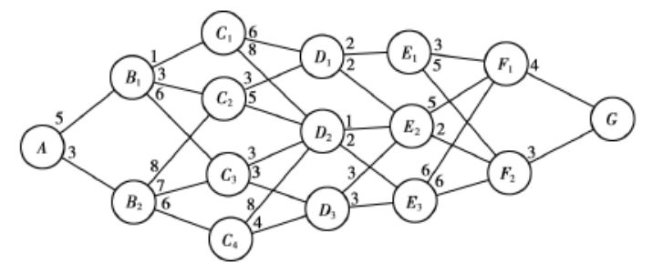

# 动态规划

> 参考文献
> * [https://zhuanlan.zhihu.com/p/144655170](https://zhuanlan.zhihu.com/p/144655170)
> * [https://www.cxyxiaowu.com/6781.html](https://www.cxyxiaowu.com/6781.html)
> * [https://mp.weixin.qq.com/s?__biz=MzUyNjQxNjYyMg==&mid=2247486923&idx=2&sn=6c1c8aeb4db68522e67ddf8c1e933660&chksm=fa0e624acd79eb5cdb410808921609a830b9b9221e813e4eb89cf551ca48f317668d44b095d2&scene=21#wechat_redirect](https://mp.weixin.qq.com/s?__biz=MzUyNjQxNjYyMg==&mid=2247486923&idx=2&sn=6c1c8aeb4db68522e67ddf8c1e933660&chksm=fa0e624acd79eb5cdb410808921609a830b9b9221e813e4eb89cf551ca48f317668d44b095d2&scene=21#wechat_redirect)
> * [https://www.cxyxiaowu.com/7012.html](https://www.cxyxiaowu.com/7012.html)

## 1 概述
### 基本思想

* 多阶段决策问题。比如最短路线问题，机器负荷问题等，把解决这一类问题的的方法称为动态规划方法
* 动态规划算法与分治法类似，其思想把求解的问题分成许多阶段或多个子问题，然后按顺序求解各子问题。最后一个阶段或子问题的解就是初始问题的解。

* 动态规划基本思想是保留已解决的子问题的解，在需要时再查找已求得的解，就可以避免大量重复计算，进而提升算法效率。

### 对比分治法
* 动态规划中分解得到的**子问题不是互相独立的**。不同子问题的数目常常只有多项式级，用分治法求解时，有些子问题被重复计算了多次，从而导致分治法求解问题时间复杂度极高。

* 动态规划的基本思想是保留已经解决的子问题的解。在需要的时候查找已知的解。避免大量重复的计算而提高效率。

### 条件
1. **最优子结构/最优化原理**：如果问题的最优解所包含的子问题的解也是最优的，就称该问题具有最优子结构，即满足最优化原理。
2. **无后效性**：即某阶段状态一旦确定，就不受这个状态以后决策的影响。也就是说，某状态以后的过程不会影响以前的状态，只与当前状态有关。
3. **有重叠子问题**：即子问题之间是**不独立**的，一个子问题在下一阶段决策中可能被多次使用到。（该性质并不是动态规划适用的必要条件，但是如果没有这条性质，动态规划算法同其他算法相比就不具备优势）

## 2 动态规划模型的基本概念

以上是求A到G的最短路线问题。
### 阶段

明确问题的各个**阶段**：将问题划分为相互联系的各个阶段。以便能按一定的次序求解问题。阶段的划分一般是根据时间和空间的特征进行的，但是要能够把问题的过程转化为多阶段决策问题。

**最短路线问题中**：ABCDEFG是七个不同的阶段。

### 状态
**状态**表示每个阶段开始所处的自然状况或者客观条件。

**最短路线问题中**：第一阶段的状态就是A，第二阶段的状态就是$\{B_1,B_2\}$ ，即第k阶段所有出发点的集合。描述过程状态的变量称为状态变量，用$\{S_k\}$表示第 k 阶段的**状态变量**。如$S_3=\{C_1,C_2,C_3,C_4\}$

动态规划中的状态与一般所说的状态概念是不同的，它必须具有三个特性：
* 要能够用来描述受控过程的演变特征。
* 要满足无后效性。 所谓无后效性是指：如果某段状态给定，则在这段以后过程的发展不受前面各阶段状态的影响。
* 可知性。即是规定的各段状态变量的值，由直接或间接都是可以知道的。

### 决策

决策表示当过程处于某一阶段某一状态时，可以做出不同的决定，从而确定下一阶段的状态，这个决定就叫做**决策**。

描述决策的变量，称为**决策变量**。可以是一个数一组数，也可以是一个向量。常用$u_k(s_k)$表示第 k 个阶段处于$s_k$时的决策变量，可见决策变量是状态的函数，也就是处于不同的状态时所能的决策与当前状态有关。

决策变量的取值常常限制在某一范围内，此范围称为**允许决策集合**。常用$D_k(s_k)$表示第 k 阶段从状态 $s_k$出发的允许决策集合，显然有 $u_k(s_k)$ 属于$D_k$

最短路线问题中：若从$B_1$出发，允许决策集合$D_2(B_1)=\{C_1,C_2,C_3\}=\{u_2(B_1)\}$

### 策略

**策略**是按顺序排列的策略组成的集合。由过程的第k阶段开始到终止状态为止的过程，称为问题的后部子过程（或称为k子过程）。由每段的决策按照顺序排列组成的决策函数序列$\{u_k(s_k),u_{k+1}s_{k+1},\dots,u_n(s_n)\}$称为k子过程策略，简称为子策略.

### 状态转移方程

状态转移方程是确定过程由一个状态到另一个状态的演变过程。如果给定第 k 个阶段的状态变量$s_k$的取值，那么该阶段的决策变量$u_k(s_k)$一经确定，第 k+1 阶段的状态变量$s_{k+1}$的取值也就决定了。

$$
s_{k+1}=T_k(s_k,u_k)
$$

### 最优指标函数
用来判断决策过程中的优劣问题，淘汰不好的解，留下最优子结构。
$$
v_k=v_k(s_k,u_k,s_{k+1},u_{k+1},\dots,s_{n})
$$

## 3 构建动态规划模型

### 方法
* 动态规划问题的关键在于正确地写出基本的递推关系式和恰当的边界条件
* 备忘录方法（矩阵表格）

### 动态规划算法的步骤
1. **问题分解划分阶段i**：找到规模增长的方向。规模增长如果只有一个方向，称为**线性规模增长**。如果有两个方向称为**非线性规模增长**。例如两个字符串最长公共子序列，典型的两个方向的非线性规模增长。给出增长方向的阶段序列。
2. **确定状态变量$x_k$**：描述阶段的状态。某一个阶段可以只有一个状态，表示**线性决策过程**复杂度通常为O(n)。某一阶段也可以有多个状态，如图中所展示，称为**非线性决策过程**，复杂度通常为O(n*m)。n表示阶段的数量，m表示每个阶段状态的最大数量。
3. **确定状态转移方程** ：状态变量和决策变量构成的状态转移方程$x_{k+1}=T_k(u_k,x_k)$。如果给定第k段状态变量$x_k$的值，则该段的决策变量$u_k$一经确定，第k+1段状态变量$x_{k+1}$的值也就完全确定。 
4. **确定边界实现过程**。开始和结束的条件。往往添加$x_0$维，方便计算状态转移。

### 可逆过程
* 顺序解法：以G为始端，以A为终端的左行解法程序称为顺序解法
* 逆序解法可以把段次颠倒过来求最优解的多阶段决策过程称为可逆过程。

* 顺序解法和逆序解法只表示行进方向的不同或始端的颠倒。但用动态规划方法求最优解时，都是在行进方向规定后，均要逆着这个规定的行进方向，从最后一段向前逆推计算，逐段找出最优途径

## 4 动态规划分类
### 规模增长
* 确定规模的增长方向。一般在动态规划问题中。规模可变的并不只有一个。比如在正则表达式与字符串的匹配问题中。字符串的规模可以变化，正则表达式的规模也可以变化。
* 根据规模增长的可以将动态规划分为四类：
  * 线性动态规划。线性规模增长。线性决策过程。例如：斐波那契数列、青蛙跳台阶、最大子段和。时间复杂度为O(n)
  * 树形动态规划。非线性规模增长。非线性决策过程。第二个规模增长方向构成该阶段的状态集合（每个阶段的状态并非一个），但是每个阶段的状态数量不确定。例如：三角形数组最小路径和、单向最短路径问题。时间复杂度为O(n*m)//m表示某一阶段最大的状态数量。
  * 矩阵动态规划。非线性规模增长。非线性决策。第二个规模增长方向与第一个规模增长方向独立，不受第一个规模增长影响，每个阶段的状态数量是固定的。例如背包问题、n个骰子的点数问题。O(n*m)。由于矩阵可以用来表示图。也可以定义为图型动态规划
  * 序列动态规划。非线性规模增长。非线性决策。第二个规模增长的方向不受第一个规模增长的影响，矩阵动态规划的特殊形式，针对序列的动态规划。例如：最长公共子序列、正则表达式匹配。O(n*m)
* 二维规模增长的冬天规划，第一维表示的行，第二维表示列。第一维为主要的规模增长方向，第二维是第一维某一阶段的状态集合。
## 4.1 线性动态规划

## 4.2 树型动态规划

## 4.3 矩阵动态规划（图型动态规划）

## 4.4 序列动态规划

## 5 常见问题
### 1矩阵连乘问题

### 2凸多边形最优三角剖分

### 3 最长公共子序列

### 5图像压缩问题

### 6最大子段和问题

### 7流水作业调度问题

### 8投资问题

### 9 01背包问题

### 10 0n背包问题

### 11最优二叉搜索树问题

### 12 n个骰子的点数

### 13 正则表达式的匹配

### 12 序列匹配问题

----

### 最短路线问题

### 机器负荷问题

### 资源分配问题

### 可靠性问题

### 排序问题

### 设备更新问题

### 计算二项式系数
