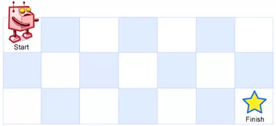

# 动态规划——矩阵动态规划

> 矩阵可以看作是图的一种，怎么说？你可以把整个矩阵当成一个图，矩阵里面的每个位置上的元素当成是图上的节点，然后每个节点的邻居就是其相邻的上下左右的位置
> 
> 矩阵类动态规划的两个规模增长方向可能存在两种情况：等价独立和非等价独立。例如不同路径和最大矩形中的规模增长方向，是等价独立的，两个规模增长的含义是一样的，比较好判断。但是在背包问题等其他子问题中。规模增长的方向是不等价，一个是背包容量的增长，另一个是物品数量的增长，通常比较难发现。
> 
> 在矩阵动态规划中，两个维度的增长方向是可以相互交换的。只要设计好即可。但有可能存在一个简单一个复杂的情况。
> * 不同路径
> * 最大矩形

## 1 不同路径

### 问题描述
一个机器人位于一个 m x n 网格的左上角 （起始点在下图中标记为“Start” ）。

机器人每次只能向下或者向右移动一步。机器人试图达到网格的右下角（在下图中标记为“Finish”）。

问总共有多少条不同的路径？

例如，上图是一个7 x 3 的网格。有多少可能的路径？说明： m 和 n 的值均不超过 100。

示例 1:
```
输入: m = 3, n = 2
输出: 3
解释:
从左上角开始，总共有 3 条路径可以到达右下角。

1. 向右 -> 向右 -> 向下
2. 向右 -> 向下 -> 向右
3. 向下 -> 向右 -> 向右
```

### 问题分析

### 策略选择


### 算法设计
* 问题分解划分阶段：规模增长的方向有两个m和n，两者相互独立。第一个阶段是m。第二个阶段是n
* 确定状态变量。对于第i,j阶段的状态变量，x(i,j)。表示到达改点的路径的总的数量。构成状态矩阵。
* 确定状态转移方程。对于i,j阶段的状态，有两种构成情况。从上向下，从左向右。所以：

$$
x(i,j)=x(i-1,j)+x(i,j-1)
$$
* 确定边界。添加额外列，额外行，表示可能性为0.


### 算法分析

* 时间复杂度O(m+n)
* 空间复杂度O(m*n)

### 算法实现
```C++
class Solution {
public:
    int uniquePaths(int m, int n) {
        vector<int> vec(n,1);
        vector<vector<int>> result(m,vec);
        for(int i=1;i<m;i++){
            for(int j=1;j<n;j++){
                result[i][j]=result[i-1][j]+result[i][j-1];
            }
        }
        return result[m-1][n-1];
    }
};
```

## 2 最大矩形
### 问题描述

在一个由 0 和 1 组成的二维矩阵内，找到只包含 1 的最大正方形，并返回其面积。

示例:

输入: 
```
1 0 1 0 0
1 0 1 1 1
1 1 1 1 1
1 0 0 1 0
输出: 4
```
### 问题分析

### 算法设计

* 问题分解划分阶段：规模增长方向横向和纵向两个。选择阶段i,j
* 确定状态变量：x(i,j)表示i,j能构成的最大矩形。
* 确定状态转移方程。x(i,j)构成的最大矩形与(i-1,j),(i,j-1),(i-1,j-1)有关。是三个中最小的那个决定的。
$$
x(i,j)=min(x(i-1,j),x(i,j-1),x(i-1,j-1))
$$

### 算法分析

### 算法实现

```java
public int maximalSquare(char[][] matrix) {
    if (matrix.length == 0 || matrix[0].length == 0) {
        return 0;
    }

    int m = matrix.length, n = matrix[0].length;

    int[][] dp = new int[m][n];

    int maxLength = 0;

    for (int i = 0; i < m; ++i) {
        for (int j = 0; j < n; ++j) {
            if (matrix[i][j] == '1') {
                if (i == 0 || j == 0) {
                    dp[i][j] = matrix[i][j] == '1' ? 1 : 0;
                } else {
                    dp[i][j] = Math.min(dp[i - 1][j], 
                                        Math.min(dp[i][j - 1], dp[i - 1][j - 1])) + 1;
                }

                maxLength = Math.max(dp[i][j], maxLength);
            }
        }
    }

    return maxLength * maxLength;
}
```

### 3 粉刷房子

### 问题描述
假如有一排房子，共 n 个，每个房子可以被粉刷成红色、蓝色或者绿色这三种颜色中的一种，你需要粉刷所有的房子并且使其相邻的两个房子颜色不能相同。

当然，因为市场上不同颜色油漆的价格不同，所以房子粉刷成不同颜色的花费成本也是不同的。每个房子粉刷成不同颜色的花费是以一个 n x 3 的矩阵来表示的。

例如，costs[0][0]表示第 0 号房子粉刷成红色的成本花费；costs[1][2]表示第 1 号房子粉刷成绿色的花费，以此类推。请你计算出粉刷完所有房子最少的花费成本。

注意：

所有花费均为正整数。

示例：
```
输入: [[17,2,17],[16,16,5],[14,3,19]]
输出: 10
解释: 将 0 号房子粉刷成蓝色，1 号房子粉刷成绿色，2 号房子粉刷成蓝色。
最少花费: 2 + 5 + 3 = 10。
```

### 问题分析


### 策略选择

### 算法设计

* 问题分解划分阶段：规模增长的方向为房子的个数n，颜色的数量m。划分阶段为n=1,2,3,...,k。m=0,1,2
* 确定状态变量。dp(i,j)表示第i个房子被染成j颜色的最低费用。
* 确定状态转移方程

$$
dp(i,j)=min(dp(i-1,(j+1)\%3),dp(i-1,(j+2)\%3))+cost(i,j)
$$

* 确定边界实现过程。添加0房子边界。

### 算法分析

### 算法实现
```
//@五分钟学算法//www.cxyxiaowu.compublic int minCost(int[][] costs) {
    if (costs == null || costs.length == 0) {
        return 0;
    }
    int n = costs.length;

    int[][] dp = new int[n][3];

    for (int i = 0; i < costs[0].length; ++i) {
        dp[0][i] = costs[0][i];
    }

    for (int i = 1; i < n; ++i) {
        dp[i][0] = Math.min(dp[i - 1][1], dp[i - 1][2]) + costs[i][0];
        dp[i][1] = Math.min(dp[i - 1][0], dp[i - 1][2]) + costs[i][1];
        dp[i][2] = Math.min(dp[i - 1][0], dp[i - 1][1]) + costs[i][2];
    }

    return Math.min(dp[n - 1][0], Math.min(dp[n - 1][1], dp[n - 1][2]));
}
```