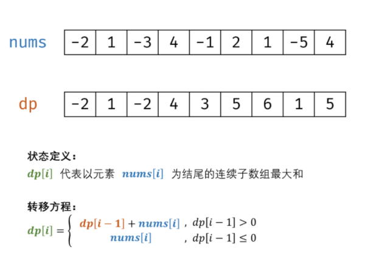

# 动态规划——线性动态规划

> 主要用来熟练动态规划的步骤
> * 斐波那契数列
> * 青蛙跳台阶
> * 最大子段和

## 1 斐波那契数列

### 问题描述

* 写一个函数，输入 n ，求斐波那契（Fibonacci）数列的第 n 项（即 F(N)）。斐波那契数列的定义如下：
```
F(0) = 0,   F(1) = 1
F(N) = F(N - 1) + F(N - 2), 其中 N > 1.
```
* 斐波那契数列由 0 和 1 开始，之后的斐波那契数就是由之前的两数相加而得出。答案需要取模 1e9+7（1000000007），如计算初始结果为：1000000008，请返回 1。
* [链接](https://leetcode-cn.com/problems/fei-bo-na-qi-shu-lie-lcof)

### 问题分析


### 问题分类

* 数组
* 动态规划+迭代

### 选择策略
* 数组
* 动态规划
  * 原理： 以斐波那契数列性质 f(n + 1) = f(n) + f(n - 1)f(n+1)=f(n)+f(n−1) 为转移方程。

### 算法设计

* 状态定义： 设$dp$为一维数组，其中 $dp[i]$ 的值代表 斐波那契数列第 $i$个数字 。
* 转移方程： $dp[i + 1] = dp[i] + dp[i - 1]$，即对应数列定义 $f(n + 1) = f(n) + f(n - 1)$；
* 初始状态： $dp[0] = 0 dp[1] = 1$，即初始化前两个数字；
* 返回值：$dp[n]$ ，即斐波那契数列的第 n 个数字。


### 算法分析
* 时间复杂度O(n)
* 空间复杂度O(n)


### 算法实现

```
    int fib(int n) {
        // 递归法，时间复杂度太高。
        if(n==0){
            return 0;
        }
        if(n==1){
            return 1;
        }
        // return fib(n-1)+fib(n-2);
        long long a[n+1];
        a[0]=0;
        a[1]=1;
        for(int i=2;i<n+1;i++){
            a[i]=(a[i-1]+a[i-2])%(1000000007);
        }
        return a[n];
    }
```


## 2 爬楼梯

### 问题描述

假设你正在爬楼梯。需要 n 阶你才能到达楼顶。每次你可以爬 1 或 2 个台阶。你有多少种不同的方法可以爬到楼顶呢？注意：给定 n 是一个正整数。

示例 1：
```
输入：2
输出：2
解释： 有两种方法可以爬到楼顶。
1. 1 阶 + 1 阶
2. 2 阶
```
### 问题分析

### 策略选择

### 算法设计

1. 问题分解划分阶段：规模增长的方向n。线性规模增长。阶段n=1,2,...,n各个阶段。
2. 确定状态变量：xk，表示k阶段公有xk中爬楼梯的方法
3. 确定状态转移方程：分为两种情况讨论，如果最后是1步，则x_k =x_k-1。如果最后一步是两步。则x_k=x_k-2。

$$
x_k = x_{k-1}+x_{k-2}
$$
4. 确定边界。x_0=0表示开始的情况。x_k表示当前的结果。x_n表示终止的情况。

### 算法实现
```java
public int climbStairs(int n) {
    if (n == 1) {
        return 1;
    }

    int[] dp = new int[n + 1];  // 多开一位，考虑起始位置

    dp[0] = 0; dp[1] = 1; dp[2] = 2;
    for (int i = 3; i <= n; ++i) {
        dp[i] = dp[i - 1] + dp[i - 2];
    }

    return dp[n];
}
```

## 3 连续子数组最大和

### 问题描述

* 输入一个整型数组，数组中的一个或连续多个整数组成一个子数组。求所有子数组的和的最大值。要求时间复杂度为O(n)。

### 算法设计

* **状态定义**： 设动态规划列表 dpdp ，dp[i]dp[i] 代表以元素 nums[i]nums[i] 为结尾的连续子数组最大和。
  * 为何定义最大和 dp[i]dp[i] 中必须包含元素 nums[i]nums[i] ：保证 dp[i]dp[i] 递推到 dp[i+1]dp[i+1] 的正确性；如果不包含 nums[i]nums[i] ，递推时则不满足题目的 连续子数组 要求。
* **转移方程**： 若 dp[i-1] \leq 0dp[i−1]≤0 ，说明 dp[i - 1]dp[i−1] 对 dp[i]dp[i] 产生负贡献，即 dp[i-1] + nums[i]dp[i−1]+nums[i] 还不如 nums[i]nums[i] 本身大。   
  * 当 dp[i - 1] > 0dp[i−1]>0 时：执行 dp[i] = dp[i-1] + nums[i]dp[i]=dp[i−1]+nums[i] 
  * 当 dp[i - 1] \leq 0dp[i−1]≤0 时：执行 dp[i] = nums[i]dp[i]=nums[i] ；
* **初始状态**： dp[0] = nums[0]dp[0]=nums[0]，即以 nums[0]nums[0] 结尾的连续子数组最大和为 nums[0]nums[0] 。
* **返回值**： 返回 dpdp 列表中的最大值，代表全局最大值。



### 算法分析

* 时间复杂度 O(N)O(N) ： 线性遍历数组 numsnums 即可获得结果，使用 O(N)O(N) 时间。
* 空间复杂度 O(1)O(1) ： 使用常数大小的额外空间。

### 算法实现

```C++
    int maxSubArray(vector<int>& nums) {
        //动态规划有很多不同的方向。例如，这里把动态变化定位不断增加的连续数组的长度。
        // 当连续数组的长度为1,2,3,4,5时，会利用之前计算的结果。求解。但是这很暴力。
        // 相当于求出了当前的所有最长子数组的解。把问题的规模缩小。
        // nums的长度。动态变化。

        // 失败的动态规划，实际上是暴力求解。
        // vector<vector<int>> vec;
        // int max=-999999;
        // vec.push_back(vector<int>());
        // for(int i=0;i<nums.size();i++){
        //     vec[0].push_back(nums[i]);
        //     if(nums[i]>max){
        //         max=nums[i];
        //     }
        // }
        // for(int i=1;i<nums.size();i++){
        //     vec.push_back(vector<int>());
        //     for(int j=0;j<nums.size()-i;j++){
        //         vec[i].push_back(vec[i-1][j]+vec[0][j+i]);
        //         if(vec[i][j]>max){
        //             max=vec[i][j];
        //         }
        //     }
        // }

        // 正常的动态规划
        int max=nums[0];
        vector<int> vec;
        vec.push_back(nums[0]);
        for(int i=1;i<nums.size();i++){
            int temp =nums[i]+vec[i-1];
            if(temp > nums[i]){
                vec.push_back(temp);
            }
            else{
                vec.push_back(nums[i]);
            }
            if(vec[i]>max){
                max=vec[i];
            }
        }
        return max;
    }
```