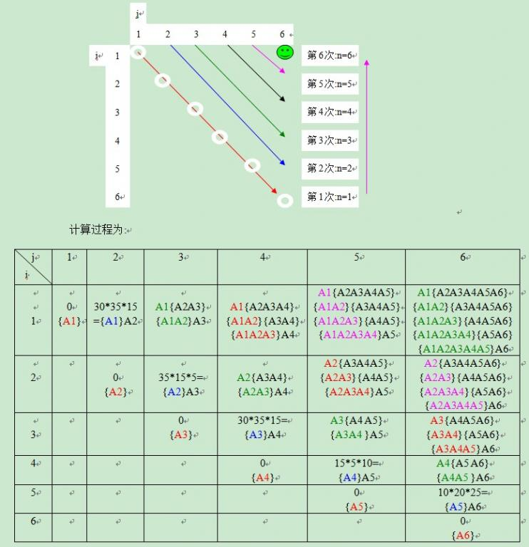

## 矩阵连乘问题


### 问题描述
给定n个矩阵｛A1,A2,…,An｝，其中Ai与Ai+1是可乘的，i=1，2…，n-1。如何确定计算矩阵连乘积的计算次序，使得依此次序计算矩阵连乘积需要的数乘次数最少。例如，给定三个连乘矩阵{A1，A2，A3}的维数分别是`10*100，100*5`和`5*50`，采用（A1A2）A3，乘法次数为`10*100*5+10*5*50=7500`次，而采用A1（A2A3），乘法次数为`100*5*50+10*100*50=75000`次乘法，显然，最好的次序是（A1A2)A3，乘法次数为7500次。

### 问题分析
矩阵链乘法问题描述：给定由n个矩阵构成的序列｛A1，A2，...，An}，对乘积A1A2...An，找到最小化乘法次数的加括号方法。


### 策略选择

* 算法思想：动态规划

### 算法设计

* 问题分解划分阶段：相邻连乘的个数。相邻连乘的个数为1，的时候0次乘法。两个相邻连乘的次数固定。三个相邻连乘的时候分两次讨论。规模增长的方向主要由两个一个是k表示矩阵连乘的个数，第二个是i表示矩阵的个数。
* 确定状态变量：dp[k][i]。表示连乘为k的时候，第i个矩阵开始的最优的乘积方式。
* 确定状态转移方程，每一个分，k-1总情况讨论。
$$
dp[k][i]=min\{dp[1][i]+dp[k-1][i+1]+time[i+1],dp[2][i]+dp[k-2][i+2]+time[i+2],...\}
$$
* 确定边界实现过程：从1开始。矩阵连成为1的时候。乘法次数都为0.


### 算法分析
* 时间复杂度O(n^3)

### 算法实现

```
```