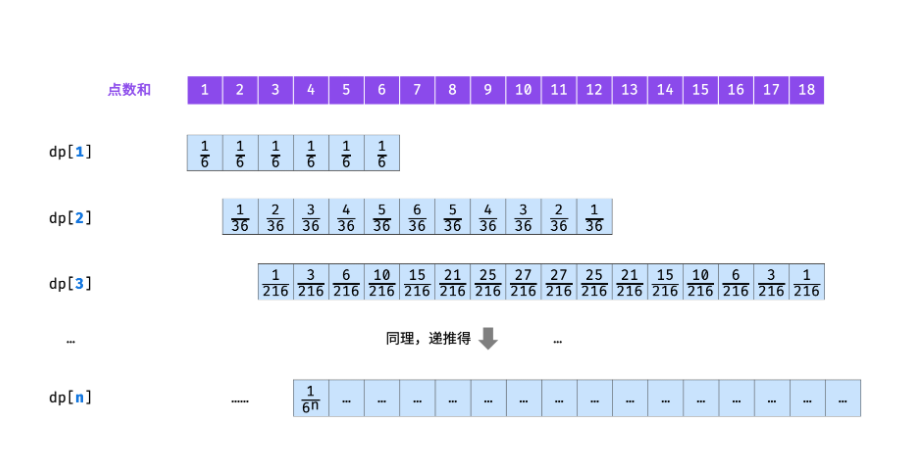

# n个骰子的点数

> 生成幂集的循环方法。完全一致，也是动态规划问题。

## 1 n个骰子的点数

### 问题描述

* 把n个骰子扔在地上，所有骰子朝上一面的点数之和为s。输入n，打印出s的所有可能的值出现的概率。你需要用一个浮点数数组返回答案，其中第 i 个元素代表这 n 个骰子所能掷出的点数集合中第 i 小的那个的概率。

* 示例 1:
```
输入: 1
输出: [0.16667,0.16667,0.16667,0.16667,0.16667,0.16667]
示例 2:

输入: 2
输出: [0.02778,0.05556,0.08333,0.11111,0.13889,0.16667,0.13889,0.11111,0.08333,0.05556,0.02778]
```

### 问题分析


### 策略选择


### 算法设计

* 使用动态规划解决问题一般分为三步：
  1. 确定状态变量
  2. 确定状态转移方程
  3. 边界处理


* 表示状态
  * 分析问题的状态时，不要分析整体，只分析最后一个阶段即可！因为动态规划问题都是划分为多个阶段的，各个阶段的状态表示都是一样，而我们的最终答案在就是在最后一个阶段。
  * 通过题目我们知道一共投掷 n 枚骰子，那最后一个阶段很显然就是：当投掷完 n 枚骰子后，各个点数出现的次数。
* 注意，这里的点数指的是前 n 枚骰子的点数和，而不是第 n 枚骰子的点数，下文同理。找出了最后一个阶段，那状态表示就简单了。
  * 首先用数组的第一维来表示阶段，也就是投掷完了几枚骰子。
  * 然后用第二维来表示投掷完这些骰子后，可能出现的点数。
  * 数组的值就表示，该阶段各个点数出现的次数。
  * 所以状态表示就是这样的：dp[i][j]dp[i][j] ，表示投掷完 ii 枚骰子后，点数 jj 的出现次数。
* 找出状态转移方程
  * 找状态转移方程也就是找各个阶段之间的转化关系，同样我们还是只需分析最后一个阶段，分析它的状态是如何得到的。
  * 最后一个阶段也就是投掷完 n 枚骰子后的这个阶段，我们用 dp[n][j]来表示最后一个阶段点数 j出现的次数。
  * 单单看第 n 枚骰子，它的点数可能为 1 , 2, 3, ... , 6因此投掷完 n 枚骰子后点数 j 出现的次数，可以由投掷完n−1 枚骰子后，对应点数 j-1, j-2, j-3, ... , j-6出现的次数之和转化过来。

```
for (第n枚骰子的点数 i = 1; i <= 6; i ++) {
    dp[n][j] += dp[n-1][j - i]
}
```
  * 写成数学公式是这样的：
$$
dp[n][j] = \sum_{i=1}^6 dp[n-1][j-i]
$$
  * n 表示阶段，jj 表示投掷完 nn 枚骰子后的点数和，ii 表示第 nn 枚骰子会出现的六个点数。

* 边界处理
  * 这里的边界处理很简单，只要我们把可以直接知道的状态初始化就好了。
  * 我们可以直接知道的状态是啥，就是第一阶段的状态：投掷完 11 枚骰子后，它的可能点数分别为 1, 2, 3, ... , 61,2,3,...,6 ，并且每个点数出现的次数都是 11 .

```
for (int i = 1; i <= 6; i ++) {
    dp[1][i] = 1;
}
```



### 算法分析
* 时间复杂度 $O(n ^ 2)$
* 空间复杂度 $O(n)$
### 算法实现

```C++
class Solution {
public:
    vector<double> twoSum(int n) {
        int dp[15][70];
        memset(dp, 0, sizeof(dp));
        for (int i = 1; i <= 6; i ++) {
            dp[1][i] = 1;
        }
        for (int i = 2; i <= n; i ++) {
            for (int j = i; j <= 6*i; j ++) {
                for (int cur = 1; cur <= 6; cur ++) {
                    if (j - cur <= 0) {
                        break;
                    }
                    dp[i][j] += dp[i-1][j-cur];
                }
            }
        }
        int all = pow(6, n);
        vector<double> ret;
        for (int i = n; i <= 6 * n; i ++) {
            ret.push_back(dp[n][i] * 1.0 / all);
        }
        return ret;
    }
}; 
```