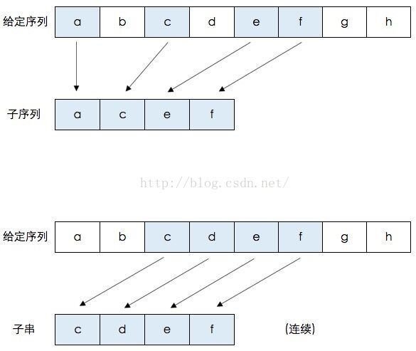
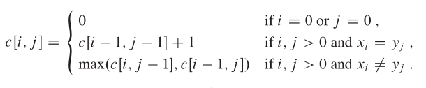
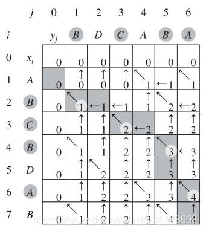

## 最长公共子序列


### 问题描述

求数组A和B的最长公共子序列

### 问题分析

1. 子序列(subsequence)： 一个特定序列的子序列就是将给定序列中零个或多个元素去掉后得到的结果(不改变元素间相对次序)。例如序列<A,B,C,B,D,A,B>的子序列有：<A,B>、<B,C,A>、<A,B,C,D,A>等。
2. 公共子序列(common subsequence)： 给定序列X和Y，序列Z是X的子序列，也是Y的子序列，则Z是X和Y的公共子序列。例如X=[A,B,C,B,D,A,B]，Y=[B,D,C,A,B,A[，那么序列Z=[B,C,A]为X和Y的公共子序列，其长度为3。但Z不是X和Y的最长公共子序列，而序列[B,C,B,A]和[B,D,A,B]也均为X和Y的最长公共子序列，长度为4，而X和Y不存在长度大于等于5的公共子序列。对于序列[A,B,C]和序列[E,F,G]的公共子序列只有空序列[]。
3. 最长公共子序列：给定序列X和Y，从它们的所有公共子序列中选出长度最长的那一个或几个。
4. 子串： 将一个序列从最前或最后或同时删掉零个或几个字符构成的新系列。区别与子序列，子序列是可以从中间抠掉字符的。cnblogs这个字符串中子序列有多少个呢？很显然有27个，比如其中的cb,cgs等等都是其子序列



### 策略选择

* 数据结构：线性数组

* 算法思想：动态规划

### 算法设计

设X=x1,x2,x3,x4...,xm，Y=y1,y2,y3,y4...,yn为两个序列，Z=z1,z2,z3,z4...,zk是他们的任意公共子序列.所以如果用一个二维数组C表示字符串X和Y中对应的前i，前j个字符的LCS的长度话。
* 确定**状态转移变量**Zk-1。它表示X的子串Xn-1和Y的子串Ym-1的最长公共子序列。
* 确定状态转移方程：
  1. 如果xm = yn，则zk = xm = yn 且 Zk-1是Xm-1和Yn-1的一个LCS
  2. 如果xm != yn 且 zk != xm，则Z是Xm-1和Y的一个LCS
  3. 如果xm != yn 且 zk != yn，则Z是X和Yn-1的一个LCS


* 状态转移过程 



### 算法分析

* 时间复杂度为O（m*n）


### 算法实现

```C++
#include <iostream>
#include <string>
#include <stack>
using namespace std;
void LCS(string s1,string s2)
{
    int m=s1.length()+1;
    int n=s2.length()+1;
    int **c;
    int **b;
    c=new int* [m];
    b=new int* [m];
    for(int i=0;i<m;i++)
    {
        c[i]=new int [n];
        b[i]=new int [n];
        for(int j=0;j<n;j++)
            b[i][j]=0;
    }
    for(int i=0;i<m;i++)
        c[i][0]=0;
    for(int i=0;i<n;i++)
        c[0][i]=0;
    for(int i=0;i<m-1;i++)
    {
        for(int j=0;j<n-1;j++)
        {
            if(s1[i]==s2[j])
            {
                c[i+1][j+1]=c[i][j]+1;
                b[i+1][j+1]=1;          //1表示箭头为  左上
            }
            else if(c[i][j+1]>=c[i+1][j])
            {
                c[i+1][j+1]=c[i][j+1];
                b[i+1][j+1]=2;          //2表示箭头向  上
            }
            else
            {
                c[i+1][j+1]=c[i+1][j];
                b[i+1][j+1]=3;          //3表示箭头向  左
            }
        }
    }
    for(int i=0;i<m;i++)                //输出c数组
    {
        for(int j=0;j<n;j++)
        {
            cout<<c[i][j]<<' ';
        }
        cout<<endl;
    }
    stack<char> same;                   //存LCS字符
    stack<int> same1,same2;             //存LCS字符在字符串1和字符串2中对应的下标，方便显示出来
    for(int i = m-1,j = n-1;i >= 0 && j >= 0; )
    {
        if(b[i][j] == 1)
        {
            i--;
            j--;
            same.push(s1[i]);
            same1.push(i);
            same2.push(j);
        }
        else if(b[i][j] == 2)
                i--;
             else
                j--;
    }
    cout<<s1<<endl;                     //输出字符串1
    for(int i=0;i<m && !same1.empty();i++)      //输出字符串1的标记
    {
        if(i==same1.top())
        {
            cout<<1;
            same1.pop();
        }
        else
            cout<<' ';
    }
    cout<<endl<<s2<<endl;                //输出字符串2
    for(int i=0;i<n && !same2.empty();i++)      //输出字符串2的标记
    {
        if(i==same2.top())
        {
            cout<<1;
            same2.pop();
        }
        else
            cout<<' ';
    }
    cout<<endl<<"最长公共子序列为：";
    while(!same.empty())
    {
        cout<<same.top();
        same.pop();
    }
    cout<<endl<<"长度为："<<c[m-1][n-1]<<endl;
    for (int i = 0; i<m; i++)
    {
        delete [] c[i];
        delete [] b[i];
    }
    delete []c;
    delete []b;
}
int main()
{
    string s1="ABCPDSFJGODIHJOFDIUSHGD";
    string s2="OSDIHGKODGHBLKSJBHKAGHI";
    LCS(s1,s2);
    return 0;
}
```