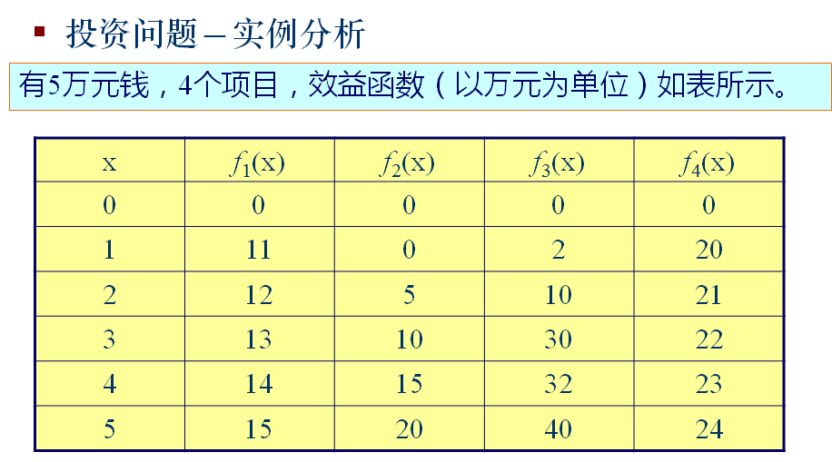
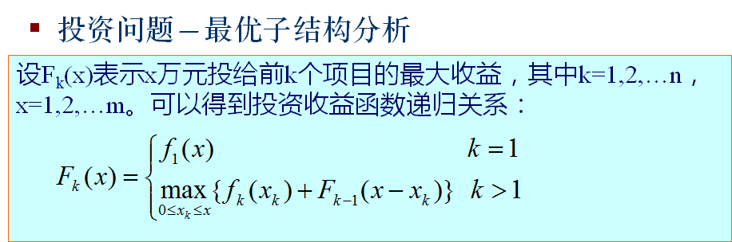
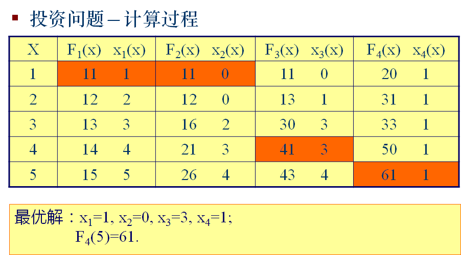

## 投资问题

### 问题描述

m元钱，n个项目。f_i(x)表示x元钱投入项目i的效益。求最大效益。

### 问题分析

### 算法设计

* 问题分解划分阶段：规模增长的方向有两个。第一个是投资的金额想，第二个是项目选择k。x,k阶段。
* 确定状态变量dp[x][k]表示投资x，第k个项目的最大收益。
* 确定状态转移方程。

* 状态转移过程。

### 算法效率

* O(n*m^2)

### 算法实现