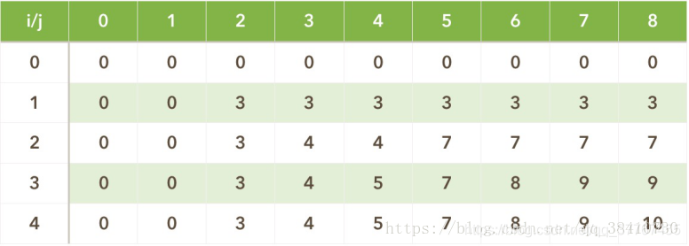
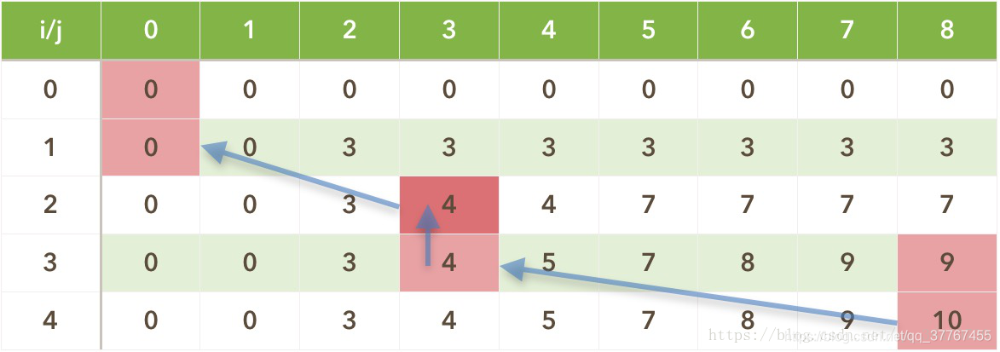

# 背包问题
## 1 01 背包问题

### 问题描述
有N个物品，它们有各自的体积和价值，现有给定容量的背包c，如何让背包里装入的物品具有最大的价值总和？

N=4
i 1,2,3,4
w 2,3,4,5
v 3,4,5,6
c=8

### 问题分析

### 策略选择


### 算法设计
有两种动态规划的思路，本质上是一致的。背包的容量增长作为第一维，或者物品的数量增长作为第一维。

* 当背包的容量作为第一维的时候。背包容量为行，物品增长为列。
  * 问题分解划分阶段。背包容量容量为i,物品选择为j
  * 确定状态dp[i][j]表示背包容量为i的情况下，第j个物品放入或者不放入的最大价值。
  * 确定状态转移方程。分两种情况讨论。当背包容量为i时，第j个物品放入和第j个物品不放入。

$$
dp[i][j]=max(dp[i][j-1],dp[i-w[i]][j-1])
$$


* 当物品的增长作为第一维的时候。物品增长为行，背包容量为列

  * 问题分解划分阶段：2个规模增长方向。背包的容量和物品。物品选择i。背包的容量表示为j。第一个阶段表示是否添加物品。第二个阶段是背包容量的增长。
  * 确定状态dp[i][j]表示第i个物品，在背包容量j的情况下的最大价值。
  * 确定状态转移方程

$$
dp[i][j]=max(dp[i-1][j],v[i]+dp[i-1][j-w[i]])
$$

> 两种计算方式完全一致。

### 算法分析

### 算法实现
```C++
#include<iostream>
using namespace std;
#include <algorithm>
 
int main()
{
	int w[5] = { 0 , 2 , 3 , 4 , 5 };			//商品的体积2、3、4、5
	int v[5] = { 0 , 3 , 4 , 5 , 6 };			//商品的价值3、4、5、6
	int bagV = 8;					        //背包大小
	int dp[5][9] = { { 0 } };			        //动态规划表
 
	for (int i = 1; i <= 4; i++) {
		for (int j = 1; j <= bagV; j++) {
			if (j < w[i])
				dp[i][j] = dp[i - 1][j];
			else
				dp[i][j] = max(dp[i - 1][j], dp[i - 1][j - w[i]] + v[i]);
		}
	}
 
	//动态规划表的输出
	for (int i = 0; i < 5; i++) {
		for (int j = 0; j < 9; j++) {
			cout << dp[i][j] << ' ';
		}
		cout << endl;
	}
 
	return 0;
}
```

最优的背包价值路径回溯方法

```C++
#include<iostream>
using namespace std;
#include <algorithm>
 
int w[5] = { 0 , 2 , 3 , 4 , 5 };			//商品的体积2、3、4、5
int v[5] = { 0 , 3 , 4 , 5 , 6 };			//商品的价值3、4、5、6
int bagV = 8;					        //背包大小
int dp[5][9] = { { 0 } };			        //动态规划表
int item[5];					        //最优解情况
 
void findMax() {					//动态规划
	for (int i = 1; i <= 4; i++) {
		for (int j = 1; j <= bagV; j++) {
			if (j < w[i])
				dp[i][j] = dp[i - 1][j];
			else
				dp[i][j] = max(dp[i - 1][j], dp[i - 1][j - w[i]] + v[i]);
		}
	}
}
 
void findWhat(int i, int j) {				//最优解情况
	if (i >= 0) {
		if (dp[i][j] == dp[i - 1][j]) {
			item[i] = 0;
			findWhat(i - 1, j);
		}
		else if (j - w[i] >= 0 && dp[i][j] == dp[i - 1][j - w[i]] + v[i]) {
			item[i] = 1;
			findWhat(i - 1, j - w[i]);
		}
	}
}
 
void print() {
	for (int i = 0; i < 5; i++) {			//动态规划表输出
		for (int j = 0; j < 9; j++) {
			cout << dp[i][j] << ' ';
		}
		cout << endl;
	}
	cout << endl;
 
	for (int i = 0; i < 5; i++)			//最优解输出
		cout << item[i] << ' ';
	cout << endl;
}
 
int main()
{
	findMax();
	findWhat(4, 8);
	print();
 
	return 0;
}
```

## 2 完全背包问题

### 问题描述

完全背包（unbounded knapsack problem）与01背包不同就是每种物品可以有无限多个：一共有N种物品，每种物品有无限多个，第i（i从1开始）种物品的重量为w[i]，价值为v[i]。在总重量不超过背包承载上限W的情况下，能够装入背包的最大价值是多少？

### 问题分析


### 策略选择


### 算法设计

* 问题分解划分阶段：2个规模增长方向。背包的容量和物品。背包的个数增长i=1,2,3,n。背包容量为j。第一个阶段表示是否添加物品。第二个阶段是背包容量的增长。
* 确定状态dp[i,j]
* 确定状态转移方程

$$
dp[i][j] = max{(dp[i-1][j − k*w[i]] + k*v[i]) for every k}
$$
* 确定边界
### 算法分析


### 算法实现


## 3 多重背包


### 问题描述
多重背包（bounded knapsack problem）与前面不同就是每种物品是有限个：一共有N种物品，第i（i从1开始）种物品的数量为n[i]，重量为w[i]，价值为v[i]。在总重量不超过背包承载上限W的情况下，能够装入背包的最大价值是多少？
### 算法设计
```
dp[i][j] = max{(dp[i-1][j − k*w[i]] + k*v[i]) for every k}
```