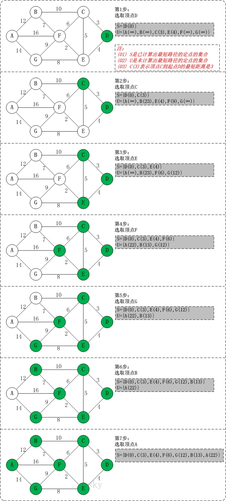

# 图算法-Dijkstra算法

> 目录
>* 图算法-Dijkstra算法
>* 图算法-Floyd算法
>* 图算法-Bellman-Ford算法
>* 图算法-Prim算法
>* 图算法-Kruskal算法


>参考文献
> * [https://www.cnblogs.com/msymm/p/9769915.html](https://www.cnblogs.com/msymm/p/9769915.html)
> * [https://blog.csdn.net/jeffleo/article/details/53349825](https://blog.csdn.net/jeffleo/article/details/53349825)


## 1 问题分析
* 最短路径算法。用于**单源最短路算法**

* Dijkstra算法算是**贪心思想**实现的，首先把起点到所有点的距离存下来找个最短的，然后松弛一次再找出最短的，所谓的松弛操作就是，遍历一遍看通过刚刚找到的距离最短的点作为中转站会不会更近，如果更近了就更新距离，这样把所有的点找遍之后就存下了起点到其他所有点的最短距离。

## 2 算法原理
* 通过Dijkstra计算图G中的最短路径时，需要指定起点s(即从顶点s开始计算)。 

* 此外，引进两个集合S和U。S的作用是记录已求出最短路径的顶点(以及相应的最短路径长度)，而U则是记录还未求出最短路径的顶点(以及该顶点到起点s的距离)。 

* 初始时，S中只有起点s；U中是除s之外的顶点，并且U中顶点的路径是"起点s到该顶点的路径"。
* 然后，从U中找出路径最短的顶点，并将其加入到S中；
* 接着，更新U中的顶点和顶点对应的路径。 
* 然后，再从U中找出路径最短的顶点，并将其加入到S中；接着，更新U中的顶点和顶点对应的路径。 ... 重复该操作，直到遍历完所有顶点。

## 3 算法步骤

### 基本步骤
1. 初始时，S只包含起点s；U包含除s外的其他顶点，且U中顶点的距离为"起点s到该顶点的距离"[例如，U中顶点v的距离为(s,v)的长度，然后s和v不相邻，则v的距离为∞]。 

2. 从U中选出"距离最短的顶点k"，并将顶点k加入到S中；同时，从U中移除顶点k。 

3. 更新U中各个顶点到起点s的距离。之所以更新U中顶点的距离，是由于上一步中确定了k是求出最短路径的顶点，从而可以利用k来更新其它顶点的距离；例如，(s,v)的距离可能大于(s,k)+(k,v)的距离。 

4. 重复步骤(2)和(3)，直到遍历完所有顶点。 

### 图解过程


### 详细说明

初始状态：S是已计算出最短路径的顶点集合，U是未计算除最短路径的顶点的集合！ 

* 第1步：将顶点D加入到S中。 
    此时，S={D(0)}, U={A(∞),B(∞),C(3),E(4),F(∞),G(∞)}。     注:C(3)表示C到起点D的距离是3。 

* 第2步：将顶点C加入到S中。 
    上一步操作之后，U中顶点C到起点D的距离最短；因此，将C加入到S中，同时更新U中顶点的距离。以顶点F为例，之前F到D的距离为∞；但是将C加入到S之后，F到D的距离为9=(F,C)+(C,D)。 
    此时，S={D(0),C(3)}, U={A(∞),B(23),E(4),F(9),G(∞)}。 

* 第3步：将顶点E加入到S中。 
    上一步操作之后，U中顶点E到起点D的距离最短；因此，将E加入到S中，同时更新U中顶点的距离。还是以顶点F为例，之前F到D的距离为9；但是将E加入到S之后，F到D的距离为6=(F,E)+(E,D)。 
    此时，S={D(0),C(3),E(4)}, U={A(∞),B(23),F(6),G(12)}。 

* 第4步：将顶点F加入到S中。 
    此时，S={D(0),C(3),E(4),F(6)}, U={A(22),B(13),G(12)}。

* 第5步：将顶点G加入到S中。 
    此时，S={D(0),C(3),E(4),F(6),G(12)}, U={A(22),B(13)}。

* 第6步：将顶点B加入到S中。 
    此时，S={D(0),C(3),E(4),F(6),G(12),B(13)}, U={A(22)}。

* 第7步：将顶点A加入到S中。 
    此时，S={D(0),C(3),E(4),F(6),G(12),B(13),A(22)}。

此时，起点D到各个顶点的最短距离就计算出来了：A(22) B(13) C(3) D(0) E(4) F(6) G(12)。

## 4 算法效率

时间复杂度$O(n^2)$
## 5 算法实现

```C++
#include<iostream>
#include<vector>
using namespace std;

class Graph{
private:
    int vertex_num;   //图的顶点个数
    int edge;
    // 如果顶点的表示是离散的应该加一层映射
    vector<vector<int>> arc; //邻接矩阵
public:
    // 测试用的默认构造函数
    Graph();
    //构造函数,从命令行输入
    Graph(int vertex_num_,int edge_);
    //打印所有的边
    void print_edge();
    // 打印整个邻接矩阵
    void print_arc();
    //求最短路径
    void Dijkstra(int begin);//单源最短路
    void Floyd();//多源最短路
    void Prim();//最小生成树
    void Kruskal();//最小生成树
};

Graph::Graph(){
    this->vertex_num = 7;
    this->edge=12;
    this->arc = vector<vector<int>>(vertex_num,vector<int>(vertex_num,INT_MAX));
    // cout<<vertex_num<<endl;
    // 初始化一个邻接矩阵.dijskra算法的图。
    arc[0][1]=12;
    arc[1][0]=12;
    arc[0][6]=14;
    arc[6][0]=14;
    arc[0][5]=16;
    arc[5][0]=16;
    arc[1][2]=10;
    arc[2][1]=10;
    arc[1][5]=7;
    arc[5][1]=7;
    arc[2][3]=3;
    arc[3][2]=3;
    arc[2][4]=5;
    arc[4][2]=5;
    arc[2][5]=6;
    arc[5][2]=6;
    arc[3][4]=4;
    arc[4][3]=4;
    arc[4][5]=2;
    arc[5][4]=2;
    arc[4][6]=8;
    arc[6][4]=8;
    arc[5][6]=9;
    arc[6][5]=9;
    // 对角线自己到自己是0
    for(int i=0;i<vertex_num;i++){
        arc[i][i]=0;
    }
}

// 从命令行输入一个邻接矩阵
Graph::Graph(int vertex_num_,int edge_){
    this->vertex_num=vertex_num_;
    this->edge=edge_;
    this->arc=vector<vector<int>>(vertex_num,vector<int>(vertex_num,INT_MAX));
    int beg=0,end=0,weight=0;
    for(int i=0;i<edge_;i++){
        cin>>beg>>end>>weight;
        arc[beg][end]=weight;
        // 如果是无向图则需要添加反向的路径
        arc[end][beg]=weight;
    }
}

void Graph::print_edge(){
    for(int i=0;i<vertex_num;i++){
        for(int j=0;j<vertex_num;j++){
            if(arc[i][j]<INT_MAX)
            cout<<"begin:"<<i<<"\tend:"<<j<<"\tweight:"<<arc[i][j]<<endl;
        }
    }
}


void Graph::print_arc(){
    for(int i=0;i<vertex_num;i++){
        for(int j=0;j<vertex_num;j++){
            cout<<arc[i][j]<<"\t";
        }
        cout<<endl;
    }
}
void Graph::Dijkstra(int begin){
    // 初始化结果集,到自己是0
    vector<int> result(vertex_num,INT_MAX);
    result[begin]=0;
    // 初始化距离集合，每次从中挑选
    vector<int> distance(vertex_num,INT_MAX);
    for(int i=0;i<vertex_num;i++){
        distance[i]=arc[begin][i];
    }
    for(int k=0;k<vertex_num-1;k++){
        // 从中挑选非零的最小值，使用0表示已经挑选到结果集合中。
        int min_distance=INT_MAX;
        int min_index=0;
        for(int i=0;i<vertex_num;i++){
            if(distance[i]!=0 && distance[i]<min_distance){
                min_distance=distance[i];
                min_index=i;
            }
        }
        // 添加到结果集合中，并更新删除distance集合。
        cout<<min_index<<endl;
        result[min_index]=min_distance;
        distance[min_index]=0;

        // 使用min_index更新距离集合
        for(int i=0;i<vertex_num;i++){
            if(distance[i]!=0 && arc[min_index][i]<INT_MAX){
                distance[i]=min(distance[i],min_distance+arc[min_index][i]);
            }
        }
    }

    for(int i=0;i<vertex_num;i++){
        cout<<"end:"<<i<<"\tweight:"<<result[i]<<endl;
    }

}
```