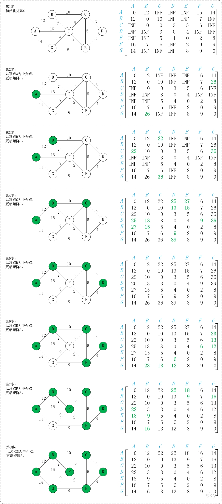

# 图算法-Floyd算法

> 目录
>* 图算法-Dijkstra算法
>* 图算法-Floyd算法
>* 图算法-Bellman-Ford算法
>* 图算法-Prim算法
>* 图算法-Kruskal算法

> 参考文献
> * [https://www.jianshu.com/p/f73c7a6f5a53](https://www.jianshu.com/p/f73c7a6f5a53)
> * [https://blog.csdn.net/jeffleo/article/details/53349825](https://blog.csdn.net/jeffleo/article/details/53349825)
## 1 问题分析

* Floyd算法是一个经典的**动态规划算法**，它又被称为插点法。该算法名称以创始人之一、1978年图灵奖获得者、斯坦福大学计算机科学系教授罗伯特·弗洛伊德命名。Floyd算法是一种利用动态规划的思想寻找给定的加权图中多源点之间最短路径的算法,算法目标是寻找从点i到点j的最短路径。

## 2 算法原理

* Floyd算法的基本思想：可以将问题分解:
  * 第一、先找出最短的距离
  * 第二、然后在考虑如何找出对应的行进路线。

> 以后再整理一下文字内容

## 3 算法过程


> 顶点名称和下标的对应
> * A B C D E F G
> * 0 1 2 3 4 5 6

1. 弗洛伊德算法定义了两个二维矩阵
   * 矩阵D记录顶点间的最小路径。例如D[0][3]= 10，说明顶点0 到 3 的最短路径为10；
   * 矩阵P记录顶点间最小路径中的中转点
   * 例如P[0][3]= 1 说明，0 到 3的最短路径轨迹为：0 -> 1 -> 3。

2. 它通过3重循环，k为中转点，v为起点，w为终点，循环比较D[v][w] 和 D[v][k] + D[k][w] 最小值，如果D[v][k] + D[k][w] 为更小值，则把D[v][k] + D[k][w] 覆盖保存在D[v][w]中。

3. 以A为中间点，原D矩阵中，D[B][G]的值为INF，即不存在B->G的最小路径，但是通过A为中间点，D[B][A] + D[A][G] = 12 + 14 = 26 小于 D[B][G] = INF， 所以D[B][A] + D[A][G] 为 B -> G的最小值，因此覆盖D[B][G] 为 26。

4. 以B为中间点，第2步后的D矩阵中，D[A][C]的值为INF， 但是通过B，D[A][B] + D[B][C] = 12 + 10 = 22 小于 D[A][C] = INF，所以D[A][B] + D[B][C] 为 A->C的最小路径，覆盖D[A][C]的值为22， 以此类推。

## 4 算法效率

时间复杂度为$O(n^3)$

## 5 算法实现

```
//这里是弗洛伊德算法的核心部分 
    //k为中间点 
    for(k = 0; k < G.vexnum; k++){
        //v为起点 
        for(v = 0 ; v < G.vexnum; v++){
            //w为终点 
            for(w =0; w < G.vexnum; w++){
                if(D[v][w] > (D[v][k] + D[k][w])){
                    D[v][w] = D[v][k] + D[k][w];//更新最小路径 
                    P[v][w] = P[v][k];//更新最小路径中间顶点 
                }
            }
        }
    }
```

```C++
#include<iostream>
#include<string.h>
using namespace std;

#define len 100
#define INF 999999

class Graph{
    // 内部类
    private:
        // 邻接表中表对应的链表的顶点
        class ENode{
            public:
                int vex;         // 顶点
                int weight;      // 权重 
                ENode *nextEdge; // 指向下一条弧
        };

        // 邻接表中表的顶点
        class VNode{
            public:
                char data; // 顶点信息
                ENode *firstEdge; // 指向第一条依付该顶点的弧
        };

    // 私有成员
    private:
        int n;              // 节点个数 
        int e;              // 边的个数
        VNode mVexs[len];
    
    public:
        Graph(){
            ENode *node1, *node2;
            n = 7; 
            e = 12;

            // 设置节点为默认数值
            string nodes = "ABCDEFG";
            // 输入节点
            for(int i=0; i < n; i++){
                mVexs[i].data = nodes[i];
                mVexs[i].firstEdge = NULL;
            }

            // 设置边为默认值
            char edges[][2] = {
                {'A', 'B'}, 
                {'A', 'F'}, 
                {'A', 'G'}, 
                {'B', 'C'}, 
                {'B', 'F'}, 
                {'C', 'D'}, 
                {'C', 'E'},
                {'C', 'F'}, 
                {'D', 'E'},
                {'E', 'F'}, 
                {'E', 'G'},
                {'F', 'G'}
            };
            
            // 边的权重
            int weights[len] = {12, 16, 14, 10, 7, 3, 5, 6, 4, 2, 8, 9};
            
            //　初始化邻接表的边
            for(int i=0; i < e; i++){
                int start = get_Node_Index(edges[i][0]);
                int end = get_Node_Index(edges[i][1]);

                // 初始化 node1
                node1 = new ENode();
                node1->vex = end;
                node1->weight = weights[i];
                node1->nextEdge = NULL;
                // 将 node 添加到 start 所在链表的末尾
                if(mVexs[start].firstEdge == NULL){
                    mVexs[start].firstEdge = node1;
                }
                else{
                    linkLast(mVexs[start].firstEdge, node1);
                }

                // 初始化 node2
                node2 = new ENode();
                node2->vex = start;
                node2->weight = weights[i];
                node2->nextEdge = NULL;
                // 将 node 添加到 end 所在链表的末尾
                if(mVexs[end].firstEdge == NULL){
                    mVexs[end].firstEdge = node2;
                }
                else{
                    linkLast(mVexs[end].firstEdge, node2);
                }
            }
        }

        // 相邻节点链接子函数
        void linkLast(ENode*p1, ENode*p2){
            ENode*p = p1;
            while(p->nextEdge){
                p = p->nextEdge;
            }
            p->nextEdge = p2;
        }
        
        // 返回顶点下标
        int get_Node_Index(char number){
            for(int i=0; i < n; i++){
                if(number == mVexs[i].data){
                    return i;
                }
            }
            return -1; //这句话永远不会执行的
        }

        // 输出邻接表
        void print(){
            for(int i=0; i < n; i ++){
                cout<<mVexs[i].data;
                ENode *temp = mVexs[i].firstEdge;
                while(temp){
                    cout<<" -> "<<temp->vex;
                    temp = temp->nextEdge;
                }
                cout<<endl;
            }
            cout<<endl;
        }

        // 得到两个节点之间的权重
        int getWeight(int m, int n){
            ENode *enode = mVexs[m].firstEdge;
            while(enode){
                if(enode->vex == n){
                    return enode->weight;
                }
                enode = enode->nextEdge;
            }
            return INF;
        }

        // 弗洛伊德算法
        void floyd(){
            int dist[n][n]; // 距离矩阵
            int path[7][7]; // 路径矩阵, 7为节点数目
            int i, j, k;
            int temp;

            // 初始化权重
            for(i = 0; i < n; i++){
                for(j = 0; j < n; j++){
                    if(i == j){
                        dist[i][j] = 0;
                    }
                    else{
                        dist[i][j] = getWeight(i, j);
                    }
                    path[i][j] = i;
                }
            }
            
            // floyd 算法开始
            for(k = 0; k < n; k++){
                for(i = 0; i < n; i++){
                    for(j = 0; j < n; j++){
                        temp = (dist[i][k] == INF || dist[k][j] == INF)? INF : (dist[i][k] + dist[k][j]);
                        if(temp < dist[i][j]){
                            dist[i][j] = temp;
                            path[i][j] = path[k][j];
                        }
                    }
                }
            }

            // 打印出两点之间最短距离 + 路径
            for(i = 0; i < n-1; i++){
                for(j = i+1; j < n; j++){
                    if(dist[i][j] < 10){
                        cout<<mVexs[i].data<<" -> "<<mVexs[j].data<<": "<<dist[i][j]<<"  , 路径为: ";
                    }
                    else{
                        cout<<mVexs[i].data<<" -> "<<mVexs[j].data<<": "<<dist[i][j]<<" , 路径为: ";
                    }
                    getPath(i, j, path);
                    cout<<endl;
                }
                cout<<endl;
            }
            
            // 输出路径矩阵观察, 可用此矩阵自己用笔演算一下路径查找过程
            // for(i = 0; i < n; i++){
            //     for(j = 0; j < n; j++){
            //         cout<<path[i][j]<<" ";
            //     }
            //     cout<<endl;
            // }
        }

        // 递归实现得到节点之间最短路径
        void getPath(int start, int end, int path[][7]){
            if(path[start][end] == start){
                cout<<mVexs[start].data<<" "<<mVexs[end].data<<" ";
            }
            else{
                getPath(start, path[start][end], path);
                cout<<mVexs[end].data<<" ";
            }
        }
};

int main(){
    Graph g;
    // 输出邻接表
    // g.print();

    // 弗洛伊德算法
    g.floyd();
    return 0;
}
```