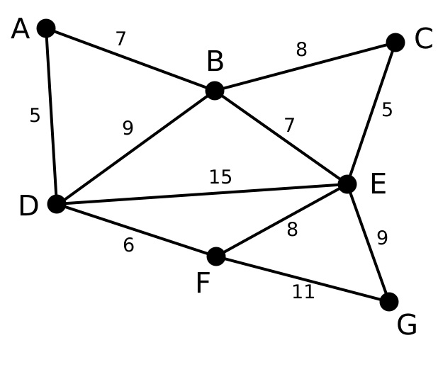
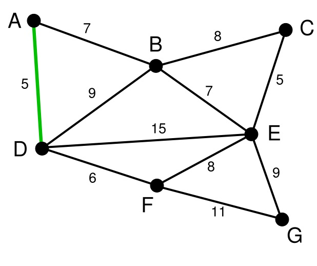
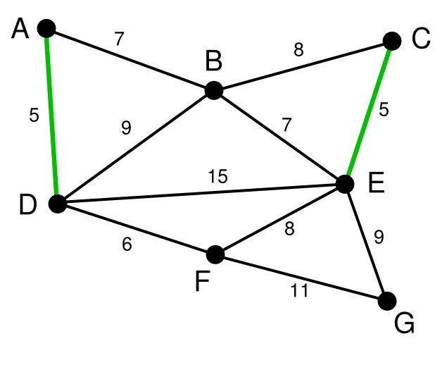
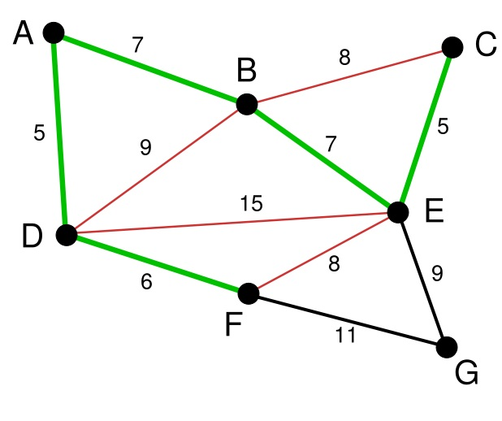
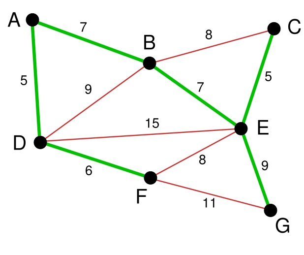

# 图算法-Dijkstra算法

> 目录
>* 图算法-Dijkstra算法
>* 图算法-Floyd算法
>* 图算法-Bellman-Ford算法
>* 图算法-Prim算法
>* 图算法-Kruskal算法

> 参考文献
> [https://www.cnblogs.com/ggzhangxiaochao/p/9070873.html](https://www.cnblogs.com/ggzhangxiaochao/p/9070873.html)
## 1 问题描述
* Kruskal算法是一种用来寻找**最小生成树的算法**，由Joseph Kruskal在1956年发表。
* 用来解决同样问题的还有Prim算法和Boruvka算法等。三种算法都是**贪婪算法**的应用。和Boruvka算法不同的地方是，Kruskal算法在图中存在相同权值的边时也有效。
  * 当点少，但是关系复杂的时候，使用prim算法，进行点的贪心。
  * 当点多，但是关系很稀疏的时候，使用kruskal算法那，进行边的贪心

## 2 算法原理

1. 记Graph中有v个顶点，e个边

2. 新建图Graphnew，Graphnew中拥有原图中相同的e个顶点，但没有边

3. 将原图Graph中所有e个边按权值从小到大排序

4. 循环：从权值最小的边开始遍历每条边。if这条边连接的两个节点于图Graphnew中不在同一个连通分量中，添加这条边到图Graphnew中。直至图Graph中所有的节点都在同一个连通分量中。


## 3 算法流程

1. 首先第一步，我们有一张图Graph，有若干点和边


2. 将所有的边的长度排序，用排序的结果作为我们选择边的依据。这里再次体现了贪心算法的思想。资源排序，对局部最优的资源进行选择，排序完成后，我们率先选择了边AD。


3. 在剩下的变中寻找。我们找到了CE。这里边的权重也是5


4. 依次类推我们找到了6,7,7，即DF，AB，BE。


5. 下面继续选择， BC或者EF尽管现在长度为8的边是最小的未选择的边。但是现在他们已经连通了（对于BC可以通过CE,EB来连接，类似的EF可以通过EB,BA,AD,DF来接连）。所以不需要选择他们。类似的BD也已经连通了（这里上图的连通线用红色表示了）。最后就剩下EG和FG了。当然我们选择了EG。



## 4 算法效率

时间复杂度：$O(E*\log_2V)$

## 5 算法实现

```C++
#include<iostream>
#include<vector>
#include<queue>
#include<algorithm>
using namespace std;

// 一下算法可以借助一些东西进行改进。
class Graph{
private:
    int vertex_num;   //图的顶点个数
    int edge;
    // 如果顶点的表示是离散的应该加一层映射
    vector<vector<int>> arc; //邻接矩阵
public:
    // 测试用的默认构造函数
    Graph();
    //构造函数,从命令行输入
    Graph(int vertex_num_,int edge_);
    //打印所有的边
    void print_edge();
    // 打印整个邻接矩阵
    void print_arc();
    //求最短路径
    void Dijkstra(int begin);//单源最短路
    void Floyd();//多源最短路
    void Prim(int begin);//最小生成树
    void Kruskal();//最小生成树
};

Graph::Graph(){
    this->vertex_num = 7;
    this->edge=12;
    this->arc = vector<vector<int>>(vertex_num,vector<int>(vertex_num,INT_MAX));
    // cout<<vertex_num<<endl;
    // 初始化一个邻接矩阵.dijskra算法的图。
    arc[0][1]=12;
    arc[1][0]=12;
    arc[0][6]=14;
    arc[6][0]=14;
    arc[0][5]=16;
    arc[5][0]=16;
    arc[1][2]=10;
    arc[2][1]=10;
    arc[1][5]=7;
    arc[5][1]=7;
    arc[2][3]=3;
    arc[3][2]=3;
    arc[2][4]=5;
    arc[4][2]=5;
    arc[2][5]=6;
    arc[5][2]=6;
    arc[3][4]=4;
    arc[4][3]=4;
    arc[4][5]=2;
    arc[5][4]=2;
    arc[4][6]=8;
    arc[6][4]=8;
    arc[5][6]=9;
    arc[6][5]=9;
    // 对角线自己到自己是0
    for(int i=0;i<vertex_num;i++){
        arc[i][i]=0;
    }
}

// 从命令行输入一个邻接矩阵
Graph::Graph(int vertex_num_,int edge_){
    this->vertex_num=vertex_num_;
    this->edge=edge_;
    this->arc=vector<vector<int>>(vertex_num,vector<int>(vertex_num,INT_MAX));
    int beg=0,end=0,weight=0;
    for(int i=0;i<edge_;i++){
        cin>>beg>>end>>weight;
        arc[beg][end]=weight;
        // 如果是无向图则需要添加反向的路径
        arc[end][beg]=weight;
    }
}

void Graph::print_edge(){
    for(int i=0;i<vertex_num;i++){
        for(int j=0;j<vertex_num;j++){
            if(arc[i][j]<INT_MAX)
            cout<<"begin:"<<i<<"\tend:"<<j<<"\tweight:"<<arc[i][j]<<endl;
        }
    }
}


void Graph::print_arc(){
    for(int i=0;i<vertex_num;i++){
        for(int j=0;j<vertex_num;j++){
            cout<<arc[i][j]<<"\t";
        }
        cout<<endl;
    }
}

// 并查集的设计实现，用来检验是否连通
class SetUnion{
public:
    vector<int> vec;
    // 初始化并查集
    SetUnion(int n){
        vec=vector<int>(n);
        for(int i=0;i<n;i++){
            vec[i]=i;
        }
    }
    // 没有路径压缩的递归查找
    int find_r(int x){
        if(x==vec[x])return x;
        else{
            return find_r(vec[x]);
        }
    }
    // 合并两个非连通图。
    void merge(int i,int j){
        vec[find(i)]=find(j);
    }
    // 有路径压缩的递归查找
    int find(int x){
        if(x==vec[x]){
            return x;
        }
        else{
            vec[x]=find(vec[x]);
            return vec[x];
        }
    }

};
// 构造边的对象
struct Edge
{
    int start;
    int end;
    int weight;
    Edge(int s,int e,int w){
        start=s;
        end=e;
        weight=w;
    }
    // 重写<运算符
    bool operator<(const Edge& a)const{
        return a.weight > weight;
    }
};
// 贪心选择最小的边。且使他们不连通。
void Graph::Kruskal(){
    // 构建结果集合
    vector<Edge> result;
    // 对边初始化并进行排序
    vector<Edge> vec;
    for(int i=0;i<vertex_num;i++){
        for(int j=i+1;j<vertex_num;j++){
            if(arc[i][j]<INT_MAX){
                vec.push_back(Edge(i,j,arc[i][j]));
            }
            
        }
    }
    sort(vec.begin(),vec.end());

    // 创建点的并查集
    SetUnion su(vertex_num);
    int k=0;
    for(int i=0;i<vec.size();i++){
        Edge e = vec[i];
        if(su.find(e.start)!=su.find(e.end)){
            result.push_back(e);
            su.merge(e.start,e.end);
        }
    }

    // 显示结果
    for(int i=0;i<result.size();i++){
        cout<<result[i].start<<"\t"<<result[i].end<<"\t"<<result[i].weight<<endl;
    }
}
int main(){
    Graph g;
    // g.print();
    // g.Dijkstra(3);
    // g.Floyd();
    // g.Prim(2);
    g.Kruskal();
    return 0;
}
```
