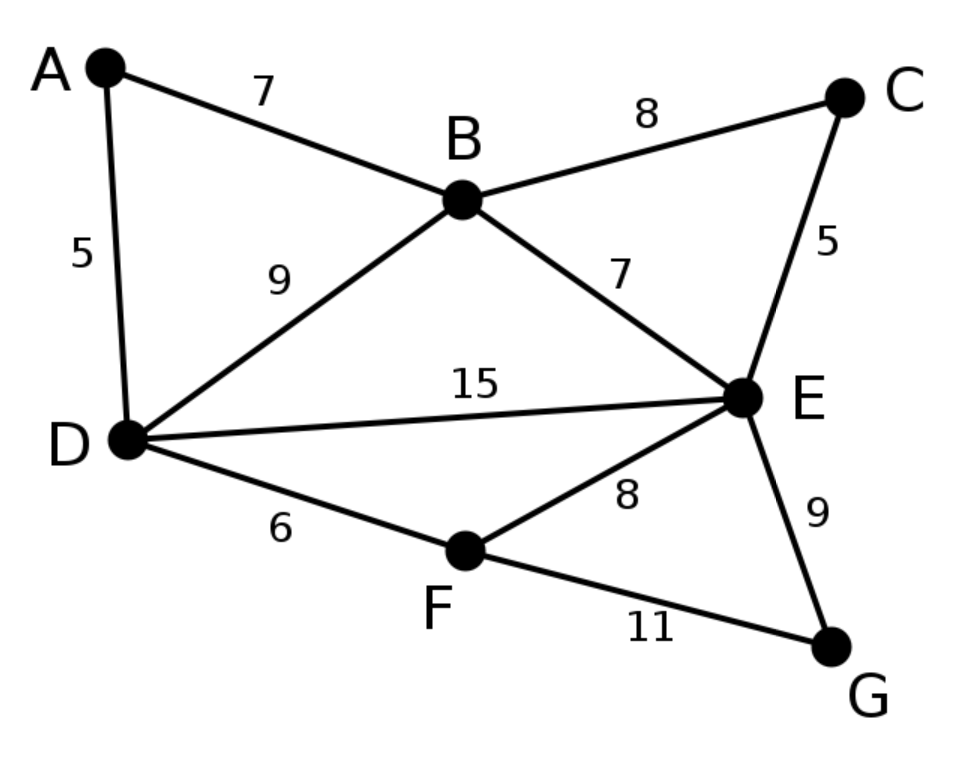
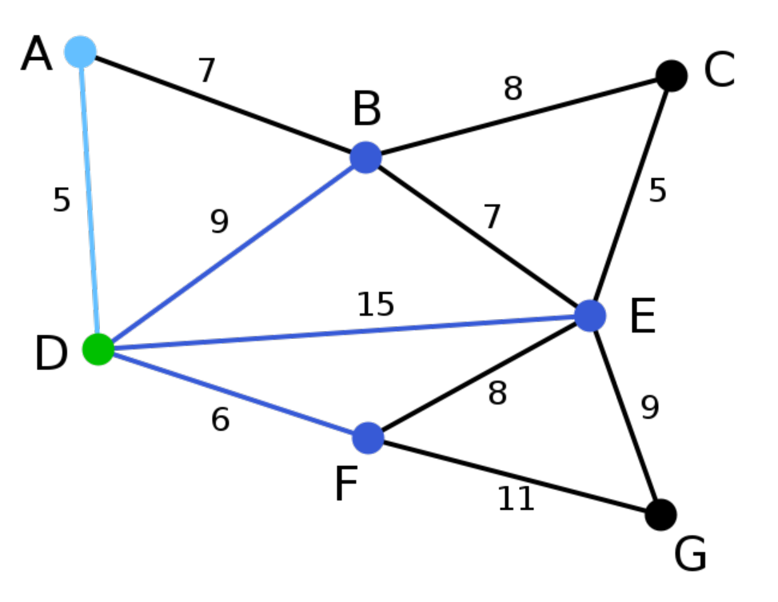
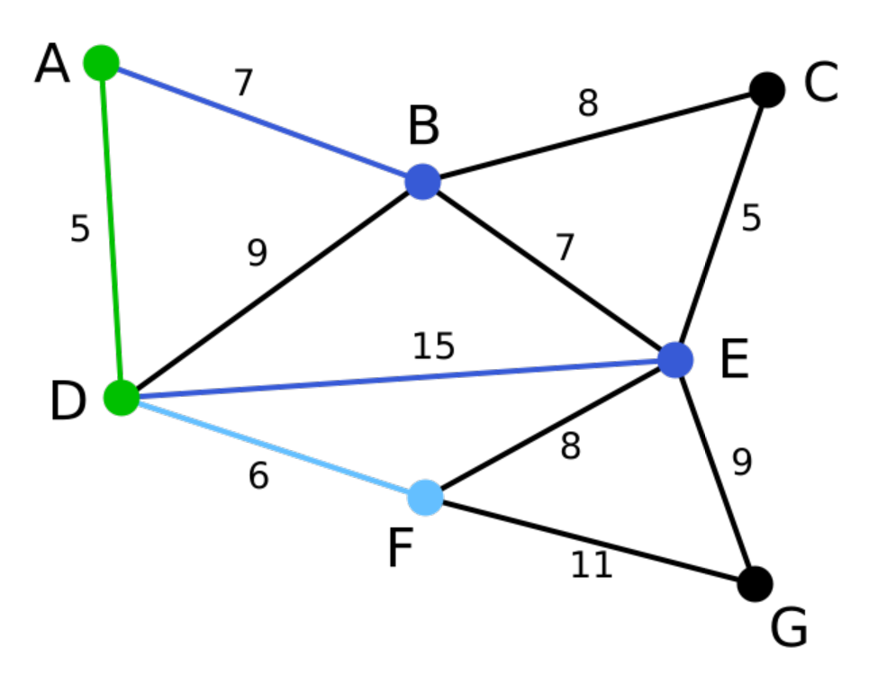
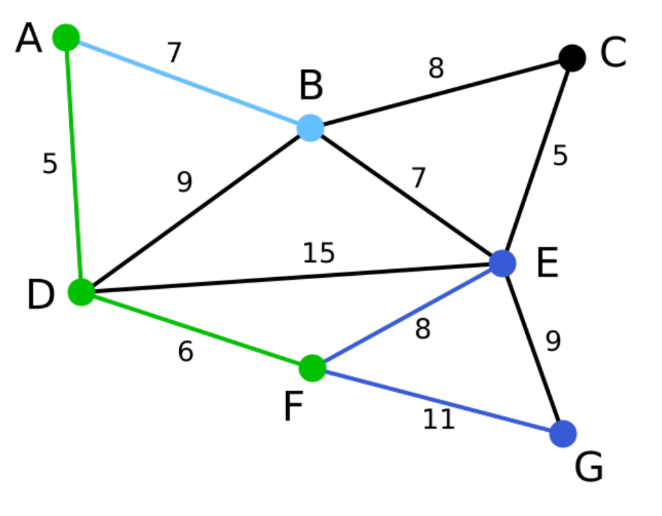
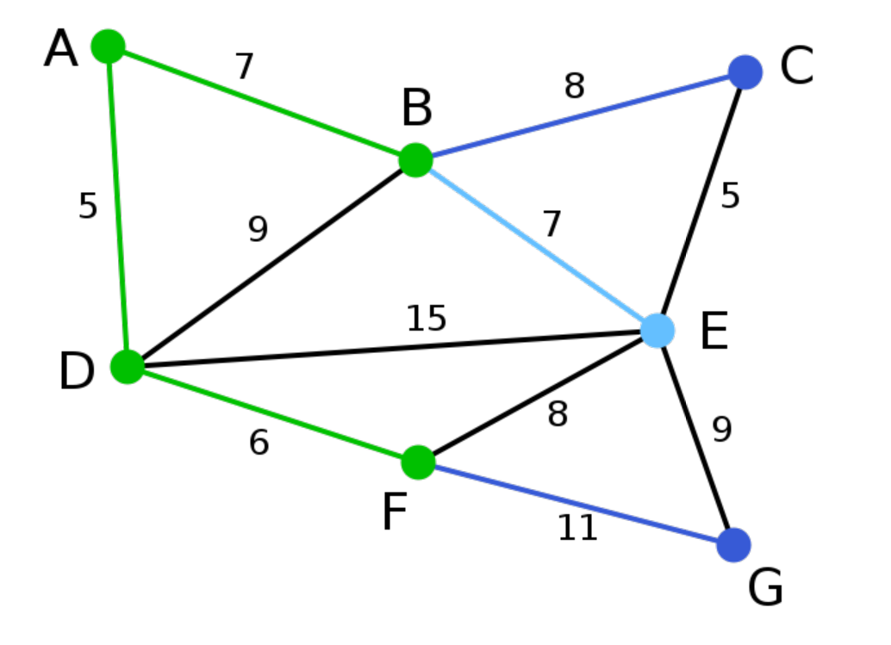
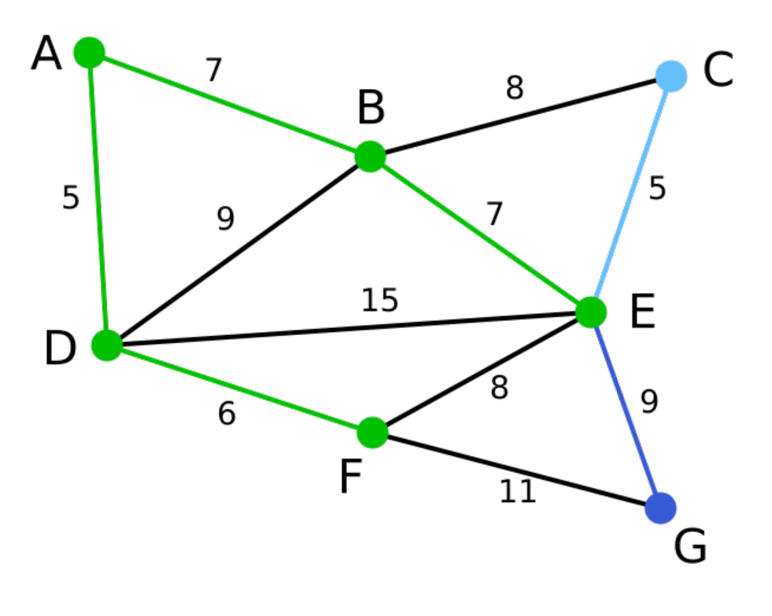
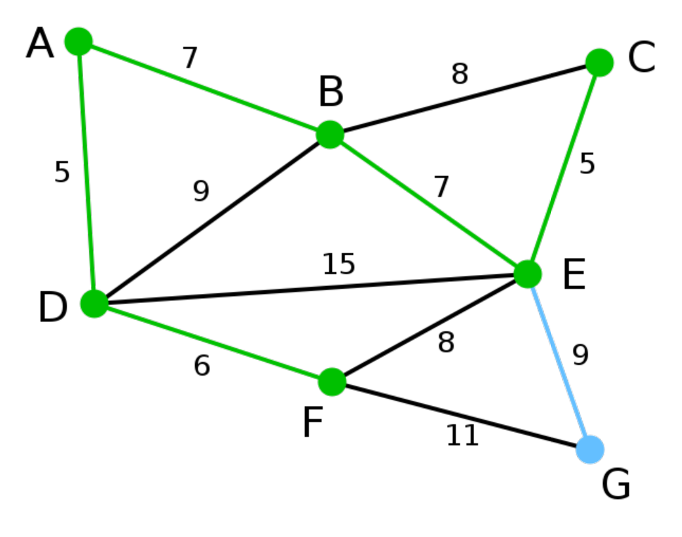
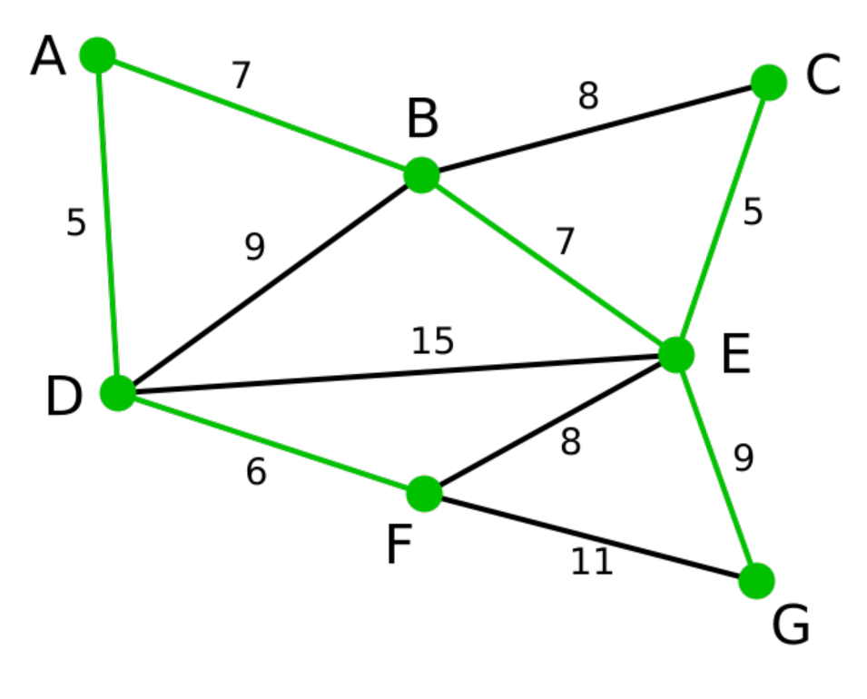

# 图算法-Prim算法
> 目录
>* 图算法-Dijkstra算法
>* 图算法-Floyd算法
>* 图算法-Bellman-Ford算法
>* 图算法-Prim算法
>* 图算法-Kruskal算法

> 参考文献
> * [https://www.cnblogs.com/ggzhangxiaochao/p/9070873.html](https://www.cnblogs.com/ggzhangxiaochao/p/9070873.html)

## 1 问题分析

* 普里姆算法（Prim算法），图论中的一种算法，可在加权连通图里搜索**最小生成树**。意即由此算法搜索到的边子集所构成的树中，不但包括了连通图里的所有顶点（英语：Vertex (graph theory)），且其所有边的权值之和亦为最小。
* 主要思想是**基于顶点的贪心思想**。

## 2 算法原理

1. 输入：一个加权连通图，其中顶点集合为V，边集合为E；

2. 初始化：Vnew = {x}，其中x为集合V中的任一节点（起始点），Enew = {},为空；

3. 重复下列操作，直到Vnew = V：

    * 在集合E中选取权值最小的边<u, v>，其中u为集合Vnew中的元素，而v不在Vnew集合当中，并且v∈V（如果存在有多条满足前述条件即具有相同权值的边，则可任意选取其中之一）；

    * 将v加入集合Vnew中，将<u, v>边加入集合Enew中；

4. 输出：使用集合Vnew和Enew来描述所得到的最小生成树。


## 3 算法过程

1. 此为原始的加权连通图。每条边一侧的数字代表其权值。结果集合{}，可选集合{}。

2. 顶点D被任意选为起始点。顶点A、B、E和F通过单条边与D相连。A是距离D最近的顶点，因此将A及对应边AD以高亮表示。结果集合为{D}.可选集合为{A,B,E,F}

3. 下一个顶点为距离D或A最近的顶点。B距D为9，距A为7，E为15，F为6。因此，F距D或A最近，因此将顶点F与相应边DF以高亮表示。结果集合{A,D}，可选集合{B,E,F}

4. 算法继续重复上面的步骤。距离A为7的顶点B被高亮表示。结果集合为{A,D,F}，可选集合为{B,E,G}

5. 在当前情况下，可以在C、E与G间进行选择。C距B为8，E距B为7，G距F为11。E最近，因此将顶点E与相应边BE高亮表示。结果集合为{A,D,F,B},可选集合为{C,E,G}

6. 这里，可供选择的顶点只有C和G。C距E为5，G距E为9，故选取C，并与边EC一同高亮表示。结果集合为{A,D,F,B,E},可选集合为{C,G}

7. 顶点G是唯一剩下的顶点，它距F为11，距E为9，E最近，故高亮表示G及相应边EG。结果集合为{A,D,F,B,E,C},可选集合为{G}

8. 现在，所有顶点均已被选取，图中绿色部分即为连通图的最小生成树。在此例中，最小生成树的权值之和为39。结果集合为{A,D,F,B,E,C,G},可选集合为{}


## 4 算法效率
顶点数V，边数E。时间复杂度：

* 邻接矩阵:$O(V^2)$
* 邻接表:$O(E\log_2V)$


## 5 算法实现

```C++
#include<iostream>
#include<vector>
#include<queue>
using namespace std;

// 构造边的对象
struct Edge
{
    int start;
    int end;
    int weight;
    Edge(int s,int e,int w){
        start=s;
        end=e;
        weight=w;
    }
    // 重写<运算符
    bool operator<(const Edge& a)const{
        return a.weight < weight;
    }
};
// struct cmp{
//     bool operator()(Edge a,Edge b){
//         return b.weight > a.weight;
//     }
// };

class Graph{
private:
    int vertex_num;   //图的顶点个数
    int edge;
    // 如果顶点的表示是离散的应该加一层映射
    vector<vector<int>> arc; //邻接矩阵
public:
    // 测试用的默认构造函数
    Graph();
    //构造函数,从命令行输入
    Graph(int vertex_num_,int edge_);
    //打印所有的边
    void print_edge();
    // 打印整个邻接矩阵
    void print_arc();
    //求最短路径
    void Dijkstra(int begin);//单源最短路
    void Floyd();//多源最短路
    void Prim();//最小生成树
    void Kruskal();//最小生成树
};

Graph::Graph(){
    this->vertex_num = 7;
    this->edge=12;
    this->arc = vector<vector<int>>(vertex_num,vector<int>(vertex_num,INT_MAX));
    // cout<<vertex_num<<endl;
    // 初始化一个邻接矩阵.dijskra算法的图。
    arc[0][1]=12;
    arc[1][0]=12;
    arc[0][6]=14;
    arc[6][0]=14;
    arc[0][5]=16;
    arc[5][0]=16;
    arc[1][2]=10;
    arc[2][1]=10;
    arc[1][5]=7;
    arc[5][1]=7;
    arc[2][3]=3;
    arc[3][2]=3;
    arc[2][4]=5;
    arc[4][2]=5;
    arc[2][5]=6;
    arc[5][2]=6;
    arc[3][4]=4;
    arc[4][3]=4;
    arc[4][5]=2;
    arc[5][4]=2;
    arc[4][6]=8;
    arc[6][4]=8;
    arc[5][6]=9;
    arc[6][5]=9;
    // 对角线自己到自己是0
    for(int i=0;i<vertex_num;i++){
        arc[i][i]=0;
    }
}

// 从命令行输入一个邻接矩阵
Graph::Graph(int vertex_num_,int edge_){
    this->vertex_num=vertex_num_;
    this->edge=edge_;
    this->arc=vector<vector<int>>(vertex_num,vector<int>(vertex_num,INT_MAX));
    int beg=0,end=0,weight=0;
    for(int i=0;i<edge_;i++){
        cin>>beg>>end>>weight;
        arc[beg][end]=weight;
        // 如果是无向图则需要添加反向的路径
        arc[end][beg]=weight;
    }
}

void Graph::print_edge(){
    for(int i=0;i<vertex_num;i++){
        for(int j=0;j<vertex_num;j++){
            if(arc[i][j]<INT_MAX)
            cout<<"begin:"<<i<<"\tend:"<<j<<"\tweight:"<<arc[i][j]<<endl;
        }
    }
}

void Graph::print_arc(){
    for(int i=0;i<vertex_num;i++){
        for(int j=0;j<vertex_num;j++){
            cout<<arc[i][j]<<"\t";
        }
        cout<<endl;
    }
}
// 使用优先队列，挑选结果集合
// 经过分析不需要使用优先队列。与dijkstra算法一样。可以使用向量来表示是否选中。
void Graph::Prim(){
    // 最小生成树开始的顶点。表示顶点是否被选中过.-1表示没有被选中。其他值表示它的上一个节点。
    vector<int> result(vertex_num,-1);
    // 用来记录到某个节点的距离的向量
    vector<int> distance(vertex_num,INT_MAX);
    // 用来记录到某个节点的前一个节点向量
    vector<int> pre_point(vertex_num,-1);

    // 首先选择第一个节点
    int min_index=2;
    int min_distance=INT_MAX;
    result[min_index]=min_index;//表示从当前节点开始.前一个节点时自己。

    for(int k=0;k<vertex_num-1;k++){
        // 以当前节点更新距离结合
        for(int i=0;i<vertex_num;i++){
            if(result[i]<0 && arc[min_index][i]<distance[i]){
                distance[i]=arc[min_index][i];
                pre_point[i]=min_index;
            }
        }
        min_distance=INT_MAX;
        // 挑选距离最小的节点
        for(int i=0;i<vertex_num;i++){
            if(result[i]<0 && distance[i]<min_distance){
                min_distance=distance[i];
                min_index=i;
            }
        }
        cout<<min_index<<"\t"<<pre_point[min_index]<<endl;
        // 更新结果集合
        result[min_index]=pre_point[min_index];
    }

    // 输出结果集合
    for(int i=0;i<vertex_num;i++){
        cout<<i<<"\t"<<result[i]<<"\t"<<arc[result[i]][i]<<endl;
    }

}
int main(){
    Graph g;
    // g.print();
    // g.Dijkstra(3);
    // g.Floyd();
    // g.Prim();
    return 0;
}
```