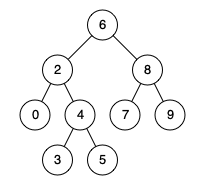

# 树的遍历

## 1 树的子结构

* 输入两棵二叉树A和B，判断B是不是A的子结构。(约定空树不是任意一个树的子结构).B是A的子结构， 即 A中有出现和B相同的结构和节点值。
* [链接](https://leetcode-cn.com/problems/shu-de-zi-jie-gou-lcof/)

## 2 树的镜像

* 请完成一个函数，输入一个二叉树，该函数输出它的镜像。
* [链接](https://leetcode-cn.com/problems/er-cha-shu-de-jing-xiang-lcof/)

## 3 对称的二叉树

* 请实现一个函数，用来判断一棵二叉树是不是对称的。如果一棵二叉树和它的镜像一样，那么它是对称的。
* [链接](https://leetcode-cn.com/problems/dui-cheng-de-er-cha-shu-lcof/)

## 4 二叉搜索树的第k大节点

* 给定一棵二叉搜索树，请找出其中第k大的节点。
* 示例 1:
```
输入: root = [3,1,4,null,2], k = 1
   3
  / \
 1   4
  \
   2
输出: 4
示例 2:
```
* [链接](https://leetcode-cn.com/problems/er-cha-sou-suo-shu-de-di-kda-jie-dian-lcof)

## 5 二叉树的深度

* 输入一棵二叉树的根节点，求该树的深度。从根节点到叶节点依次经过的节点（含根、叶节点）形成树的一条路径，最长路径的长度为树的深度。

* 例如：
```
给定二叉树 [3,9,20,null,null,15,7]，

    3
   / \
  9  20
    /  \
   15   7
返回它的最大深度 3 。
```
* [链接](https://leetcode-cn.com/problems/er-cha-shu-de-shen-du-lcof)

## 6 平衡二叉树

* 输入一棵二叉树的根节点，判断该树是不是平衡二叉树。如果某二叉树中任意节点的左右子树的深度相差不超过1，那么它就是一棵平衡二叉树。

 

* 示例 1:
```
给定二叉树 [3,9,20,null,null,15,7]

    3
   / \
  9  20
    /  \
   15   7
返回 true 。
```
* [链接](https://leetcode-cn.com/problems/ping-heng-er-cha-shu-lcof)

## 7 二叉搜索树的最近公共祖先

### 问题描述
* 给定一个二叉搜索树, 找到该树中两个指定节点的最近公共祖先。最近公共祖先的定义为：“对于有根树 T 的两个结点 p、q，最近公共祖先表示为一个结点 x，满足 x 是 p、q 的祖先且 x 的深度尽可能大（一个节点也可以是它自己的祖先）。”

* 例如，给定如下二叉搜索树: 
```
root = [6,2,8,0,4,7,9,null,null,3,5]
```

* 示例 1:
```
输入: root = [6,2,8,0,4,7,9,null,null,3,5], p = 2, q = 8
输出: 6 
解释: 节点 2 和节点 8 的最近公共祖先是 6。
```

### 问题分析

### 策略选择


### 算法设计

### 算法分析

### 算法实现

```C++
/**
 * Definition for a binary tree node.
 * struct TreeNode {
 *     int val;
 *     TreeNode *left;
 *     TreeNode *right;
 *     TreeNode(int x) : val(x), left(NULL), right(NULL) {}
 * };
 */
class Solution {
public:

    TreeNode* result;
    TreeNode* lowestCommonAncestor(TreeNode* root, TreeNode* p, TreeNode* q) {
        dfs(root,p,q);
        return result;
    }
    // 递归的返回值与通过全局变量修改值不同。递归的返回值是与左右子树强相关的值。
    // 在深度优先遍历的时候，如果使用全局变量，左子树修改了全局变量的值，
    // 那么右子树也能得到这个被左子树修改的值。如果通过返回值。则只能其父节点得到该值！！！
    int dfs(TreeNode* root,TreeNode* p,TreeNode* q){
        if(root==nullptr)return 0;
        int i=0;
        i+=dfs(root->right,p,q)+dfs(root->left,p,q);
        if(root->val==p->val)i++;
        if(root->val==q->val)i++;
        if(i==2 ){
            result=root;
            i++;
        }
        return i;
    }
};
```
