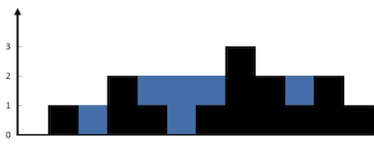
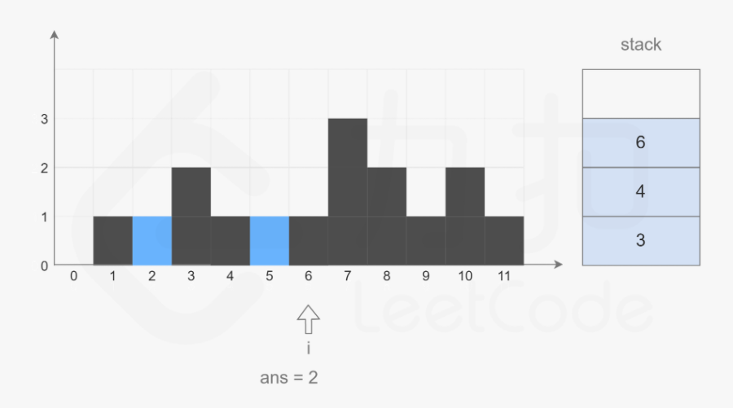

# 接雨水问题

> 这个问题也太经典了，能用的这些思路，也太神奇了。

## 1 接雨水问题


给定 n 个非负整数表示每个宽度为 1 的柱子的高度图，计算按此排列的柱子，下雨之后能接多少雨水。




上面是由数组 [0,1,0,2,1,0,1,3,2,1,2,1] 表示的直方图，在这种情况下，可以接 6 个单位的水（蓝色部分表示水）。 感谢 Marcos 贡献此图。

示例:

[链接](https://leetcode-cn.com/problems/volume-of-histogram-lcci)
```

输入: [0,1,0,2,1,0,1,3,2,1,2,1]
输出: 6

```
### 问题分析

* 问题抽象
* 问题分类：线性数组


## 1.1 接雨水问题——动态规划
### 策略算则

1. 动态规划


### 算法设计

1. 左扫一遍，求每个位置的左最大值。
2. 右扫一遍，取每个位置的右最大值。
3. 取两个最大值的最小值。作为该位置能接雨水的高度。

### 算法分析
* 时间复杂度O(n)
* 空间复杂度O(n)

### 算法实现

```C++
class Solution {
public:
    int trap(vector<int>& height) {
        int n=height.size();
        vector<int> left(n,0);
        vector<int> right(n,0);

        int max_left=0,max_right=0;
        for(int i=0;i<n;i++){
            if(height[i]>max_left)max_left=height[i];
            left[i]=max_left;
            
            if(height[n-1-i]>max_right)max_right=height[n-1-i];
            right[n-1-i]=max_right;
        }
        int sum=0;
        for(int i=0;i<n;i++){
            sum+=min(left[i],right[i])-height[i];
        }
        return sum;
    }
};
```

## 1.2 接雨水问题——单调栈
### 策略选择

* 单调栈

### 算法设计

* 计算思想与动态规划不同。动态规划目标是计算一个位置的上方能存多少水。二单调栈计算任意两个能存水的左右边界，能存多少水。是横向计算水的量。单调栈在出栈的时候恰好能够形成一个蓄水池的左右边界。

* 从左到右遍历数组，遍历到下标 ii 时，如果栈内至少有两个元素，记栈顶元素为top，top 的下面一个元素是  left，则一定有 height[left]≥height[top]。如果 height[i]>height[top]，则得到一个可以接雨水的区域，该区域的宽度i−left−1，高度是min(height[left],height[i])−height[top]，根据宽度和高度即可计算得到该区域能接的雨水量。

* 为了得到  left，需要将  top 出栈。在对  top 计算能接的雨水量之后， left 变成新的  top，重复上述操作，直到栈变为空，或者栈顶下标对应的  height 中的元素大于或等于height[i]。


### 算法分析

* 时间复杂度：O(n)
* 空间复杂度：O(n)

### 算法实现

```
class Solution {
public:
    int trap(vector<int>& height) {
        int ans = 0;
        stack<int> stk;
        int n = height.size();
        for (int i = 0; i < n; ++i) {
            while (!stk.empty() && height[i] > height[stk.top()]) {
                int top = stk.top();
                stk.pop();
                if (stk.empty()) {
                    break;
                }
                int left = stk.top();
                int currWidth = i - left - 1;
                int currHeight = min(height[left], height[i]) - height[top];
                ans += currWidth * currHeight;
            }
            stk.push(i);
        }
        return ans;
    }
};
```

## 1.3 接雨水问题——双指针

### 策略选择

* 双指针

### 算法设计

* 本质上与[最大盛水面积](4.3%20数组与滑动窗口.md)中提到的双指针方法是完全一致的。都是一种**贪心思想**。舍弃掉不可能继续增大的区域。


### 算法分析

* 时间复杂度：O(n)
* 空间复杂度：O(1)O(1)


### 算法实现

```
class Solution {
public:
    int trap(vector<int>& height) {
        int ans = 0;
        int left = 0, right = height.size() - 1;
        int leftMax = 0, rightMax = 0;
        while (left < right) {
            leftMax = max(leftMax, height[left]);
            rightMax = max(rightMax, height[right]);
            if (height[left] < height[right]) {
                ans += leftMax - height[left];
                ++left;
            } else {
                ans += rightMax - height[right];
                --right;
            }
        }
        return ans;
    }
};
```
