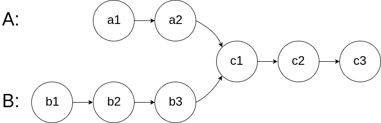
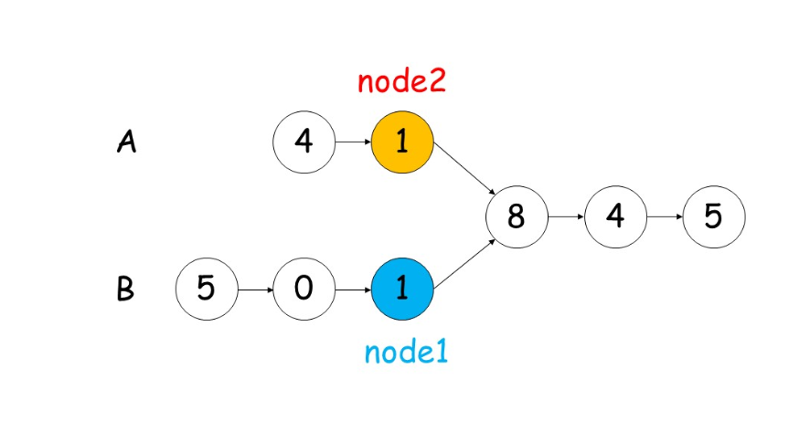
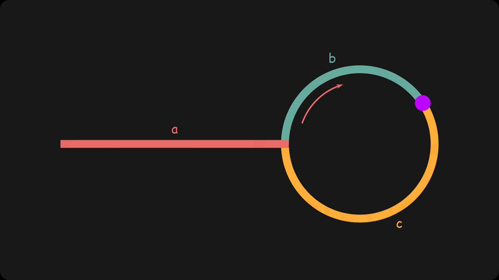

# 链表与双指针


## 1 链表中的倒数第k个节点

### 问题描述

* 输入一个链表，输出该链表中倒数第k个节点。为了符合大多数人的习惯，本题从1开始计数，即链表的尾节点是倒数第1个节点。例如，一个链表有 6 个节点，从头节点开始，它们的值依次是 1、2、3、4、5、6。这个链表的倒数第 3 个节点是值为 4 的节点。

### 问题分析

* 典型的双指针问题

### 问题分类

* 数组与链表
* 双指针问题

### 策略选择

* 蛮力法

### 算法流程

* 两个一样快的指针。相距k个距离。
* 一个到达终点，另一个则为倒数第k个节点

### 算法分析
* 时间复杂度O(n)
* 空间复杂度O(1)

### 算法实现

```C++
    ListNode* getKthFromEnd(ListNode* head, int k) {
        ListNode* first=head;
        ListNode* second=head;
        while(--k){
            second=second->next;
        }
        while(second->next){
            second = second->next;
            first = first->next;
        }
        return first;
    }
```

## 2 两个链表的第一个公共节点

### 问题描述

输入两个链表，找出它们的第一个公共节点。这两个链表不相交，返回 null。


要求：
* 如果两个链表没有交点，返回 null.
* 在返回结果后，两个链表仍须保持原有的结构。
* 可假定整个链表结构中没有循环。
* 程序尽量满足 O(n) 时间复杂度，且仅用 O(1) 内存。
[链接](https://leetcode-cn.com/problems/liang-ge-lian-biao-de-di-yi-ge-gong-gong-jie-dian-lcof)
### 问题分析

* 问题类别：双指针
  
### 策略选择

* 数据结构：线性数据结构
* 算法思想：双指针

### 算法设计
* 我们使用两个指针 node1，node2 分别指向两个链表 headA，headB 的头结点，然后同时分别逐结点遍历，
* 当 node1 到达链表 headA 的末尾时，重新定位到链表 headB 的头结点；
* 当 node2 到达链表 headB 的末尾时，重新定位到链表 headA 的头结点。



### 算法分析

- 时间复杂度：O(M+N)O(M+N)。
- 空间复杂度：O(1)O(1)。

### 算法实现

```C++
class Solution {
public:
    ListNode *getIntersectionNode(ListNode *headA, ListNode *headB) {
        ListNode *node1 = headA;
        ListNode *node2 = headB;
        
        while (node1 != node2) {
            node1 = node1 != NULL ? node1->next : headB;
            node2 = node2 != NULL ? node2->next : headA;
        }
        return node1;
    }
};
```

## 3 和为s的两个数字
### 问题描述

* 输入一个递增排序的数组和一个数字s，在数组中查找两个数，使得它们的和正好是s。如果有多对数字的和等于s，则输出任意一对即可。
* 示例 1：
```
输入：nums = [2,7,11,15], target = 9
输出：[2,7] 或者 [7,2]
```
### 问题分析


### 策略选择

* 数据结构：线型数组
* 算法思想：双指针搜搜
### 算法设计
始化： 双指针 ii , jj 分别指向数组 numsnums 的左右两端 （俗称对撞双指针）。
循环搜索： 当双指针相遇时跳出；
计算和 s = nums[i] + nums[j]s=nums[i]+nums[j] ；
若 s > targets>target ，则指针 jj 向左移动，即执行 j = j - 1j=j−1 ；
若 s < targets<target ，则指针 ii 向右移动，即执行 i = i + 1i=i+1 ；
若 s = targets=target ，立即返回数组 [nums[i], nums[j]][nums[i],nums[j]] ；
返回空数组，代表无和为 targettarget 的数字组合。


### 算法分析
* 时间复杂度 O(N)： N为数组 nums 的长度；双指针共同线性遍历整个数组。
* 空间复杂度 O(1) ： 变量 i, j 使用常数大小的额外空间。

### 算法实现

```C++
    vector<int> twoSum(vector<int>& nums, int target) {
        vector<int> vec;
        int i=0,j=nums.size()-1;
        while(nums[i]+nums[j]!=target){
            if(nums[i]+nums[j]>target)j--;
            if(nums[i]+nums[j]<target)i++;
        }
        vec.push_back(nums[i]);
        vec.push_back(nums[j]);
        return vec;
    }
```

## 5 环形链表II
### 问题描述

* 给定一个链表，返回链表开始入环的第一个节点。 如果链表无环，则返回 null。

* 为了表示给定链表中的环，我们使用整数 pos 来表示链表尾连接到链表中的位置（索引从 0 开始）。 如果 pos 是 -1，则在该链表中没有环。注意，pos 仅仅是用于标识环的情况，并不会作为参数传递到函数中。

* 说明：不允许修改给定的链表。

* 进阶：你是否可以使用 O(1) 空间解决此题？
 

* 示例 1：
```
输入：head = [3,2,0,-4], pos = 1
输出：返回索引为 1 的链表节点
解释：链表中有一个环，其尾部连接到第二个节点。
```

### 问题分析


### 策略选择


### 算法设计

* 我们使用两个指针，$\textit{fast}$ 与 $\textit{slow}$。它们起始都位于链表的头部。随后，$\textit{slow}$ 指针每次向后移动一个位置，而 $\textit{fast}$ 指针向后移动两个位置。如果链表中存在环，则 $\textit{fast}$ 指针最终将再次与 $\textit{slow}$ 指针在环中相遇。

* 如下图所示，设链表中环外部分的长度为 a。$\textit{slow}$ 指针进入环后，又走了 b 的距离与 $\textit{fast}$相遇。此时，$\textit{fast}$ 指针已经走完了环的 n 圈，因此它走过的总距离为 $a+n(b+c)+b=a+(n+1)b+nc$。



* 根据题意，任意时刻，$\textit{fast}$指针走过的距离都为 \textit{slow}slow 指针的 22 倍。因此，我们有
$$
a+(n+1)b+nc=2(a+b) \implies a=c+(n-1)(b+c)
$$
* 有了 a=c+(n-1)(b+c)的等量关系，我们会发现：从相遇点到入环点的距离加上 n-1圈的环长，恰好等于从链表头部到入环点的距离。

* 因此，当发现 $\textit{slow}$与 $\textit{fast}$ 相遇时，我们再额外使用一个指针 $\textit{ptr}$。起始，它指向链表头部；随后，它和 $\textit{slow}$每次向后移动一个位置。最终，它们会在入环点相遇。

### 算法分析
* 时间复杂度O(N)
* 空间复杂度O(1)

### 算法实现

```C++
class Solution {
public:
    ListNode *detectCycle(ListNode *head) {
        ListNode *slow = head, *fast = head;
        while (fast != nullptr) {
            slow = slow->next;
            if (fast->next == nullptr) {
                return nullptr;
            }
            fast = fast->next->next;
            if (fast == slow) {
                ListNode *ptr = head;
                while (ptr != slow) {
                    ptr = ptr->next;
                    slow = slow->next;
                }
                return ptr;
            }
        }
        return nullptr;
    }
};
```
```C++
// 自己的解法与上边的思想类似，但是没有发现那个关系。纯粹靠求出a+b长度，b+c长度。两者做差，得到a-c的长度。然后两个指针位移相同的距离，在加上a-c的差。就会相遇。
class Solution {
public:
    ListNode *detectCycle(ListNode *head) {
        if(head==nullptr)return nullptr;
        ListNode* p1=head,*p2=head;
        int i=0;
        // 找到b
        while(true){
            // 没有环，遇到空值
            if(p2==nullptr || p2->next == nullptr){
                return nullptr;
            }
            // p1迭代到下一个节点
            p2=p2->next->next;
            p1=p1->next;
            i++;
            // 判断是否重合
            if(p1==p2)break;
        }
        // a+b=i
        int a_b =i;
        i=0;
        //确定b+c的长度
        while(true){
            p2=p2->next;
            i++;
            if(p2==p1)break;
        }
        // b+c的长度
        int b_c = i;
        int cha = a_b-b_c;
        p1=head;
        if(cha>0){
            for(i=cha;i>0;i--){
                p1=p1->next;
            }
        }
        else if(cha<0){
            for(i=-cha;i>0;i--){
                p2=p2->next;
            }
        }

        while(true){
            if(p1==p2)return p1;
            p1=p1->next;
            p2=p2->next;
        }
        return nullptr;
    }
};
```


