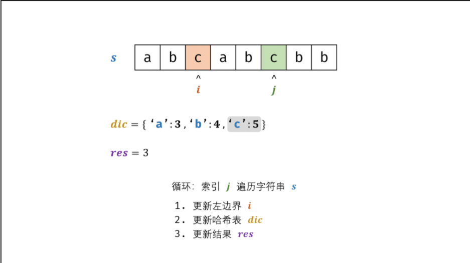

# 数组与滑动窗口

## 1.2 最长不含重复字符的子字符串——滑动窗口

### 问题描述

* 请从字符串中找出一个最长的不包含重复字符的子字符串，计算该最长子字符串的长度。


### 问题分析


### 问题分类


### 算法设计

* 哈希表 dicdic 统计： 指针 jj 遍历字符 ss ，哈希表统计字符 s[j]s[j] 最后一次出现的索引 。
* 更新左指针 ii ： 根据上轮左指针 ii 和 dic[s[j]]dic[s[j]] ，每轮更新左边界 ii ，保证区间 [i + 1, j][i+1,j] 内无重复字符且最大。
$$
i=max(dic[s[j]],i)
$$
* 更新结果 res ： 取上轮 res 和本轮双指针区间 [i + 1,j][i+1,j] 的宽度（即 j - ij−i ）中的最大值

$$
res=max(res,j−i)
$$



### 算法分析

* 时间复杂度 O(N)： 其中 N为字符串长度，动态规划需遍历计算 dpdp 列表。
* 空间复杂度 O(1) ： 字符的 ASCII 码范围为 00 ~ 127，哈希表 dic最多使用 O(128) = O(1) 大小的额外空间。


### 算法分析

* 时间复杂度 O(N)O(N) ： 其中 NN 为字符串长度，动态规划需遍历计算 dpdp 列表。
* 空间复杂度 O(1)O(1) ： 字符的 ASCII 码范围为 00 ~ 127127 ，哈希表 dicdic 最多使用 O(128) = O(1)O(128)=O(1) 大小的额外空间。

### 算法实现

```C++
    int lengthOfLongestSubstring(string s) {
        vector<int> a(200,-1);
        int repeat=-1;
        int max_val=0;
        for(int i=0;i<s.size();i++){
            repeat=max(a[s[i]],repeat);
            max_val=max(i-repeat,max_val);
            a[s[i]]=i;
        }
        return max_val;
    }
```


