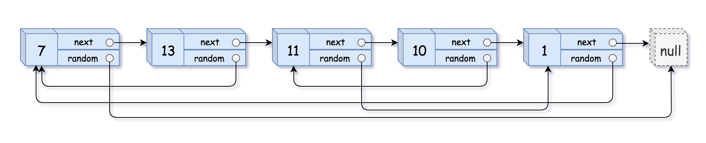

# 链表与映射


## 复制带随机指针的链表

### 问题描述

给你一个长度为 n 的链表，每个节点包含一个额外增加的随机指针 random ，该指针可以指向链表中的任何节点或空节点。

构造这个链表的 深拷贝。 深拷贝应该正好由 n 个 全新 节点组成，其中每个新节点的值都设为其对应的原节点的值。新节点的 next 指针和 random 指针也都应指向复制链表中的新节点，并使原链表和复制链表中的这些指针能够表示相同的链表状态。复制链表中的指针都不应指向原链表中的节点 。

例如，如果原链表中有 X 和 Y 两个节点，其中 X.random --> Y 。那么在复制链表中对应的两个节点 x 和 y ，同样有 x.random --> y 。

返回复制链表的头节点。

用一个由 n 个节点组成的链表来表示输入/输出中的链表。每个节点用一个 [val, random_index] 表示：

val：一个表示 Node.val 的整数。
random_index：随机指针指向的节点索引（范围从 0 到 n-1）；如果不指向任何节点，则为  null 。
你的代码 只 接受原链表的头节点 head 作为传入参数。

 

示例 1：


```
输入：head = [[7,null],[13,0],[11,4],[10,2],[1,0]]
输出：[[7,null],[13,0],[11,4],[10,2],[1,0]]
```

### 问题分析

* 需要建立原链表节点到新链表节点的映射。这个映射本可以通过添加子段实现，但是不能添加。只能使用一个map完成链表映射了。

### 策略选择


### 算法设计

### 算法分析

### 算法实现

```C++
/*
// Definition for a Node.
class Node {
public:
    int val;
    Node* next;
    Node* random;
    
    Node(int _val) {
        val = _val;
        next = NULL;
        random = NULL;
    }
};
*/
class Solution {
public:
    Node* copyRandomList(Node* head) {
        if(head==nullptr)return nullptr;
        // 使用vector，修改原链表的方法不行。
        // 使用map建立原链表到新链表的映射
        map<Node*,Node*> m;
        Node* old_head = head;
        Node* temp_old = head;
        Node* new_head = new Node(head->val);
        Node* temp_new = new_head;
        while(temp_old->next!=nullptr){
            m[temp_old]=temp_new;
            temp_new->next = new Node(temp_old->next->val);
            
            temp_old=temp_old->next;
            temp_new=temp_new->next;

        }
        m[temp_old]=temp_new;

        temp_old = head;
        while(temp_old!=nullptr){
            if(temp_old->random!=nullptr){
                m[temp_old]->random=m[temp_old->random];
            }
            temp_old=temp_old->next;
        }

        return new_head;
    }
};
```