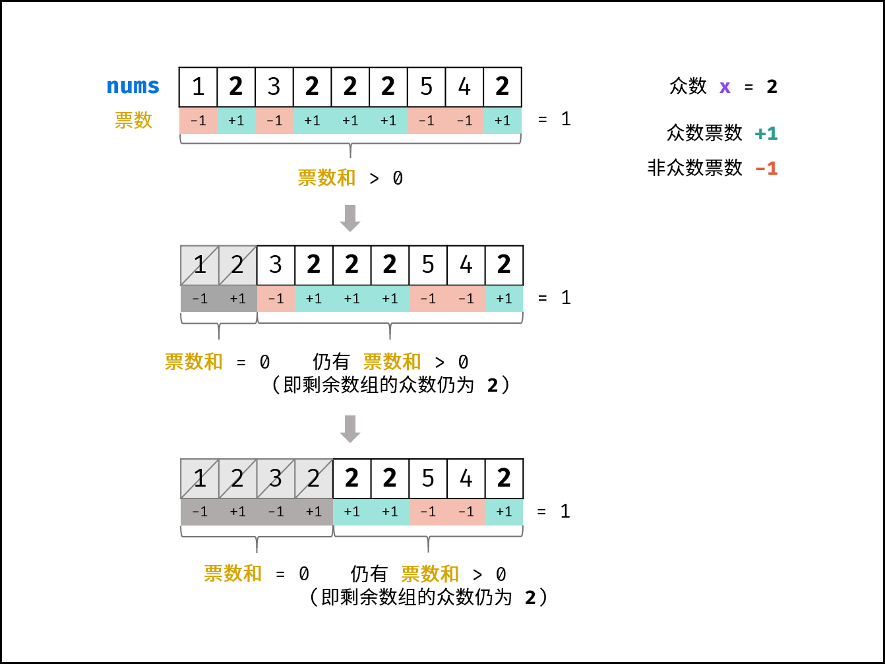

## 1 重复数字问题

### 问题描述

* 找出数组中重复的数字。在一个长度为 n 的数组 nums 里的所有数字都在 0～n-1 的范围内。数组中某些数字是重复的，但不知道有几个数字重复了，也不知道每个数字重复了几次。请找出数组中任意一个重复的数字。
* [问题链接](https://leetcode-cn.com/problems/shu-zu-zhong-zhong-fu-de-shu-zi-lcof)

### 问题分析

* 重复问题的解决大部分都可以使用哈希表。然后根据元素提供的额外属性采用哈希表的变种。
* 如本题中提供了额外的限制——0-n-1范围内的数字。那么除了用提供的unordered_set。也可以使用数组作为哈希表，数组的下标作为键，数组的值为值。于是很容易想到第二种方法的改进，即第三种方法。

### 问题分类
* 线性数据结构
* 查找问题
* 枚举法。

## 1.1 重复数字问题——排序

### 策略选择

### 算法设计
* 使用快速排序
* 寻找第一组相邻的重复数字。

### 正确性证明

### 算法分析
* 时间复杂度O(nlogn)
* 空间复杂度O(logn)

### 算法实现

```
    // 排序方法。排序后出现连续重复数字。
    int findRepeatNumber1(vector<int>& nums) {
        sort(nums.begin(),nums.end());
        for(int i=0;i<nums.size()-1;i++){
            if(nums[i]==nums[i+1]){
                return(nums[i]);
            }
        }
        return 0;
    }
```
## 1.2 重复数字问题——hashset

### 策略选择

* 数据结构：哈希表散列表
* 算法思想：枚举法

### 算法设计

* 使用unordered_set已有的元素。
* 依次检验每一个元素。set中没有元素则保存。有元素则重复

### 算法分析

* 时间复杂度O(n)
* 空间复杂度O(n)

### 算法实现

```
    // hashset的方法
    int findRepeatNumber2(vector<int>& nums) {
        unordered_set<int> m;
        for(int i=0;i<nums.size();i++){
            if(m.count(nums[i])>0){
                return(nums[i]);
            }
            m.insert(nums[i]);
        }
        return 0;
    }
```

## 1.3 重复数字问题——原地置换

### 策略选择

* 数据结构：数组哈希表
* 算法思想：枚举法线性查找

### 算法设计

* 利用数组的下标作为键。每次将元素归位。
* 如果数组下标与元素值相等。则下一个
* 如果数组下边与元素值不想等，则一直交换本元素值。直到相等
* 如果要交换的两个元素值相等。则检测到重复元素。返回

### 算法分析

* 时间复杂度O(n)
* 空间复杂度O(1)

### 算法实现
```
   // 原地置换的方法
    int findRepeatNumber(vector<int>& nums) {
        for(int i=0;i<nums.size();i++){
            if(i==nums[i])continue;
            if(nums[i]==nums[nums[i]])return nums[i];
            else {
                swap(nums[i],nums[nums[i]]);
                i--;
            }
        }
        return 0;
    }
```

## 2 数组中超过一半的数

### 问题描述

* 数组中有一个数字出现的次数超过数组长度的一半，请找出这个数字。你可以假设数组是非空的，并且给定的数组总是存在多数元素。
* [链接](https://leetcode-cn.com/problems/shu-zu-zhong-chu-xian-ci-shu-chao-guo-yi-ban-de-shu-zi-lcof/)


### 问题分析

### 问题分类

### 策略选择
* 数论知识补充
* 推论一： 若记 众数 的票数为 +1+，非众数 的票数为 -1 ，则一定有所有数字的 票数和 > 0 。
* 推论二： 若数组的前 a 个数字的 票数和 =0 ，则 数组剩余 (n−a) 个数字的 票数和一定仍 >0 ，即后 (n−a) 个数字的 众数仍为 x



### 算法设计

* 摩尔投票法
  1. 初始化： 票数统计 votes = 0 ， 众数 x；
  2. 循环： 遍历数组 nums 中的每个数字 num ；
     1. 当 票数 votes 等于 0 ，则假设当前数字 num 是众数；
     2. 当 num = x 时，票数 votes 自增 1 ；当 num != x 时，票数 votes 自减 1 ；
  3. 返回值： 返回 x 即可；
### 算法分析

* 时间复杂度 O(N) ： N 为数组 nums 长度。
* 空间复杂度 O(1)： votes 变量使用常数大小的额外空间。

### 算法实现

```
class Solution {
public:
    int majorityElement(vector<int>& nums) {
        int x = 0, votes = 0;
        for(int num : nums){
            if(votes == 0) x = num;
            votes += num == x ? 1 : -1;
        }
        return x;
    }
};
```