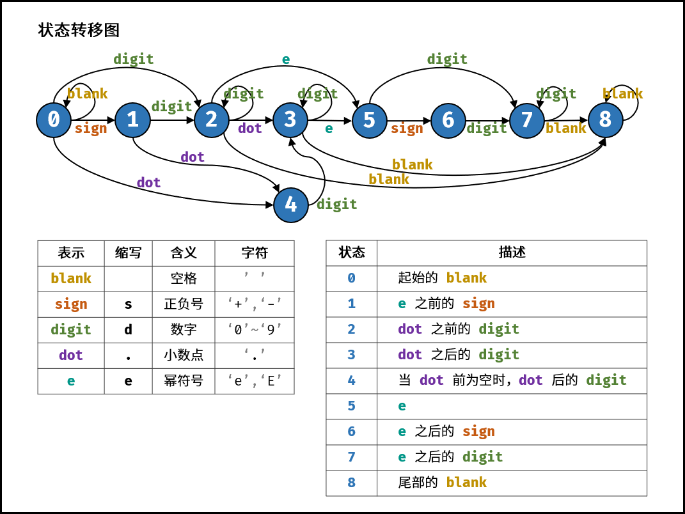

# 表示数值的字符串

## 1 表示数值的字符串

### 问题描述

* 请实现一个函数用来判断字符串是否表示数值（包括整数和小数）。例如，字符串"+100"、"5e2"、"-123"、"3.1416"、"-1E-16"、"0123"都表示数值，但"12e"、"1a3.14"、"1.2.3"、"+-5"及"12e+5.4"都不是。
* [链接](https://leetcode-cn.com/problems/biao-shi-shu-zhi-de-zi-fu-chuan-lcof)


### 问题分析

* 这题一看，明显就是有限状态自动机。词法分析过程中用来判断关键字、数值的。属于暴力破解。使用优先状态自动机。确定分类讨论的情况。找到符合规则的所有的路。
* 另外提供了另外一种暴力破解的思路。通过讨论违反规则的情况。找到违反规则的所有的路。

* 提供了两种截然不同的分类讨论的思路。在某些情况下，第二种思路反而会简单很多。

* 在 C++ 文档 中，描述了一个合法的数值字符串应当具有的格式。具体而言，它包含以下部分：
  * 符号位，即 +、− 两种符号
  * 整数部分，即由若干字符 0-9组成的字符串
  * 小数点
  * 小数部分，其构成与整数部分相同
  * 指数部分，其中包含开头的字符 e（大写小写均可）、可选的符号位，和整数部分

### 问题分类

* 枚举法
* 正向分类讨论和反向分类讨论

## 1.1 表示数值的字符串——有限状态自动机DFA

### 选择策略

* 有限状态自动机
* 正向分类讨论

### 算法设计

* 字符类型：空格 「 」、数字「 0—9 」 、正负号 「 +− 」 、小数点 「 .」 、幂符号 「 eE 」 
* 状态定义：按照字符串从左到右的顺序，定义以下 9 种状态。
  1. 开始的空格
  2. 幂符号前的正负号
  3. 小数点前的数字
  4. 小数点、小数点后的数字
  5. 当小数点前为空格时，小数点、小数点后的数字
  6. 幂符号
  7. 幂符号后的正负号
  8. 幂符号后的数字
  9. 结尾的空格

* 状态转移图



### 算法分析

* 时间复杂度O(n)
* 空间复杂度O(n)

### 算法实现

```C++
 // 方法一：有限状态自动机DFA，时间复杂度 O(N)
    typedef pair<char,int> charint;
    typedef unordered_map<char,int> unmap;
    bool isNumber(string s) {
        vector<unmap> states = {
            unmap{charint(' ',0),charint('s',1),charint('d',2),charint('.',4)},
            unmap{charint('d',2),charint('.',4)},
            unmap{charint('d',2),charint('.',3),charint('e',5),charint(' ',8)},
            unmap{charint('d',3),charint('e',5),charint(' ',8)},
            unmap{charint('d',3)},
            unmap{charint('s',6),charint('d',7)},
            unmap{charint('d',7)},
            unmap{charint('d',7),charint(' ',8)},
            unmap{charint(' ',8)}
        };
        int p = 0;
        char t;
        for(char c:s){
            if(c >= '0' && c <= '9')
                t = 'd';
            else if(c == '+' || c == '-')
                t = 's';
            else if(c == 'e' || c == 'E')
                t = 'e';
            else if(c == '.' || c == ' ')
                t = c;
            else
                t = '?';
            if(!states[p].count(t))
                return false;
            p = (int) states[p][t];
        }
        return p == 2 || p == 3 || p == 7 || p == 8;
    }
```
## 1.2 表示数值的字符串——反向分类讨论

### 算法设计

* 讨论所有可能出现的反例

* e/E 分割为指数和底数
  * 底数：
    * 只能有一个+-号位于第一位
    * 只能有一个小数点
  * 指数
    * 只能有一个+-号位于第一位
    * 不能有小数点

### 算法分析

* 时间复杂度O(n)
* 空间复杂度O()


