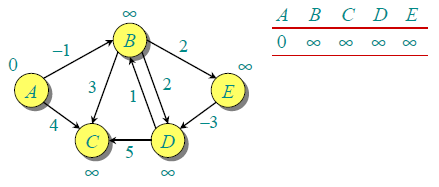
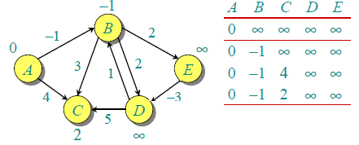
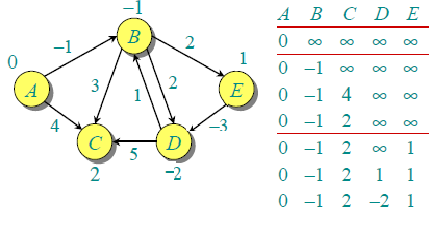
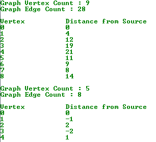

Bellman-Ford 单源最短路径算法

Bellman-Ford 算法是一种用于计算带权有向图中单源最短路径（SSSP：Single-Source
Shortest Path）的算法。该算法由 Richard Bellman 和 Lester Ford 分别发表于 1958
年和 1956 年，而实际上 Edward F. Moore 也在 1957
年发布了相同的算法，因此，此算法也常被称为 Bellman-Ford-Moore 算法。

Bellman-Ford 算法和 [Dijkstra
算法](http://www.cnblogs.com/gaochundong/p/dijkstra_algorithm.html)同为解决单源最短路径的算法。对于带权有向图
G = (V, E)，Dijkstra 算法要求图 G 中边的权值均为非负，而 [Bellman-Ford
算法](http://www.cnblogs.com/gaochundong/p/bellman_ford_algorithm.html)能适应一般的情况（即存在负权边的情况）。一个实现的很好的
Dijkstra 算法比 Bellman-Ford 算法的运行时间要低。

Bellman-Ford 算法采用动态规划（Dynamic Programming）进行设计，实现的时间复杂度为
O(V\*E)，其中 V 为顶点数量，E 为边的数量。Dijkstra 算法采用贪心算法（Greedy
Algorithm）范式进行设计，普通实现的时间复杂度为 O(V2)，若基于 [Fibonacci
heap](http://www.cnblogs.com/gaochundong/p/fibonacci_heap.html)
的最小优先队列实现版本则时间复杂度为 O(E + VlogV)。

Bellman-Ford 算法描述：

1.  创建源顶点 v 到图中所有顶点的距离的集合
    distSet，为图中的所有顶点指定一个距离值，初始均为 Infinite，源顶点距离为 0；

2.  计算最短路径，执行 V - 1 次遍历；

    -   对于图中的每条边：如果起点 u 的距离 d 加上边的权值 w 小于终点 v 的距离
        d，则更新终点 v 的距离值 d；

3.  检测图中是否有负权边形成了环，遍历图中的所有边，计算 u 至 v 的距离，如果对于
    v 存在更小的距离，则说明存在环；

伪码实现如下：

复制代码

1 BELLMAN-FORD(G, w, s) 2 INITIALIZE-SINGLE-SOURCE(G, s) 3 for i 1 to \|V[G]\| -
14 do for each edge (u, v) E[G] 5 do RELAX(u, v, w) 6 for each edge (u, v) E[G]
7 do if d[v] \> d[u] + w(u, v) 8 then return FALSE 9 return TRUE

复制代码

Bellman-Ford 算法的运行时间为 O(V\*E)，因为第 2 行的初始化占用了 Θ(V)，第 3-4
行对边进行了 V - 1 趟操作，每趟操作的运行时间为 Θ(E)。第 6-7 行的 for
循环运行时间为 O(E)。

例如，下面的有向图 G 中包含 5 个顶点和 8 条边。假设源点 为 A。初始化 distSet
所有距离为 INFI，源点 A 为 0。

由于图中有 5 个顶点，按照步骤 1 需要遍历 4 次，第一次遍历的结果如下。

第二次遍历的结果如下。

以此类推可以得出完全遍历的结果。

C\# 代码实现：

复制代码

1 using System; 2 using System.Collections.Generic; 3 using System.Linq; 4 5
namespace GraphAlgorithmTesting 6 { 7 class Program 8 { 9 static void
Main(string[] args) 10 { 11 int[,] graph = new int[9, 9] 12 { 13 {0, 4, 0, 0, 0,
0, 0, 8, 0}, 14 {4, 0, 8, 0, 0, 0, 0, 11, 0}, 15 {0, 8, 0, 7, 0, 4, 0, 0, 2}, 16
{0, 0, 7, 0, 9, 14, 0, 0, 0}, 17 {0, 0, 0, 9, 0, 10, 0, 0, 0}, 18 {0, 0, 4, 0,
10, 0, 2, 0, 0}, 19 {0, 0, 0, 14, 0, 2, 0, 1, 6}, 20 {8, 11, 0, 0, 0, 0, 1, 0,
7}, 21 {0, 0, 2, 0, 0, 0, 6, 7, 0} 22 }; 23 24 Graph g = new
Graph(graph.GetLength(0)); 25 for (int i = 0; i \< graph.GetLength(0); i++) 26 {
27 for (int j = 0; j \< graph.GetLength(1); j++) 28 { 29 if (graph[i, j] \> 0)
30 g.AddEdge(i, j, graph[i, j]); 31 } 32 } 33 34 Console.WriteLine("Graph Vertex
Count : {0}", g.VertexCount); 35 Console.WriteLine("Graph Edge Count : {0}",
g.EdgeCount); 36 Console.WriteLine(); 37 38 int[] distSet = g.BellmanFord(0); 39
Console.WriteLine("Vertex\\t\\tDistance from Source"); 40 for (int i = 0; i \<
distSet.Length; i++) 41 { 42 Console.WriteLine("{0}\\t\\t{1}", i, distSet[i]);
43 } 44 45 // build a directed and negative weighted graph 46 Graph
directedGraph = new Graph(5); 47 directedGraph.AddEdge(0, 1, -1); 48
directedGraph.AddEdge(0, 2, 4); 49 directedGraph.AddEdge(1, 2, 3); 50
directedGraph.AddEdge(1, 3, 2); 51 directedGraph.AddEdge(1, 4, 2); 52
directedGraph.AddEdge(3, 2, 5); 53 directedGraph.AddEdge(3, 1, 1); 54
directedGraph.AddEdge(4, 3, -3); 55 56 Console.WriteLine(); 57
Console.WriteLine("Graph Vertex Count : {0}", directedGraph.VertexCount); 58
Console.WriteLine("Graph Edge Count : {0}", directedGraph.EdgeCount); 59
Console.WriteLine(); 60 61 int[] distSet1 = directedGraph.BellmanFord(0); 62
Console.WriteLine("Vertex\\t\\tDistance from Source"); 63 for (int i = 0; i \<
distSet1.Length; i++) 64 { 65 Console.WriteLine("{0}\\t\\t{1}", i, distSet1[i]);
66 } 67 68 Console.ReadKey(); 69 } 70 71 class Edge 72 { 73 public Edge(int
begin, int end, int weight) 74 { 75 this.Begin = begin; 76 this.End = end; 77
this.Weight = weight; 78 } 79 80 public int Begin { get; private set; } 81
public int End { get; private set; } 82 public int Weight { get; private set; }
83 84 public override string ToString() 85 { 86 return string.Format( 87
"Begin[{0}], End[{1}], Weight[{2}]", 88 Begin, End, Weight); 89 } 90 } 91 92
class Graph 93 { 94 private Dictionary\<int, List\<Edge\>\> \_adjacentEdges 95 =
new Dictionary\<int, List\<Edge\>\>(); 96 97 public Graph(int vertexCount) 98 {
99 this.VertexCount = vertexCount;100 } 101 102 public int VertexCount { get;
private set; }103 104 public int EdgeCount 105 { 106 get107 { 108 return
\_adjacentEdges.Values.SelectMany(e =\> e).Count(); 109 } 110 } 111 112 public
void AddEdge(int begin, int end, int weight) 113 { 114 if
(!\_adjacentEdges.ContainsKey(begin)) 115 { 116 var edges = new List\<Edge\>();
117 \_adjacentEdges.Add(begin, edges); 118 } 119 120
\_adjacentEdges[begin].Add(new Edge(begin, end, weight)); 121 } 122 123 public
int[] BellmanFord(int source) 124 { 125 // distSet[i] will hold the shortest
distance from source to i126 int[] distSet = new int[VertexCount];127 128 //
Step 1: Initialize distances from source to all other vertices as INFINITE129
for (int i = 0; i \< VertexCount; i++)130 { 131 distSet[i] = int.MaxValue;132 }
133 distSet[source] = 0;134 135 // Step 2: Relax all edges \|V\| - 1 times. A
simple shortest path from source136 // to any other vertex can have at-most
\|V\| - 1 edges137 for (int i = 1; i \<= VertexCount - 1; i++)138 { 139 foreach
(var edge in \_adjacentEdges.Values.SelectMany(e =\> e)) 140 { 141 int u =
edge.Begin; 142 int v = edge.End; 143 int weight = edge.Weight; 144 145 if
(distSet[u] != int.MaxValue146 && distSet[u] + weight \< distSet[v]) 147 { 148
distSet[v] = distSet[u] + weight; 149 } 150 } 151 } 152 153 // Step 3: check for
negative-weight cycles. The above step guarantees154 // shortest distances if
graph doesn't contain negative weight cycle.155 // If we get a shorter path,
then there is a cycle.156 foreach (var edge in
\_adjacentEdges.Values.SelectMany(e =\> e)) 157 { 158 int u = edge.Begin; 159
int v = edge.End; 160 int weight = edge.Weight; 161 162 if (distSet[u] !=
int.MaxValue163 && distSet[u] + weight \< distSet[v]) 164 { 165
Console.WriteLine("Graph contains negative weight cycle.");166 } 167 } 168 169
return distSet; 170 } 171 } 172 } 173 }

复制代码

运行结果如下：

