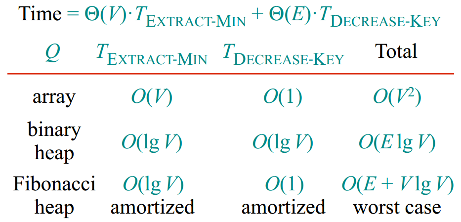
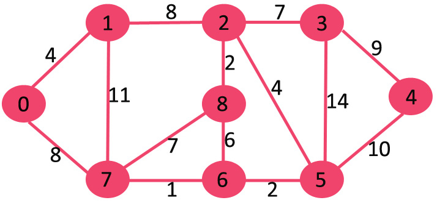
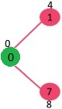
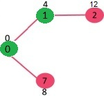
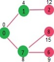
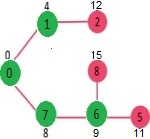
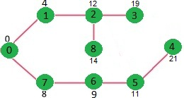

Dijkstra 单源最短路径算法

Dijkstra 算法是一种用于计算带权有向图中单源最短路径（SSSP：Single-Source
Shortest Path）的算法，由计算机科学家 Edsger Dijkstra 于 1956 年构思并于 1959
年发表。其解决的问题是：给定图 G 和源顶点 v，找到从 v 至图中所有顶点的最短路径。

Dijkstra 算法采用贪心算法（Greedy
Algorithm）范式进行设计。在最短路径问题中，对于带权有向图 G = (V, E)，Dijkstra
算法的初始实现版本未使用最小优先队列实现，其时间复杂度为 O(V2)，基于 [Fibonacci
heap](http://www.cnblogs.com/gaochundong/p/fibonacci_heap.html)
的最小优先队列实现版本，其时间复杂度为 O(E + VlogV)。

[Bellman-Ford
算法](http://www.cnblogs.com/gaochundong/p/bellman_ford_algorithm.html)和
[Dijkstra
算法](http://www.cnblogs.com/gaochundong/p/dijkstra_algorithm.html)同为解决单源最短路径的算法。对于带权有向图
G = (V, E)，Dijkstra 算法要求图 G 中边的权值均为非负，而 Bellman-Ford
算法能适应一般的情况（即存在负权边的情况）。一个实现的很好的 Dijkstra 算法比
Bellman-Ford 算法的运行时间 O(V\*E) 要低。

Dijkstra 算法描述：

1.  创建源顶点 v 到图中所有顶点的距离的集合
    distSet，为图中的所有顶点指定一个距离值，初始均为 Infinite，源顶点距离为 0；

2.  创建 SPT（Shortest Path Tree）集合 sptSet，用于存放包含在 SPT 中的顶点；

3.  如果 sptSet 中并没有包含所有的顶点，则：

    -   选中不包含在 sptSet 中的顶点 u，u 为当前 sptSet 中未确认的最短距离顶点；

    -   将 u 包含进 sptSet；

    -   更新 u 的所有邻接顶点的距离值；

伪码实现如下：

复制代码

1 function Dijkstra(Graph, source): 2 3 dist[source] ← 0 // Distance from source
to source 4 prev[source] ← undefined // Previous node in optimal path
initialization 5 6 for each vertex v in Graph: // Initialization 7 if v ≠ source
// Where v has not yet been removed from Q (unvisited nodes) 8 dist[v] ←
infinity // Unknown distance function from source to v 9 prev[v] ← undefined //
Previous node in optimal path from source 10 end if 11 add v to Q // All nodes
initially in Q (unvisited nodes) 12 end for13 14 while Q is not empty: 15 u ←
vertex in Q with min dist[u] // Source node in first case16 remove u from Q 17
18 for each neighbor v of u: // where v has not yet been removed from Q. 19 alt
← dist[u] + length(u, v) 20 if alt \< dist[v]: // A shorter path to v has been
found 21 dist[v] ← alt 22 prev[v] ← u 23 end if24 end for25 end while26 27
return dist[], prev[] 28 29 end function

复制代码

例如，下面是一个包含 9 个顶点的图，每条边分别标识了距离。

源顶点 source = 0，初始时，

-   sptSet = {false, false, false, false, false, false, false, false, false};

-   distSet = {**0**, INF, INF, INF, INF, INF, INF, INF, INF};

将 0 包含至 sptSet 中；

-   sptSet = {**true**, false, false, false, false, false, false, false, false};

更新 0 至其邻接节点的距离；

-   distSet = {**0**, **4**, INF, INF, INF, INF, INF, **8**, INF};

选择不在 sptSet 中的 Min Distance 的顶点，为顶点 1，则将 1 包含至 sptSet；

-   sptSet = {**true**, **true**, false, false, false, false, false, false,
    false};

更新 1 至其邻接节点的距离；

-   distSet = {**0**, **4**, **12**, INF, INF, INF, INF, **8**, INF};

选择不在 sptSet 中的 Min Distance 的顶点，为顶点 7，则将 7 包含至 sptSet；

-   sptSet = {**true**, **true**, false, false, false, false, false, **true**,
    false};

更新 7 至其邻接节点的距离；

-   distSet = {**0**, **4**, **12**, INF, INF, INF, **9**, **8**, **15**};

选择不在 sptSet 中的 Min Distance 的顶点，为顶点 6，则将 6 包含至 sptSet；

-   sptSet = {**true**, **true**, false, false, false, false, **true**,
    **true**, false};

更新 6 至其邻接节点的距离；

-   distSet = {**0**, **4**, **12**, INF, INF, **11**, **9**, **8**, **15**};

以此类推，直到遍历结束。

-   sptSet = {**true**, **true**, **true**, **true**, **true**, **true**,
    **true**, **true**, **true**};

-   distSet = {**0**, **4**, **12**, **19**, **21**, **11**, **9**, **8**,
    **14**};

最终结果为源顶点 0 至所有顶点的距离：

复制代码

Vertex Distance from Source 0 0 1 4 2 12 3 19 4 21 5 11 6 9 7 8 8 14

复制代码

C\#代码实现：

复制代码

1 using System; 2 using System.Collections.Generic; 3 using System.Linq; 4 5
namespace GraphAlgorithmTesting 6 { 7 class Program 8 { 9 static void
Main(string[] args) 10 { 11 int[,] graph = new int[9, 9] 12 { 13 {0, 4, 0, 0, 0,
0, 0, 8, 0}, 14 {4, 0, 8, 0, 0, 0, 0, 11, 0}, 15 {0, 8, 0, 7, 0, 4, 0, 0, 2}, 16
{0, 0, 7, 0, 9, 14, 0, 0, 0}, 17 {0, 0, 0, 9, 0, 10, 0, 0, 0}, 18 {0, 0, 4, 0,
10, 0, 2, 0, 0}, 19 {0, 0, 0, 14, 0, 2, 0, 1, 6}, 20 {8, 11, 0, 0, 0, 0, 1, 0,
7}, 21 {0, 0, 2, 0, 0, 0, 6, 7, 0} 22 }; 23 24 Graph g = new
Graph(graph.GetLength(0)); 25 for (int i = 0; i \< graph.GetLength(0); i++) 26 {
27 for (int j = 0; j \< graph.GetLength(1); j++) 28 { 29 if (graph[i, j] \> 0)
30 g.AddEdge(i, j, graph[i, j]); 31 } 32 } 33 34 int[] dist = g.Dijkstra(0); 35
Console.WriteLine("Vertex\\t\\tDistance from Source"); 36 for (int i = 0; i \<
dist.Length; i++) 37 { 38 Console.WriteLine("{0}\\t\\t{1}", i, dist[i]); 39 } 40
41 Console.ReadKey(); 42 } 43 44 class Edge 45 { 46 public Edge(int begin, int
end, int distance) 47 { 48 this.Begin = begin; 49 this.End = end; 50
this.Distance = distance; 51 } 52 53 public int Begin { get; private set; } 54
public int End { get; private set; } 55 public int Distance { get; private set;
} 56 } 57 58 class Graph 59 { 60 private Dictionary\<int, List\<Edge\>\>
\_adjacentEdges 61 = new Dictionary\<int, List\<Edge\>\>(); 62 63 public
Graph(int vertexCount) 64 { 65 this.VertexCount = vertexCount; 66 } 67 68 public
int VertexCount { get; private set; } 69 70 public void AddEdge(int begin, int
end, int distance) 71 { 72 if (!\_adjacentEdges.ContainsKey(begin)) 73 { 74 var
edges = new List\<Edge\>(); 75 \_adjacentEdges.Add(begin, edges); 76 } 77 78
\_adjacentEdges[begin].Add(new Edge(begin, end, distance)); 79 } 80 81 public
int[] Dijkstra(int source) 82 { 83 // dist[i] will hold the shortest distance
from source to i 84 int[] distSet = new int[VertexCount]; 85 86 // sptSet[i]
will true if vertex i is included in shortest 87 // path tree or shortest
distance from source to i is finalized 88 bool[] sptSet = new bool[VertexCount];
89 90 // initialize all distances as INFINITE and stpSet[] as false 91 for (int
i = 0; i \< VertexCount; i++) 92 { 93 distSet[i] = int.MaxValue; 94 sptSet[i] =
false; 95 } 96 97 // distance of source vertex from itself is always 0 98
distSet[source] = 0; 99 100 // find shortest path for all vertices101 for (int i
= 0; i \< VertexCount - 1; i++)102 { 103 // pick the minimum distance vertex
from the set of vertices not104 // yet processed. u is always equal to source in
first iteration.105 int u = CalculateMinDistance(distSet, sptSet); 106 107 //
mark the picked vertex as processed108 sptSet[u] = true;109 110 // update dist
value of the adjacent vertices of the picked vertex.111 for (int v = 0; v \<
VertexCount; v++)112 { 113 // update dist[v] only if is not in sptSet, there is
an edge from114 // u to v, and total weight of path from source to v through u
is115 // smaller than current value of dist[v]116 if (!sptSet[v] 117 &&
distSet[u] != int.MaxValue118 && \_adjacentEdges[u].Exists(e =\> e.End == v))
119 { 120 int d = \_adjacentEdges[u].Single(e =\> e.End == v).Distance; 121 if
(distSet[u] + d \< distSet[v]) 122 { 123 distSet[v] = distSet[u] + d; 124 } 125
} 126 } 127 } 128 129 return distSet; 130 } 131 132 /// \<summary\>133 /// A
utility function to find the vertex with minimum distance value, 134 /// from
the set of vertices not yet included in shortest path tree 135 ///
\</summary\>136 private int CalculateMinDistance(int[] distSet, bool[]
sptSet)137 { 138 int minDistance = int.MaxValue;139 int minDistanceIndex =
\-1;140 141 for (int v = 0; v \< VertexCount; v++)142 { 143 if (!sptSet[v] &&
distSet[v] \<= minDistance) 144 { 145 minDistance = distSet[v]; 146
minDistanceIndex = v; 147 } 148 } 149 150 return minDistanceIndex; 151 } 152 }
153 } 154 }

复制代码
