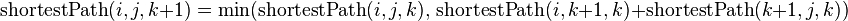
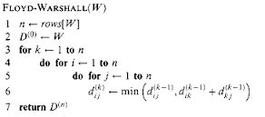
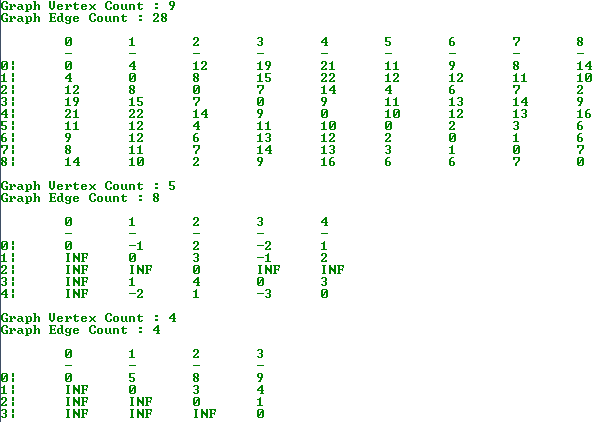

Floyd-Warshall 全源最短路径算法

Floyd-Warshall 算法采用动态规划方案来解决在一个有向图 G = (V, E)
上每对顶点间的最短路径问题，即全源最短路径问题（All-Pairs Shortest Paths
Problem），其中图 G 允许存在权值为负的边，但不存在权值为负的回路。Floyd-Warshall
算法的运行时间为 Θ(V3)。

Floyd-Warshall 算法由 Robert Floyd 于 1962 年提出，但其实质上与 Bernad Roy 于
1959 年和 Stephen Warshall 于 1962 年提出的算法相同。

解决单源最短路径问题的方案有 [Dijkstra
算法](http://www.cnblogs.com/gaochundong/p/dijkstra_algorithm.html)和
[Bellman-Ford
算法](http://www.cnblogs.com/gaochundong/p/bellman_ford_algorithm.html)，对于全源最短路径问题可以认为是单源最短路径问题（Single
Source Shortest Paths
Problem）的推广，即分别以每个顶点作为源顶点并求其至其它顶点的最短距离。更通用的全源最短路径算法包括：

-   针对稠密图的 Floyd-Warshall 算法：时间复杂度为 O(V3)；

-   针对稀疏图的 Johnson 算法：时间复杂度为 O(V2logV + VE)；

最短路径算法中的最优子结构指的是两顶点之间的最短路径包括路径上其它顶点的最短路径。具体描述为：对于给定的带权图
G = (V, E)，设 p = \<v1, v2, …,vk\> 是从 v1 到 vk 的最短路径，那么对于任意 i 和
j，1 ≤ i ≤ j ≤ k，pij = \<vi, vi+1, …, vj\> 为 p 中顶点 vi 到 vj 的子路径，那么
pij 是顶点 vi 到 vj 的最短路径。

Floyd-Warshall 算法的设计基于了如下观察。设带权图 G = (V, E) 中的所有顶点 V =
{1, 2, . . . , n}，考虑一个顶点子集 {1, 2, . . . , k}。对于任意对顶点 i,
j，考虑从顶点 i 到 j 的所有路径的中间顶点都来自该子集 {1, 2, . . . , k}，设 p
是该子集中的最短路径。Floyd-Warshall 算法描述了 p 与 i, j
间最短路径及中间顶点集合 {1, 2, . . . , k - 1} 的关系，该关系依赖于 k 是否是路径
p 上的一个中间顶点。

算法伪码如下：

最短路径算法的设计都使用了松弛（relaxation）技术。在算法开始时只知道图中边的权值，然后随着处理逐渐得到各对顶点的最短路径的信息，算法会逐渐更新这些信息，每步都会检查是否可以找到一条路径比当前已有路径更短，这一过程通常称为松弛（relaxation）。

C\# 代码实现：

复制代码

1 using System; 2 using System.Collections.Generic; 3 using System.Linq; 4 5
namespace GraphAlgorithmTesting 6 { 7 class Program 8 { 9 static void
Main(string[] args) 10 { 11 int[,] graph = new int[9, 9] 12 { 13 {0, 4, 0, 0, 0,
0, 0, 8, 0}, 14 {4, 0, 8, 0, 0, 0, 0, 11, 0}, 15 {0, 8, 0, 7, 0, 4, 0, 0, 2}, 16
{0, 0, 7, 0, 9, 14, 0, 0, 0}, 17 {0, 0, 0, 9, 0, 10, 0, 0, 0}, 18 {0, 0, 4, 0,
10, 0, 2, 0, 0}, 19 {0, 0, 0, 14, 0, 2, 0, 1, 6}, 20 {8, 11, 0, 0, 0, 0, 1, 0,
7}, 21 {0, 0, 2, 0, 0, 0, 6, 7, 0} 22 }; 23 24 Graph g = new
Graph(graph.GetLength(0)); 25 for (int i = 0; i \< graph.GetLength(0); i++) 26 {
27 for (int j = 0; j \< graph.GetLength(1); j++) 28 { 29 if (graph[i, j] \> 0)
30 g.AddEdge(i, j, graph[i, j]); 31 } 32 } 33 34 Console.WriteLine("Graph Vertex
Count : {0}", g.VertexCount); 35 Console.WriteLine("Graph Edge Count : {0}",
g.EdgeCount); 36 Console.WriteLine(); 37 38 int[,] distSet = g.FloydWarshell();
39 PrintSolution(g, distSet); 40 41 // build a directed and negative weighted
graph 42 Graph directedGraph1 = new Graph(5); 43 directedGraph1.AddEdge(0, 1,
\-1); 44 directedGraph1.AddEdge(0, 2, 4); 45 directedGraph1.AddEdge(1, 2, 3); 46
directedGraph1.AddEdge(1, 3, 2); 47 directedGraph1.AddEdge(1, 4, 2); 48
directedGraph1.AddEdge(3, 2, 5); 49 directedGraph1.AddEdge(3, 1, 1); 50
directedGraph1.AddEdge(4, 3, -3); 51 52 Console.WriteLine(); 53
Console.WriteLine("Graph Vertex Count : {0}", directedGraph1.VertexCount); 54
Console.WriteLine("Graph Edge Count : {0}", directedGraph1.EdgeCount); 55
Console.WriteLine(); 56 57 int[,] distSet1 = directedGraph1.FloydWarshell(); 58
PrintSolution(directedGraph1, distSet1); 59 60 // build a directed and positive
weighted graph 61 Graph directedGraph2 = new Graph(4); 62
directedGraph2.AddEdge(0, 1, 5); 63 directedGraph2.AddEdge(0, 3, 10); 64
directedGraph2.AddEdge(1, 2, 3); 65 directedGraph2.AddEdge(2, 3, 1); 66 67
Console.WriteLine(); 68 Console.WriteLine("Graph Vertex Count : {0}",
directedGraph2.VertexCount); 69 Console.WriteLine("Graph Edge Count : {0}",
directedGraph2.EdgeCount); 70 Console.WriteLine(); 71 72 int[,] distSet2 =
directedGraph2.FloydWarshell(); 73 PrintSolution(directedGraph2, distSet2); 74
75 Console.ReadKey(); 76 } 77 78 private static void PrintSolution(Graph g,
int[,] distSet) 79 { 80 Console.Write("\\t"); 81 for (int i = 0; i \<
g.VertexCount; i++) 82 { 83 Console.Write(i + "\\t"); 84 } 85
Console.WriteLine(); 86 Console.Write("\\t"); 87 for (int i = 0; i \<
g.VertexCount; i++) 88 { 89 Console.Write("-" + "\\t"); 90 } 91
Console.WriteLine(); 92 for (int i = 0; i \< g.VertexCount; i++) 93 { 94
Console.Write(i + "\|\\t"); 95 for (int j = 0; j \< g.VertexCount; j++) 96 { 97
if (distSet[i, j] == int.MaxValue) 98 { 99 Console.Write("INF" + "\\t");100 }
101 else102 { 103 Console.Write(distSet[i, j] + "\\t");104 } 105 } 106
Console.WriteLine(); 107 } 108 } 109 110 class Edge 111 { 112 public Edge(int
begin, int end, int weight) 113 { 114 this.Begin = begin;115 this.End = end;116
this.Weight = weight;117 } 118 119 public int Begin { get; private set; }120
public int End { get; private set; }121 public int Weight { get; private set;
}122 123 public override string ToString() 124 { 125 return string.Format(126
"Begin[{0}], End[{1}], Weight[{2}]",127 Begin, End, Weight); 128 } 129 } 130 131
class Graph 132 { 133 private Dictionary\<int, List\<Edge\>\> \_adjacentEdges134
= new Dictionary\<int, List\<Edge\>\>();135 136 public Graph(int vertexCount)
137 { 138 this.VertexCount = vertexCount;139 } 140 141 public int VertexCount {
get; private set; }142 143 public int EdgeCount 144 { 145 get146 { 147 return
\_adjacentEdges.Values.SelectMany(e =\> e).Count(); 148 } 149 } 150 151 public
void AddEdge(int begin, int end, int weight) 152 { 153 if
(!\_adjacentEdges.ContainsKey(begin)) 154 { 155 var edges = new List\<Edge\>();
156 \_adjacentEdges.Add(begin, edges); 157 } 158 159
\_adjacentEdges[begin].Add(new Edge(begin, end, weight)); 160 } 161 162 public
int[,] FloydWarshell()163 { 164 /\* distSet[,] will be the output matrix that
will finally have the shortest165 distances between every pair of vertices
\*/166 int[,] distSet = new int[VertexCount, VertexCount];167 168 for (int i =
0; i \< VertexCount; i++)169 { 170 for (int j = 0; j \< VertexCount; j++)171 {
172 distSet[i, j] = int.MaxValue;173 } 174 } 175 for (int i = 0; i \<
VertexCount; i++)176 { 177 distSet[i, i] = 0;178 } 179 180 /\* Initialize the
solution matrix same as input graph matrix. Or181 we can say the initial values
of shortest distances are based 182 on shortest paths considering no
intermediate vertex. \*/183 foreach (var edge in
\_adjacentEdges.Values.SelectMany(e =\> e)) 184 { 185 distSet[edge.Begin,
edge.End] = edge.Weight; 186 } 187 188 /\* Add all vertices one by one to the
set of intermediate vertices.189 ---\> Before start of a iteration, we have
shortest distances between all 190 pairs of vertices such that the shortest
distances consider only the 191 vertices in set {0, 1, 2, .. k-1} as
intermediate vertices. 192 ---\> After the end of a iteration, vertex no. k is
added to the set of 193 intermediate vertices and the set becomes {0, 1, 2, ..
k} \*/194 for (int k = 0; k \< VertexCount; k++)195 { 196 // Pick all vertices
as source one by one197 for (int i = 0; i \< VertexCount; i++)198 { 199 // Pick
all vertices as destination for the above picked source200 for (int j = 0; j \<
VertexCount; j++)201 { 202 // If vertex k is on the shortest path from203 // i
to j, then update the value of distSet[i,j]204 if (distSet[i, k] !=
int.MaxValue205 && distSet[k, j] != int.MaxValue206 && distSet[i, k] +
distSet[k, j] \< distSet[i, j]) 207 { 208 distSet[i, j] = distSet[i, k] +
distSet[k, j]; 209 } 210 } 211 } 212 } 213 214 return distSet; 215 } 216 } 217 }
218 }

复制代码

运行结果如下：

