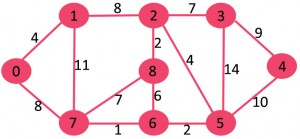
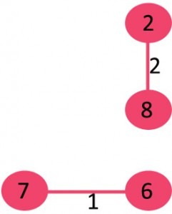
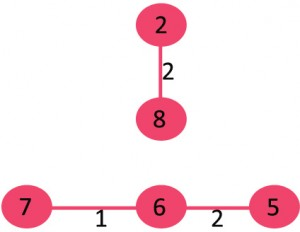
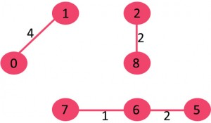
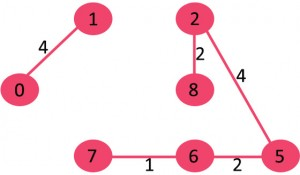
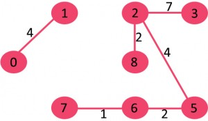
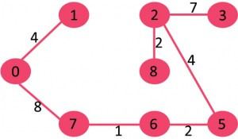
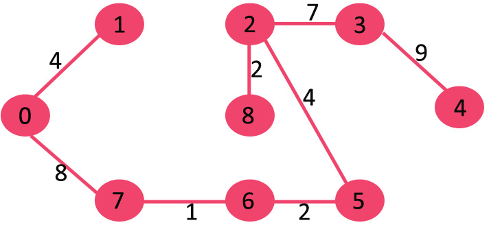
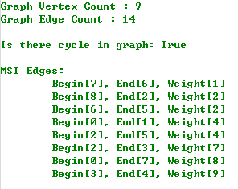

Kruskal 最小生成树算法

对于一个给定的连通的无向图 G = (V, E)，希望找到一个无回路的子集 T，T 是 E
的子集，它连接了所有的顶点，且其权值之和为最小。

因为 T 无回路且连接所有的顶点，所以它必然是一棵树，称为生成树（Spanning
Tree），因为它生成了图 G。显然，由于树 T 连接了所有的顶点，所以树 T 有 V - 1
条边。一张图 G 可以有很多棵生成树，而把确定权值最小的树 T
的问题称为**最小生成树问题（Minimum Spanning Tree）**。术语 "最小生成树"
实际上是 "最小权值生成树" 的缩写。

**Kruskal 算法**提供一种在 O(ElogV) 运行时间确定最小生成树的方案。Kruskal
算法基于贪心算法（Greedy
Algorithm）的思想进行设计，其选择的**贪心策略**就是，每次都选择权重最小的但未形成环路的边加入到生成树中。其算法结构如下：

1.  将所有的边按照权重非递减排序；

2.  选择最小权重的边，判断是否其在当前的生成树中形成了一个环路。如果环路没有形成，则将该边加入树中，否则放弃。

3.  重复步骤 2，直到有 V - 1 条边在生成树中。

上述步骤 2 中使用了 [Union-Find
算法](http://www.cnblogs.com/gaochundong/p/disjoint_set_forests_heuristics.html)来判断是否存在环路。

例如，下面是一个无向连通图 G。

图 G 中包含 9 个顶点和 14 条边，所以期待的最小生成树应包含 (9 - 1) = 8 条边。

首先对所有的边按照权重的非递减顺序排序：

复制代码

Weight Src Dest 1 7 6 2 8 2 2 6 5 4 0 1 4 2 5 6 8 6 7 2 3 7 7 8 8 0 7 8 1 2 9 3
4 10 5 4 11 1 7 14 3 5

复制代码

然后从排序后的列表中选择权重最小的边。

1\. 选择边 {7, 6}，无环路形成，包含在生成树中。

2\. 选择边 {8, 2}，无环路形成，包含在生成树中。

3\. 选择边 {6, 5}，无环路形成，包含在生成树中。

4\. 选择边 {0, 1}，无环路形成，包含在生成树中。

5\. 选择边 {2, 5}，无环路形成，包含在生成树中。

6\. 选择边 {8, 6}，有环路形成，放弃。

7\. 选择边 {2, 3}，无环路形成，包含在生成树中。

8\. 选择边 {7, 8}，有环路形成，放弃。

9\. 选择边 {0, 7}，无环路形成，包含在生成树中。

10\. 选择边 {1, 2}，有环路形成，放弃。

11\. 选择边 {3, 4}，无环路形成，包含在生成树中。

12\. 由于当前生成树中已经包含 V - 1 条边，算法结束。

C\# 实现的 Kruskal 算法如下。

复制代码

1 using System; 2 using System.Collections.Generic; 3 using System.Linq; 4 5
namespace GraphAlgorithmTesting 6 { 7 class Program 8 { 9 static void
Main(string[] args) 10 { 11 Graph g = new Graph(9); 12 g.AddEdge(0, 1, 4); 13
g.AddEdge(0, 7, 8); 14 g.AddEdge(1, 2, 8); 15 g.AddEdge(1, 7, 11); 16
g.AddEdge(2, 3, 7); 17 g.AddEdge(2, 5, 4); 18 g.AddEdge(8, 2, 2); 19
g.AddEdge(3, 4, 9); 20 g.AddEdge(3, 5, 14); 21 g.AddEdge(5, 4, 10); 22
g.AddEdge(6, 5, 2); 23 g.AddEdge(8, 6, 6); 24 g.AddEdge(7, 6, 1); 25
g.AddEdge(7, 8, 7); 26 27 Console.WriteLine(); 28 Console.WriteLine("Graph
Vertex Count : {0}", g.VertexCount); 29 Console.WriteLine("Graph Edge Count :
{0}", g.EdgeCount); 30 Console.WriteLine(); 31 32 Console.WriteLine("Is there
cycle in graph: {0}", g.HasCycle()); 33 Console.WriteLine(); 34 35 Edge[] mst =
g.Kruskal(); 36 Console.WriteLine("MST Edges:"); 37 foreach (var edge in mst) 38
{ 39 Console.WriteLine("\\t{0}", edge); 40 } 41 42 Console.ReadKey(); 43 } 44 45
class Edge 46 { 47 public Edge(int begin, int end, int weight) 48 { 49
this.Begin = begin; 50 this.End = end; 51 this.Weight = weight; 52 } 53 54
public int Begin { get; private set; } 55 public int End { get; private set; }
56 public int Weight { get; private set; } 57 58 public override string
ToString() 59 { 60 return string.Format( 61 "Begin[{0}], End[{1}], Weight[{2}]",
62 Begin, End, Weight); 63 } 64 } 65 66 class Subset 67 { 68 public int Parent {
get; set; } 69 public int Rank { get; set; } 70 } 71 72 class Graph 73 { 74
private Dictionary\<int, List\<Edge\>\> \_adjacentEdges 75 = new
Dictionary\<int, List\<Edge\>\>(); 76 77 public Graph(int vertexCount) 78 { 79
this.VertexCount = vertexCount; 80 } 81 82 public int VertexCount { get; private
set; } 83 84 public IEnumerable\<int\> Vertices { get { return
\_adjacentEdges.Keys; } } 85 86 public IEnumerable\<Edge\> Edges 87 { 88 get {
return \_adjacentEdges.Values.SelectMany(e =\> e); } 89 } 90 91 public int
EdgeCount { get { return this.Edges.Count(); } } 92 93 public void AddEdge(int
begin, int end, int weight) 94 { 95 if (!\_adjacentEdges.ContainsKey(begin)) 96
{ 97 var edges = new List\<Edge\>(); 98 \_adjacentEdges.Add(begin, edges); 99 }
100 101 \_adjacentEdges[begin].Add(new Edge(begin, end, weight)); 102 } 103 104
private int Find(Subset[] subsets, int i) 105 { 106 // find root and make root
as parent of i (path compression)107 if (subsets[i].Parent != i) 108
subsets[i].Parent = Find(subsets, subsets[i].Parent); 109 110 return
subsets[i].Parent; 111 } 112 113 private void Union(Subset[] subsets, int x, int
y) 114 { 115 int xroot = Find(subsets, x); 116 int yroot = Find(subsets, y); 117
118 // Attach smaller rank tree under root of high rank tree119 // (Union by
Rank)120 if (subsets[xroot].Rank \< subsets[yroot].Rank) 121
subsets[xroot].Parent = yroot; 122 else if (subsets[xroot].Rank \>
subsets[yroot].Rank) 123 subsets[yroot].Parent = xroot; 124 125 // If ranks are
same, then make one as root and increment126 // its rank by one127 else128 { 129
subsets[yroot].Parent = xroot; 130 subsets[xroot].Rank++; 131 } 132 } 133 134
public bool HasCycle() 135 { 136 Subset[] subsets = new Subset[VertexCount]; 137
for (int i = 0; i \< subsets.Length; i++)138 { 139 subsets[i] = new Subset();
140 subsets[i].Parent = i; 141 subsets[i].Rank = 0;142 } 143 144 // Iterate
through all edges of graph, find subset of both145 // vertices of every edge, if
both subsets are same,146 // then there is cycle in graph.147 foreach (var edge
in this.Edges)148 { 149 int x = Find(subsets, edge.Begin); 150 int y =
Find(subsets, edge.End); 151 152 if (x == y) 153 { 154 return true;155 } 156 157
Union(subsets, x, y); 158 } 159 160 return false;161 } 162 163 public Edge[]
Kruskal() 164 { 165 // This will store the resultant MST166 Edge[] mst = new
Edge[VertexCount - 1];167 168 // Step 1: Sort all the edges in non-decreasing
order of their weight169 // If we are not allowed to change the given graph, we
can create a copy of170 // array of edges171 var sortedEdges =
this.Edges.OrderBy(t =\> t.Weight);172 var enumerator =
sortedEdges.GetEnumerator(); 173 174 // Allocate memory for creating V
ssubsets175 // Create V subsets with single elements176 Subset[] subsets = new
Subset[VertexCount]; 177 for (int i = 0; i \< subsets.Length; i++)178 { 179
subsets[i] = new Subset(); 180 subsets[i].Parent = i; 181 subsets[i].Rank =
0;182 } 183 184 // Number of edges to be taken is equal to V-1185 int e = 0;186
while (e \< VertexCount - 1)187 { 188 // Step 2: Pick the smallest edge. And
increment the index189 // for next iteration190 Edge nextEdge; 191 if
(enumerator.MoveNext()) 192 { 193 nextEdge = enumerator.Current; 194 195 int x =
Find(subsets, nextEdge.Begin); 196 int y = Find(subsets, nextEdge.End); 197 198
// If including this edge does't cause cycle, include it199 // in result and
increment the index of result for next edge200 if (x != y) 201 { 202 mst[e++] =
nextEdge; 203 Union(subsets, x, y); 204 } 205 else206 { 207 // Else discard the
nextEdge208 } 209 } 210 } 211 212 return mst; 213 } 214 } 215 } 216 }

复制代码

输出结果如下：

