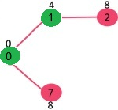
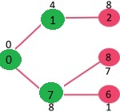
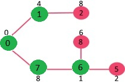
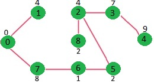
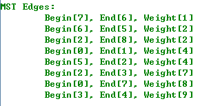

Prim 最小生成树算法

**Prim 算法**是一种解决**最小生成树问题（Minimum Spanning Tree）**的算法。和
[Kruskal
算法](http://www.cnblogs.com/gaochundong/p/kruskal_minimum_spanning_tree.html)类似，Prim
算法的设计也是基于贪心算法（Greedy algorithm）。

Prim
算法的思想很简单，一棵生成树必须连接所有的顶点，而要保持最小权重则每次选择邻接的边时要选择较小权重的边。Prim
算法看起来非常类似于单源最短路径 [Dijkstra
算法](http://www.cnblogs.com/gaochundong/p/dijkstra_algorithm.html)，从源点出发，寻找当前的最短路径，每次比较当前可达邻接顶点中最小的一个边加入到生成树中。

例如，下面这张连通的无向图 G，包含 9 个顶点和 14
条边，所以期待的最小生成树应包含 (9 - 1) = 8 条边。

创建 mstSet 包含到所有顶点的距离，初始为 INF，源点 0 的距离为 0，{0, INF, INF,
INF, INF, INF, INF, INF, INF}。

选择当前最短距离的顶点，即还是顶点 0，将 0 加入 MST，此时邻接顶点为 1 和 7。

选择当前最小距离的顶点 1，将 1 加入 MST，此时邻接顶点为 2。

选择 2 和 7 中最小距离的顶点为 7，将 7 加入 MST，此时邻接顶点为 6 和 8。

选择 2, 6, 8 中最小距离的顶点为 6，将 6 加入 MST，此时邻接顶点为 5。

重复上面步骤直到遍历完所有顶点为止，会得到如下 MST。

C\# 实现 **Prim 算法**如下。Prim 算法可以达到 O(ElogV)
的运行时间，如果采用斐波那契堆实现，运行时间可以减少到 O(E + VlogV)，如果 V
远小于 E 的话，将是对算法较大的改进。

复制代码

1 using System; 2 using System.Collections.Generic; 3 using System.Linq; 4 5
namespace GraphAlgorithmTesting 6 { 7 class Program 8 { 9 static void
Main(string[] args) 10 { 11 Graph g = new Graph(9); 12 g.AddEdge(0, 1, 4); 13
g.AddEdge(0, 7, 8); 14 g.AddEdge(1, 2, 8); 15 g.AddEdge(1, 7, 11); 16
g.AddEdge(2, 3, 7); 17 g.AddEdge(2, 5, 4); 18 g.AddEdge(3, 4, 9); 19
g.AddEdge(3, 5, 14); 20 g.AddEdge(5, 4, 10); 21 g.AddEdge(6, 5, 2); 22
g.AddEdge(7, 6, 1); 23 g.AddEdge(7, 8, 7); 24 g.AddEdge(8, 2, 2); 25
g.AddEdge(8, 6, 6); 26 27 // sorry, this is an undirect graph, 28 // so, you
know that this is not a good idea. 29 List\<Edge\> edges = g.Edges 30 .Select(e
=\> new Edge(e.End, e.Begin, e.Weight)) 31 .ToList(); 32 foreach (var edge in
edges) 33 { 34 g.AddEdge(edge.Begin, edge.End, edge.Weight); 35 } 36 37
Console.WriteLine(); 38 Console.WriteLine("Graph Vertex Count : {0}",
g.VertexCount); 39 Console.WriteLine("Graph Edge Count : {0}", g.EdgeCount); 40
Console.WriteLine(); 41 42 List\<Edge\> mst = g.Prim(); 43
Console.WriteLine("MST Edges:"); 44 foreach (var edge in mst.OrderBy(e =\>
e.Weight)) 45 { 46 Console.WriteLine("\\t{0}", edge); 47 } 48 49
Console.ReadKey(); 50 } 51 52 class Edge 53 { 54 public Edge(int begin, int end,
int weight) 55 { 56 this.Begin = begin; 57 this.End = end; 58 this.Weight =
weight; 59 } 60 61 public int Begin { get; private set; } 62 public int End {
get; private set; } 63 public int Weight { get; private set; } 64 65 public
override string ToString() 66 { 67 return string.Format( 68 "Begin[{0}],
End[{1}], Weight[{2}]", 69 Begin, End, Weight); 70 } 71 } 72 73 class Graph 74 {
75 private Dictionary\<int, List\<Edge\>\> \_adjacentEdges 76 = new
Dictionary\<int, List\<Edge\>\>(); 77 78 public Graph(int vertexCount) 79 { 80
this.VertexCount = vertexCount; 81 } 82 83 public int VertexCount { get; private
set; } 84 85 public IEnumerable\<int\> Vertices { get { return
\_adjacentEdges.Keys; } } 86 87 public IEnumerable\<Edge\> Edges 88 { 89 get {
return \_adjacentEdges.Values.SelectMany(e =\> e); } 90 } 91 92 public int
EdgeCount { get { return this.Edges.Count(); } } 93 94 public void AddEdge(int
begin, int end, int weight) 95 { 96 if (!\_adjacentEdges.ContainsKey(begin)) 97
{ 98 var edges = new List\<Edge\>(); 99 \_adjacentEdges.Add(begin, edges); 100 }
101 102 \_adjacentEdges[begin].Add(new Edge(begin, end, weight)); 103 } 104 105
public List\<Edge\> Prim() 106 { 107 // Array to store constructed MST108 int[]
parent = new int[VertexCount];109 110 // Key values used to pick minimum weight
edge in cut111 int[] keySet = new int[VertexCount];112 113 // To represent set
of vertices not yet included in MST114 bool[] mstSet = new bool[VertexCount];115
116 // Initialize all keys as INFINITE117 for (int i = 0; i \< VertexCount;
i++)118 { 119 keySet[i] = int.MaxValue;120 mstSet[i] = false;121 } 122 123 //
Always include first 1st vertex in MST.124 // Make key 0 so that this vertex is
picked as first vertex125 keySet[0] = 0;126 parent[0] = -1; // First node is
always root of MST127 128 // The MST will have V vertices129 for (int i = 0; i
\< VertexCount - 1; i++)130 { 131 // Pick thd minimum key vertex from the set of
vertices132 // not yet included in MST133 int u = CalculateMinDistance(keySet,
mstSet); 134 135 // Add the picked vertex to the MST Set136 mstSet[u] = true;137
138 // Update key value and parent index of the adjacent vertices of139 // the
picked vertex. Consider only those vertices which are not yet140 // included in
MST141 for (int v = 0; v \< VertexCount; v++)142 { 143 // graph[u, v] is non
zero only for adjacent vertices of m144 // mstSet[v] is false for vertices not
yet included in MST145 // Update the key only if graph[u, v] is smaller than
key[v]146 if (!mstSet[v] 147 && \_adjacentEdges.ContainsKey(u) 148 &&
\_adjacentEdges[u].Exists(e =\> e.End == v)) 149 { 150 int d =
\_adjacentEdges[u].Single(e =\> e.End == v).Weight; 151 if (d \< keySet[v]) 152
{ 153 keySet[v] = d; 154 parent[v] = u; 155 } 156 } 157 } 158 } 159 160 // get
all MST edges161 List\<Edge\> mst = new List\<Edge\>(); 162 for (int i = 1; i \<
VertexCount; i++)163 mst.Add(\_adjacentEdges[parent[i]].Single(e =\> e.End ==
i)); 164 165 return mst; 166 } 167 168 private int CalculateMinDistance(int[]
keySet, bool[] mstSet)169 { 170 int minDistance = int.MaxValue;171 int
minDistanceIndex = -1;172 173 for (int v = 0; v \< VertexCount; v++)174 { 175 if
(!mstSet[v] && keySet[v] \<= minDistance) 176 { 177 minDistance = keySet[v]; 178
minDistanceIndex = v; 179 } 180 } 181 182 return minDistanceIndex; 183 } 184 }
185 } 186 }

复制代码

输出结果如下：

**参考资料**
