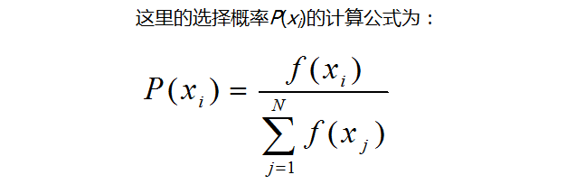
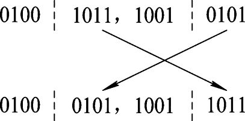
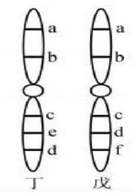
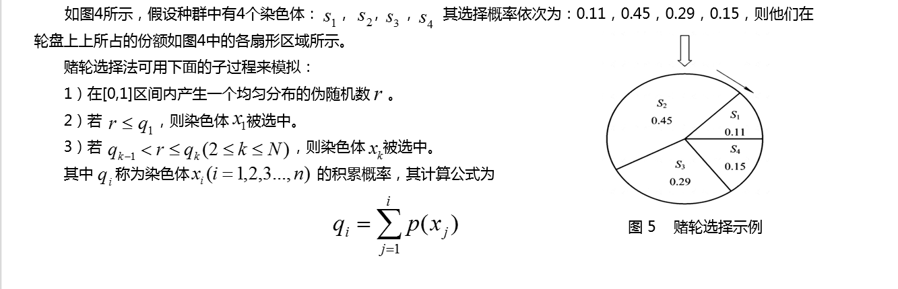
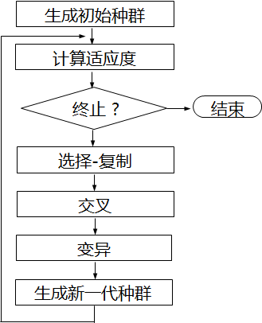

遗传算法定义

遗传算法（Genetic Algorithm,
GA）起源于对生物系统所进行的计算机模拟研究。它是模仿自然界生物进化机制发展起来的随机全局搜索和优化方法，借鉴了达尔文的进化论和孟德尔的遗传学说。其本质是一种高效、并行、全局搜索的方法，能在搜索过程中自动获取和积累有关搜索空间的知识，并自适应地控制搜索过程以求得最佳解。

袋鼠跳问题（纯粹是觉得有意思）

**“袋鼠跳”问题**

既然我们把函数曲线理解成一个一个山峰和山谷组成的山脉。那么我们可以设想所得到的每一个解就是一只袋鼠，我们希望它们不断的向着更高处跳去，直到跳到最高的山峰（尽管袋鼠本身不见得愿意那么做）。所以求最大值的过程就转化成一个“袋鼠跳”的过程。

作为对比下面简单介绍“袋鼠跳”的几种方式。

1\. 爬山法（最速上升爬山法）：

从搜索空间中随机产生邻近的点，从中选择对应解最优的个体，替换原来的个体，不断重复上述过程。因为爬山法只对“邻近”的点作比较，所以目光比较“短浅”，常常只能收敛到离开初始位置比较近的局部最优解上面。对于存在很多局部最优点的问题，通过一个简单的迭代找出全局最优解的机会非常渺茫。（在爬山法中，袋鼠最有希望到达最靠近它出发点的山顶，但不能保证该山顶是珠穆朗玛峰，或者是一个非常高的山峰。因为一路上它只顾上坡，没有下坡。）

2\. 模拟退火：

这个方法来自金属热加工过程的启发。在金属热加工过程中，当金属的温度超过它的熔点（Melting
Point）时，原子就会激烈地随机运动。与所有的其它的物理系统相类似，原子的这种运动趋向于寻找其能量的极小状态。在这个能量的变迁过程中，开始时，温度非常高，
使得原子具有很高的能量。随着温度不断降低，金属逐渐冷却，金属中的原子的能量就越来越小，最后达到所有可能的最低点。利用模拟退火的时候，让算法从较大的跳跃开始，使到它有足够的“能量”逃离可能“路过”的局部最优解而不至于限制在其中，当它停在全局最优解附近的时候，逐渐的减小跳跃量，以便使其“落脚
”到全局最优解上。（在模拟退火中，袋鼠喝醉了，而且随机地大跳跃了很长时间。运气好的话，它从一个山峰跳过山谷，到了另外一个更高的山峰上。但最后，它渐渐清醒了并朝着它所在的峰顶跳去。）

3\. 遗传算法：

模拟物竞天择的生物进化过程，通过维护一个潜在解的群体执行了多方向的搜索，并支持这些方向上的信息构成和交换。是以面为单位的搜索，比以点为单位的搜索，更能发现全局最优解。（在遗传算法中，有很多袋鼠，它们降落到喜玛拉雅山脉的任意地方。**这些袋鼠并不知道它们的任务是寻找珠穆朗玛峰。**但每过几年，就在一些海拔高度较低的地方射杀一些袋鼠，并希望存活下来的袋鼠是多产的，在它们所处的地方生儿育女*。*）（或者换个说法。从前，有一大群袋鼠，它们被莫名其妙的零散地遗弃于喜马拉雅山脉。于是只好在那里艰苦的生活。海拔低的地方弥漫着一种无色无味的毒气，海拔越高毒气越稀薄。可是可怜的袋鼠们对此**全然不觉**，还是习惯于活蹦乱跳。于是，不断有袋鼠死于海拔较低的地方，而越是在海拔高的袋鼠越是能活得更久，也越有机会生儿育女。就这样经过许多年，这些袋鼠们竟然都不自觉地聚拢到了一个个的山峰上，可是在所有的袋鼠中，只有聚拢到珠穆朗玛峰的袋鼠被带回了美丽的澳洲。）

相关术语

**基因型(genotype)**

性状染色体的内部表现；

**表现型(phenotype)**

染色体决定的性状的外部表现，或者说，根据基因型形成的个体的外部表现；

**进化(evolution)**

种群逐渐适应生存环境，品质不断得到改良。生物的进化是以种群的形式进行的。

**适应度(fitness)**

度量某个物种对于生存环境的适应程度。

**选择(selection)**

>   以一定的概率从种群中选择若干个个体。一般，选择过程是一种基于适应度的优胜劣汰的过程。

**复制(reproduction)**

>   细胞分裂时，遗传物质DNA通过复制而转移到新产生的细胞中，新细胞就继承了旧细胞的基因。

**交叉(crossover)**

>   两个染色体的某一相同位置处DNA被切断，前后两串分别交叉组合形成两个新的染色体。也称基因重组或杂交；

**变异(mutation)**

复制时可能（很小的概率）产生某些复制差错，变异产生新的染色体，表现出新的性状。

**编码(coding)**

>   DNA中遗传信息在一个长链上按一定的模式排列。遗传编码可看作从表现型到基因型的映射。

**解码(decoding)**

基因型到表现型的映射。

**个体（individual）**

指染色体带有特征的实体；

**种群（population）**

个体的集合，该集合内个体数称为种群的大小。

基础定义

Ø**染色体与基因**

染色体（chromosome）就是问题中个体的某种字符串形式的编码表示。字符串中的字符也就称为基因（gene）。

Ø**个体**

个体就是模拟生物个体而对问题中的对象（一般就是问题的解）的一种称呼，一个个体也就是搜索空间中的一个点。

Ø**种群**

种群(population)就是模拟生物种群而由若干个体组成的群体,
它一般是整个搜索空间的一个很小的子集。

Ø**适应度与适应度函数**

适应度(fitness)就是借鉴生物个体对环境适应程度，而对问题中的个体对象所设计的表征其优劣的一种测度。适应度函数(fitness
function)就是问题中的全体个体与其适应度之间的一个对应关系。它一般是一个实值函数。该函数就是遗传算法中指导搜索的评价函数。

Ø**遗传操作**

亦称遗传算子(genetic operator)，就是关于染色体的运算。遗传算法中有三种遗传操作:

● 选择-复制(selection-reproduction)

● 交叉(crossover，亦称交换、交配

● 变异(mutation，亦称突变)

遗传算子

**● 选择-复制(selection-reproduction)**

通常做法是：对于一个规模为N的种群S，按每个染色体xi∈S的选择概率P(xi)所决定的选中机会,
分N次从S中随机选定N个染色体, 并进行复制。

上述公式中，f(xi)表示个体的适应度函数，xi表示个体，p(xi)表示选择概率。

**● 交叉(crossover，亦称交换、交配或杂交)**

互换两个染色体某些位上的基因。

例如, 设染色体 s1=01001011, s2=10010101, 交换其后4位基因, 即s1′=01000101,
s2′=10011011可以看做是原染色体s1和s2的子代染色体。

**● 变异(mutation，亦称突变)**

就是改变染色体某个(些)位上的基因。

例如, 设染色体 s=11001101将其第三位上的0变为1, 即s=11001101 →11101101=
s′。s′也可以看做是原染色体s的子代染色体。

**● 相关算法**

**选择-复制中的赌轮算法**

**交叉中的PMX部分匹配法**

PMX操作是Goldberg和Lingle于1985年提出的，在PMX操作中先随机产生两个位串交叉点，定义这两点之间的区域为一匹配交叉区域，并使用位置交换操作来交换两个父串的匹配区域。考虑下面一个实例，如两父及匹配区域为：

A=9 8 5 \| 4 6 7 \| 1 3 2 0

B=8 6 3 \| 2 0 1 \| 9 5 4 7

首先交换A和B的两个匹配区域，得到：

A’=9 8 5 \| 2 0 1 \| 1 3 2 0

B’=8 6 3 \| 4 6 7 \| 9 5 4 7

对于A’、B’两子串中匹配区域以外出现的遍历重复，依据匹配区域内的位置映射关系，逐一进行交换，对于A’有2到4，0到6，1到7的位置符号映射，对于A’的匹配区域以外的2，0，1分别以4，6，7替换，则得：

A’’=9 8 5 \| 2 0 1 \| 7 3 4 6

同理可得：

B’’=8 0 3 \| 4 6 7 \| 9 5 2 1

这样，每个子串的次序由其父串部分地确定。

**交叉中的OX顺序交叉法**

1985年Davis等人提出了基于路径表示的顺序交叉（OX）操作，OX操作能够保留排列，并融合不同排列的有序结构单元。此方法开始也是选择一个匹配区域：

A=9 8 5 \| 4 6 7 \| 1 3 2 0

B=8 6 3 \| 2 0 1 \| 9 5 4 7

首先，两个交叉点之间的中间段保持不变，在其区域外的相应位置标记X，得到

A’=X X X \| 4 6 7 \| X X X X

B’=X X X \| 2 0 1 \| X X X X

其次，记录父个体B从第二个交叉点开始城市码的排列顺序，当到达表尾时，返回表头继续记录城市码，直至到达第二个交叉点结束，这样便获得了父个体B从第二个交叉点开始的城市码排列顺序为9-5-4-7-8-6-3-2-0-1，对于父个体A而言，已有城市码4，6，7将它们从父个体B的城市码排列顺序中去掉，得到排列顺序9-5-8-3-2-0-1，再将这个排列顺序复制给父个体A，复制的起点也是从第二个交叉点开始，以此决定子个体1对应位置的未知码X，这样新个体A’’为:

A’’=2 0 1 4 6 7 9 5 8 3

同样，利用同样的方法可以得到交叉后的B’’染色体为：

B’’=4 6 7 2 0 1 3 9 8 5

算法步骤

**遗传算法的基本流程图**

**遗传算法步骤用文字描述如下：**

>   a)在搜索空间U上定义一个适应度函数f(x)，给定种群规模N，交叉率Pc和变异率Pm，代数T；

>   b)随机产生U中的N个个体s1, s2, …, sN，组成初始种群S={s1, s2, …,
>   sN}，置代数计数器t=1；

>   c)计算S中每个个体的适应度f() ；

>   d)若终止条件满足，则取S中适应度最大的个体作为所求结果，算法结束。

>   e)按选择概率P(xi)所决定的选中机会，每次从S中随机选定1个个体并将其染色体复制，共做N次，然后将复制所得的N个染色体组成群体S1；

>   f)按交叉率Pc所决定的参加交叉的染色体数c，从S1中随机确定c个染色体，配对进行交叉操作，并用产生的新染色体代替原染色体，得群体S2；

>   g)按变异率Pm所决定的变异次数m，从S2中随机确定m个染色体，分别进行变异操作，并用产生的新染色体代替原染色体，得群体S3；

>   h)将群体S3作为新一代种群，即用S3代替S，t = t+1，转步3；

**遗传算法步骤用代码描述如下：**

>   1\. initiate(); //产生初始化种群

>   2\. evaluation( 0 ); //对初始化种群进行评估、排序

>   3\. for( i = 0 ; i \< MAXloop ; i++ )

>   4\. {

>   5\. cross(); //进行交叉操作

>   6\. evaluation(); //对子种群进行评估、排序

>   7\. selection(); //对父子种群中选择最优的NUM个作为新的父种群

>   8\. if( record() = = 1 ) //满足终止规则1，则flag=1并停止循环

>   9\. {

>   10\. break;

>   11\. }

>   12\. mutation(); //变异操作

>   13\. }

**遗传算法中的控制参数**

>   Ø种群规模；

>   Ø最大换代数；

>   Ø交叉率(crossover
>   rate)就是参加交叉运算的染色体个数占全体染色体总数的比例，记为Pc,取值范围一般为0.4～0.99；

>   Ø变异率(mutation
>   rate)是指发生变异的基因位数所占全体染色体的基因总位数的比例，记为Pm，取值范围一般为0.0001～0.1。

其他思想

**精英主义**

当利用交叉和变异产生新的一代时，我们有很大的可能把在某个中间步骤中得到的最优解丢失。

精英主义的思想是，在每一次产生新的一代时，首先把当前最优解原封不动的复制到新的一代中。然后按照前面所说的那样做就行。精英主义方法可以大幅提高运算速度，因为它可以防止丢失掉找到的最好的解。

精英主义是基本遗传算法的一种优化。为了防止进化过程中产生的最优解被交叉和变异所破坏，可以将每一代中的最优解原封不动的复制到下一代中。

**灾变主义**

遗传算法的局部搜索能力较强，但是很容易陷入局部极值。引用网上的一段原话:

“那么如何解决遗传算法容易陷入局部极值的问题呢？让我们来看看大自然提供的方案。六千五百万年以前，恐龙和灵长类动物并存，恐龙在地球上占绝对统治地位，如果恐龙没有灭绝灵长类动物是绝没有可能统治地球的。正是恐龙的灭绝才使灵长类动物有了充分进化的余地，事实上地球至少经历了5次物种大灭绝，每次物种灭绝都给更加高级的生物提供了充分进化的余地。所以要跳出局部极值就必须杀死当前所有的优秀个体，从而让远离当前极值的点有充分的进化余地。这就是灾变的思想。”

灾变就是杀掉最优秀的个体，这样才可能产生更优秀的物种。那何时进行灾变，灾变次数又如何设定？

何时进行灾变，可以采用灾变倒计数的方式。如果n代还没有出现比之前更优秀的个体时，可以发生灾变。灾变次数可以这样来确定，如果若干次灾变后产生的个体的适应度与没灾变前的一样，可停止灾变。
