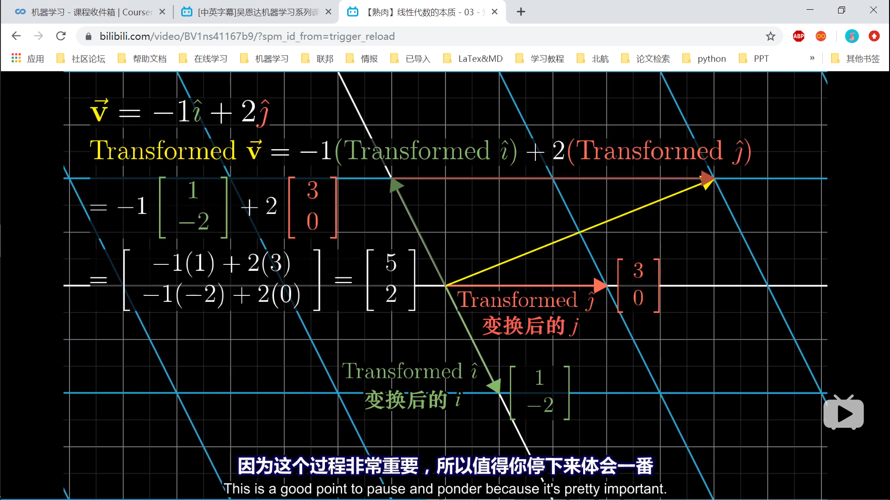

# 线性代数的本质
> 宇宙最强系列视频

## 向量的本质

* 图形=符号=坐标

## 线性组合、张成的空间与积

* 基向量i，j的可以表示向量空间。
* 任意两个向量的线性组合可以表示平面，称为向量的张成空间
* 不同的基向量，对向量空间的描述不同。

## 线性变换
* 线性变换：保持平行
* 原来的向量表示，乘以变换后的基向量表示
* 基向量变换。矩阵表示列向量的个数，列向量的每一个值，都表示向量的一个维度。矩阵的第一个维度，是所有列向量的第一个维度的排列。源向量的每一个维度，代表不同的基向量的scaling，缩放。
* 线性变换，
  * 变换后的基向量=矩阵的列向量
  * 原向量的每一个维度，都是对基向量的缩放。
  * 目标向量的每一个维度，都是变换后的基向量在这一个维度的缩放的和。

[1,2,3,4]自身是1维数组，维度是4，能描述4个维度的数组。

## 矩阵乘法

* 批量的线性变换。

* 非方阵。行缺失，表示主成分保留，次要维度省略。
* 非方阵。行增加，表示补充了次要成分。