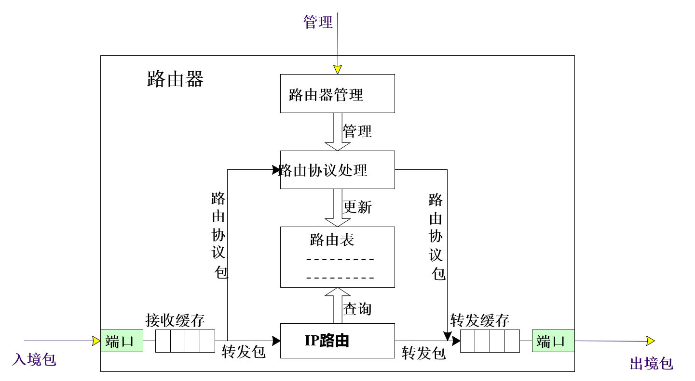

## 常见地址说明

### MAC地址

### IPV4地址

### IPV6地址

### 广播地址与广播域

主机位都为1，是广播地址。

本质上广播地址是全为1的mac地址，广播是链路层的概念，对于广播帧，二层交换机会向每一个接口复制转发。

广播域用来区分是否属于同一个网络地址（与主机地址对应）也就是同一个网段。用VLAN来划分不同的网段，区分不同的广播域。而不需要路由器进行转发，就实现了局域网的组建。

广播域-相同的网络地址-同一个局域网
二层交换机VLAN-区分广播域-不同的网络地址-不同局域网的转发

### 网络地址（网络号）、主机地址（主机号）、子网掩码

将IP地址分为网络地址与主机地址。通过子网掩码，就可以判断两个IP在不在一个局域网内部。子网掩码可以看出有多少位是网络号，有多少位是主机号。

### 网关接口

网间连接器、协议转换器。实现局域网与广域网的互联。

## 常见表格说明

### 路由表

### 交换机表

### ARP表

### NAT表

## 常见网络设备说明

### 集线器
* 概述：集线器工作在局域网(LAN)环境，像网卡一样，应用于OSI参考模型第一层，因此又被称为物理层设备。共享带宽的设备，可以实现多台电脑同时使用一个进线接口来上网或组成局域网 。所有的端口属于同一个冲突域和广播域。对端口接收到的电信号进行复制、整型、放大，以扩大网络传输的距离，同时把所有节点的连线集中在以他为中心的端口上。它的每个端口具有接收和发送数据的功能，将比特信号复制转发。

### 交换机
* 概述：属于OSI的第二层数据链路层设备。独享带宽的设备，可以实现多台电脑同时使用一个进线接口来上网或组成局域网。交换机最大的好处是快速，由于交换机只须识别帧中MAC地址，直接根据MAC地址产生选择转发端口算法简单，转发速度极高。

* 工作原理：交换机内部采用背板总线交换结构，为每个端口提供独立的共享介质，每个冲突域只有一个端口。

### 路由器
路由器属于OSI第三层即网络层设备，它根据IP地址选择转发路径，转发数据包到响应的网络。

路由器一半工作在广域网，分别连接不同的网络，是一种中继系统。

路由器的数据转发功能是基于路由表实现的，每个路由器都会维护一张路由表，根据路由表决定数据包的转发路径。路由表时通过路由算法计算得到的。

