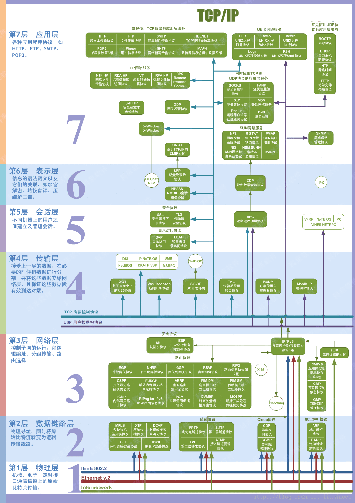

# 计算机网络概述

## 1 五层模型

> 每一层都有自己的数据单位或者说数据结构。每一个传输单位都采用了消息头+数据的组合方式用来传输数据。底层对上层的数据内容进行分割与封装，形成底层数据单位，以达到不同的目的。

### 应用层(application layer)
* 专门针对某些应用提供服务
* 数据单位：报文Message

### 传输层(transport layer)

* 负责不同主机的进程间的传输。从源主机的进程到目的主机的进程。实现端到端通信。
* 数据单位：报文段Segment

### 网络层(network layer)
* 负责从源地址(source)到目的地地址(destination)的传输，从源主机传输数据到目标主机。实现点到点通信（point to point)
* 数据单位：数据报datagram

### 数据链路层(data-link layer)
* 封装数据报。负责一条连路上，一个节点到另一个节点的传输。单跳(hop-by-hop, node-to-node)
* 数据单位：帧Frame

### 物理层(physical layer)
* 通过线路传送比特(bit)流，只完成一个节点到另一个节点的传输（单跳）
* 数据单位：比特流bit

### 协议栈示意图

## 2 数据单元长度

### 链路层-Frame最大长度  
以太网(Ethernet)数据帧的长度必须在46-1500字节之间，这个1500字节被称为链路层的MTU(最大传输单元)。上述数据内容长度不包括链路层的首部和尾部的18个字节。所以真正的链路层帧的长度应该是：（46＋18）－（1500＋18）

### 网络层-Datagram最大长度  
对于IP协议来说，数据内容的长度包含20个字节的头部信息，所以数据内容的长度为1480。

### 传输层-Segment最大长度  
IP协议数据内容长度1480字节存放TCP报文段或UDP报文段。最大长度理论上2^16 - IPhead  - UDPhead= 65535 - 20 - 8=65507字节，但是实际上UDP数据报的数据区最大长度为1480 - 8 = 1472字节（UDP的头部信息占用八个字节）。TCP 1480-TCPHead(20) = 1460 Bytes(TCP 报文段的头部信息占用20个字节）

### 协议封装过程  
链路层帧只对网络层数据报进行封装不进行分割。传输层数据内容超过MTU最大传输单元时，网络层数据报对传输层报文会进行分片操作。

### UDP和TCP的数据长度
我们在用Socket编程时，UDP协议要求包小于64K。TCP没有限定，TCP包头中就没有“长度”字段，而完全依靠IP层去处理分帧。这就是为什么TCP常常被称作一种“流协议”的原因，开发者在使用TCP服务的时候，不必去关心数据包的大小，只需讲SOCKET看作一条数据流的入口，往里面放数据就是了，TCP协议本身会进行拥塞/流量控制。 

## 3 因特网
### 组成

因特网通常指的是全球性的公共互联网。从组成上来说由：端系统，通信链路和交换机组成。

* 端系统：接入因特网并通过因特网与其他设备通信的设备被称为端系统。它是一次因特网信息交换的发起者或者接收者。

* 通信链路：通信链路相当于道路，用于传输信息。在通信链路上传输的信息称为分组。

* 交换机：交换机用于辅助信息交换，选择信息交换所使用的通信链路，交换机分为二层交换机即常说的交换机和三层交换机即路由器。

> 端系统通过ISP（因特网服务提供商）接入网络，每个是由ISP由多个交换机和多段通信链路组成的网络。ISP是分层级的，用户接入的是底层ISP，底层ISP的服务由高层ISP提供，通过分层可以降低网络管理的难度和复杂度。

## 4 网络协议

### 网络协议
定义了在两个或多个通信实体之间交换信息的格式、次序，以及在信息发送、接受以及发生其它事件时采取的动作。网络协议使得网络中各种不同的参与者可以相互通信。

网络协议通常被分为不同的层次。每个协议属于一层，每个层次负责不同的功能，并向上一层提供服务。一个协议层能够利用软件、硬件或者两者结合的方式实现。协议分层有概念化和结构化的优点，分层提供了一种结构化的方式来讨论系统组件，模块化使得更新组件更为容易。分层的一个潜在缺点是某层可能重复其较低层次的功能。各层所有的协议综合起来就构成了协议栈。通常的网络分为五个层次（非ISO OSI模型）。

* 应用层：网络应用程序及其应用层协议存在的地方。
* 运输层：提供了在主机之间传送应用层报文的服务。最重要的两个协议时UDP和TCP
* 网络层：负责将数据报从一台主机移动到另一台主机。
* 链路层：也称为数据链路层或者网络接口层。链路层沿着路径将数据报传送给下一个节点。链路层传输的单元称为帧。
* 物理层：负责将帧的每一个比特从一个节点移动到下一个节点。

由于网络中有很多不同的参与者，参与者的物理位置是不确定的，信息可能会通过存在恶意用户的网络，通信链路可能坏掉，因而无论对于哪个层次的协议来说，都涉及到如下问题：
* 如何标识一个参与者，即如何起名字，名字的格式，每个层次都定义了自己的“地址（名字）”格式，最终这些信息都会进入报文中
* 参与者如何获取自己的标识，即谁给起名字，可能是协议获取，可能是管理员分配，可能是软件自己选择，可能是统一的机构分配并固化到硬件
* 如何将数据送到目的地，通常是通过下一层提供的服务
* 如何确保数据的正确性，即收到的数据就是发出去的时候的样子，一般通过校验和来实现
* 是否要保证数据的安全性，如果要，如何保证，通常通过各种加密协议

## 5 网络构成
### 网络边缘
端系统位于网络边缘也称为主机，它们运行网络应用程序。网络应用程序又分为客户端和服务端，客户端是服务的获取者，服务端是服务的提供者。

端系统通过边缘路由器接入网络，接入方式主要有有线接入和无线接入。接入的物理媒介有双绞线，同轴电缆，光缆，无线电信道等等。

### 网络核心
网络核心是指互联了因特网端系统的交换机和链路的网状的网络。
* 电路交换  
电路交换中，当两台主机要通信时，该网络在两台主机之间建立一条专用的端到端的连接。电路交换一般通过多路复用来提高链路的使用效率，多路复用技术包括时分复用（TDM），频分复用（FDM），码分多址（CDMA）。电路交换网络需要信令软件来协调端到端路径上的交换机的操作。

* 分组交换  
在分组交换网络中，应用程序的数据被分割成报文进行收发。在源和目的之间，这些分组通过通信链路和分组交换机传送。多数分组交换机在输入端采用存储转发机制工作，存储转发指的是在交换机能够开始向输出链路传输该分组之前，必须接收到整个分组。因此，存储转发式分组交换机沿着该分组的路径在每条链路的输入端引入了存储转发时延。

每个分组交换机由多条链路与之相连。对于每条相连的链路，该分组交换机有一个输出缓存，它用于缓存交换机准备发往这条链路的分组。如果分组需要往某个链路发送，但该链路正在发送其它分组，该分组就要在输出缓存排队等待，因此分组交换又引入了排队时延。同时由于缓存大小是有限的，因而如果需要进行缓存一个新的分组时，缓存已满，就会导致该分组被丢失。
分组交换存在时延并且该时延是不可预测的，因而它不适用于实时服务。

由于分组交换不存在专用电路，因而它需要做额外的动作保证分组可以到达目的地。因特网的做法是：每个通过网络传输的分组在其首部包含了其目的地址。地址采用了层次结构。当分组到达网络中的一台交换机时，该交换机检查分组的目的地址的一部分，并向相邻的交换机转发该分组。每个交换机都具有一个转发表，用于将目的地址映射到输出链路。当分组到达一个交换机时，交换机检查其目的地址，并用这个目的地址搜索转发表，以找到合适的输出链路。典型的转发表就是三层交换机即路由器中的路由表。

## 6 网络性能
### 时延
分组交换中存在各种时延，时延中最重要的包括：处理时延，排队时延，传输时延和传播时延。

* 处理时延：检查分组首部和决定该分组如何处理所需时延以及对报文进行各种检查所需的时间之和。
* 排队时延：分组在队列中等待传输所需的时间
* 传输时延：分组长度/链路速率（接口速率，比如10M以太网就是10Mbps）。对于超过10Mbps速率的信道而言，该值很小，影响也很小。
* 传播时延：链路长度/链路传播速度（比特在链路中的物理传输速度）。对于局域网该值往往非常小，但是对于卫星传输可能很大。

在这几种时延中，传输时延、传播时延取决于物理介质，处理时延需要做的动作基本是固定的，因而和处理器的速率和软件设计相关，而排队时延则和系统运行的整体运行相关，是最复杂的时延。

### 丢包

让a表示分组到达的平均速率，R是传输速率，即比特从队列中推出的速率，同时假设每个分组都由L比特组成，则L*a/R称为流量强度。它在估量排队时延的影响程度方面起着重要作用。如果流量强度大于1，则比特到达的平均速率超过比特从队列中传输出去的速率，在这种情况下，队列会趋向于无限大，排队时延也会趋向于无穷大。因而设计系统时必须保证流量强度不能大于1。
如果流量强度小于等于1，则：
如果分组周期性的到达，则每个分组到达时队列都是空的，因而就不会有排队时延。
如果分组以突发形式到达，则有可能有很大的平均排队时延。并且随着流量强度接近于1，平均排队时延迅速增加。
在实际设备中，由于设备缓存的有限性，因而如果到达的分组无法被存储就会被丢弃，丢弃的分组会随着流量强度的增加而增加。

### 吞吐量
吞吐量是单位时间内主机收发的报文的速率。当没有干扰时，吞吐量近似于沿着源到目的的路径上的最小传输速率。

## 7 网络攻击
网络攻击是网络的最大威胁，常见的攻击手段有：
* 病毒入侵：通过病毒进入主机从而进行攻击
* 拒绝服务攻击：核心思想使得合法用户无法使用服务
* 嗅探攻击：获得信息的拷贝，在对信息进行分析
* 伪装攻击：伪装成受信任的人从而获取信息
* 中间人攻击：插入到两个通信实体之间的通信链路中进行攻击。